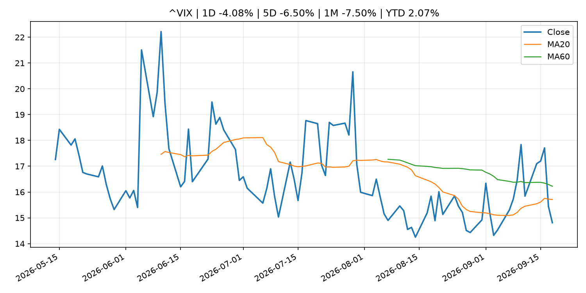
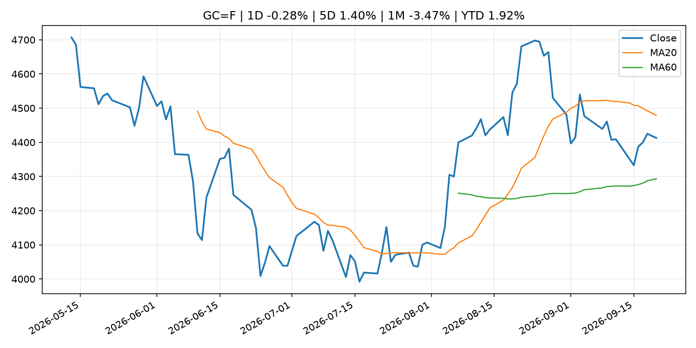
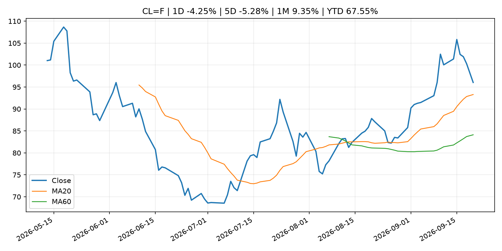
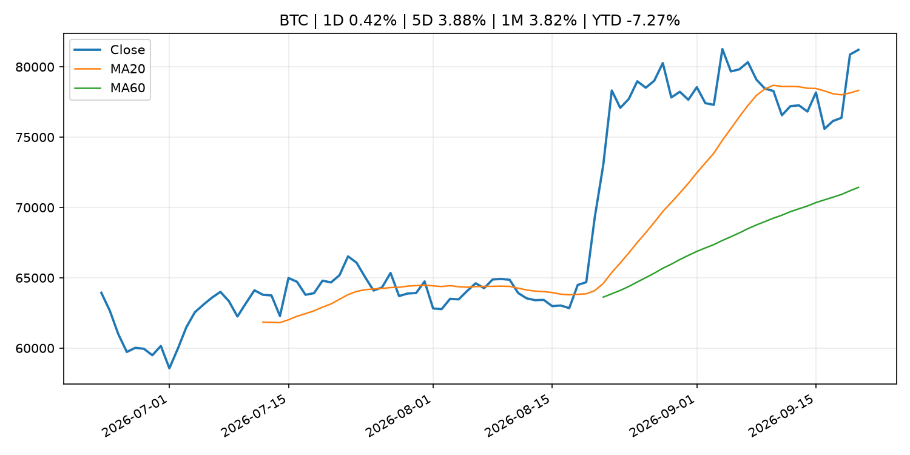
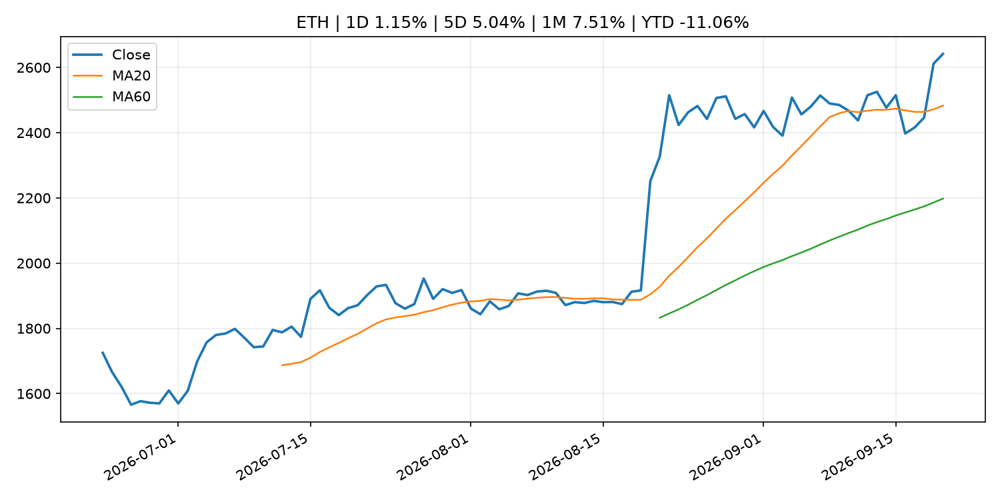
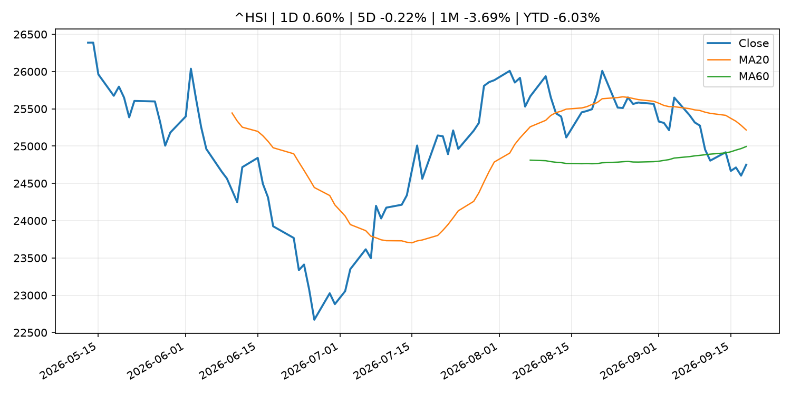

# Global Macro Morning Briefing - 2026-09-21

> Not financial advice / 非投资建议。

## 0. 今日总览
- 市场状态：unknown。市场信号不足，暂不判断明确状态。
- 今日三大主线：
  1. central_bank_decision: My rental property is paid off, but I need cash. Is this a bad time to take out a $50,000 HELOC?
  2. regulation: Coinbase, Robinhood, Circle could be early winners of SEC's tokenized-stock push, analysts say
- 一句话结论：今日晨报重点关注：央行决策会重定价利率、汇率、久期资产和风险资产。；监管变化会改变行业盈利预期和资产风险溢价。。跨资产方面，SPY 1D -0.12%；QQQ 1D 0.63%；^VIX 1D -4.08%；TLT 1D -0.65%；GC=F 1D -0.28%；CL=F 1D -4.25%；BTC 1D 0.42%；ETH 1D 1.15%；市场信号不足，暂不判断明确状态。政策、通胀、利率、美元、美债、能源和加密监管仍是主要观察线索。所有结论仅基于公开数据与短摘要整理，不构成投资建议。

## 1. 隔夜跨资产市场
- 美股：SPY 1D -0.12%，QQQ 1D 0.63%，整体趋势需结合 VIX 和利率确认。
- 美债/美元：TLT 1D -0.65%，美元指数 1D 0.06%，是判断折现率压力的核心线索。
- 黄金/原油：黄金 1D -0.28%，原油 1D -4.25%，用于观察避险、通胀和地缘风险。
- 加密：BTC 1D 0.42%，ETH 1D 1.15%，关注是否独立于纳指走出加密自身行情。
- 港股/A股：恒生 1D 0.60%，沪深300/上证 1D n/a，重点看中国政策预期与人民币线索。
- 风险观察：关注后续数据是否确认当前跨资产信号。

### US_EQUITY

| symbol | latest close | 1D | 5D | 1M | YTD | trend |
|---|---:|---:|---:|---:|---:|---|
| SPY | 761.69 | -0.12% | -0.34% | -0.96% | 11.49% | range_bound |
| QQQ | 721.45 | 0.63% | 0.92% | 0.75% | 17.67% | uptrend |
| DIA | 515.88 | -0.48% | -1.88% | -3.44% | 6.67% | range_bound |
| IWM | 284.10 | -0.47% | -1.66% | -5.84% | 14.20% | strong_downtrend |
| VTI | 375.43 | 0.02% | -0.23% | -1.20% | 11.63% | range_bound |

### US_MACRO_MARKET

| symbol | latest close | 1D | 5D | 1M | YTD | trend |
|---|---:|---:|---:|---:|---:|---|
| ^VIX | 14.81 | -4.08% | -6.50% | -7.50% | 2.07% | downtrend |
| DX-Y.NYB | 100.28 | 0.06% | 0.82% | 1.39% | 1.89% | range_bound |
| TLT | 81.25 | -0.65% | 0.47% | -2.13% | -6.64% | downtrend |
| IEF | 90.80 | -0.49% | -0.23% | -2.76% | -5.50% | downtrend |

### COMMODITIES

| symbol | latest close | 1D | 5D | 1M | YTD | trend |
|---|---:|---:|---:|---:|---:|---|
| GC=F | 4,412.70 | -0.28% | 1.40% | -3.47% | 1.92% | range_bound |
| SI=F | 66.88 | 0.48% | 5.29% | -1.69% | -5.22% | uptrend |
| CL=F | 96.04 | -4.25% | -5.28% | 9.35% | 67.55% | strong_uptrend |
| BZ=F | 99.43 | -4.27% | -5.91% | 6.02% | 63.67% | strong_uptrend |
| NG=F | 2.89 | -0.89% | -0.35% | 5.60% | -20.23% | range_bound |
| HG=F | 6.71 | 1.48% | 6.05% | 3.92% | 19.02% | uptrend |

### HK_MARKET

| symbol | latest close | 1D | 5D | 1M | YTD | trend |
|---|---:|---:|---:|---:|---:|---|
| ^HSI | 24,750.78 | 0.60% | -0.22% | -3.69% | -6.03% | range_bound |
| 0700.HK | 419.00 | -1.64% | -2.19% | -7.18% | -32.74% | strong_downtrend |
| 9988.HK | 109.30 | 4.00% | 1.67% | -13.39% | -26.64% | strong_downtrend |
| 3690.HK | 73.20 | 0.41% | -2.53% | -14.74% | -30.02% | strong_downtrend |
| 1810.HK | 26.40 | 0.99% | 0.15% | -4.90% | -34.46% | range_bound |
| 1211.HK | 81.50 | 0.43% | 2.07% | -11.22% | -17.47% | strong_downtrend |

### CRYPTO

| symbol | latest close | 1D | 5D | 1M | YTD | trend |
|---|---:|---:|---:|---:|---:|---|
| BTC | 81,209.76 | 0.42% | 3.88% | 3.82% | -7.27% | uptrend |
| ETH | 2,641.60 | 1.15% | 5.04% | 7.51% | -11.06% | strong_uptrend |
| SOLANA | 111.16 | -1.36% | 8.44% | 5.28% | -10.73% | strong_uptrend |
| BINANCECOIN | 771.98 | 1.42% | 7.17% | 11.47% | -10.51% | uptrend |
| RIPPLE | 1.41 | 1.16% | -0.77% | 1.14% | -23.27% | uptrend |

## 2. 今日最重要的 10 条新闻
### 1. My rental property is paid off, but I need cash. Is this a bad time to take out a $50,000 HELOC?
- 来源：MarketWatch Top Stories
- 时间：2026-09-20T15:00:00+00:00
- 地区：US
- 事件类型：central_bank_decision
- 重要性层级：Tier 1
- 一句话摘要：The Federal Reserve announced a quarter-percentage-point interest-rate hike Wednesday, to a range of 3.75%-4.0%.
- 为什么重要：央行决策会重定价利率、汇率、久期资产和风险资产。
- 可能影响：主要影响 QQQ，方向为 negative，强度 high；鹰派政策提高折现率，压制成长股估值。
  - 资产：QQQ
    方向：negative
    强度：high
    原因：鹰派政策提高折现率，压制成长股估值。
  - 资产：SPY
    方向：negative
    强度：medium
    原因：更紧政策通常削弱风险偏好。
  - 资产：TLT
    方向：negative
    强度：high
    原因：利率上行通常压低长债价格。
  - 资产：DXY
    方向：positive
    强度：high
    原因：更高利率预期通常支撑美元。
  - 资产：BTC
    方向：negative
    强度：high
    原因：流动性收紧通常压制高 beta 加密资产。
- 原文链接：[https://www.marketwatch.com/story/my-rental-property-is-paid-off-but-i-need-cash-is-this-a-bad-time-to-take-out-a-50-000-heloc-d094bbc5?mod=mw_rss_topstories](https://www.marketwatch.com/story/my-rental-property-is-paid-off-but-i-need-cash-is-this-a-bad-time-to-take-out-a-50-000-heloc-d094bbc5?mod=mw_rss_topstories)

### 2. Coinbase, Robinhood, Circle could be early winners of SEC's tokenized-stock push, analysts say
- 来源：CoinDesk
- 时间：2026-09-20T12:00:00+00:00
- 地区：global
- 事件类型：regulation
- 重要性层级：Tier 2
- 一句话摘要：Coinbase, Robinhood, Circle could be early winners of SEC's tokenized-stock push, analysts say
- 为什么重要：监管变化会改变行业盈利预期和资产风险溢价。
- 可能影响：主要影响 BTC，方向为 mixed，强度 high；加密监管或 ETF 进展会改变 BTC 的资金流和风险溢价。
  - 资产：BTC
    方向：mixed
    强度：high
    原因：加密监管或 ETF 进展会改变 BTC 的资金流和风险溢价。
  - 资产：ETH
    方向：mixed
    强度：high
    原因：监管框架会影响 ETH 产品化和机构参与度。
  - 资产：COIN
    方向：mixed
    强度：medium
    原因：监管清晰度和执法风险会影响交易平台估值。
  - 资产：crypto market
    方向：mixed
    强度：high
    原因：信息影响整个加密市场结构，但方向取决于细节。
- 原文链接：[https://www.coindesk.com/business/2026/09/20/coinbase-robinhood-circle-could-be-early-winners-of-sec-s-tokenized-stock-push-analysts-say](https://www.coindesk.com/business/2026/09/20/coinbase-robinhood-circle-could-be-early-winners-of-sec-s-tokenized-stock-push-analysts-say)

### 3. Record diesel prices are exposing pain points in the stock market and economy
- 来源：MarketWatch Top Stories
- 时间：2026-09-20T13:00:00+00:00
- 地区：US
- 事件类型：other
- 重要性层级：Tier 3
- 一句话摘要：A major risks now is that diesel prices stay high — and continue to put upward pressure on inflation.
- 为什么重要：这条信息暂未匹配到重大宏观、政策或市场事件，更适合作为背景跟踪。
- 可能影响：主要影响 DXY，方向为 positive，强度 high；通胀压力可能推高政策利率预期并支撑美元。
  - 资产：DXY
    方向：positive
    强度：high
    原因：通胀压力可能推高政策利率预期并支撑美元。
  - 资产：TLT
    方向：negative
    强度：high
    原因：通胀上行通常推升收益率、压低长债价格。
  - 资产：QQQ
    方向：negative
    强度：high
    原因：更高利率对成长股估值折现率不利。
  - 资产：SPY
    方向：mixed
    强度：medium
    原因：名义增长可能支撑收入，但更高利率压制估值。
  - 资产：GC=F
    方向：mixed
    强度：medium
    原因：通胀对黄金是支撑，但实际利率上行会形成压力。
  - 资产：BTC
    方向：mixed
    强度：medium
    原因：抗通胀叙事和流动性收紧可能相互抵消。
- 原文链接：[https://www.marketwatch.com/story/record-diesel-prices-are-exposing-pain-points-in-the-stock-market-and-economy-a2079b04?mod=mw_rss_topstories](https://www.marketwatch.com/story/record-diesel-prices-are-exposing-pain-points-in-the-stock-market-and-economy-a2079b04?mod=mw_rss_topstories)

### 4. ‘It's awful’: How tariffs, soaring fuel costs and higher interest rates are squeezing American companies
- 来源：CNBC Economy
- 时间：2026-09-20T12:47:23+00:00
- 地区：US
- 事件类型：other
- 重要性层级：Tier 3
- 一句话摘要：Tariffs, fuel prices and interest rates are squeezing American companies, particularly manufacturers, auto suppliers, retailers and transportation businesses.
- 为什么重要：这条信息暂未匹配到重大宏观、政策或市场事件，更适合作为背景跟踪。
- 可能影响：更偏背景信息，短期市场影响可能有限。
  - 资产：暂无明确资产映射
  - 方向：unknown
  - 强度：low
  - 原因：公开信息不足以判断方向。
- 原文链接：[https://www.cnbc.com/2026/09/20/tariffs-fuel-prices-and-interest-rates-squeeze-us-companies.html](https://www.cnbc.com/2026/09/20/tariffs-fuel-prices-and-interest-rates-squeeze-us-companies.html)

## 3. 政策与央行观察
### 1. My rental property is paid off, but I need cash. Is this a bad time to take out a $50,000 HELOC?
- 来源：MarketWatch Top Stories
- 时间：2026-09-20T15:00:00+00:00
- 地区：US
- 事件类型：central_bank_decision
- 重要性层级：Tier 1
- 一句话摘要：The Federal Reserve announced a quarter-percentage-point interest-rate hike Wednesday, to a range of 3.75%-4.0%.
- 为什么重要：央行决策会重定价利率、汇率、久期资产和风险资产。
- 可能影响：主要影响 QQQ，方向为 negative，强度 high；鹰派政策提高折现率，压制成长股估值。
  - 资产：QQQ
    方向：negative
    强度：high
    原因：鹰派政策提高折现率，压制成长股估值。
  - 资产：SPY
    方向：negative
    强度：medium
    原因：更紧政策通常削弱风险偏好。
  - 资产：TLT
    方向：negative
    强度：high
    原因：利率上行通常压低长债价格。
  - 资产：DXY
    方向：positive
    强度：high
    原因：更高利率预期通常支撑美元。
  - 资产：BTC
    方向：negative
    强度：high
    原因：流动性收紧通常压制高 beta 加密资产。
- 原文链接：[https://www.marketwatch.com/story/my-rental-property-is-paid-off-but-i-need-cash-is-this-a-bad-time-to-take-out-a-50-000-heloc-d094bbc5?mod=mw_rss_topstories](https://www.marketwatch.com/story/my-rental-property-is-paid-off-but-i-need-cash-is-this-a-bad-time-to-take-out-a-50-000-heloc-d094bbc5?mod=mw_rss_topstories)

### 2. Coinbase, Robinhood, Circle could be early winners of SEC's tokenized-stock push, analysts say
- 来源：CoinDesk
- 时间：2026-09-20T12:00:00+00:00
- 地区：global
- 事件类型：regulation
- 重要性层级：Tier 2
- 一句话摘要：Coinbase, Robinhood, Circle could be early winners of SEC's tokenized-stock push, analysts say
- 为什么重要：监管变化会改变行业盈利预期和资产风险溢价。
- 可能影响：主要影响 BTC，方向为 mixed，强度 high；加密监管或 ETF 进展会改变 BTC 的资金流和风险溢价。
  - 资产：BTC
    方向：mixed
    强度：high
    原因：加密监管或 ETF 进展会改变 BTC 的资金流和风险溢价。
  - 资产：ETH
    方向：mixed
    强度：high
    原因：监管框架会影响 ETH 产品化和机构参与度。
  - 资产：COIN
    方向：mixed
    强度：medium
    原因：监管清晰度和执法风险会影响交易平台估值。
  - 资产：crypto market
    方向：mixed
    强度：high
    原因：信息影响整个加密市场结构，但方向取决于细节。
- 原文链接：[https://www.coindesk.com/business/2026/09/20/coinbase-robinhood-circle-could-be-early-winners-of-sec-s-tokenized-stock-push-analysts-say](https://www.coindesk.com/business/2026/09/20/coinbase-robinhood-circle-could-be-early-winners-of-sec-s-tokenized-stock-push-analysts-say)

## 4. 市场异动与图表
- QQQ 上涨 0.63%
- VIX 下跌 -4.08%
- TLT 下跌 -0.65%
- Oil 下跌 -4.25%

### SPY

### QQQ

### ^VIX

### TLT

### GC=F

### CL=F

### BTC

### ETH

### ^HSI

## 5. 华尔街与机构公开观点
- 暂无可靠公开观点。

## 6. 今日重点关注
- 经济数据：经济数据：暂无可靠公开日历数据；如配置经济日历源后可自动填充。
- 央行讲话：央行讲话：暂无可靠公开日历数据；重点跟踪 Fed、ECB、BoJ、PBOC 官网 RSS。
- 财报：财报：暂无可靠数据。
- 政策事件：政策事件：暂无可靠数据。
- 风险提醒：风险提醒：关注数据源失败项、突发地缘风险、利率和美元的二阶反应。

## 7. 英文金融表达与宏观概念
- **inflation expectations**：通胀预期，指家庭、企业或市场对未来通胀的预估。 例句：Inflation expectations can shape wage bargaining and bond yields.
- **real yield**：实际收益率，名义利率扣除通胀预期后的收益率。 例句：Gold often reacts more to real yields than nominal yields.
- **terminal rate**：终端利率，市场预期本轮加息周期的最高政策利率。 例句：A higher terminal rate can pressure growth stocks.
- **risk-off**：避险模式，资金偏向美元、国债、黄金等防御资产。 例句：A geopolitical shock can push markets into risk-off mode.
- **market structure**：市场结构，指交易、托管、清算、ETF、监管等制度安排。 例句：Crypto market structure rules can affect institutional participation.
- **soft landing**：软着陆，指通胀回落而经济避免明显衰退。 例句：Markets often rally when data support a soft landing.

## 8. 背景材料
- [‘There might be a silver lining’: My friend’s wife died at 60 after a high-earning career. Can he claim her Social Security?](https://www.marketwatch.com/story/there-might-be-a-silver-lining-my-friends-wife-died-at-60-after-a-high-earning-career-can-he-claim-her-social-security-eb95210a?mod=mw_rss_topstories)（MarketWatch Top Stories，other）：“They had been married for over 30 years when she passed.”
- [Record diesel prices are exposing pain points in the stock market and economy](https://www.marketwatch.com/story/record-diesel-prices-are-exposing-pain-points-in-the-stock-market-and-economy-a2079b04?mod=mw_rss_topstories)（MarketWatch Top Stories，other）：A major risks now is that diesel prices stay high — and continue to put upward pressure on inflation.
- [‘It's awful’: How tariffs, soaring fuel costs and higher interest rates are squeezing American companies](https://www.cnbc.com/2026/09/20/tariffs-fuel-prices-and-interest-rates-squeeze-us-companies.html)（CNBC Economy，other）：Tariffs, fuel prices and interest rates are squeezing American companies, particularly manufacturers, auto suppliers, retailers and transportation businesses.
- [Crypto traders braced for a total wipeout this week but Bitcoin had other plans](https://www.coindesk.com/markets/2026/09/18/crypto-traders-braced-for-a-total-wipeout-this-week-but-bitcoin-had-other-plans)（CoinDesk，other）：Crypto traders braced for a total wipeout this week but Bitcoin had other plans
- ['The orange tie stays': Michael Saylor responds to venture capitalist's bitcoin obituary](https://www.coindesk.com/markets/2026/09/19/the-orange-tie-stays-michael-saylor-responds-to-venture-capitalist-s-bitcoin-obituary)（CoinDesk，other）：'The orange tie stays': Michael Saylor responds to venture capitalist's bitcoin obituary

## 9. 数据源、失败项与免责声明
- 采集时间：2026-09-20T23:51:55
- 数据源：公开 RSS、Yahoo Finance、CoinGecko、AKShare、FRED、SEC data.sec.gov，以及用户自有 inputs/reports 文件。
- 合规说明：不绕过 WSJ、Bloomberg、FT、Reuters 等付费墙；对付费媒体只使用公开 RSS 标题、摘要、链接和发布时间。
- 免责声明：Not financial advice / 非投资建议。本项目仅供个人学习、研究和信息整理，不构成投资建议、交易建议或任何收益承诺。
- 失败或跳过的数据源：
  - crypto data failed coin=dogecoin
  - China market data failed symbol=上证指数: empty dataframe
  - China market data failed symbol=深证成指: empty dataframe
  - China market data failed symbol=创业板指: empty dataframe
  - China market data failed symbol=沪深300: empty dataframe
  - China market data failed symbol=中证500: empty dataframe
  - China market data failed symbol=科创50: empty dataframe
  - FRED_API_KEY not set; skipping FRED macro series
  - SEC failed cik=0000320193
  - SEC failed cik=0000789019
  - SEC failed cik=0001045810
  - SEC failed cik=0001318605
  - SEC failed cik=0001577552
