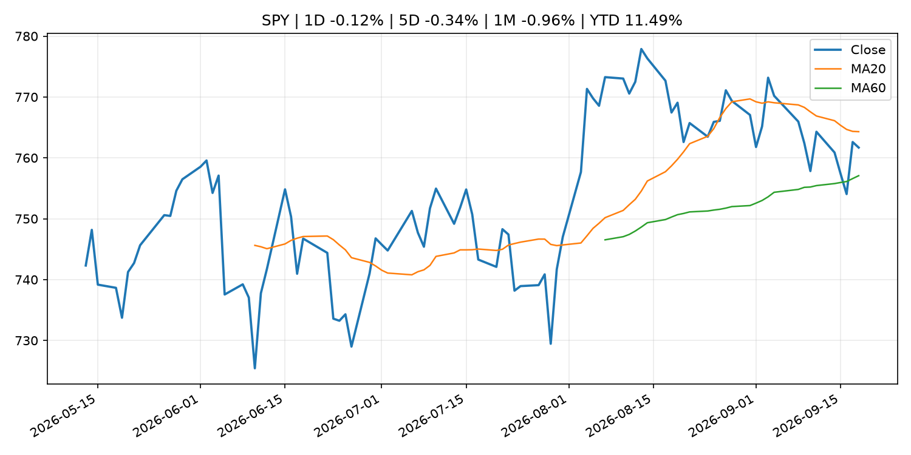
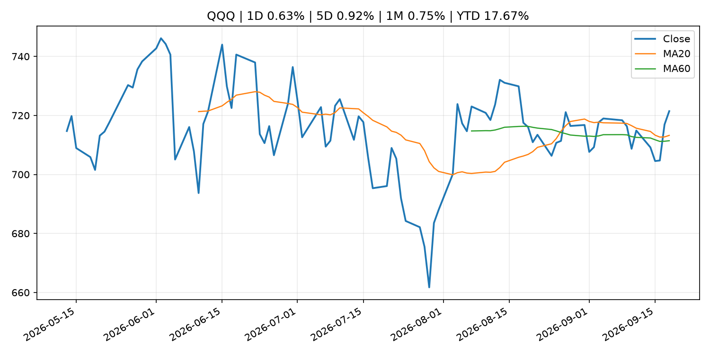
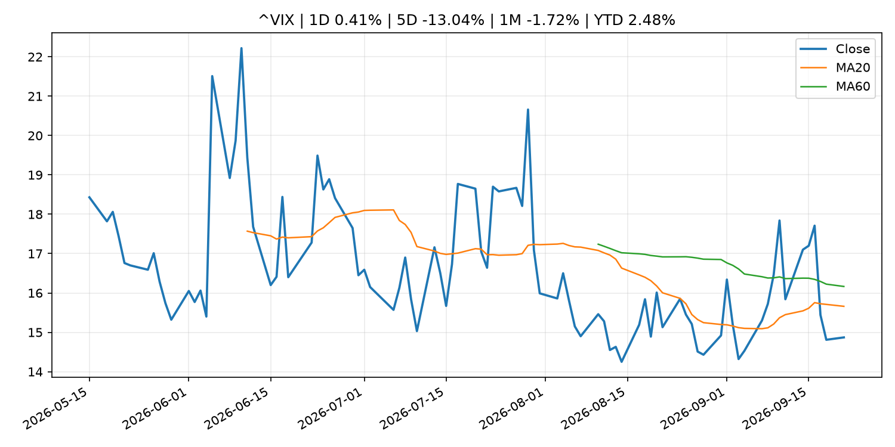
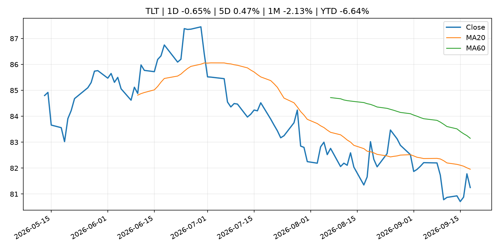
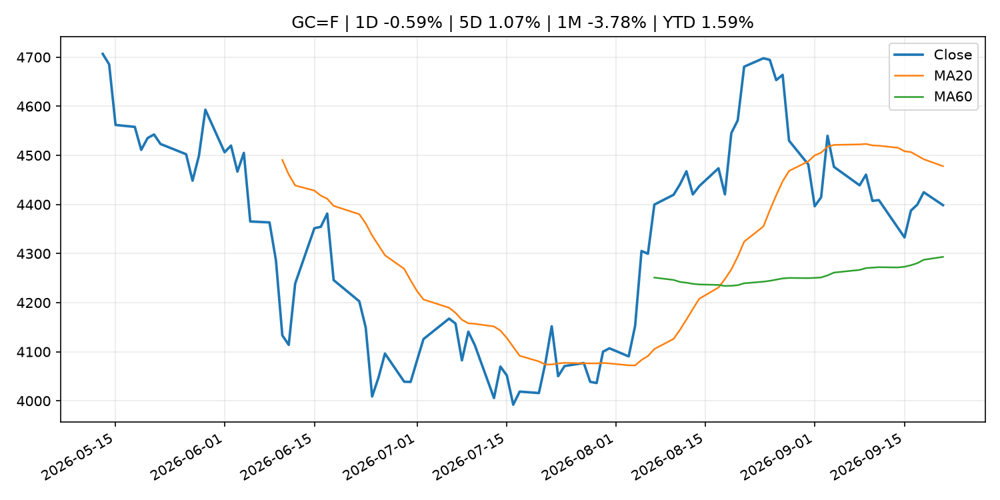
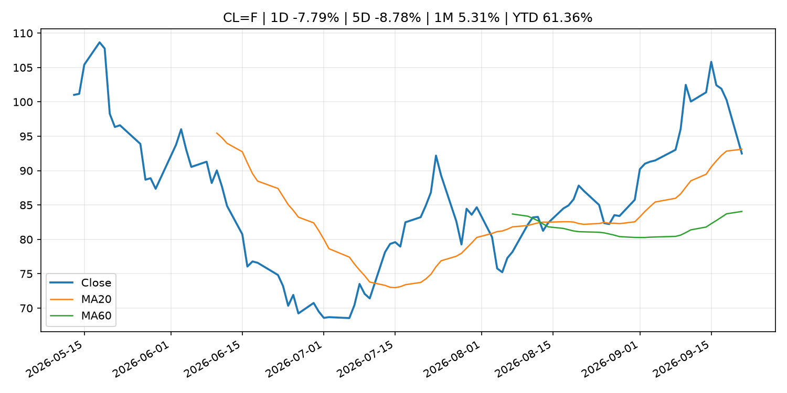
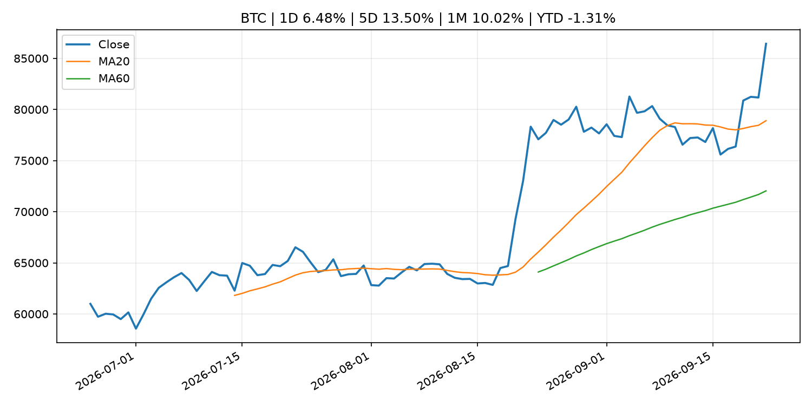
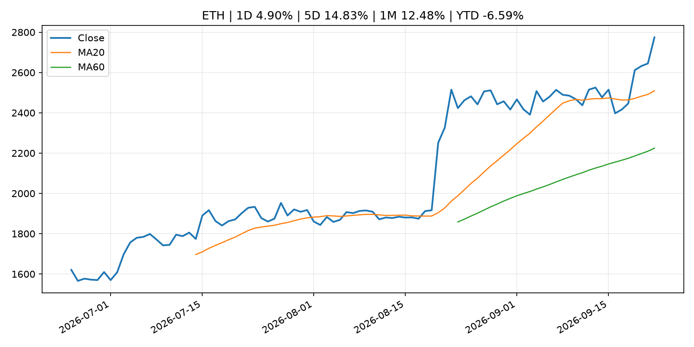
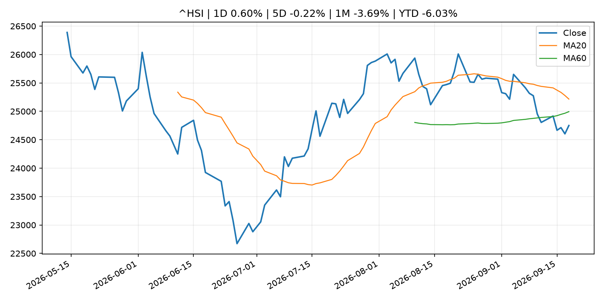

# Global Macro Morning Briefing - 2026-09-22

> Not financial advice / 非投资建议。

## 0. 今日总览
- 市场状态：unknown。市场信号不足，暂不判断明确状态。
- 今日三大主线：
  1. central_bank_decision: Crypto enjoys bullish bounce post-Fed rate hike: Crypto Week Ahead
  2. crypto_market_structure: Google and Apple seek crypto talent as Big Tech eyes stablecoin and tokenization rails
  3. regulation: Why this investment bank expects little demand for tokenized stocks despite SEC’s new trading rules
- 一句话结论：今日晨报重点关注：央行决策会重定价利率、汇率、久期资产和风险资产。；加密市场结构和监管变化会影响 BTC、ETH 及相关股票的风险溢价。。跨资产方面，SPY 1D -0.12%；QQQ 1D 0.63%；^VIX 1D 0.41%；TLT 1D -0.65%；GC=F 1D -0.59%；CL=F 1D -7.79%；BTC 1D 6.48%；ETH 1D 4.90%；市场信号不足，暂不判断明确状态。政策、通胀、利率、美元、美债、能源和加密监管仍是主要观察线索。所有结论仅基于公开数据与短摘要整理，不构成投资建议。

## 1. 隔夜跨资产市场
- 美股：SPY 1D -0.12%，QQQ 1D 0.63%，整体趋势需结合 VIX 和利率确认。
- 美债/美元：TLT 1D -0.65%，美元指数 1D 0.16%，是判断折现率压力的核心线索。
- 黄金/原油：黄金 1D -0.59%，原油 1D -7.79%，用于观察避险、通胀和地缘风险。
- 加密：BTC 1D 6.48%，ETH 1D 4.90%，关注是否独立于纳指走出加密自身行情。
- 港股/A股：恒生 1D 0.60%，沪深300/上证 1D n/a，重点看中国政策预期与人民币线索。
- 风险观察：关注后续数据是否确认当前跨资产信号。

### US_EQUITY

| symbol | latest close | 1D | 5D | 1M | YTD | trend |
|---|---:|---:|---:|---:|---:|---|
| SPY | 761.69 | -0.12% | -0.34% | -0.96% | 11.49% | range_bound |
| QQQ | 721.45 | 0.63% | 0.92% | 0.75% | 17.67% | uptrend |
| DIA | 515.88 | -0.48% | -1.88% | -3.44% | 6.67% | range_bound |
| IWM | 284.10 | -0.47% | -1.66% | -5.84% | 14.20% | strong_downtrend |
| VTI | 375.43 | 0.02% | -0.23% | -1.20% | 11.63% | range_bound |

### US_MACRO_MARKET

| symbol | latest close | 1D | 5D | 1M | YTD | trend |
|---|---:|---:|---:|---:|---:|---|
| ^VIX | 14.87 | 0.41% | -13.04% | -1.72% | 2.48% | downtrend |
| DX-Y.NYB | 100.39 | 0.16% | 0.93% | 1.50% | 2.00% | range_bound |
| TLT | 81.25 | -0.65% | 0.47% | -2.13% | -6.64% | downtrend |
| IEF | 90.80 | -0.49% | -0.23% | -2.76% | -5.50% | downtrend |

### COMMODITIES

| symbol | latest close | 1D | 5D | 1M | YTD | trend |
|---|---:|---:|---:|---:|---:|---|
| GC=F | 4,398.60 | -0.59% | 1.07% | -3.78% | 1.59% | range_bound |
| SI=F | 67.04 | 0.73% | 5.55% | -1.45% | -4.98% | uptrend |
| CL=F | 92.49 | -7.79% | -8.78% | 5.31% | 61.36% | range_bound |
| BZ=F | 96.46 | -7.13% | -8.72% | 2.86% | 58.78% | range_bound |
| NG=F | 2.84 | -2.58% | -2.04% | 3.81% | -21.59% | downtrend |
| HG=F | 6.80 | 2.84% | 7.47% | 5.31% | 20.62% | strong_uptrend |

### HK_MARKET

| symbol | latest close | 1D | 5D | 1M | YTD | trend |
|---|---:|---:|---:|---:|---:|---|
| ^HSI | 24,750.78 | 0.60% | -0.22% | -3.69% | -6.03% | range_bound |
| 0700.HK | 430.00 | 2.63% | -0.14% | -5.91% | -30.98% | strong_downtrend |
| 9988.HK | 112.60 | 3.02% | 6.33% | -8.46% | -24.43% | range_bound |
| 3690.HK | 74.00 | 1.09% | -1.40% | -12.94% | -29.25% | strong_downtrend |
| 1810.HK | 27.58 | 4.47% | 1.55% | -4.96% | -31.53% | uptrend |
| 1211.HK | 81.20 | -0.37% | 1.25% | -12.83% | -17.77% | strong_downtrend |

### CRYPTO

| symbol | latest close | 1D | 5D | 1M | YTD | trend |
|---|---:|---:|---:|---:|---:|---|
| BTC | 86,427.61 | 6.48% | 13.50% | 10.02% | -1.31% | strong_uptrend |
| ETH | 2,774.28 | 4.90% | 14.83% | 12.48% | -6.59% | strong_uptrend |
| SOLANA | 119.12 | 7.16% | 20.88% | 15.63% | -4.34% | strong_uptrend |
| BINANCECOIN | 799.14 | 3.49% | 10.17% | 15.63% | -7.37% | strong_uptrend |
| RIPPLE | 1.53 | 8.75% | 18.12% | 11.19% | -16.68% | strong_uptrend |

## 2. 今日最重要的 10 条新闻
### 1. Crypto enjoys bullish bounce post-Fed rate hike: Crypto Week Ahead
- 来源：CoinDesk
- 时间：2026-09-21T09:12:42+00:00
- 地区：global
- 事件类型：central_bank_decision
- 重要性层级：Tier 1
- 一句话摘要：Crypto enjoys bullish bounce post-Fed rate hike: Crypto Week Ahead
- 为什么重要：央行决策会重定价利率、汇率、久期资产和风险资产。
- 可能影响：主要影响 QQQ，方向为 negative，强度 high；鹰派政策提高折现率，压制成长股估值。
  - 资产：QQQ
    方向：negative
    强度：high
    原因：鹰派政策提高折现率，压制成长股估值。
  - 资产：SPY
    方向：negative
    强度：medium
    原因：更紧政策通常削弱风险偏好。
  - 资产：TLT
    方向：negative
    强度：high
    原因：利率上行通常压低长债价格。
  - 资产：DXY
    方向：positive
    强度：high
    原因：更高利率预期通常支撑美元。
  - 资产：BTC
    方向：negative
    强度：high
    原因：流动性收紧通常压制高 beta 加密资产。
- 原文链接：[https://www.coindesk.com/markets/2026/09/21/crypto-week-ahead](https://www.coindesk.com/markets/2026/09/21/crypto-week-ahead)

### 2. Google and Apple seek crypto talent as Big Tech eyes stablecoin and tokenization rails
- 来源：CoinDesk
- 时间：2026-09-21T12:17:48+00:00
- 地区：global
- 事件类型：crypto_market_structure
- 重要性层级：Tier 2
- 一句话摘要：Google and Apple seek crypto talent as Big Tech eyes stablecoin and tokenization rails
- 为什么重要：加密市场结构和监管变化会影响 BTC、ETH 及相关股票的风险溢价。
- 可能影响：主要影响 BTC，方向为 mixed，强度 high；加密监管或 ETF 进展会改变 BTC 的资金流和风险溢价。
  - 资产：BTC
    方向：mixed
    强度：high
    原因：加密监管或 ETF 进展会改变 BTC 的资金流和风险溢价。
  - 资产：ETH
    方向：mixed
    强度：high
    原因：监管框架会影响 ETH 产品化和机构参与度。
  - 资产：COIN
    方向：mixed
    强度：medium
    原因：监管清晰度和执法风险会影响交易平台估值。
  - 资产：crypto market
    方向：mixed
    强度：high
    原因：信息影响整个加密市场结构，但方向取决于细节。
  - 资产：QQQ
    方向：mixed
    强度：high
    原因：AI 资本开支会影响大型科技股盈利和估值预期。
  - 资产：SMH
    方向：mixed
    强度：high
    原因：AI 投资周期直接影响半导体需求。
- 原文链接：[https://www.coindesk.com/business/2026/09/21/google-and-apple-seek-crypto-talent-as-big-tech-eyes-stablecoin-and-tokenization-rails](https://www.coindesk.com/business/2026/09/21/google-and-apple-seek-crypto-talent-as-big-tech-eyes-stablecoin-and-tokenization-rails)

### 3. Why this investment bank expects little demand for tokenized stocks despite SEC’s new trading rules
- 来源：CoinDesk
- 时间：2026-09-21T19:08:40+00:00
- 地区：global
- 事件类型：regulation
- 重要性层级：Tier 2
- 一句话摘要：Why this investment bank expects little demand for tokenized stocks despite SEC’s new trading rules
- 为什么重要：监管变化会改变行业盈利预期和资产风险溢价。
- 可能影响：主要影响 BTC，方向为 mixed，强度 high；加密监管或 ETF 进展会改变 BTC 的资金流和风险溢价。
  - 资产：BTC
    方向：mixed
    强度：high
    原因：加密监管或 ETF 进展会改变 BTC 的资金流和风险溢价。
  - 资产：ETH
    方向：mixed
    强度：high
    原因：监管框架会影响 ETH 产品化和机构参与度。
  - 资产：COIN
    方向：mixed
    强度：medium
    原因：监管清晰度和执法风险会影响交易平台估值。
  - 资产：crypto market
    方向：mixed
    强度：high
    原因：信息影响整个加密市场结构，但方向取决于细节。
- 原文链接：[https://www.coindesk.com/markets/2026/09/21/why-this-investment-bank-sees-little-demand-for-tokenized-stocks-despite-sec-s-new-trading-rules](https://www.coindesk.com/markets/2026/09/21/why-this-investment-bank-sees-little-demand-for-tokenized-stocks-despite-sec-s-new-trading-rules)

### 4. Coinbase, Robinhood, Circle could be early winners of SEC's tokenized-stock push, analysts say
- 来源：CoinDesk
- 时间：2026-09-20T12:00:00+00:00
- 地区：global
- 事件类型：regulation
- 重要性层级：Tier 2
- 一句话摘要：Coinbase, Robinhood, Circle could be early winners of SEC's tokenized-stock push, analysts say
- 为什么重要：监管变化会改变行业盈利预期和资产风险溢价。
- 可能影响：主要影响 BTC，方向为 mixed，强度 high；加密监管或 ETF 进展会改变 BTC 的资金流和风险溢价。
  - 资产：BTC
    方向：mixed
    强度：high
    原因：加密监管或 ETF 进展会改变 BTC 的资金流和风险溢价。
  - 资产：ETH
    方向：mixed
    强度：high
    原因：监管框架会影响 ETH 产品化和机构参与度。
  - 资产：COIN
    方向：mixed
    强度：medium
    原因：监管清晰度和执法风险会影响交易平台估值。
  - 资产：crypto market
    方向：mixed
    强度：high
    原因：信息影响整个加密市场结构，但方向取决于细节。
- 原文链接：[https://www.coindesk.com/business/2026/09/20/coinbase-robinhood-circle-could-be-early-winners-of-sec-s-tokenized-stock-push-analysts-say](https://www.coindesk.com/business/2026/09/20/coinbase-robinhood-circle-could-be-early-winners-of-sec-s-tokenized-stock-push-analysts-say)

### 5. AT&T’s stock looks like the smartest bet in the wireless sector, analyst says
- 来源：MarketWatch Top Stories
- 时间：2026-09-21T21:57:00+00:00
- 地区：US
- 事件类型：other
- 重要性层级：Tier 3
- 一句话摘要：An analyst at BNP has taken a positive view of AT&T’s stock, writing that investors should have “little to quibble with on the mobile side.”
- 为什么重要：这条信息暂未匹配到重大宏观、政策或市场事件，更适合作为背景跟踪。
- 可能影响：更偏背景信息，短期市场影响可能有限。
  - 资产：暂无明确资产映射
  - 方向：unknown
  - 强度：low
  - 原因：公开信息不足以判断方向。
- 原文链接：[https://www.marketwatch.com/story/at-ts-stock-looks-like-the-smartest-bet-in-the-wireless-sector-analyst-says-6e773d63?mod=mw_rss_topstories](https://www.marketwatch.com/story/at-ts-stock-looks-like-the-smartest-bet-in-the-wireless-sector-analyst-says-6e773d63?mod=mw_rss_topstories)

### 6. Bitcoin hits an 8-month high — and sends a clear message about risk appetite right now
- 来源：MarketWatch Top Stories
- 时间：2026-09-21T21:47:00+00:00
- 地区：US
- 事件类型：other
- 重要性层级：Tier 3
- 一句话摘要：The lack of clarity around crypto’s regulatory framework hasn’t stopped bitcoin from surging, as investors haven’t abandoned hopes for clearer U.S. rules.
- 为什么重要：这条信息暂未匹配到重大宏观、政策或市场事件，更适合作为背景跟踪。
- 可能影响：更偏背景信息，短期市场影响可能有限。
  - 资产：暂无明确资产映射
  - 方向：unknown
  - 强度：low
  - 原因：公开信息不足以判断方向。
- 原文链接：[https://www.marketwatch.com/story/bitcoin-hits-an-8-month-high-and-sends-a-clear-message-about-risk-appetite-right-now-edc7b9a5?mod=mw_rss_topstories](https://www.marketwatch.com/story/bitcoin-hits-an-8-month-high-and-sends-a-clear-message-about-risk-appetite-right-now-edc7b9a5?mod=mw_rss_topstories)

## 3. 政策与央行观察
### 1. Crypto enjoys bullish bounce post-Fed rate hike: Crypto Week Ahead
- 来源：CoinDesk
- 时间：2026-09-21T09:12:42+00:00
- 地区：global
- 事件类型：central_bank_decision
- 重要性层级：Tier 1
- 一句话摘要：Crypto enjoys bullish bounce post-Fed rate hike: Crypto Week Ahead
- 为什么重要：央行决策会重定价利率、汇率、久期资产和风险资产。
- 可能影响：主要影响 QQQ，方向为 negative，强度 high；鹰派政策提高折现率，压制成长股估值。
  - 资产：QQQ
    方向：negative
    强度：high
    原因：鹰派政策提高折现率，压制成长股估值。
  - 资产：SPY
    方向：negative
    强度：medium
    原因：更紧政策通常削弱风险偏好。
  - 资产：TLT
    方向：negative
    强度：high
    原因：利率上行通常压低长债价格。
  - 资产：DXY
    方向：positive
    强度：high
    原因：更高利率预期通常支撑美元。
  - 资产：BTC
    方向：negative
    强度：high
    原因：流动性收紧通常压制高 beta 加密资产。
- 原文链接：[https://www.coindesk.com/markets/2026/09/21/crypto-week-ahead](https://www.coindesk.com/markets/2026/09/21/crypto-week-ahead)

### 2. Google and Apple seek crypto talent as Big Tech eyes stablecoin and tokenization rails
- 来源：CoinDesk
- 时间：2026-09-21T12:17:48+00:00
- 地区：global
- 事件类型：crypto_market_structure
- 重要性层级：Tier 2
- 一句话摘要：Google and Apple seek crypto talent as Big Tech eyes stablecoin and tokenization rails
- 为什么重要：加密市场结构和监管变化会影响 BTC、ETH 及相关股票的风险溢价。
- 可能影响：主要影响 BTC，方向为 mixed，强度 high；加密监管或 ETF 进展会改变 BTC 的资金流和风险溢价。
  - 资产：BTC
    方向：mixed
    强度：high
    原因：加密监管或 ETF 进展会改变 BTC 的资金流和风险溢价。
  - 资产：ETH
    方向：mixed
    强度：high
    原因：监管框架会影响 ETH 产品化和机构参与度。
  - 资产：COIN
    方向：mixed
    强度：medium
    原因：监管清晰度和执法风险会影响交易平台估值。
  - 资产：crypto market
    方向：mixed
    强度：high
    原因：信息影响整个加密市场结构，但方向取决于细节。
  - 资产：QQQ
    方向：mixed
    强度：high
    原因：AI 资本开支会影响大型科技股盈利和估值预期。
  - 资产：SMH
    方向：mixed
    强度：high
    原因：AI 投资周期直接影响半导体需求。
- 原文链接：[https://www.coindesk.com/business/2026/09/21/google-and-apple-seek-crypto-talent-as-big-tech-eyes-stablecoin-and-tokenization-rails](https://www.coindesk.com/business/2026/09/21/google-and-apple-seek-crypto-talent-as-big-tech-eyes-stablecoin-and-tokenization-rails)

### 3. Why this investment bank expects little demand for tokenized stocks despite SEC’s new trading rules
- 来源：CoinDesk
- 时间：2026-09-21T19:08:40+00:00
- 地区：global
- 事件类型：regulation
- 重要性层级：Tier 2
- 一句话摘要：Why this investment bank expects little demand for tokenized stocks despite SEC’s new trading rules
- 为什么重要：监管变化会改变行业盈利预期和资产风险溢价。
- 可能影响：主要影响 BTC，方向为 mixed，强度 high；加密监管或 ETF 进展会改变 BTC 的资金流和风险溢价。
  - 资产：BTC
    方向：mixed
    强度：high
    原因：加密监管或 ETF 进展会改变 BTC 的资金流和风险溢价。
  - 资产：ETH
    方向：mixed
    强度：high
    原因：监管框架会影响 ETH 产品化和机构参与度。
  - 资产：COIN
    方向：mixed
    强度：medium
    原因：监管清晰度和执法风险会影响交易平台估值。
  - 资产：crypto market
    方向：mixed
    强度：high
    原因：信息影响整个加密市场结构，但方向取决于细节。
- 原文链接：[https://www.coindesk.com/markets/2026/09/21/why-this-investment-bank-sees-little-demand-for-tokenized-stocks-despite-sec-s-new-trading-rules](https://www.coindesk.com/markets/2026/09/21/why-this-investment-bank-sees-little-demand-for-tokenized-stocks-despite-sec-s-new-trading-rules)

### 4. Coinbase, Robinhood, Circle could be early winners of SEC's tokenized-stock push, analysts say
- 来源：CoinDesk
- 时间：2026-09-20T12:00:00+00:00
- 地区：global
- 事件类型：regulation
- 重要性层级：Tier 2
- 一句话摘要：Coinbase, Robinhood, Circle could be early winners of SEC's tokenized-stock push, analysts say
- 为什么重要：监管变化会改变行业盈利预期和资产风险溢价。
- 可能影响：主要影响 BTC，方向为 mixed，强度 high；加密监管或 ETF 进展会改变 BTC 的资金流和风险溢价。
  - 资产：BTC
    方向：mixed
    强度：high
    原因：加密监管或 ETF 进展会改变 BTC 的资金流和风险溢价。
  - 资产：ETH
    方向：mixed
    强度：high
    原因：监管框架会影响 ETH 产品化和机构参与度。
  - 资产：COIN
    方向：mixed
    强度：medium
    原因：监管清晰度和执法风险会影响交易平台估值。
  - 资产：crypto market
    方向：mixed
    强度：high
    原因：信息影响整个加密市场结构，但方向取决于细节。
- 原文链接：[https://www.coindesk.com/business/2026/09/20/coinbase-robinhood-circle-could-be-early-winners-of-sec-s-tokenized-stock-push-analysts-say](https://www.coindesk.com/business/2026/09/20/coinbase-robinhood-circle-could-be-early-winners-of-sec-s-tokenized-stock-push-analysts-say)

## 4. 市场异动与图表
- QQQ 上涨 0.63%
- TLT 下跌 -0.65%
- Gold 下跌 -0.59%
- Oil 下跌 -7.79%
- BTC 上涨 6.48%
- ETH 上涨 4.90%

### SPY

### QQQ

### ^VIX

### TLT

### GC=F

### CL=F

### BTC

### ETH

### ^HSI

## 5. 华尔街与机构公开观点
- 暂无可靠公开观点。

## 6. 今日重点关注
- 经济数据：经济数据：暂无可靠公开日历数据；如配置经济日历源后可自动填充。
- 央行讲话：央行讲话：暂无可靠公开日历数据；重点跟踪 Fed、ECB、BoJ、PBOC 官网 RSS。
- 财报：财报：暂无可靠数据。
- 政策事件：政策事件：暂无可靠数据。
- 风险提醒：风险提醒：关注数据源失败项、突发地缘风险、利率和美元的二阶反应。

## 7. 英文金融表达与宏观概念
- **terminal rate**：终端利率，市场预期本轮加息周期的最高政策利率。 例句：A higher terminal rate can pressure growth stocks.
- **market structure**：市场结构，指交易、托管、清算、ETF、监管等制度安排。 例句：Crypto market structure rules can affect institutional participation.
- **inflation expectations**：通胀预期，指家庭、企业或市场对未来通胀的预估。 例句：Inflation expectations can shape wage bargaining and bond yields.
- **real yield**：实际收益率，名义利率扣除通胀预期后的收益率。 例句：Gold often reacts more to real yields than nominal yields.
- **soft landing**：软着陆，指通胀回落而经济避免明显衰退。 例句：Markets often rally when data support a soft landing.
- **risk-off**：避险模式，资金偏向美元、国债、黄金等防御资产。 例句：A geopolitical shock can push markets into risk-off mode.

## 8. 背景材料
- [AT&T’s stock looks like the smartest bet in the wireless sector, analyst says](https://www.marketwatch.com/story/at-ts-stock-looks-like-the-smartest-bet-in-the-wireless-sector-analyst-says-6e773d63?mod=mw_rss_topstories)（MarketWatch Top Stories，other）：An analyst at BNP has taken a positive view of AT&T’s stock, writing that investors should have “little to quibble with on the mobile side.”
- [Bitcoin hits an 8-month high — and sends a clear message about risk appetite right now](https://www.marketwatch.com/story/bitcoin-hits-an-8-month-high-and-sends-a-clear-message-about-risk-appetite-right-now-edc7b9a5?mod=mw_rss_topstories)（MarketWatch Top Stories，other）：The lack of clarity around crypto’s regulatory framework hasn’t stopped bitcoin from surging, as investors haven’t abandoned hopes for clearer U.S. rules.
- [Bitcoin could test $90,000 after shorts get squeezed, but traders warn leverage is building](https://www.coindesk.com/markets/2026/09/21/bitcoin-could-test-usd90-000-after-shorts-get-squeezed-but-traders-warn-leverage-is-building)（CoinDesk，other）：Bitcoin could test $90,000 after shorts get squeezed, but traders warn leverage is building
- [‘It's awful’: How tariffs, soaring fuel costs and higher interest rates are squeezing American companies](https://www.cnbc.com/2026/09/20/tariffs-fuel-prices-and-interest-rates-squeeze-us-companies.html)（CNBC Economy，other）：Tariffs, fuel prices and interest rates are squeezing American companies, particularly manufacturers, auto suppliers, retailers and transportation businesses.
- [Treasury Secretary Scott Bessent champions dollar dominance across global markets and stablecoins](https://www.coindesk.com/markets/2026/09/21/scott-bessent-champions-dollar-dominance-across-global-markets-and-stablecoins)（CoinDesk，other）：Treasury Secretary Scott Bessent champions dollar dominance across global markets and stablecoins
- [Strategy returns to bitcoin buys, adding $75 million of BTC last week](https://www.coindesk.com/markets/2026/09/21/strategy-returns-to-bitcoin-buys-adding-usd75-million-of-btc-last-week)（CoinDesk，other）：Strategy returns to bitcoin buys, adding $75 million of BTC last week
- [Bitcoin's 44% gain in third quarter teases full-blown crypto bull run](https://www.coindesk.com/daybook-us/2026/09/21/bitcoin-s-44-gain-in-third-quarter-teases-full-blown-crypto-bull-run)（CoinDesk，other）：Bitcoin's 44% gain in third quarter teases full-blown crypto bull run
- [Perp futures linked to 'bitcoin VIX' debut on Hyperliquid](https://www.coindesk.com/markets/2026/09/21/perp-futures-linked-to-bitcoin-vix-debut-on-hyperliquid)（CoinDesk，other）：Perp futures linked to 'bitcoin VIX' debut on Hyperliquid
- [Bitcoin hits $85,000 as short squeeze forces out $648 million of bearish bets](https://www.coindesk.com/markets/2026/09/21/bitcoin-hits-usd85-000-as-short-squeeze-forces-out-usd648-million-of-bearish-bets)（CoinDesk，other）：Bitcoin hits $85,000 as short squeeze forces out $648 million of bearish bets
- [X sues its own users for running a fake bitcoin news bot farm](https://www.coindesk.com/markets/2026/09/21/x-sues-its-won-users-for-running-a-fake-bitcoin-news-bot-farm)（CoinDesk，other）：X sues its own users for running a fake bitcoin news bot farm
- [ECB to invest part of own funds in tokenised securities, with settlement via Pontes](https://www.ecb.europa.eu//press/pr/date/2026/html/ecb.pr260921_1~5a011ecbea.en.html)（ECB Press Releases，other）：ECB to invest part of own funds in tokenised securities, with settlement via Pontes
- [Eurosystem brings central bank money to tokenised finance](https://www.ecb.europa.eu//press/pr/date/2026/html/ecb.pr260921~e754847a7b.en.html)（ECB Press Releases，other）：Eurosystem brings central bank money to tokenised finance
- [Live updates: Bitcoin hits $87,000, while traders pile into leveraged bets](https://www.coindesk.com/business/2026/09/21/live-updates-bitcoin-rises-above-usd82-000-as-falling-oil-lifts-risk-assets)（CoinDesk，other）：Live updates: Bitcoin hits $87,000, while traders pile into leveraged bets
- [Bitcoin rises above $81,000, while NEAR jumps 23% on Zcash swap traffic](https://www.coindesk.com/markets/2026/09/21/bitcoin-rises-above-usd81-000-while-near-jumps-23-on-zcash-swap-traffic)（CoinDesk，other）：Bitcoin rises above $81,000, while NEAR jumps 23% on Zcash swap traffic
- [Bitcoin’s price has cleared a key hurdle that has historically preceded major bull runs](https://www.coindesk.com/markets/2026/09/21/bitcoin-s-price-has-cleared-a-key-hurdle-that-has-historically-preceded-major-bull-runs)（CoinDesk，other）：Bitcoin’s price has cleared a key hurdle that has historically preceded major bull runs
- [Crypto traders braced for a total wipeout this week but Bitcoin had other plans](https://www.coindesk.com/markets/2026/09/18/crypto-traders-braced-for-a-total-wipeout-this-week-but-bitcoin-had-other-plans)（CoinDesk，other）：Crypto traders braced for a total wipeout this week but Bitcoin had other plans

## 9. 数据源、失败项与免责声明
- 采集时间：2026-09-22T00:36:11
- 数据源：公开 RSS、Yahoo Finance、CoinGecko、AKShare、FRED、SEC data.sec.gov，以及用户自有 inputs/reports 文件。
- 合规说明：不绕过 WSJ、Bloomberg、FT、Reuters 等付费墙；对付费媒体只使用公开 RSS 标题、摘要、链接和发布时间。
- 免责声明：Not financial advice / 非投资建议。本项目仅供个人学习、研究和信息整理，不构成投资建议、交易建议或任何收益承诺。
- 失败或跳过的数据源：
  - crypto data failed coin=dogecoin
  - China market data failed symbol=上证指数: empty dataframe
  - China market data failed symbol=深证成指: empty dataframe
  - China market data failed symbol=创业板指: empty dataframe
  - China market data failed symbol=沪深300: empty dataframe
  - China market data failed symbol=中证500: empty dataframe
  - China market data failed symbol=科创50: empty dataframe
  - FRED_API_KEY not set; skipping FRED macro series
  - SEC failed cik=0000320193
  - SEC failed cik=0000789019
  - SEC failed cik=0001045810
  - SEC failed cik=0001318605
  - SEC failed cik=0001577552
