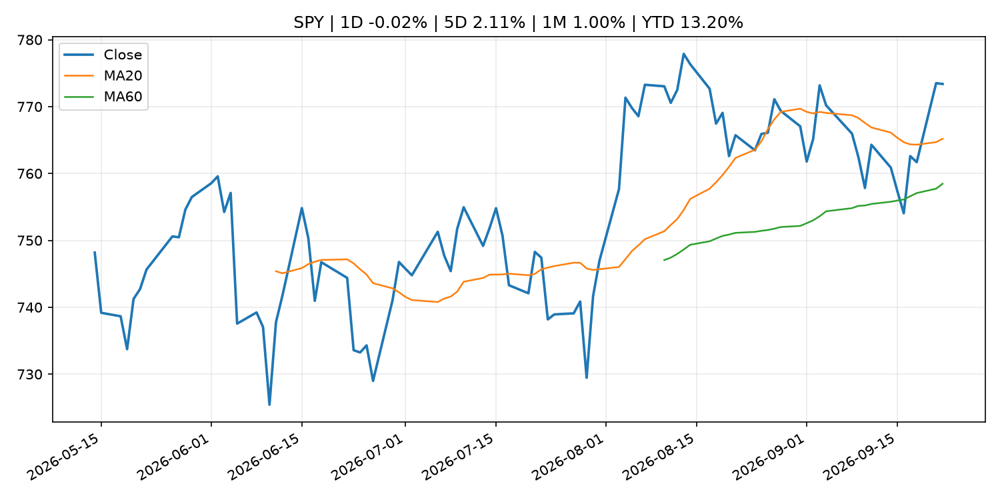
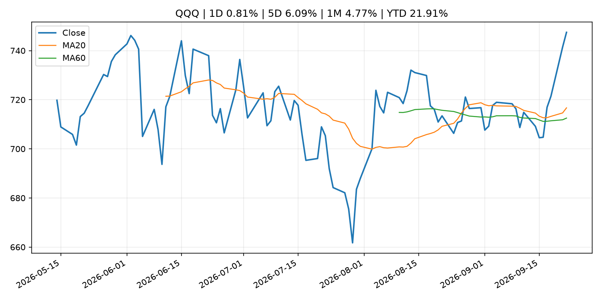
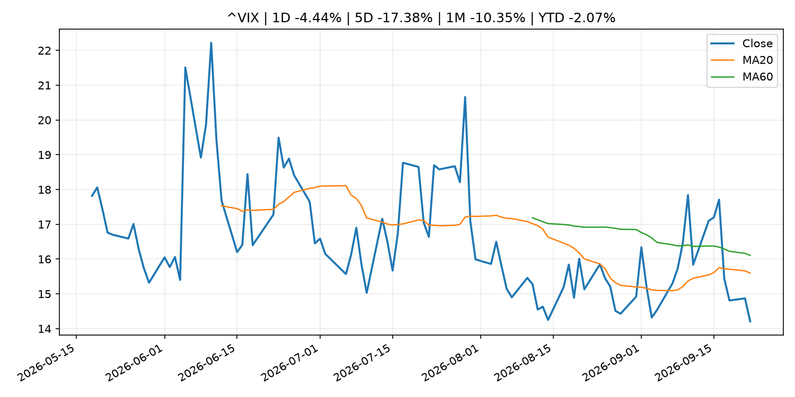
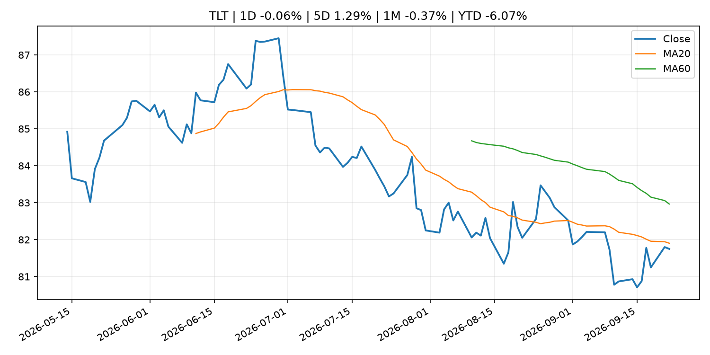
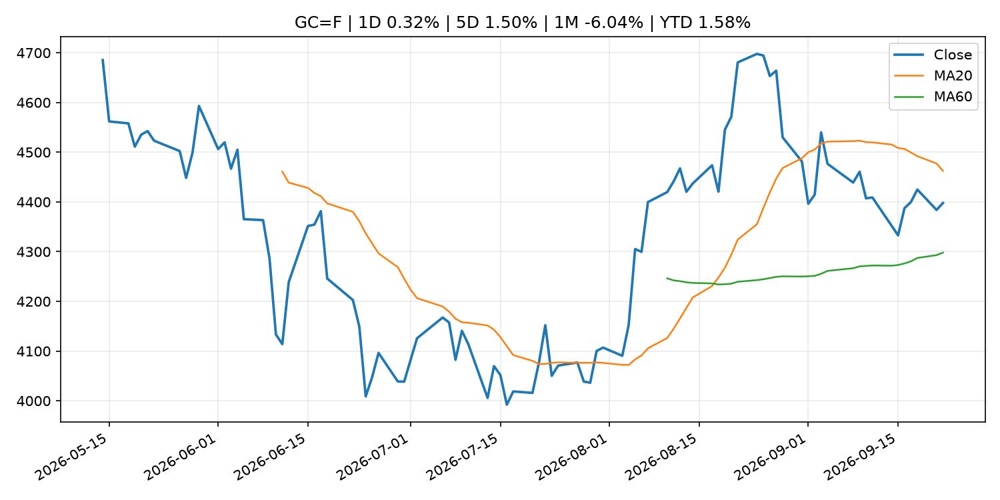
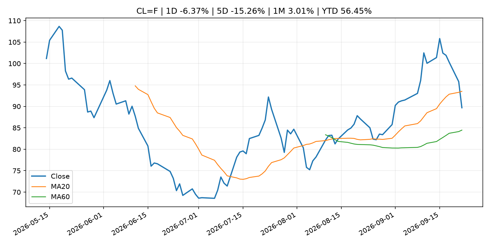
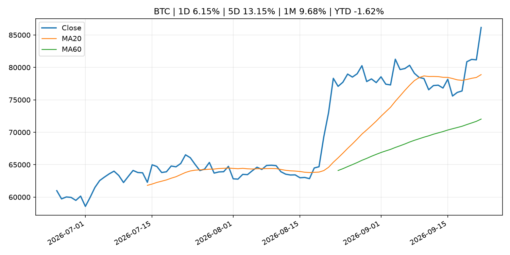
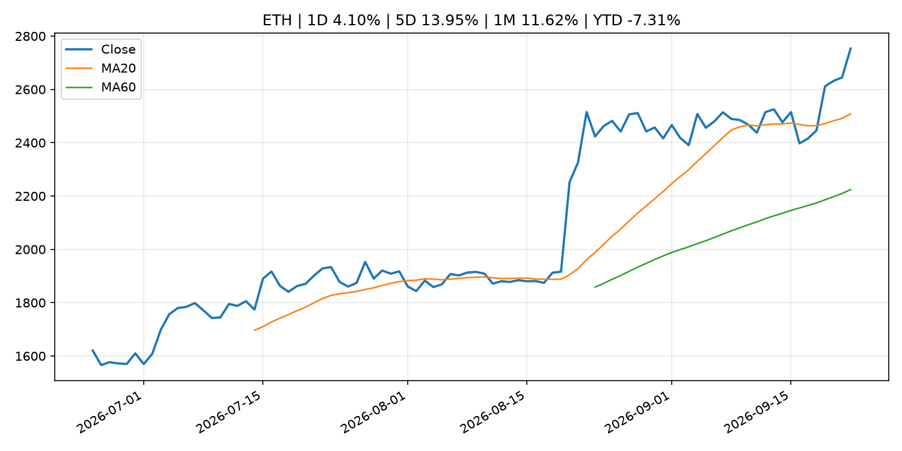
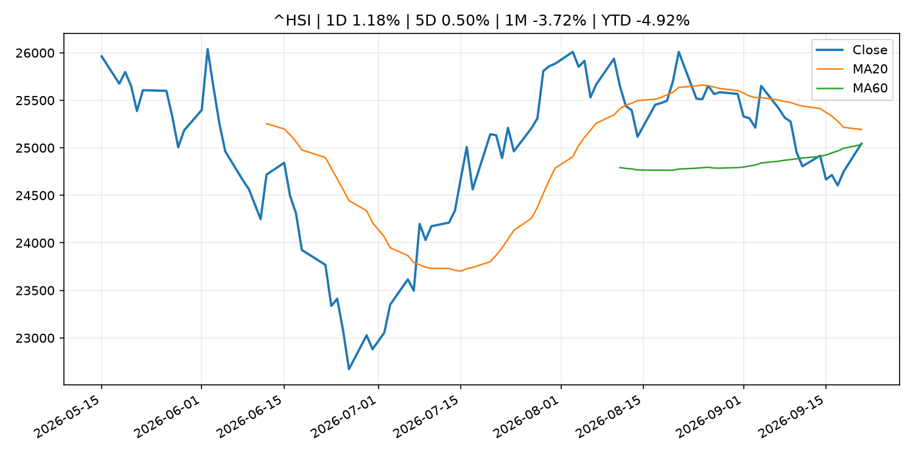

# Global Macro Morning Briefing - 2026-09-23

> Not financial advice / 非投资建议。

## 0. 今日总览
- 市场状态：unknown。市场信号不足，暂不判断明确状态。
- 今日三大主线：
  1. fiscal_policy: Binance probed by U.S. federal prosecutors for sanctions violations: Bloomberg
  2. regulation: SEC Censures OTC Link LLC for Repeated Compliance Failures Related to Regulation SCI
  3. crypto_market_structure: Next for the U.S. SEC: Agency's chief crypto counsel illuminates path for custody
- 一句话结论：今日晨报重点关注：财政和贸易政策会影响增长、通胀、企业利润和跨境资本流。；监管变化会改变行业盈利预期和资产风险溢价。。跨资产方面，SPY 1D -0.02%；QQQ 1D 0.81%；^VIX 1D -4.44%；TLT 1D -0.06%；GC=F 1D 0.32%；CL=F 1D -6.37%；BTC 1D 6.15%；ETH 1D 4.10%；市场信号不足，暂不判断明确状态。政策、通胀、利率、美元、美债、能源和加密监管仍是主要观察线索。所有结论仅基于公开数据与短摘要整理，不构成投资建议。

## 1. 隔夜跨资产市场
- 美股：SPY 1D -0.02%，QQQ 1D 0.81%，整体趋势需结合 VIX 和利率确认。
- 美债/美元：TLT 1D -0.06%，美元指数 1D 0.12%，是判断折现率压力的核心线索。
- 黄金/原油：黄金 1D 0.32%，原油 1D -6.37%，用于观察避险、通胀和地缘风险。
- 加密：BTC 1D 6.15%，ETH 1D 4.10%，关注是否独立于纳指走出加密自身行情。
- 港股/A股：恒生 1D 1.18%，沪深300/上证 1D n/a，重点看中国政策预期与人民币线索。
- 风险观察：关注后续数据是否确认当前跨资产信号。

### US_EQUITY

| symbol | latest close | 1D | 5D | 1M | YTD | trend |
|---|---:|---:|---:|---:|---:|---|
| SPY | 773.38 | -0.02% | 2.11% | 1.00% | 13.20% | uptrend |
| QQQ | 747.46 | 0.81% | 6.09% | 4.77% | 21.91% | strong_uptrend |
| DIA | 518.00 | -0.34% | -0.62% | -2.67% | 7.11% | downtrend |
| IWM | 287.21 | 0.57% | 0.73% | -4.25% | 15.45% | strong_downtrend |
| VTI | 381.27 | 0.04% | 2.26% | 0.80% | 13.37% | uptrend |

### US_MACRO_MARKET

| symbol | latest close | 1D | 5D | 1M | YTD | trend |
|---|---:|---:|---:|---:|---:|---|
| ^VIX | 14.21 | -4.44% | -17.38% | -10.35% | -2.07% | downtrend |
| DX-Y.NYB | 100.55 | 0.12% | 0.90% | 1.77% | 2.16% | range_bound |
| TLT | 81.75 | -0.06% | 1.29% | -0.37% | -6.07% | downtrend |
| IEF | 91.16 | 0.01% | 0.37% | -1.79% | -5.12% | downtrend |

### COMMODITIES

| symbol | latest close | 1D | 5D | 1M | YTD | trend |
|---|---:|---:|---:|---:|---:|---|
| GC=F | 4,397.90 | 0.32% | 1.50% | -6.04% | 1.58% | range_bound |
| SI=F | 67.89 | 3.13% | 7.35% | -2.28% | -3.79% | uptrend |
| CL=F | 89.68 | -6.37% | -15.26% | 3.01% | 56.45% | range_bound |
| BZ=F | 98.49 | -1.84% | -9.43% | 4.34% | 62.12% | strong_uptrend |
| NG=F | 3.17 | 11.88% | 8.70% | 14.42% | -12.30% | strong_uptrend |
| HG=F | 6.91 | 3.28% | 8.43% | 4.95% | 22.44% | strong_uptrend |

### HK_MARKET

| symbol | latest close | 1D | 5D | 1M | YTD | trend |
|---|---:|---:|---:|---:|---:|---|
| ^HSI | 25,042.71 | 1.18% | 0.50% | -3.72% | -4.92% | range_bound |
| 0700.HK | 451.60 | 5.02% | 2.92% | 2.64% | -27.51% | range_bound |
| 9988.HK | 114.80 | 1.95% | 7.09% | 2.04% | -22.95% | range_bound |
| 3690.HK | 73.20 | -1.08% | -2.07% | -11.49% | -30.02% | strong_downtrend |
| 1810.HK | 27.20 | -1.38% | 2.64% | -2.23% | -32.47% | uptrend |
| 1211.HK | 81.35 | 0.18% | 2.91% | -12.34% | -17.62% | strong_downtrend |

### CRYPTO

| symbol | latest close | 1D | 5D | 1M | YTD | trend |
|---|---:|---:|---:|---:|---:|---|
| BTC | 86,159.69 | 6.15% | 13.15% | 9.68% | -1.62% | strong_uptrend |
| ETH | 2,753.06 | 4.10% | 13.95% | 11.62% | -7.31% | strong_uptrend |
| SOLANA | 118.53 | 6.64% | 20.29% | 15.07% | -4.81% | strong_uptrend |
| BINANCECOIN | 788.12 | 2.06% | 8.65% | 14.03% | -8.64% | strong_uptrend |
| RIPPLE | 1.57 | 11.41% | 21.01% | 13.91% | -14.64% | strong_uptrend |

## 2. 今日最重要的 10 条新闻
### 1. Binance probed by U.S. federal prosecutors for sanctions violations: Bloomberg
- 来源：CoinDesk
- 时间：2026-09-22T10:07:52+00:00
- 地区：global
- 事件类型：fiscal_policy
- 重要性层级：Tier 1
- 一句话摘要：Binance probed by U.S. federal prosecutors for sanctions violations: Bloomberg
- 为什么重要：财政和贸易政策会影响增长、通胀、企业利润和跨境资本流。
- 可能影响：可能影响利率、汇率、风险资产或大宗商品预期，但当前公开信息不足以判断明确方向。
  - 资产：暂无明确资产映射
  - 方向：unknown
  - 强度：low
  - 原因：公开信息不足以判断方向。
- 原文链接：[https://www.coindesk.com/policy/2026/09/22/binance-probed-by-u-s-federal-prosecutors-for-sanctions-violations-bloomberg](https://www.coindesk.com/policy/2026/09/22/binance-probed-by-u-s-federal-prosecutors-for-sanctions-violations-bloomberg)

### 2. SEC Censures OTC Link LLC for Repeated Compliance Failures Related to Regulation SCI
- 来源：SEC Press Releases
- 时间：2026-09-22T12:41:11-04:00
- 地区：US
- 事件类型：regulation
- 重要性层级：Tier 2
- 一句话摘要：The Securities and Exchange Commission today censured New York-based broker dealer OTC Link LLC and ordered it to pay a $575,000 civil penalty for longstanding violations of Regulation Systems Compliance and Integrity (SCI).According to the SEC’s settled…
- 为什么重要：监管变化会改变行业盈利预期和资产风险溢价。
- 可能影响：主要影响 BTC，方向为 mixed，强度 high；加密监管或 ETF 进展会改变 BTC 的资金流和风险溢价。
  - 资产：BTC
    方向：mixed
    强度：high
    原因：加密监管或 ETF 进展会改变 BTC 的资金流和风险溢价。
  - 资产：ETH
    方向：mixed
    强度：high
    原因：监管框架会影响 ETH 产品化和机构参与度。
  - 资产：COIN
    方向：mixed
    强度：medium
    原因：监管清晰度和执法风险会影响交易平台估值。
  - 资产：crypto market
    方向：mixed
    强度：high
    原因：信息影响整个加密市场结构，但方向取决于细节。
- 原文链接：[https://www.sec.gov/newsroom/press-releases/2026-91-sec-censures-otc-link-llc-repeated-compliance-failures-related-regulation-sci](https://www.sec.gov/newsroom/press-releases/2026-91-sec-censures-otc-link-llc-repeated-compliance-failures-related-regulation-sci)

### 3. Next for the U.S. SEC: Agency's chief crypto counsel illuminates path for custody
- 来源：CoinDesk
- 时间：2026-09-22T15:21:28+00:00
- 地区：global
- 事件类型：crypto_market_structure
- 重要性层级：Tier 2
- 一句话摘要：Next for the U.S. SEC: Agency's chief crypto counsel illuminates path for custody
- 为什么重要：加密市场结构和监管变化会影响 BTC、ETH 及相关股票的风险溢价。
- 可能影响：主要影响 BTC，方向为 mixed，强度 high；加密监管或 ETF 进展会改变 BTC 的资金流和风险溢价。
  - 资产：BTC
    方向：mixed
    强度：high
    原因：加密监管或 ETF 进展会改变 BTC 的资金流和风险溢价。
  - 资产：ETH
    方向：mixed
    强度：high
    原因：监管框架会影响 ETH 产品化和机构参与度。
  - 资产：COIN
    方向：mixed
    强度：medium
    原因：监管清晰度和执法风险会影响交易平台估值。
  - 资产：crypto market
    方向：mixed
    强度：high
    原因：信息影响整个加密市场结构，但方向取决于细节。
- 原文链接：[https://www.coindesk.com/policy/2026/09/22/next-for-the-u-s-sec-agency-s-chief-crypto-counsel-illuminates-path-for-custody](https://www.coindesk.com/policy/2026/09/22/next-for-the-u-s-sec-agency-s-chief-crypto-counsel-illuminates-path-for-custody)

### 4. European central banks push to expand stablecoin yield ban to crypto lending and staking
- 来源：CoinDesk
- 时间：2026-09-22T14:32:59+00:00
- 地区：global
- 事件类型：crypto_market_structure
- 重要性层级：Tier 2
- 一句话摘要：European central banks push to expand stablecoin yield ban to crypto lending and staking
- 为什么重要：加密市场结构和监管变化会影响 BTC、ETH 及相关股票的风险溢价。
- 可能影响：主要影响 BTC，方向为 mixed，强度 high；加密监管或 ETF 进展会改变 BTC 的资金流和风险溢价。
  - 资产：BTC
    方向：mixed
    强度：high
    原因：加密监管或 ETF 进展会改变 BTC 的资金流和风险溢价。
  - 资产：ETH
    方向：mixed
    强度：high
    原因：监管框架会影响 ETH 产品化和机构参与度。
  - 资产：COIN
    方向：mixed
    强度：medium
    原因：监管清晰度和执法风险会影响交易平台估值。
  - 资产：crypto market
    方向：mixed
    强度：high
    原因：信息影响整个加密市场结构，但方向取决于细节。
- 原文链接：[https://www.coindesk.com/policy/2026/09/22/european-central-banks-push-to-expand-stablecoin-yield-ban-to-crypto-lending-and-staking](https://www.coindesk.com/policy/2026/09/22/european-central-banks-push-to-expand-stablecoin-yield-ban-to-crypto-lending-and-staking)

### 5. Why this investment bank expects little demand for tokenized stocks despite SEC’s new trading rules
- 来源：CoinDesk
- 时间：2026-09-21T19:08:40+00:00
- 地区：global
- 事件类型：regulation
- 重要性层级：Tier 2
- 一句话摘要：Why this investment bank expects little demand for tokenized stocks despite SEC’s new trading rules
- 为什么重要：监管变化会改变行业盈利预期和资产风险溢价。
- 可能影响：主要影响 BTC，方向为 mixed，强度 high；加密监管或 ETF 进展会改变 BTC 的资金流和风险溢价。
  - 资产：BTC
    方向：mixed
    强度：high
    原因：加密监管或 ETF 进展会改变 BTC 的资金流和风险溢价。
  - 资产：ETH
    方向：mixed
    强度：high
    原因：监管框架会影响 ETH 产品化和机构参与度。
  - 资产：COIN
    方向：mixed
    强度：medium
    原因：监管清晰度和执法风险会影响交易平台估值。
  - 资产：crypto market
    方向：mixed
    强度：high
    原因：信息影响整个加密市场结构，但方向取决于细节。
- 原文链接：[https://www.coindesk.com/markets/2026/09/21/why-this-investment-bank-sees-little-demand-for-tokenized-stocks-despite-sec-s-new-trading-rules](https://www.coindesk.com/markets/2026/09/21/why-this-investment-bank-sees-little-demand-for-tokenized-stocks-despite-sec-s-new-trading-rules)

### 6. Bitcoin recovers from Asian-session lows as falling oil price supports risk appetite
- 来源：CoinDesk
- 时间：2026-09-22T10:59:03+00:00
- 地区：global
- 事件类型：other
- 重要性层级：Tier 3
- 一句话摘要：Bitcoin recovers from Asian-session lows as falling oil price supports risk appetite
- 为什么重要：这条信息暂未匹配到重大宏观、政策或市场事件，更适合作为背景跟踪。
- 可能影响：主要影响 CL=F，方向为 positive，强度 high；供给扰动或 OPEC 减产通常推升 WTI 原油。
  - 资产：CL=F
    方向：positive
    强度：high
    原因：供给扰动或 OPEC 减产通常推升 WTI 原油。
  - 资产：BZ=F
    方向：positive
    强度：high
    原因：全球供给风险通常直接影响 Brent 原油。
  - 资产：SPY
    方向：mixed
    强度：medium
    原因：能源股可能受益，但通胀和成本压力不利于宽基风险资产。
- 原文链接：[https://www.coindesk.com/markets/2026/09/22/bitcoin-recovers-from-asian-session-lows-as-falling-oil-price-supports-risk-appetite](https://www.coindesk.com/markets/2026/09/22/bitcoin-recovers-from-asian-session-lows-as-falling-oil-price-supports-risk-appetite)

### 7. Federal Reserve Board announces approval of application by BancFirst Corporation
- 来源：Federal Reserve Press Releases
- 时间：2026-09-22T20:30:00+00:00
- 地区：US
- 事件类型：other
- 重要性层级：Tier 3
- 一句话摘要：Federal Reserve Board announces approval of application by BancFirst Corporation
- 为什么重要：这条信息暂未匹配到重大宏观、政策或市场事件，更适合作为背景跟踪。
- 可能影响：更偏背景信息，短期市场影响可能有限。
  - 资产：暂无明确资产映射
  - 方向：unknown
  - 强度：low
  - 原因：公开信息不足以判断方向。
- 原文链接：[https://www.federalreserve.gov/newsevents/pressreleases/orders20260922a.htm](https://www.federalreserve.gov/newsevents/pressreleases/orders20260922a.htm)

## 3. 政策与央行观察
### 1. Binance probed by U.S. federal prosecutors for sanctions violations: Bloomberg
- 来源：CoinDesk
- 时间：2026-09-22T10:07:52+00:00
- 地区：global
- 事件类型：fiscal_policy
- 重要性层级：Tier 1
- 一句话摘要：Binance probed by U.S. federal prosecutors for sanctions violations: Bloomberg
- 为什么重要：财政和贸易政策会影响增长、通胀、企业利润和跨境资本流。
- 可能影响：可能影响利率、汇率、风险资产或大宗商品预期，但当前公开信息不足以判断明确方向。
  - 资产：暂无明确资产映射
  - 方向：unknown
  - 强度：low
  - 原因：公开信息不足以判断方向。
- 原文链接：[https://www.coindesk.com/policy/2026/09/22/binance-probed-by-u-s-federal-prosecutors-for-sanctions-violations-bloomberg](https://www.coindesk.com/policy/2026/09/22/binance-probed-by-u-s-federal-prosecutors-for-sanctions-violations-bloomberg)

### 2. SEC Censures OTC Link LLC for Repeated Compliance Failures Related to Regulation SCI
- 来源：SEC Press Releases
- 时间：2026-09-22T12:41:11-04:00
- 地区：US
- 事件类型：regulation
- 重要性层级：Tier 2
- 一句话摘要：The Securities and Exchange Commission today censured New York-based broker dealer OTC Link LLC and ordered it to pay a $575,000 civil penalty for longstanding violations of Regulation Systems Compliance and Integrity (SCI).According to the SEC’s settled…
- 为什么重要：监管变化会改变行业盈利预期和资产风险溢价。
- 可能影响：主要影响 BTC，方向为 mixed，强度 high；加密监管或 ETF 进展会改变 BTC 的资金流和风险溢价。
  - 资产：BTC
    方向：mixed
    强度：high
    原因：加密监管或 ETF 进展会改变 BTC 的资金流和风险溢价。
  - 资产：ETH
    方向：mixed
    强度：high
    原因：监管框架会影响 ETH 产品化和机构参与度。
  - 资产：COIN
    方向：mixed
    强度：medium
    原因：监管清晰度和执法风险会影响交易平台估值。
  - 资产：crypto market
    方向：mixed
    强度：high
    原因：信息影响整个加密市场结构，但方向取决于细节。
- 原文链接：[https://www.sec.gov/newsroom/press-releases/2026-91-sec-censures-otc-link-llc-repeated-compliance-failures-related-regulation-sci](https://www.sec.gov/newsroom/press-releases/2026-91-sec-censures-otc-link-llc-repeated-compliance-failures-related-regulation-sci)

### 3. Next for the U.S. SEC: Agency's chief crypto counsel illuminates path for custody
- 来源：CoinDesk
- 时间：2026-09-22T15:21:28+00:00
- 地区：global
- 事件类型：crypto_market_structure
- 重要性层级：Tier 2
- 一句话摘要：Next for the U.S. SEC: Agency's chief crypto counsel illuminates path for custody
- 为什么重要：加密市场结构和监管变化会影响 BTC、ETH 及相关股票的风险溢价。
- 可能影响：主要影响 BTC，方向为 mixed，强度 high；加密监管或 ETF 进展会改变 BTC 的资金流和风险溢价。
  - 资产：BTC
    方向：mixed
    强度：high
    原因：加密监管或 ETF 进展会改变 BTC 的资金流和风险溢价。
  - 资产：ETH
    方向：mixed
    强度：high
    原因：监管框架会影响 ETH 产品化和机构参与度。
  - 资产：COIN
    方向：mixed
    强度：medium
    原因：监管清晰度和执法风险会影响交易平台估值。
  - 资产：crypto market
    方向：mixed
    强度：high
    原因：信息影响整个加密市场结构，但方向取决于细节。
- 原文链接：[https://www.coindesk.com/policy/2026/09/22/next-for-the-u-s-sec-agency-s-chief-crypto-counsel-illuminates-path-for-custody](https://www.coindesk.com/policy/2026/09/22/next-for-the-u-s-sec-agency-s-chief-crypto-counsel-illuminates-path-for-custody)

### 4. European central banks push to expand stablecoin yield ban to crypto lending and staking
- 来源：CoinDesk
- 时间：2026-09-22T14:32:59+00:00
- 地区：global
- 事件类型：crypto_market_structure
- 重要性层级：Tier 2
- 一句话摘要：European central banks push to expand stablecoin yield ban to crypto lending and staking
- 为什么重要：加密市场结构和监管变化会影响 BTC、ETH 及相关股票的风险溢价。
- 可能影响：主要影响 BTC，方向为 mixed，强度 high；加密监管或 ETF 进展会改变 BTC 的资金流和风险溢价。
  - 资产：BTC
    方向：mixed
    强度：high
    原因：加密监管或 ETF 进展会改变 BTC 的资金流和风险溢价。
  - 资产：ETH
    方向：mixed
    强度：high
    原因：监管框架会影响 ETH 产品化和机构参与度。
  - 资产：COIN
    方向：mixed
    强度：medium
    原因：监管清晰度和执法风险会影响交易平台估值。
  - 资产：crypto market
    方向：mixed
    强度：high
    原因：信息影响整个加密市场结构，但方向取决于细节。
- 原文链接：[https://www.coindesk.com/policy/2026/09/22/european-central-banks-push-to-expand-stablecoin-yield-ban-to-crypto-lending-and-staking](https://www.coindesk.com/policy/2026/09/22/european-central-banks-push-to-expand-stablecoin-yield-ban-to-crypto-lending-and-staking)

### 5. Why this investment bank expects little demand for tokenized stocks despite SEC’s new trading rules
- 来源：CoinDesk
- 时间：2026-09-21T19:08:40+00:00
- 地区：global
- 事件类型：regulation
- 重要性层级：Tier 2
- 一句话摘要：Why this investment bank expects little demand for tokenized stocks despite SEC’s new trading rules
- 为什么重要：监管变化会改变行业盈利预期和资产风险溢价。
- 可能影响：主要影响 BTC，方向为 mixed，强度 high；加密监管或 ETF 进展会改变 BTC 的资金流和风险溢价。
  - 资产：BTC
    方向：mixed
    强度：high
    原因：加密监管或 ETF 进展会改变 BTC 的资金流和风险溢价。
  - 资产：ETH
    方向：mixed
    强度：high
    原因：监管框架会影响 ETH 产品化和机构参与度。
  - 资产：COIN
    方向：mixed
    强度：medium
    原因：监管清晰度和执法风险会影响交易平台估值。
  - 资产：crypto market
    方向：mixed
    强度：high
    原因：信息影响整个加密市场结构，但方向取决于细节。
- 原文链接：[https://www.coindesk.com/markets/2026/09/21/why-this-investment-bank-sees-little-demand-for-tokenized-stocks-despite-sec-s-new-trading-rules](https://www.coindesk.com/markets/2026/09/21/why-this-investment-bank-sees-little-demand-for-tokenized-stocks-despite-sec-s-new-trading-rules)

## 4. 市场异动与图表
- QQQ 上涨 0.81%
- VIX 下跌 -4.44%
- Oil 下跌 -6.37%
- BTC 上涨 6.15%
- ETH 上涨 4.10%

### SPY

### QQQ

### ^VIX

### TLT

### GC=F

### CL=F

### BTC

### ETH

### ^HSI

## 5. 华尔街与机构公开观点
- 暂无可靠公开观点。

## 6. 今日重点关注
- 经济数据：经济数据：暂无可靠公开日历数据；如配置经济日历源后可自动填充。
- 央行讲话：央行讲话：暂无可靠公开日历数据；重点跟踪 Fed、ECB、BoJ、PBOC 官网 RSS。
- 财报：财报：暂无可靠数据。
- 政策事件：政策事件：暂无可靠数据。
- 风险提醒：风险提醒：关注数据源失败项、突发地缘风险、利率和美元的二阶反应。

## 7. 英文金融表达与宏观概念
- **risk-off**：避险模式，资金偏向美元、国债、黄金等防御资产。 例句：A geopolitical shock can push markets into risk-off mode.
- **supply disruption**：供给扰动，通常指能源或商品供应受冲突、减产或天气影响。 例句：Supply disruption can lift oil prices and inflation expectations.
- **market structure**：市场结构，指交易、托管、清算、ETF、监管等制度安排。 例句：Crypto market structure rules can affect institutional participation.
- **inflation expectations**：通胀预期，指家庭、企业或市场对未来通胀的预估。 例句：Inflation expectations can shape wage bargaining and bond yields.
- **real yield**：实际收益率，名义利率扣除通胀预期后的收益率。 例句：Gold often reacts more to real yields than nominal yields.
- **terminal rate**：终端利率，市场预期本轮加息周期的最高政策利率。 例句：A higher terminal rate can pressure growth stocks.

## 8. 背景材料
- [Federal Reserve Board announces approval of application by BancFirst Corporation](https://www.federalreserve.gov/newsevents/pressreleases/orders20260922a.htm)（Federal Reserve Press Releases，other）：Federal Reserve Board announces approval of application by BancFirst Corporation
- [Bitcoin, ether perpetual volumes on Kalshi are dominated by an unusual, repetitive trade, data shows](https://www.coindesk.com/markets/2026/09/21/bitcoin-ether-perpetual-volumes-on-kalshi-are-dominated-by-an-unusual-repetitive-trade-data-shows)（CoinDesk，other）：Bitcoin, ether perpetual volumes on Kalshi are dominated by an unusual, repetitive trade, data shows
- [Why Payward-backed Reap is betting on non-USD stablecoins for 24/7 cross-border FX settlement](https://www.coindesk.com/business/2026/09/22/visa-partner-reap-eyes-local-currency-stablecoins-in-several-countries-for-24-7-onchain-fx)（CoinDesk，other）：Why Payward-backed Reap is betting on non-USD stablecoins for 24/7 cross-border FX settlement
- [A $3.2 million 'bitcoin butterfly' option trade bets on $95,000 by the end of October](https://www.coindesk.com/daybook-us/2026/09/22/a-usd3-2-million-bitcoin-butterfly-option-trade-bets-on-usd95-000-by-the-end-of-october)（CoinDesk，other）：A $3.2 million 'bitcoin butterfly' option trade bets on $95,000 by the end of October
- [Bitcoin recovers from Asian-session lows as falling oil price supports risk appetite](https://www.coindesk.com/markets/2026/09/22/bitcoin-recovers-from-asian-session-lows-as-falling-oil-price-supports-risk-appetite)（CoinDesk，other）：Bitcoin recovers from Asian-session lows as falling oil price supports risk appetite
- [Live updates: Bitcoin trades near $86,000 as U.S. stocks post small gains](https://www.coindesk.com/markets/2026/09/22/live-updates-oil-falls-as-iran-signals-possible-hormuz-reopening-bitcoin-holds-near-usd86-000)（CoinDesk，other）：Live updates: Bitcoin trades near $86,000 as U.S. stocks post small gains
- [Spot bitcoin ETFs attracted nearly $1 billion on Monday, the 9th largest inflow ever](https://www.coindesk.com/markets/2026/09/22/spot-bitcoin-etfs-attracted-nearly-usd1-billion-on-monday-the-9th-largest-inflow-ever)（CoinDesk，other）：Spot bitcoin ETFs attracted nearly $1 billion on Monday, the 9th largest inflow ever
- [Whitehats move 52 bitcoin from the Coldcard hack to a recovery trust](https://www.coindesk.com/markets/2026/09/22/whitehats-move-52-bitcoin-from-the-coldcard-hack-to-a-recovery-trust)（CoinDesk，other）：Whitehats move 52 bitcoin from the Coldcard hack to a recovery trust
- [Philip R. Lane: Interview with Le Temps](https://www.ecb.europa.eu//press/inter/date/2026/html/ecb.in260922~5f89d300ee.en.html)（ECB Press Releases，other）：Philip R. Lane: Interview with Le Temps
- [Dogecoin leads market rebound with 15% pump, bitcoin steady above $85,000](https://www.coindesk.com/markets/2026/09/22/dogecoin-leads-market-rebound-with-15-pump-bitcoin-steady-above-usd85-000)（CoinDesk，other）：Dogecoin leads market rebound with 15% pump, bitcoin steady above $85,000
- [Bitcoin could test $90,000 after shorts get squeezed, but traders warn leverage is building](https://www.coindesk.com/markets/2026/09/21/bitcoin-could-test-usd90-000-after-shorts-get-squeezed-but-traders-warn-leverage-is-building)（CoinDesk，other）：Bitcoin could test $90,000 after shorts get squeezed, but traders warn leverage is building
- [‘It's awful’: How tariffs, soaring fuel costs and higher interest rates are squeezing American companies](https://www.cnbc.com/2026/09/20/tariffs-fuel-prices-and-interest-rates-squeeze-us-companies.html)（CNBC Economy，other）：Tariffs, fuel prices and interest rates are squeezing American companies, particularly manufacturers, auto suppliers, retailers and transportation businesses.
- [Treasury Secretary Scott Bessent champions dollar dominance across global markets and stablecoins](https://www.coindesk.com/markets/2026/09/21/scott-bessent-champions-dollar-dominance-across-global-markets-and-stablecoins)（CoinDesk，other）：Treasury Secretary Scott Bessent champions dollar dominance across global markets and stablecoins
- [ECB to invest part of own funds in tokenised securities, with settlement via Pontes](https://www.ecb.europa.eu//press/pr/date/2026/html/ecb.pr260921_1~5a011ecbea.en.html)（ECB Press Releases，other）：ECB to invest part of own funds in tokenised securities, with settlement via Pontes
- [Eurosystem brings central bank money to tokenised finance](https://www.ecb.europa.eu//press/pr/date/2026/html/ecb.pr260921~e754847a7b.en.html)（ECB Press Releases，other）：Eurosystem brings central bank money to tokenised finance

## 9. 数据源、失败项与免责声明
- 采集时间：2026-09-23T00:00:46
- 数据源：公开 RSS、Yahoo Finance、CoinGecko、AKShare、FRED、SEC data.sec.gov，以及用户自有 inputs/reports 文件。
- 合规说明：不绕过 WSJ、Bloomberg、FT、Reuters 等付费墙；对付费媒体只使用公开 RSS 标题、摘要、链接和发布时间。
- 免责声明：Not financial advice / 非投资建议。本项目仅供个人学习、研究和信息整理，不构成投资建议、交易建议或任何收益承诺。
- 失败或跳过的数据源：
  - crypto data failed coin=dogecoin
  - China market data failed symbol=上证指数: empty dataframe
  - China market data failed symbol=深证成指: empty dataframe
  - China market data failed symbol=创业板指: empty dataframe
  - China market data failed symbol=沪深300: empty dataframe
  - China market data failed symbol=中证500: empty dataframe
  - China market data failed symbol=科创50: empty dataframe
  - FRED_API_KEY not set; skipping FRED macro series
  - SEC failed cik=0000320193
  - SEC failed cik=0000789019
  - SEC failed cik=0001045810
  - SEC failed cik=0001318605
  - SEC failed cik=0001577552
