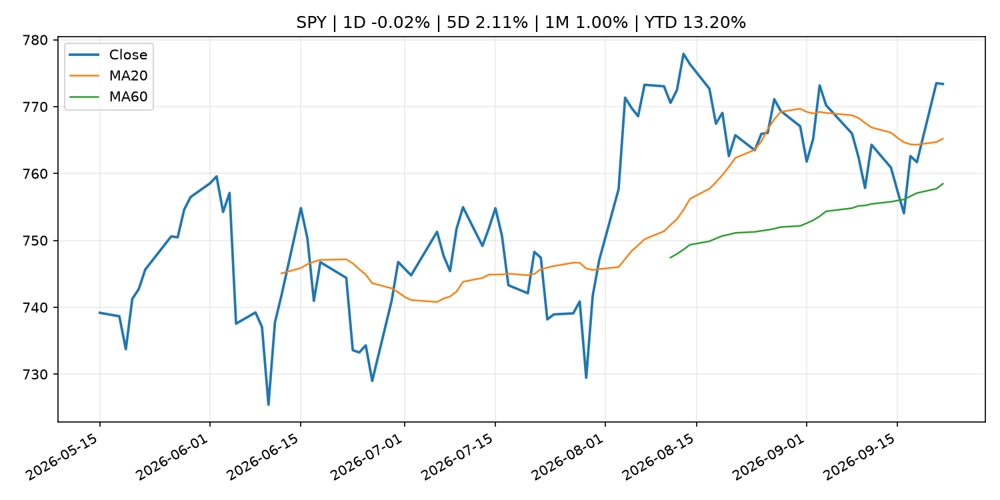
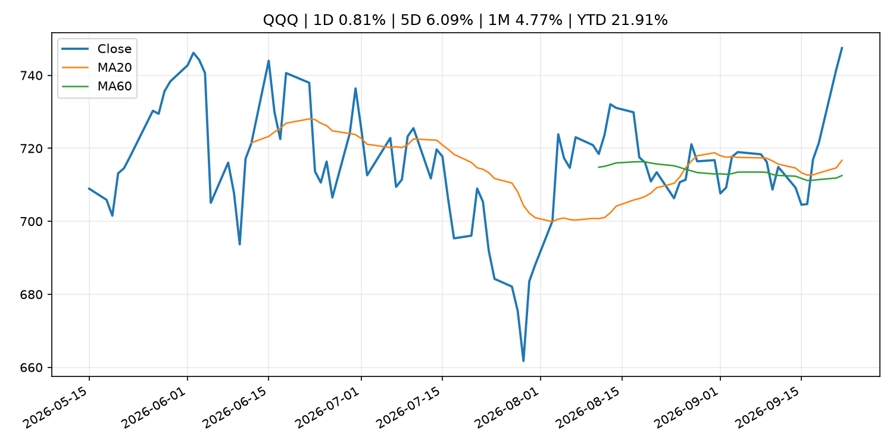
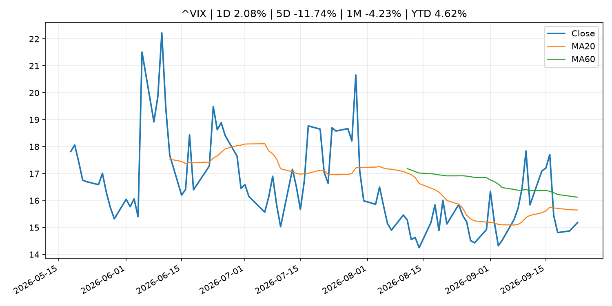
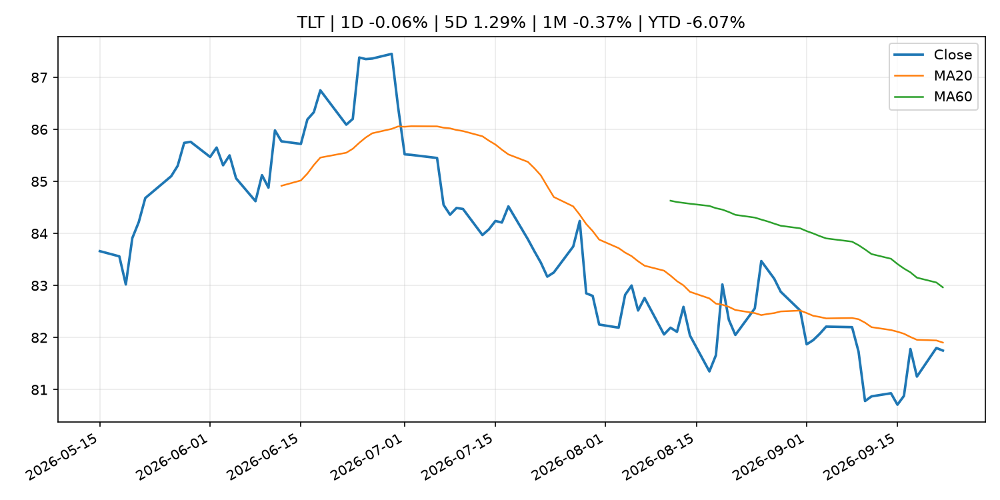
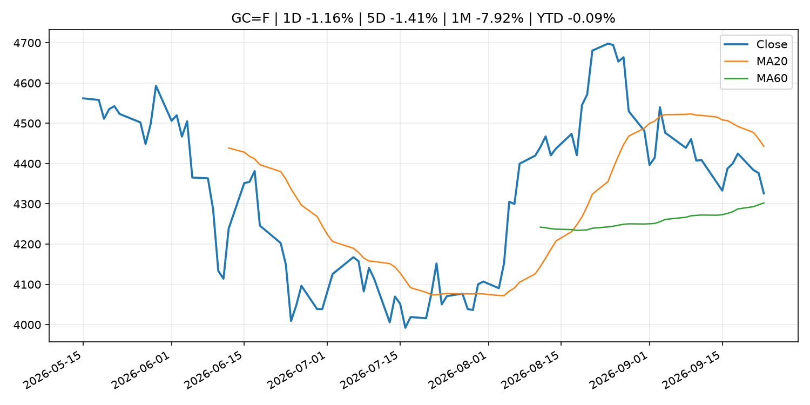
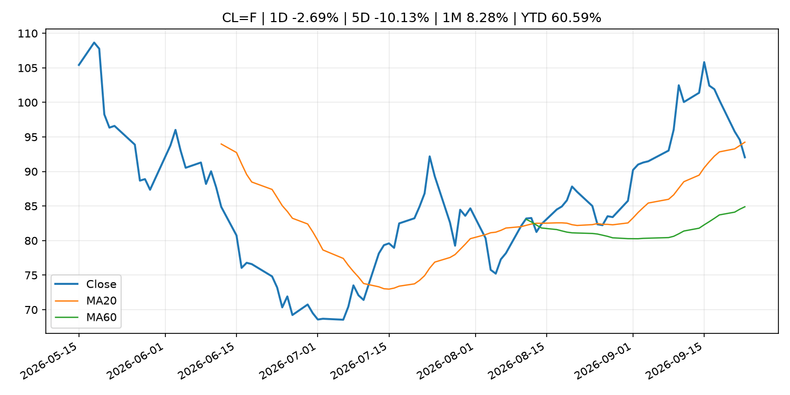
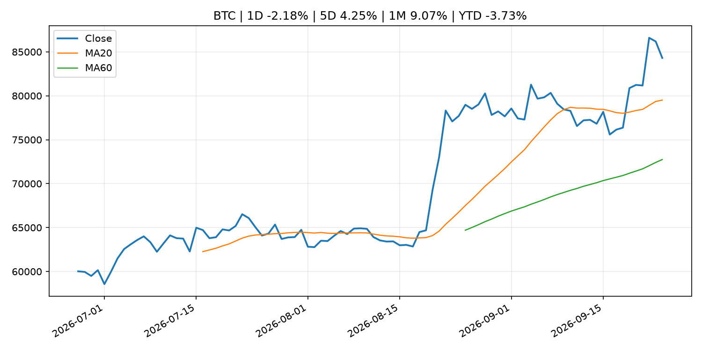
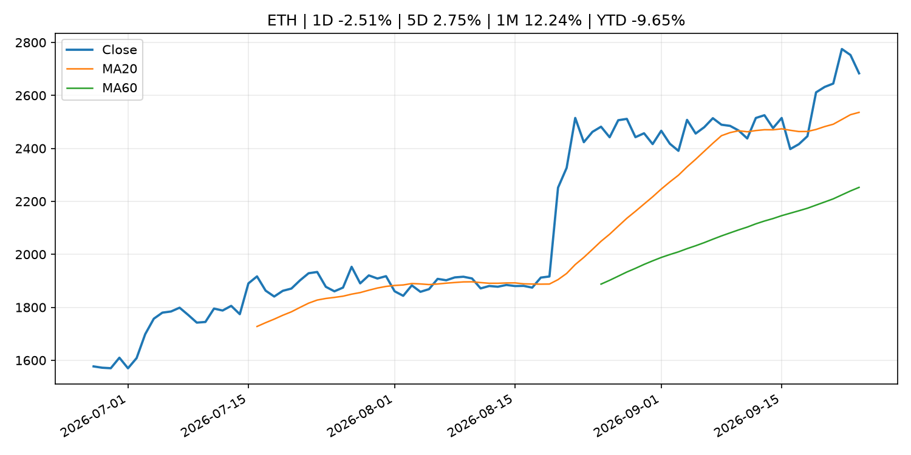

# Global Macro Morning Briefing - 2026-09-24

> Not financial advice / 非投资建议。

## 0. 今日总览
- 市场状态：unknown。市场信号不足，暂不判断明确状态。
- 今日三大主线：
  1. regulation: SEC Publishes Updated Market Statistics, Highlighting Increase in IPOs and Proceeds Raised
  2. regulation: SEC Charges South Florida Resident and His Company for Alleged Investment Scheme Defrauding Law Enforcement
  3. regulation: MoonPay to acquire SEC-registered North Capital in $60 million all-stock deal
- 一句话结论：今日晨报重点关注：监管变化会改变行业盈利预期和资产风险溢价。；监管变化会改变行业盈利预期和资产风险溢价。。跨资产方面，SPY 1D -0.02%；QQQ 1D 0.81%；^VIX 1D 2.08%；TLT 1D -0.06%；GC=F 1D -1.16%；CL=F 1D -2.69%；BTC 1D -2.18%；ETH 1D -2.51%；市场信号不足，暂不判断明确状态。政策、通胀、利率、美元、美债、能源和加密监管仍是主要观察线索。所有结论仅基于公开数据与短摘要整理，不构成投资建议。

## 1. 隔夜跨资产市场
- 美股：SPY 1D -0.02%，QQQ 1D 0.81%，整体趋势需结合 VIX 和利率确认。
- 美债/美元：TLT 1D -0.06%，美元指数 1D 0.69%，是判断折现率压力的核心线索。
- 黄金/原油：黄金 1D -1.16%，原油 1D -2.69%，用于观察避险、通胀和地缘风险。
- 加密：BTC 1D -2.18%，ETH 1D -2.51%，关注是否独立于纳指走出加密自身行情。
- 港股/A股：恒生 1D 1.18%，沪深300/上证 1D n/a，重点看中国政策预期与人民币线索。
- 风险观察：关注后续数据是否确认当前跨资产信号。

### US_EQUITY

| symbol | latest close | 1D | 5D | 1M | YTD | trend |
|---|---:|---:|---:|---:|---:|---|
| SPY | 773.38 | -0.02% | 2.11% | 1.00% | 13.20% | uptrend |
| QQQ | 747.46 | 0.81% | 6.09% | 4.77% | 21.91% | strong_uptrend |
| DIA | 519.78 | 0.76% | -0.90% | -1.47% | 7.47% | downtrend |
| IWM | 287.21 | 0.57% | 0.73% | -4.25% | 15.45% | strong_downtrend |
| VTI | 381.10 | 1.51% | 1.71% | 1.20% | 13.32% | uptrend |

### US_MACRO_MARKET

| symbol | latest close | 1D | 5D | 1M | YTD | trend |
|---|---:|---:|---:|---:|---:|---|
| ^VIX | 15.18 | 2.08% | -11.74% | -4.23% | 4.62% | downtrend |
| DX-Y.NYB | 101.12 | 0.69% | 1.48% | 2.35% | 2.75% | range_bound |
| TLT | 81.75 | -0.06% | 1.29% | -0.37% | -6.07% | downtrend |
| IEF | 91.15 | 0.39% | 0.24% | -1.99% | -5.13% | downtrend |

### COMMODITIES

| symbol | latest close | 1D | 5D | 1M | YTD | trend |
|---|---:|---:|---:|---:|---:|---|
| GC=F | 4,325.80 | -1.16% | -1.41% | -7.92% | -0.09% | range_bound |
| SI=F | 64.72 | -1.83% | 0.68% | -5.57% | -8.26% | range_bound |
| CL=F | 92.05 | -2.69% | -10.13% | 8.28% | 60.59% | range_bound |
| BZ=F | 97.96 | -1.30% | -7.44% | 6.28% | 61.25% | range_bound |
| NG=F | 3.17 | 7.05% | 9.79% | 14.09% | -12.27% | strong_uptrend |
| HG=F | 6.78 | 0.24% | 5.35% | 2.67% | 20.13% | uptrend |

### HK_MARKET

| symbol | latest close | 1D | 5D | 1M | YTD | trend |
|---|---:|---:|---:|---:|---:|---|
| ^HSI | 25,042.71 | 1.18% | 0.50% | -3.72% | -4.92% | range_bound |
| 0700.HK | 441.00 | -2.35% | 1.75% | -0.23% | -29.21% | range_bound |
| 9988.HK | 109.80 | -4.36% | 3.39% | -3.85% | -26.31% | range_bound |
| 3690.HK | 72.85 | -0.48% | -2.15% | -5.63% | -30.35% | strong_downtrend |
| 1810.HK | 26.18 | -3.75% | 0.00% | -5.69% | -35.00% | range_bound |
| 1211.HK | 80.35 | -1.23% | 1.45% | -14.16% | -18.63% | strong_downtrend |

### CRYPTO

| symbol | latest close | 1D | 5D | 1M | YTD | trend |
|---|---:|---:|---:|---:|---:|---|
| BTC | 84,307.76 | -2.18% | 4.25% | 9.07% | -3.73% | strong_uptrend |
| ETH | 2,683.46 | -2.51% | 2.75% | 12.24% | -9.65% | strong_uptrend |
| SOLANA | 114.99 | -2.97% | 2.03% | 14.54% | -7.65% | strong_uptrend |
| BINANCECOIN | 766.15 | -2.79% | 0.66% | 11.32% | -11.19% | strong_uptrend |
| RIPPLE | 1.50 | -4.61% | 7.37% | 11.00% | -18.56% | strong_uptrend |

## 2. 今日最重要的 10 条新闻
### 1. SEC Publishes Updated Market Statistics, Highlighting Increase in IPOs and Proceeds Raised
- 来源：SEC Press Releases
- 时间：2026-09-23T14:27:00-04:00
- 地区：US
- 事件类型：regulation
- 重要性层级：Tier 2
- 一句话摘要：The Securities and Exchange Commission’s Division of Economic and Risk Analysis (DERA) published updated statistics and data visualizations covering key segments of the U.S. capital markets, including a notable increase in the number of initial public…
- 为什么重要：监管变化会改变行业盈利预期和资产风险溢价。
- 可能影响：主要影响 BTC，方向为 mixed，强度 high；加密监管或 ETF 进展会改变 BTC 的资金流和风险溢价。
  - 资产：BTC
    方向：mixed
    强度：high
    原因：加密监管或 ETF 进展会改变 BTC 的资金流和风险溢价。
  - 资产：ETH
    方向：mixed
    强度：high
    原因：监管框架会影响 ETH 产品化和机构参与度。
  - 资产：COIN
    方向：mixed
    强度：medium
    原因：监管清晰度和执法风险会影响交易平台估值。
  - 资产：crypto market
    方向：mixed
    强度：high
    原因：信息影响整个加密市场结构，但方向取决于细节。
- 原文链接：[https://www.sec.gov/newsroom/press-releases/2026-93-sec-publishes-updated-market-statistics-highlighting-increase-ipos-proceeds-raised](https://www.sec.gov/newsroom/press-releases/2026-93-sec-publishes-updated-market-statistics-highlighting-increase-ipos-proceeds-raised)

### 2. SEC Charges South Florida Resident and His Company for Alleged Investment Scheme Defrauding Law Enforcement
- 来源：SEC Press Releases
- 时间：2026-09-23T12:00:00-04:00
- 地区：US
- 事件类型：regulation
- 重要性层级：Tier 2
- 一句话摘要：The Securities and Exchange Commission today charged CMI Capital LLC and its founder and manager, Michael D. Williams, for an alleged fraudulent investment scheme that raised approximately $860,000 from at least 18 investors, many of whom are current or…
- 为什么重要：监管变化会改变行业盈利预期和资产风险溢价。
- 可能影响：主要影响 BTC，方向为 mixed，强度 high；加密监管或 ETF 进展会改变 BTC 的资金流和风险溢价。
  - 资产：BTC
    方向：mixed
    强度：high
    原因：加密监管或 ETF 进展会改变 BTC 的资金流和风险溢价。
  - 资产：ETH
    方向：mixed
    强度：high
    原因：监管框架会影响 ETH 产品化和机构参与度。
  - 资产：COIN
    方向：mixed
    强度：medium
    原因：监管清晰度和执法风险会影响交易平台估值。
  - 资产：crypto market
    方向：mixed
    强度：high
    原因：信息影响整个加密市场结构，但方向取决于细节。
- 原文链接：[https://www.sec.gov/newsroom/press-releases/2026-92-sec-charges-south-florida-resident-his-company-alleged-investment-scheme-defrauding-law-enforcement](https://www.sec.gov/newsroom/press-releases/2026-92-sec-charges-south-florida-resident-his-company-alleged-investment-scheme-defrauding-law-enforcement)

### 3. MoonPay to acquire SEC-registered North Capital in $60 million all-stock deal
- 来源：CoinDesk
- 时间：2026-09-23T13:00:00+00:00
- 地区：global
- 事件类型：regulation
- 重要性层级：Tier 2
- 一句话摘要：MoonPay to acquire SEC-registered North Capital in $60 million all-stock deal
- 为什么重要：监管变化会改变行业盈利预期和资产风险溢价。
- 可能影响：主要影响 BTC，方向为 mixed，强度 high；加密监管或 ETF 进展会改变 BTC 的资金流和风险溢价。
  - 资产：BTC
    方向：mixed
    强度：high
    原因：加密监管或 ETF 进展会改变 BTC 的资金流和风险溢价。
  - 资产：ETH
    方向：mixed
    强度：high
    原因：监管框架会影响 ETH 产品化和机构参与度。
  - 资产：COIN
    方向：mixed
    强度：medium
    原因：监管清晰度和执法风险会影响交易平台估值。
  - 资产：crypto market
    方向：mixed
    强度：high
    原因：信息影响整个加密市场结构，但方向取决于细节。
- 原文链接：[https://www.coindesk.com/business/2026/09/23/moonpay-to-acquire-sec-registered-north-capital-in-usd60-million-all-stock-deal](https://www.coindesk.com/business/2026/09/23/moonpay-to-acquire-sec-registered-north-capital-in-usd60-million-all-stock-deal)

### 4. BlackRock says AI agents could drive stablecoin and crypto adoption
- 来源：CoinDesk
- 时间：2026-09-23T09:17:53+00:00
- 地区：global
- 事件类型：crypto_market_structure
- 重要性层级：Tier 2
- 一句话摘要：BlackRock says AI agents could drive stablecoin and crypto adoption
- 为什么重要：加密市场结构和监管变化会影响 BTC、ETH 及相关股票的风险溢价。
- 可能影响：主要影响 BTC，方向为 mixed，强度 high；加密监管或 ETF 进展会改变 BTC 的资金流和风险溢价。
  - 资产：BTC
    方向：mixed
    强度：high
    原因：加密监管或 ETF 进展会改变 BTC 的资金流和风险溢价。
  - 资产：ETH
    方向：mixed
    强度：high
    原因：监管框架会影响 ETH 产品化和机构参与度。
  - 资产：COIN
    方向：mixed
    强度：medium
    原因：监管清晰度和执法风险会影响交易平台估值。
  - 资产：crypto market
    方向：mixed
    强度：high
    原因：信息影响整个加密市场结构，但方向取决于细节。
- 原文链接：[https://www.coindesk.com/markets/2026/09/23/ai-agents-will-soon-buy-their-own-computing-power-and-data-using-stablecoins-according-to-blackrock](https://www.coindesk.com/markets/2026/09/23/ai-agents-will-soon-buy-their-own-computing-power-and-data-using-stablecoins-according-to-blackrock)

### 5. SEC Censures OTC Link LLC for Repeated Compliance Failures Related to Regulation SCI
- 来源：SEC Press Releases
- 时间：2026-09-22T12:41:11-04:00
- 地区：US
- 事件类型：regulation
- 重要性层级：Tier 2
- 一句话摘要：The Securities and Exchange Commission today censured New York-based broker dealer OTC Link LLC and ordered it to pay a $575,000 civil penalty for longstanding violations of Regulation Systems Compliance and Integrity (SCI).According to the SEC’s settled…
- 为什么重要：监管变化会改变行业盈利预期和资产风险溢价。
- 可能影响：主要影响 BTC，方向为 mixed，强度 high；加密监管或 ETF 进展会改变 BTC 的资金流和风险溢价。
  - 资产：BTC
    方向：mixed
    强度：high
    原因：加密监管或 ETF 进展会改变 BTC 的资金流和风险溢价。
  - 资产：ETH
    方向：mixed
    强度：high
    原因：监管框架会影响 ETH 产品化和机构参与度。
  - 资产：COIN
    方向：mixed
    强度：medium
    原因：监管清晰度和执法风险会影响交易平台估值。
  - 资产：crypto market
    方向：mixed
    强度：high
    原因：信息影响整个加密市场结构，但方向取决于细节。
- 原文链接：[https://www.sec.gov/newsroom/press-releases/2026-91-sec-censures-otc-link-llc-repeated-compliance-failures-related-regulation-sci](https://www.sec.gov/newsroom/press-releases/2026-91-sec-censures-otc-link-llc-repeated-compliance-failures-related-regulation-sci)

### 6. Next for the U.S. SEC: Agency's chief crypto counsel illuminates path for custody
- 来源：CoinDesk
- 时间：2026-09-22T15:21:28+00:00
- 地区：global
- 事件类型：crypto_market_structure
- 重要性层级：Tier 2
- 一句话摘要：Next for the U.S. SEC: Agency's chief crypto counsel illuminates path for custody
- 为什么重要：加密市场结构和监管变化会影响 BTC、ETH 及相关股票的风险溢价。
- 可能影响：主要影响 BTC，方向为 mixed，强度 high；加密监管或 ETF 进展会改变 BTC 的资金流和风险溢价。
  - 资产：BTC
    方向：mixed
    强度：high
    原因：加密监管或 ETF 进展会改变 BTC 的资金流和风险溢价。
  - 资产：ETH
    方向：mixed
    强度：high
    原因：监管框架会影响 ETH 产品化和机构参与度。
  - 资产：COIN
    方向：mixed
    强度：medium
    原因：监管清晰度和执法风险会影响交易平台估值。
  - 资产：crypto market
    方向：mixed
    强度：high
    原因：信息影响整个加密市场结构，但方向取决于细节。
- 原文链接：[https://www.coindesk.com/policy/2026/09/22/next-for-the-u-s-sec-agency-s-chief-crypto-counsel-illuminates-path-for-custody](https://www.coindesk.com/policy/2026/09/22/next-for-the-u-s-sec-agency-s-chief-crypto-counsel-illuminates-path-for-custody)

### 7. European central banks push to expand stablecoin yield ban to crypto lending and staking
- 来源：CoinDesk
- 时间：2026-09-22T14:32:59+00:00
- 地区：global
- 事件类型：crypto_market_structure
- 重要性层级：Tier 2
- 一句话摘要：European central banks push to expand stablecoin yield ban to crypto lending and staking
- 为什么重要：加密市场结构和监管变化会影响 BTC、ETH 及相关股票的风险溢价。
- 可能影响：主要影响 BTC，方向为 mixed，强度 high；加密监管或 ETF 进展会改变 BTC 的资金流和风险溢价。
  - 资产：BTC
    方向：mixed
    强度：high
    原因：加密监管或 ETF 进展会改变 BTC 的资金流和风险溢价。
  - 资产：ETH
    方向：mixed
    强度：high
    原因：监管框架会影响 ETH 产品化和机构参与度。
  - 资产：COIN
    方向：mixed
    强度：medium
    原因：监管清晰度和执法风险会影响交易平台估值。
  - 资产：crypto market
    方向：mixed
    强度：high
    原因：信息影响整个加密市场结构，但方向取决于细节。
- 原文链接：[https://www.coindesk.com/policy/2026/09/22/european-central-banks-push-to-expand-stablecoin-yield-ban-to-crypto-lending-and-staking](https://www.coindesk.com/policy/2026/09/22/european-central-banks-push-to-expand-stablecoin-yield-ban-to-crypto-lending-and-staking)

### 8. Palantir’s stock sees its highest close of the year, sealing a dramatic comeback
- 来源：MarketWatch Top Stories
- 时间：2026-09-23T21:08:00+00:00
- 地区：US
- 事件类型：earnings
- 重要性层级：Tier 2
- 一句话摘要：Palantir’s last earnings report reignited investor enthusiasm, and now the company is basking in the glow of a real-world AI boom.
- 为什么重要：大型科技股盈利和资本开支会影响纳指、半导体和 AI 交易主线。
- 可能影响：可能影响利率、汇率、风险资产或大宗商品预期，但当前公开信息不足以判断明确方向。
  - 资产：暂无明确资产映射
  - 方向：unknown
  - 强度：low
  - 原因：公开信息不足以判断方向。
- 原文链接：[https://www.marketwatch.com/story/palantirs-stock-is-heading-for-its-highest-close-of-the-year-in-a-dramatic-comeback-a5fd451d?mod=mw_rss_topstories](https://www.marketwatch.com/story/palantirs-stock-is-heading-for-its-highest-close-of-the-year-in-a-dramatic-comeback-a5fd451d?mod=mw_rss_topstories)

### 9. Inflation could cost Republicans the Senate — this chart shows how
- 来源：MarketWatch Top Stories
- 时间：2026-09-23T21:13:00+00:00
- 地区：US
- 事件类型：other
- 重要性层级：Tier 3
- 一句话摘要：Fallout from these decisions pushed prices higher and pressured worker pay
- 为什么重要：这条信息暂未匹配到重大宏观、政策或市场事件，更适合作为背景跟踪。
- 可能影响：主要影响 DXY，方向为 positive，强度 high；通胀压力可能推高政策利率预期并支撑美元。
  - 资产：DXY
    方向：positive
    强度：high
    原因：通胀压力可能推高政策利率预期并支撑美元。
  - 资产：TLT
    方向：negative
    强度：high
    原因：通胀上行通常推升收益率、压低长债价格。
  - 资产：QQQ
    方向：negative
    强度：high
    原因：更高利率对成长股估值折现率不利。
  - 资产：SPY
    方向：mixed
    强度：medium
    原因：名义增长可能支撑收入，但更高利率压制估值。
  - 资产：GC=F
    方向：mixed
    强度：medium
    原因：通胀对黄金是支撑，但实际利率上行会形成压力。
  - 资产：BTC
    方向：mixed
    强度：medium
    原因：抗通胀叙事和流动性收紧可能相互抵消。
- 原文链接：[https://www.marketwatch.com/story/inflation-could-cost-republicans-the-senate-this-chart-shows-how-e94a49da?mod=mw_rss_topstories](https://www.marketwatch.com/story/inflation-could-cost-republicans-the-senate-this-chart-shows-how-e94a49da?mod=mw_rss_topstories)

### 10. Statistics on Securities Financing Transactions in Japan
- 来源：Bank of Japan Announcements
- 时间：2026-09-24T08:50:00+09:00
- 地区：Japan
- 事件类型：other
- 重要性层级：Tier 3
- 一句话摘要：Statistics on Securities Financing Transactions in Japan
- 为什么重要：这条信息暂未匹配到重大宏观、政策或市场事件，更适合作为背景跟踪。
- 可能影响：更偏背景信息，短期市场影响可能有限。
  - 资产：暂无明确资产映射
  - 方向：unknown
  - 强度：low
  - 原因：公开信息不足以判断方向。
- 原文链接：[http://www.boj.or.jp/en/statistics/bis/repo/index.htm](http://www.boj.or.jp/en/statistics/bis/repo/index.htm)

## 3. 政策与央行观察
### 1. SEC Publishes Updated Market Statistics, Highlighting Increase in IPOs and Proceeds Raised
- 来源：SEC Press Releases
- 时间：2026-09-23T14:27:00-04:00
- 地区：US
- 事件类型：regulation
- 重要性层级：Tier 2
- 一句话摘要：The Securities and Exchange Commission’s Division of Economic and Risk Analysis (DERA) published updated statistics and data visualizations covering key segments of the U.S. capital markets, including a notable increase in the number of initial public…
- 为什么重要：监管变化会改变行业盈利预期和资产风险溢价。
- 可能影响：主要影响 BTC，方向为 mixed，强度 high；加密监管或 ETF 进展会改变 BTC 的资金流和风险溢价。
  - 资产：BTC
    方向：mixed
    强度：high
    原因：加密监管或 ETF 进展会改变 BTC 的资金流和风险溢价。
  - 资产：ETH
    方向：mixed
    强度：high
    原因：监管框架会影响 ETH 产品化和机构参与度。
  - 资产：COIN
    方向：mixed
    强度：medium
    原因：监管清晰度和执法风险会影响交易平台估值。
  - 资产：crypto market
    方向：mixed
    强度：high
    原因：信息影响整个加密市场结构，但方向取决于细节。
- 原文链接：[https://www.sec.gov/newsroom/press-releases/2026-93-sec-publishes-updated-market-statistics-highlighting-increase-ipos-proceeds-raised](https://www.sec.gov/newsroom/press-releases/2026-93-sec-publishes-updated-market-statistics-highlighting-increase-ipos-proceeds-raised)

### 2. SEC Charges South Florida Resident and His Company for Alleged Investment Scheme Defrauding Law Enforcement
- 来源：SEC Press Releases
- 时间：2026-09-23T12:00:00-04:00
- 地区：US
- 事件类型：regulation
- 重要性层级：Tier 2
- 一句话摘要：The Securities and Exchange Commission today charged CMI Capital LLC and its founder and manager, Michael D. Williams, for an alleged fraudulent investment scheme that raised approximately $860,000 from at least 18 investors, many of whom are current or…
- 为什么重要：监管变化会改变行业盈利预期和资产风险溢价。
- 可能影响：主要影响 BTC，方向为 mixed，强度 high；加密监管或 ETF 进展会改变 BTC 的资金流和风险溢价。
  - 资产：BTC
    方向：mixed
    强度：high
    原因：加密监管或 ETF 进展会改变 BTC 的资金流和风险溢价。
  - 资产：ETH
    方向：mixed
    强度：high
    原因：监管框架会影响 ETH 产品化和机构参与度。
  - 资产：COIN
    方向：mixed
    强度：medium
    原因：监管清晰度和执法风险会影响交易平台估值。
  - 资产：crypto market
    方向：mixed
    强度：high
    原因：信息影响整个加密市场结构，但方向取决于细节。
- 原文链接：[https://www.sec.gov/newsroom/press-releases/2026-92-sec-charges-south-florida-resident-his-company-alleged-investment-scheme-defrauding-law-enforcement](https://www.sec.gov/newsroom/press-releases/2026-92-sec-charges-south-florida-resident-his-company-alleged-investment-scheme-defrauding-law-enforcement)

### 3. MoonPay to acquire SEC-registered North Capital in $60 million all-stock deal
- 来源：CoinDesk
- 时间：2026-09-23T13:00:00+00:00
- 地区：global
- 事件类型：regulation
- 重要性层级：Tier 2
- 一句话摘要：MoonPay to acquire SEC-registered North Capital in $60 million all-stock deal
- 为什么重要：监管变化会改变行业盈利预期和资产风险溢价。
- 可能影响：主要影响 BTC，方向为 mixed，强度 high；加密监管或 ETF 进展会改变 BTC 的资金流和风险溢价。
  - 资产：BTC
    方向：mixed
    强度：high
    原因：加密监管或 ETF 进展会改变 BTC 的资金流和风险溢价。
  - 资产：ETH
    方向：mixed
    强度：high
    原因：监管框架会影响 ETH 产品化和机构参与度。
  - 资产：COIN
    方向：mixed
    强度：medium
    原因：监管清晰度和执法风险会影响交易平台估值。
  - 资产：crypto market
    方向：mixed
    强度：high
    原因：信息影响整个加密市场结构，但方向取决于细节。
- 原文链接：[https://www.coindesk.com/business/2026/09/23/moonpay-to-acquire-sec-registered-north-capital-in-usd60-million-all-stock-deal](https://www.coindesk.com/business/2026/09/23/moonpay-to-acquire-sec-registered-north-capital-in-usd60-million-all-stock-deal)

### 4. BlackRock says AI agents could drive stablecoin and crypto adoption
- 来源：CoinDesk
- 时间：2026-09-23T09:17:53+00:00
- 地区：global
- 事件类型：crypto_market_structure
- 重要性层级：Tier 2
- 一句话摘要：BlackRock says AI agents could drive stablecoin and crypto adoption
- 为什么重要：加密市场结构和监管变化会影响 BTC、ETH 及相关股票的风险溢价。
- 可能影响：主要影响 BTC，方向为 mixed，强度 high；加密监管或 ETF 进展会改变 BTC 的资金流和风险溢价。
  - 资产：BTC
    方向：mixed
    强度：high
    原因：加密监管或 ETF 进展会改变 BTC 的资金流和风险溢价。
  - 资产：ETH
    方向：mixed
    强度：high
    原因：监管框架会影响 ETH 产品化和机构参与度。
  - 资产：COIN
    方向：mixed
    强度：medium
    原因：监管清晰度和执法风险会影响交易平台估值。
  - 资产：crypto market
    方向：mixed
    强度：high
    原因：信息影响整个加密市场结构，但方向取决于细节。
- 原文链接：[https://www.coindesk.com/markets/2026/09/23/ai-agents-will-soon-buy-their-own-computing-power-and-data-using-stablecoins-according-to-blackrock](https://www.coindesk.com/markets/2026/09/23/ai-agents-will-soon-buy-their-own-computing-power-and-data-using-stablecoins-according-to-blackrock)

### 5. SEC Censures OTC Link LLC for Repeated Compliance Failures Related to Regulation SCI
- 来源：SEC Press Releases
- 时间：2026-09-22T12:41:11-04:00
- 地区：US
- 事件类型：regulation
- 重要性层级：Tier 2
- 一句话摘要：The Securities and Exchange Commission today censured New York-based broker dealer OTC Link LLC and ordered it to pay a $575,000 civil penalty for longstanding violations of Regulation Systems Compliance and Integrity (SCI).According to the SEC’s settled…
- 为什么重要：监管变化会改变行业盈利预期和资产风险溢价。
- 可能影响：主要影响 BTC，方向为 mixed，强度 high；加密监管或 ETF 进展会改变 BTC 的资金流和风险溢价。
  - 资产：BTC
    方向：mixed
    强度：high
    原因：加密监管或 ETF 进展会改变 BTC 的资金流和风险溢价。
  - 资产：ETH
    方向：mixed
    强度：high
    原因：监管框架会影响 ETH 产品化和机构参与度。
  - 资产：COIN
    方向：mixed
    强度：medium
    原因：监管清晰度和执法风险会影响交易平台估值。
  - 资产：crypto market
    方向：mixed
    强度：high
    原因：信息影响整个加密市场结构，但方向取决于细节。
- 原文链接：[https://www.sec.gov/newsroom/press-releases/2026-91-sec-censures-otc-link-llc-repeated-compliance-failures-related-regulation-sci](https://www.sec.gov/newsroom/press-releases/2026-91-sec-censures-otc-link-llc-repeated-compliance-failures-related-regulation-sci)

### 6. Next for the U.S. SEC: Agency's chief crypto counsel illuminates path for custody
- 来源：CoinDesk
- 时间：2026-09-22T15:21:28+00:00
- 地区：global
- 事件类型：crypto_market_structure
- 重要性层级：Tier 2
- 一句话摘要：Next for the U.S. SEC: Agency's chief crypto counsel illuminates path for custody
- 为什么重要：加密市场结构和监管变化会影响 BTC、ETH 及相关股票的风险溢价。
- 可能影响：主要影响 BTC，方向为 mixed，强度 high；加密监管或 ETF 进展会改变 BTC 的资金流和风险溢价。
  - 资产：BTC
    方向：mixed
    强度：high
    原因：加密监管或 ETF 进展会改变 BTC 的资金流和风险溢价。
  - 资产：ETH
    方向：mixed
    强度：high
    原因：监管框架会影响 ETH 产品化和机构参与度。
  - 资产：COIN
    方向：mixed
    强度：medium
    原因：监管清晰度和执法风险会影响交易平台估值。
  - 资产：crypto market
    方向：mixed
    强度：high
    原因：信息影响整个加密市场结构，但方向取决于细节。
- 原文链接：[https://www.coindesk.com/policy/2026/09/22/next-for-the-u-s-sec-agency-s-chief-crypto-counsel-illuminates-path-for-custody](https://www.coindesk.com/policy/2026/09/22/next-for-the-u-s-sec-agency-s-chief-crypto-counsel-illuminates-path-for-custody)

### 7. European central banks push to expand stablecoin yield ban to crypto lending and staking
- 来源：CoinDesk
- 时间：2026-09-22T14:32:59+00:00
- 地区：global
- 事件类型：crypto_market_structure
- 重要性层级：Tier 2
- 一句话摘要：European central banks push to expand stablecoin yield ban to crypto lending and staking
- 为什么重要：加密市场结构和监管变化会影响 BTC、ETH 及相关股票的风险溢价。
- 可能影响：主要影响 BTC，方向为 mixed，强度 high；加密监管或 ETF 进展会改变 BTC 的资金流和风险溢价。
  - 资产：BTC
    方向：mixed
    强度：high
    原因：加密监管或 ETF 进展会改变 BTC 的资金流和风险溢价。
  - 资产：ETH
    方向：mixed
    强度：high
    原因：监管框架会影响 ETH 产品化和机构参与度。
  - 资产：COIN
    方向：mixed
    强度：medium
    原因：监管清晰度和执法风险会影响交易平台估值。
  - 资产：crypto market
    方向：mixed
    强度：high
    原因：信息影响整个加密市场结构，但方向取决于细节。
- 原文链接：[https://www.coindesk.com/policy/2026/09/22/european-central-banks-push-to-expand-stablecoin-yield-ban-to-crypto-lending-and-staking](https://www.coindesk.com/policy/2026/09/22/european-central-banks-push-to-expand-stablecoin-yield-ban-to-crypto-lending-and-staking)

## 4. 市场异动与图表
- QQQ 上涨 0.81%
- DXY 上涨 0.69%
- Gold 下跌 -1.16%
- Oil 下跌 -2.69%
- BTC 下跌 -2.18%
- ETH 下跌 -2.51%

### SPY

### QQQ

### ^VIX

### TLT

### GC=F

### CL=F

### BTC

### ETH

### ^HSI

## 5. 华尔街与机构公开观点
- 暂无可靠公开观点。

## 6. 今日重点关注
- 经济数据：经济数据：暂无可靠公开日历数据；如配置经济日历源后可自动填充。
- 央行讲话：央行讲话：暂无可靠公开日历数据；重点跟踪 Fed、ECB、BoJ、PBOC 官网 RSS。
- 财报：财报：暂无可靠数据。
- 政策事件：政策事件：暂无可靠数据。
- 风险提醒：风险提醒：关注数据源失败项、突发地缘风险、利率和美元的二阶反应。

## 7. 英文金融表达与宏观概念
- **inflation expectations**：通胀预期，指家庭、企业或市场对未来通胀的预估。 例句：Inflation expectations can shape wage bargaining and bond yields.
- **real yield**：实际收益率，名义利率扣除通胀预期后的收益率。 例句：Gold often reacts more to real yields than nominal yields.
- **market structure**：市场结构，指交易、托管、清算、ETF、监管等制度安排。 例句：Crypto market structure rules can affect institutional participation.
- **terminal rate**：终端利率，市场预期本轮加息周期的最高政策利率。 例句：A higher terminal rate can pressure growth stocks.
- **soft landing**：软着陆，指通胀回落而经济避免明显衰退。 例句：Markets often rally when data support a soft landing.
- **risk-off**：避险模式，资金偏向美元、国债、黄金等防御资产。 例句：A geopolitical shock can push markets into risk-off mode.

## 8. 背景材料
- [Statistics on Securities Financing Transactions in Japan](http://www.boj.or.jp/en/statistics/bis/repo/index.htm)（Bank of Japan Announcements，other）：Statistics on Securities Financing Transactions in Japan
- [Social Security overpaid my 82-year-old mother by $20,000. What else is hiding in her finances?](https://www.marketwatch.com/story/she-gave-a-neighbor-2-000-social-security-overpaid-my-mother-82-by-20-000-what-else-is-hiding-in-her-finances-1b54977f?mod=mw_rss_topstories)（MarketWatch Top Stories，other）：“My mother has a pension, Social Security, investments and a house probably worth over $1 million.”
- [Trump-Xi meeting: Why China's self-sufficiency changes the calculus](https://www.cnbc.com/2026/09/23/trump-xi-meeting-why-chinas-self-sufficiency-changes-the-calculus.html)（CNBC Economy，other）：Persistent growth of Chinese exports to the U.S. is helping the world's second-largest economy ride out ongoing domestic challenges.
- [Inflation could cost Republicans the Senate — this chart shows how](https://www.marketwatch.com/story/inflation-could-cost-republicans-the-senate-this-chart-shows-how-e94a49da?mod=mw_rss_topstories)（MarketWatch Top Stories，other）：Fallout from these decisions pushed prices higher and pressured worker pay
- [Philip R. Lane: The Outlook for the Euro Area Economy](https://www.ecb.europa.eu//press/key/date/2026/html/ecb.sp260923_1~ac21bf46e3.en.pdf)（ECB Press Releases，other）：Philip R. Lane: The Outlook for the Euro Area Economy
- [The digitalisation of money, payments and finance](https://www.ecb.europa.eu//press/key/date/2026/html/ecb.sp260923~87850778f5.en.pdf)（ECB Press Releases，other）：The digitalisation of money, payments and finance
- [Crypto Long & Short: Inside the chain settling $150 billion of stablecoins a week](https://www.coindesk.com/coindesk-indices/2026/09/23/crypto-long-and-short-inside-the-chain-settling-usd150-billion-of-stablecoins-a-week)（CoinDesk，other）：Crypto Long & Short: Inside the chain settling $150 billion of stablecoins a week
- [Bitcoin's $16 billion quarterly options settlement arrives with a 'call-heavy' book](https://www.coindesk.com/markets/2026/09/23/bitcoin-s-usd16-billion-quarterly-options-settlement-arrives-with-a-call-heavy-book)（CoinDesk，other）：Bitcoin's $16 billion quarterly options settlement arrives with a 'call-heavy' book
- [Live updates: Bitcoin pulls back to $84,000 as bond yields fly higher](https://www.coindesk.com/business/2026/09/23/live-updates-bitcoin-slips-under-usd86-000-as-money-rotates-into-bch-and-zec)（CoinDesk，other）：Live updates: Bitcoin pulls back to $84,000 as bond yields fly higher
- [Bitcoin consolidates near $86,000 as rally narrows and Brent slips below $100](https://www.coindesk.com/markets/2026/09/23/bitcoin-consolidates-near-usd86-000-as-rally-narrows-and-brent-slips-below-usd100)（CoinDesk，other）：Bitcoin consolidates near $86,000 as rally narrows and Brent slips below $100
- [Almost ten million people took part in ECB survey on new euro banknotes](https://www.ecb.europa.eu//press/pr/date/2026/html/ecb.pr260923~6ebddaf01e.en.html)（ECB Press Releases，other）：Almost ten million people took part in ECB survey on new euro banknotes
- [Coinbase users can now borrow USDC against bitcoin at a fixed rate](https://www.coindesk.com/markets/2026/09/23/coinbase-users-can-now-borrow-usdc-against-bitcoin-at-a-fixed-rate)（CoinDesk，other）：Coinbase users can now borrow USDC against bitcoin at a fixed rate
- [Solana starts testing upgrade that could cut finality from 12.8 seconds to 150 milliseconds](https://www.coindesk.com/tech/2026/09/23/solana-starts-testing-upgrade-that-could-cut-finality-from-12-8-seconds-to-150-milliseconds)（CoinDesk，other）：Solana starts testing upgrade that could cut finality from 12.8 seconds to 150 milliseconds
- [Bitcoin's on a streak it hasn't hit since 2012](https://www.coindesk.com/markets/2026/09/23/bitcoin-s-on-a-streak-it-hasn-t-hit-since-2012)（CoinDesk，other）：Bitcoin's on a streak it hasn't hit since 2012
- [Zcash leads crypto majors with a 10% gain as bitcoin holds near $87,000](https://www.coindesk.com/markets/2026/09/23/zcash-leads-crypto-majors-with-a-10-gain-as-bitcoin-holds-near-usd87-000)（CoinDesk，other）：Zcash leads crypto majors with a 10% gain as bitcoin holds near $87,000
- [Federal Reserve Board announces approval of application by BancFirst Corporation](https://www.federalreserve.gov/newsevents/pressreleases/orders20260922a.htm)（Federal Reserve Press Releases，other）：Federal Reserve Board announces approval of application by BancFirst Corporation
- [Bitcoin, ether perpetual volumes on Kalshi are dominated by an unusual, repetitive trade, data shows](https://www.coindesk.com/markets/2026/09/21/bitcoin-ether-perpetual-volumes-on-kalshi-are-dominated-by-an-unusual-repetitive-trade-data-shows)（CoinDesk，other）：Bitcoin, ether perpetual volumes on Kalshi are dominated by an unusual, repetitive trade, data shows
- [Philip R. Lane: Interview with Le Temps](https://www.ecb.europa.eu//press/inter/date/2026/html/ecb.in260922~5f89d300ee.en.html)（ECB Press Releases，other）：Philip R. Lane: Interview with Le Temps

## 9. 数据源、失败项与免责声明
- 采集时间：2026-09-24T00:15:05
- 数据源：公开 RSS、Yahoo Finance、CoinGecko、AKShare、FRED、SEC data.sec.gov，以及用户自有 inputs/reports 文件。
- 合规说明：不绕过 WSJ、Bloomberg、FT、Reuters 等付费墙；对付费媒体只使用公开 RSS 标题、摘要、链接和发布时间。
- 免责声明：Not financial advice / 非投资建议。本项目仅供个人学习、研究和信息整理，不构成投资建议、交易建议或任何收益承诺。
- 失败或跳过的数据源：
  - crypto data failed coin=dogecoin
  - China market data failed symbol=上证指数: empty dataframe
  - China market data failed symbol=深证成指: empty dataframe
  - China market data failed symbol=创业板指: empty dataframe
  - China market data failed symbol=沪深300: empty dataframe
  - China market data failed symbol=中证500: empty dataframe
  - China market data failed symbol=科创50: empty dataframe
  - FRED_API_KEY not set; skipping FRED macro series
  - SEC failed cik=0000320193
  - SEC failed cik=0000789019
  - SEC failed cik=0001045810
  - SEC failed cik=0001318605
  - SEC failed cik=0001577552
