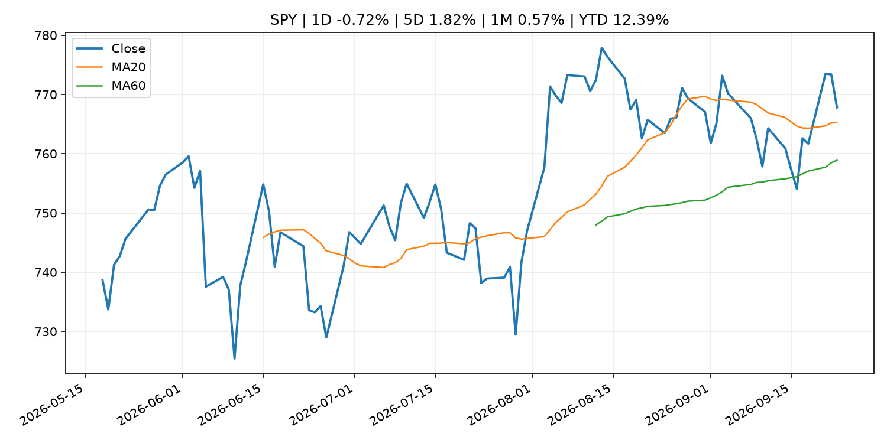
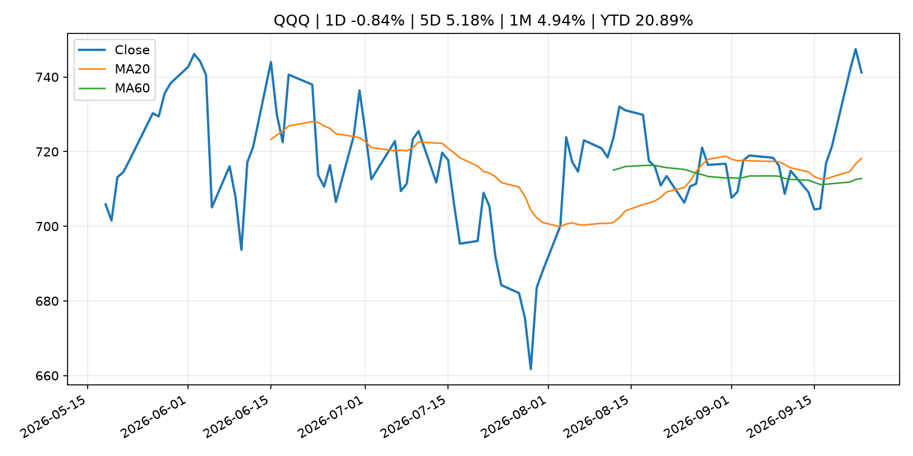
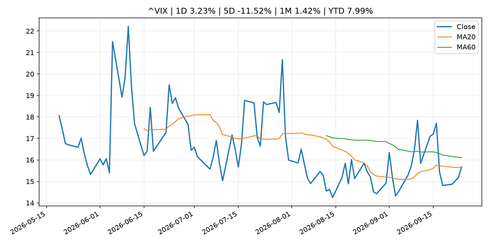
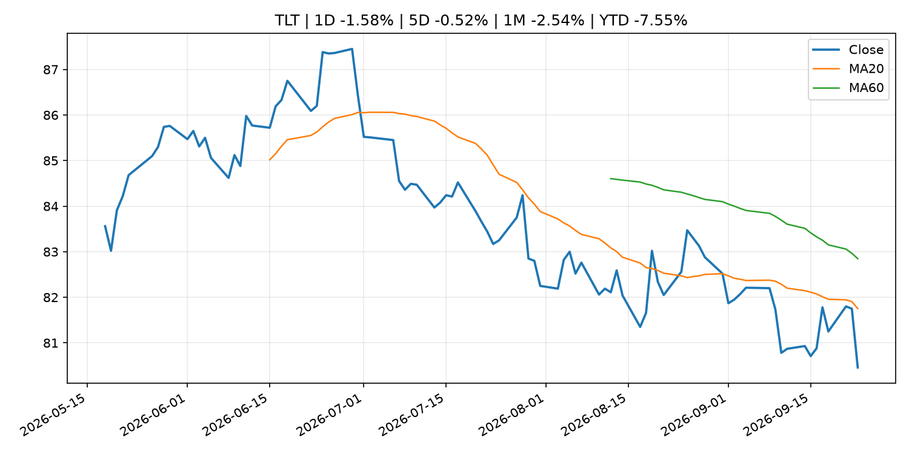
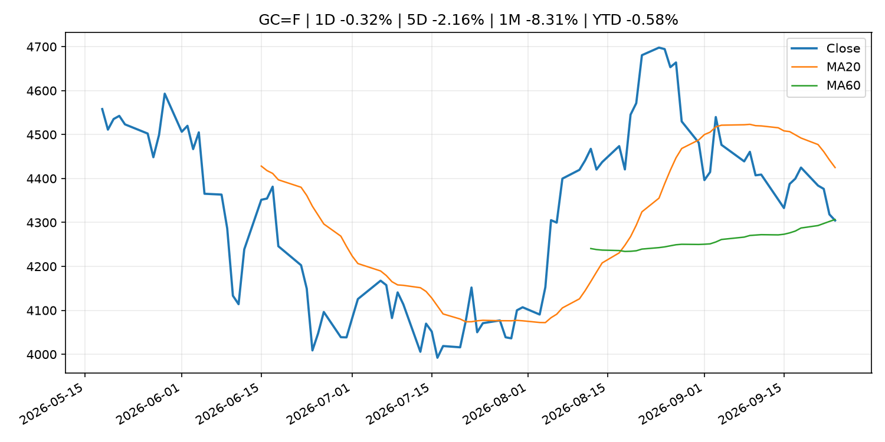
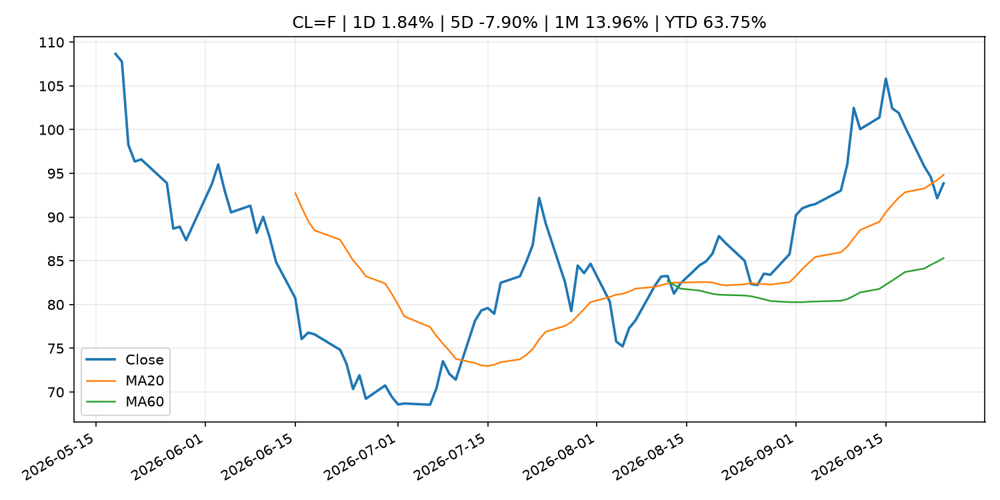
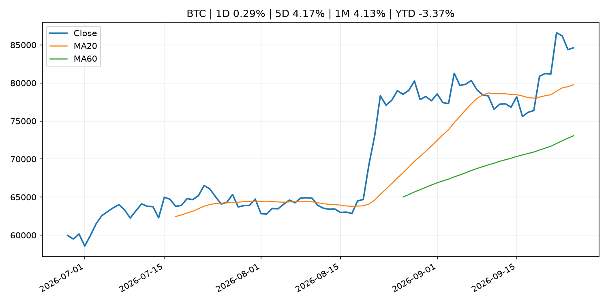
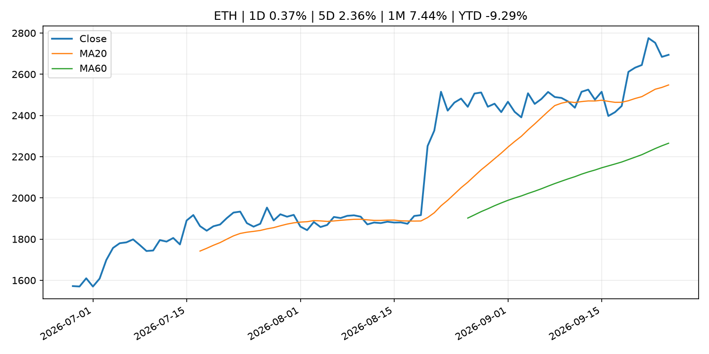
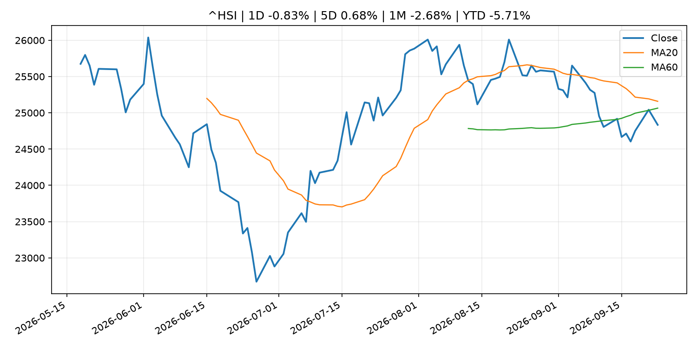

# Global Macro Morning Briefing - 2026-09-25

> Not financial advice / 非投资建议。

## 0. 今日总览
- 市场状态：mixed。市场信号不足，暂不判断明确状态。 但存在信号冲突，需要降低单一叙事置信度。
- 今日三大主线：
  1. fiscal_policy: Costco’s results beat expectations. Here’s why investors are still cautious.
  2. crypto_market_structure: Federal Reserve Board requests public comment on two proposals related to establishing a regulatory framework for Board-supervised payment stablecoin issuers under the GENIUS Act
  3. crypto_market_structure: European stablecoin issuer Qivalis sees transformation of global trade finance
- 一句话结论：今日晨报重点关注：财政和贸易政策会影响增长、通胀、企业利润和跨境资本流。；加密市场结构和监管变化会影响 BTC、ETH 及相关股票的风险溢价。。跨资产方面，SPY 1D -0.72%；QQQ 1D -0.84%；^VIX 1D 3.23%；TLT 1D -1.58%；GC=F 1D -0.32%；CL=F 1D 1.84%；BTC 1D 0.29%；ETH 1D 0.37%；市场信号不足，暂不判断明确状态。 但存在信号冲突，需要降低单一叙事置信度。政策、通胀、利率、美元、美债、能源和加密监管仍是主要观察线索。所有结论仅基于公开数据与短摘要整理，不构成投资建议。

## 1. 隔夜跨资产市场
- 美股：SPY 1D -0.72%，QQQ 1D -0.84%，整体趋势需结合 VIX 和利率确认。
- 美债/美元：TLT 1D -1.58%，美元指数 1D 0.18%，是判断折现率压力的核心线索。
- 黄金/原油：黄金 1D -0.32%，原油 1D 1.84%，用于观察避险、通胀和地缘风险。
- 加密：BTC 1D 0.29%，ETH 1D 0.37%，关注是否独立于纳指走出加密自身行情。
- 港股/A股：恒生 1D -0.83%，沪深300/上证 1D n/a，重点看中国政策预期与人民币线索。
- 风险观察：关注后续数据是否确认当前跨资产信号。

### US_EQUITY

| symbol | latest close | 1D | 5D | 1M | YTD | trend |
|---|---:|---:|---:|---:|---:|---|
| SPY | 767.81 | -0.72% | 1.82% | 0.57% | 12.39% | uptrend |
| QQQ | 741.21 | -0.84% | 5.18% | 4.94% | 20.89% | strong_uptrend |
| DIA | 514.30 | -1.05% | -1.33% | -3.37% | 6.34% | strong_downtrend |
| IWM | 281.92 | -1.84% | -0.70% | -5.39% | 13.32% | strong_downtrend |
| VTI | 378.23 | -0.75% | 1.45% | -0.00% | 12.46% | uptrend |

### US_MACRO_MARKET

| symbol | latest close | 1D | 5D | 1M | YTD | trend |
|---|---:|---:|---:|---:|---:|---|
| ^VIX | 15.67 | 3.23% | -11.52% | 1.42% | 7.99% | range_bound |
| DX-Y.NYB | 101.28 | 0.18% | 0.97% | 2.31% | 2.91% | range_bound |
| TLT | 80.46 | -1.58% | -0.52% | -2.54% | -7.55% | downtrend |
| IEF | 90.19 | -1.05% | -0.69% | -2.83% | -6.13% | downtrend |

### COMMODITIES

| symbol | latest close | 1D | 5D | 1M | YTD | trend |
|---|---:|---:|---:|---:|---:|---|
| GC=F | 4,304.50 | -0.32% | -2.16% | -8.31% | -0.58% | range_bound |
| SI=F | 64.15 | -0.35% | -2.01% | -6.53% | -9.07% | range_bound |
| CL=F | 93.86 | 1.84% | -7.90% | 13.96% | 63.75% | range_bound |
| BZ=F | 106.09 | 2.92% | 1.21% | 19.77% | 74.63% | strong_uptrend |
| NG=F | 3.27 | 8.04% | 12.58% | 17.91% | -9.73% | strong_uptrend |
| HG=F | 6.77 | 1.38% | 2.79% | 0.90% | 20.04% | uptrend |

### HK_MARKET

| symbol | latest close | 1D | 5D | 1M | YTD | trend |
|---|---:|---:|---:|---:|---:|---|
| ^HSI | 24,834.12 | -0.83% | 0.68% | -2.68% | -5.71% | range_bound |
| 0700.HK | 438.40 | -0.59% | 2.91% | -1.57% | -29.63% | range_bound |
| 9988.HK | 110.00 | 0.18% | 4.66% | -5.66% | -26.17% | range_bound |
| 3690.HK | 72.25 | -0.82% | -0.89% | -7.43% | -30.93% | strong_downtrend |
| 1810.HK | 26.58 | 1.53% | 1.68% | -6.61% | -34.01% | strong_downtrend |
| 1211.HK | 79.50 | -1.06% | -2.03% | -14.15% | -19.49% | strong_downtrend |

### CRYPTO

| symbol | latest close | 1D | 5D | 1M | YTD | trend |
|---|---:|---:|---:|---:|---:|---|
| BTC | 84,624.27 | 0.29% | 4.17% | 4.13% | -3.37% | strong_uptrend |
| ETH | 2,694.24 | 0.37% | 2.36% | 7.44% | -9.29% | strong_uptrend |
| SOLANA | 117.58 | 2.26% | 5.92% | 13.10% | -5.57% | strong_uptrend |
| BINANCECOIN | 778.91 | 1.52% | 2.25% | 7.42% | -9.71% | strong_uptrend |
| RIPPLE | 1.55 | 3.02% | 9.68% | 6.56% | -15.98% | strong_uptrend |

## 2. 今日最重要的 10 条新闻
### 1. Costco’s results beat expectations. Here’s why investors are still cautious.
- 来源：MarketWatch Top Stories
- 时间：2026-09-24T23:23:00+00:00
- 地区：US
- 事件类型：fiscal_policy
- 重要性层级：Tier 1
- 一句话摘要：Tariff refunds helped deliver a profit beat during Costco’s fourth quarter.
- 为什么重要：财政和贸易政策会影响增长、通胀、企业利润和跨境资本流。
- 可能影响：可能影响利率、汇率、风险资产或大宗商品预期，但当前公开信息不足以判断明确方向。
  - 资产：暂无明确资产映射
  - 方向：unknown
  - 强度：low
  - 原因：公开信息不足以判断方向。
- 原文链接：[https://www.marketwatch.com/story/costco-earnings-beat-expectations-thanks-to-tariff-refunds-e7270cfa?mod=mw_rss_topstories](https://www.marketwatch.com/story/costco-earnings-beat-expectations-thanks-to-tariff-refunds-e7270cfa?mod=mw_rss_topstories)

### 2. Federal Reserve Board requests public comment on two proposals related to establishing a regulatory framework for Board-supervised payment stablecoin issuers under the GENIUS Act
- 来源：Federal Reserve Press Releases
- 时间：2026-09-24T18:30:00+00:00
- 地区：US
- 事件类型：crypto_market_structure
- 重要性层级：Tier 2
- 一句话摘要：Federal Reserve Board requests public comment on two proposals related to establishing a regulatory framework for Board-supervised payment stablecoin issuers under the GENIUS Act
- 为什么重要：加密市场结构和监管变化会影响 BTC、ETH 及相关股票的风险溢价。
- 可能影响：主要影响 BTC，方向为 mixed，强度 high；加密监管或 ETF 进展会改变 BTC 的资金流和风险溢价。
  - 资产：BTC
    方向：mixed
    强度：high
    原因：加密监管或 ETF 进展会改变 BTC 的资金流和风险溢价。
  - 资产：ETH
    方向：mixed
    强度：high
    原因：监管框架会影响 ETH 产品化和机构参与度。
  - 资产：COIN
    方向：mixed
    强度：medium
    原因：监管清晰度和执法风险会影响交易平台估值。
  - 资产：crypto market
    方向：mixed
    强度：high
    原因：信息影响整个加密市场结构，但方向取决于细节。
- 原文链接：[https://www.federalreserve.gov/newsevents/pressreleases/bcreg20260924a.htm](https://www.federalreserve.gov/newsevents/pressreleases/bcreg20260924a.htm)

### 3. European stablecoin issuer Qivalis sees transformation of global trade finance
- 来源：CoinDesk
- 时间：2026-09-24T14:41:05+00:00
- 地区：global
- 事件类型：crypto_market_structure
- 重要性层级：Tier 2
- 一句话摘要：European stablecoin issuer Qivalis sees transformation of global trade finance
- 为什么重要：加密市场结构和监管变化会影响 BTC、ETH 及相关股票的风险溢价。
- 可能影响：主要影响 BTC，方向为 mixed，强度 high；加密监管或 ETF 进展会改变 BTC 的资金流和风险溢价。
  - 资产：BTC
    方向：mixed
    强度：high
    原因：加密监管或 ETF 进展会改变 BTC 的资金流和风险溢价。
  - 资产：ETH
    方向：mixed
    强度：high
    原因：监管框架会影响 ETH 产品化和机构参与度。
  - 资产：COIN
    方向：mixed
    强度：medium
    原因：监管清晰度和执法风险会影响交易平台估值。
  - 资产：crypto market
    方向：mixed
    强度：high
    原因：信息影响整个加密市场结构，但方向取决于细节。
- 原文链接：[https://www.coindesk.com/business/2026/09/24/european-stablecoin-issuer-qivalis-sees-transformation-of-global-trade-finance](https://www.coindesk.com/business/2026/09/24/european-stablecoin-issuer-qivalis-sees-transformation-of-global-trade-finance)

### 4. Trump administration weighs a global stablecoin plan to cement dollar's dominance
- 来源：CoinDesk
- 时间：2026-09-24T06:33:23+00:00
- 地区：global
- 事件类型：crypto_market_structure
- 重要性层级：Tier 2
- 一句话摘要：Trump administration weighs a global stablecoin plan to cement dollar's dominance
- 为什么重要：加密市场结构和监管变化会影响 BTC、ETH 及相关股票的风险溢价。
- 可能影响：主要影响 BTC，方向为 mixed，强度 high；加密监管或 ETF 进展会改变 BTC 的资金流和风险溢价。
  - 资产：BTC
    方向：mixed
    强度：high
    原因：加密监管或 ETF 进展会改变 BTC 的资金流和风险溢价。
  - 资产：ETH
    方向：mixed
    强度：high
    原因：监管框架会影响 ETH 产品化和机构参与度。
  - 资产：COIN
    方向：mixed
    强度：medium
    原因：监管清晰度和执法风险会影响交易平台估值。
  - 资产：crypto market
    方向：mixed
    强度：high
    原因：信息影响整个加密市场结构，但方向取决于细节。
- 原文链接：[https://www.coindesk.com/markets/2026/09/24/trump-administration-weighs-a-global-stablecoin-plan-to-cement-dollar-s-dominance](https://www.coindesk.com/markets/2026/09/24/trump-administration-weighs-a-global-stablecoin-plan-to-cement-dollar-s-dominance)

### 5. SEC Publishes Updated Market Statistics, Highlighting Increase in IPOs and Proceeds Raised
- 来源：SEC Press Releases
- 时间：2026-09-23T14:27:00-04:00
- 地区：US
- 事件类型：regulation
- 重要性层级：Tier 2
- 一句话摘要：The Securities and Exchange Commission’s Division of Economic and Risk Analysis (DERA) published updated statistics and data visualizations covering key segments of the U.S. capital markets, including a notable increase in the number of initial public…
- 为什么重要：监管变化会改变行业盈利预期和资产风险溢价。
- 可能影响：主要影响 BTC，方向为 mixed，强度 high；加密监管或 ETF 进展会改变 BTC 的资金流和风险溢价。
  - 资产：BTC
    方向：mixed
    强度：high
    原因：加密监管或 ETF 进展会改变 BTC 的资金流和风险溢价。
  - 资产：ETH
    方向：mixed
    强度：high
    原因：监管框架会影响 ETH 产品化和机构参与度。
  - 资产：COIN
    方向：mixed
    强度：medium
    原因：监管清晰度和执法风险会影响交易平台估值。
  - 资产：crypto market
    方向：mixed
    强度：high
    原因：信息影响整个加密市场结构，但方向取决于细节。
- 原文链接：[https://www.sec.gov/newsroom/press-releases/2026-93-sec-publishes-updated-market-statistics-highlighting-increase-ipos-proceeds-raised](https://www.sec.gov/newsroom/press-releases/2026-93-sec-publishes-updated-market-statistics-highlighting-increase-ipos-proceeds-raised)

### 6. SEC Charges South Florida Resident and His Company for Alleged Investment Scheme Defrauding Law Enforcement
- 来源：SEC Press Releases
- 时间：2026-09-23T12:00:00-04:00
- 地区：US
- 事件类型：regulation
- 重要性层级：Tier 2
- 一句话摘要：The Securities and Exchange Commission today charged CMI Capital LLC and its founder and manager, Michael D. Williams, for an alleged fraudulent investment scheme that raised approximately $860,000 from at least 18 investors, many of whom are current or…
- 为什么重要：监管变化会改变行业盈利预期和资产风险溢价。
- 可能影响：主要影响 BTC，方向为 mixed，强度 high；加密监管或 ETF 进展会改变 BTC 的资金流和风险溢价。
  - 资产：BTC
    方向：mixed
    强度：high
    原因：加密监管或 ETF 进展会改变 BTC 的资金流和风险溢价。
  - 资产：ETH
    方向：mixed
    强度：high
    原因：监管框架会影响 ETH 产品化和机构参与度。
  - 资产：COIN
    方向：mixed
    强度：medium
    原因：监管清晰度和执法风险会影响交易平台估值。
  - 资产：crypto market
    方向：mixed
    强度：high
    原因：信息影响整个加密市场结构，但方向取决于细节。
- 原文链接：[https://www.sec.gov/newsroom/press-releases/2026-92-sec-charges-south-florida-resident-his-company-alleged-investment-scheme-defrauding-law-enforcement](https://www.sec.gov/newsroom/press-releases/2026-92-sec-charges-south-florida-resident-his-company-alleged-investment-scheme-defrauding-law-enforcement)

### 7. 3 things Micron investors need to watch as the stakes get higher
- 来源：MarketWatch Top Stories
- 时间：2026-09-24T23:28:00+00:00
- 地区：US
- 事件类型：earnings
- 重要性层级：Tier 2
- 一句话摘要：When Micron reports earnings next week, a Rosenblatt analyst expects to hear about additional customer agreements, rising prices and stock buybacks.
- 为什么重要：大型科技股盈利和资本开支会影响纳指、半导体和 AI 交易主线。
- 可能影响：可能影响利率、汇率、风险资产或大宗商品预期，但当前公开信息不足以判断明确方向。
  - 资产：暂无明确资产映射
  - 方向：unknown
  - 强度：low
  - 原因：公开信息不足以判断方向。
- 原文链接：[https://www.marketwatch.com/story/3-things-micron-investors-need-to-watch-as-the-stakes-get-higher-e53fde7e?mod=mw_rss_topstories](https://www.marketwatch.com/story/3-things-micron-investors-need-to-watch-as-the-stakes-get-higher-e53fde7e?mod=mw_rss_topstories)

### 8. Federal Reserve Board issues enforcement action with former employee of Sandy Spring Bank
- 来源：Federal Reserve Press Releases
- 时间：2026-09-24T15:00:00+00:00
- 地区：US
- 事件类型：regulation
- 重要性层级：Tier 2
- 一句话摘要：Federal Reserve Board issues enforcement action with former employee of Sandy Spring Bank
- 为什么重要：监管变化会改变行业盈利预期和资产风险溢价。
- 可能影响：可能影响利率、汇率、风险资产或大宗商品预期，但当前公开信息不足以判断明确方向。
  - 资产：暂无明确资产映射
  - 方向：unknown
  - 强度：low
  - 原因：公开信息不足以判断方向。
- 原文链接：[https://www.federalreserve.gov/newsevents/pressreleases/enforcement20260924a.htm](https://www.federalreserve.gov/newsevents/pressreleases/enforcement20260924a.htm)

### 9. Philadelphia Fed's Anna Paulson says 'modest' rate moves likely ahead to tame inflation
- 来源：CNBC Economy
- 时间：2026-09-24T17:12:04+00:00
- 地区：US
- 事件类型：other
- 重要性层级：Tier 3
- 一句话摘要：The policymaker said she and her colleagues may need to raise interest rates further to bring inflation back to target.
- 为什么重要：这条信息暂未匹配到重大宏观、政策或市场事件，更适合作为背景跟踪。
- 可能影响：主要影响 DXY，方向为 positive，强度 high；通胀压力可能推高政策利率预期并支撑美元。
  - 资产：DXY
    方向：positive
    强度：high
    原因：通胀压力可能推高政策利率预期并支撑美元。
  - 资产：TLT
    方向：negative
    强度：high
    原因：通胀上行通常推升收益率、压低长债价格。
  - 资产：QQQ
    方向：negative
    强度：high
    原因：更高利率对成长股估值折现率不利。
  - 资产：SPY
    方向：mixed
    强度：medium
    原因：名义增长可能支撑收入，但更高利率压制估值。
  - 资产：GC=F
    方向：mixed
    强度：medium
    原因：通胀对黄金是支撑，但实际利率上行会形成压力。
  - 资产：BTC
    方向：mixed
    强度：medium
    原因：抗通胀叙事和流动性收紧可能相互抵消。
- 原文链接：[https://www.cnbc.com/2026/09/24/philadelphia-feds-anna-paulson-says-modest-rate-moves-likely-ahead-to-tame-inflation.html](https://www.cnbc.com/2026/09/24/philadelphia-feds-anna-paulson-says-modest-rate-moves-likely-ahead-to-tame-inflation.html)

### 10. Results of BIS International Locational Banking Statistics and International Consolidated Banking Statistics in Japan
- 来源：Bank of Japan Announcements
- 时间：2026-09-25T08:50:00+09:00
- 地区：Japan
- 事件类型：other
- 重要性层级：Tier 3
- 一句话摘要：Results of BIS International Locational Banking Statistics and International Consolidated Banking Statistics in Japan
- 为什么重要：这条信息暂未匹配到重大宏观、政策或市场事件，更适合作为背景跟踪。
- 可能影响：更偏背景信息，短期市场影响可能有限。
  - 资产：暂无明确资产映射
  - 方向：unknown
  - 强度：low
  - 原因：公开信息不足以判断方向。
- 原文链接：[http://www.boj.or.jp/en/statistics/bis/ibs/index.htm](http://www.boj.or.jp/en/statistics/bis/ibs/index.htm)

## 3. 政策与央行观察
### 1. Costco’s results beat expectations. Here’s why investors are still cautious.
- 来源：MarketWatch Top Stories
- 时间：2026-09-24T23:23:00+00:00
- 地区：US
- 事件类型：fiscal_policy
- 重要性层级：Tier 1
- 一句话摘要：Tariff refunds helped deliver a profit beat during Costco’s fourth quarter.
- 为什么重要：财政和贸易政策会影响增长、通胀、企业利润和跨境资本流。
- 可能影响：可能影响利率、汇率、风险资产或大宗商品预期，但当前公开信息不足以判断明确方向。
  - 资产：暂无明确资产映射
  - 方向：unknown
  - 强度：low
  - 原因：公开信息不足以判断方向。
- 原文链接：[https://www.marketwatch.com/story/costco-earnings-beat-expectations-thanks-to-tariff-refunds-e7270cfa?mod=mw_rss_topstories](https://www.marketwatch.com/story/costco-earnings-beat-expectations-thanks-to-tariff-refunds-e7270cfa?mod=mw_rss_topstories)

### 2. Federal Reserve Board requests public comment on two proposals related to establishing a regulatory framework for Board-supervised payment stablecoin issuers under the GENIUS Act
- 来源：Federal Reserve Press Releases
- 时间：2026-09-24T18:30:00+00:00
- 地区：US
- 事件类型：crypto_market_structure
- 重要性层级：Tier 2
- 一句话摘要：Federal Reserve Board requests public comment on two proposals related to establishing a regulatory framework for Board-supervised payment stablecoin issuers under the GENIUS Act
- 为什么重要：加密市场结构和监管变化会影响 BTC、ETH 及相关股票的风险溢价。
- 可能影响：主要影响 BTC，方向为 mixed，强度 high；加密监管或 ETF 进展会改变 BTC 的资金流和风险溢价。
  - 资产：BTC
    方向：mixed
    强度：high
    原因：加密监管或 ETF 进展会改变 BTC 的资金流和风险溢价。
  - 资产：ETH
    方向：mixed
    强度：high
    原因：监管框架会影响 ETH 产品化和机构参与度。
  - 资产：COIN
    方向：mixed
    强度：medium
    原因：监管清晰度和执法风险会影响交易平台估值。
  - 资产：crypto market
    方向：mixed
    强度：high
    原因：信息影响整个加密市场结构，但方向取决于细节。
- 原文链接：[https://www.federalreserve.gov/newsevents/pressreleases/bcreg20260924a.htm](https://www.federalreserve.gov/newsevents/pressreleases/bcreg20260924a.htm)

### 3. European stablecoin issuer Qivalis sees transformation of global trade finance
- 来源：CoinDesk
- 时间：2026-09-24T14:41:05+00:00
- 地区：global
- 事件类型：crypto_market_structure
- 重要性层级：Tier 2
- 一句话摘要：European stablecoin issuer Qivalis sees transformation of global trade finance
- 为什么重要：加密市场结构和监管变化会影响 BTC、ETH 及相关股票的风险溢价。
- 可能影响：主要影响 BTC，方向为 mixed，强度 high；加密监管或 ETF 进展会改变 BTC 的资金流和风险溢价。
  - 资产：BTC
    方向：mixed
    强度：high
    原因：加密监管或 ETF 进展会改变 BTC 的资金流和风险溢价。
  - 资产：ETH
    方向：mixed
    强度：high
    原因：监管框架会影响 ETH 产品化和机构参与度。
  - 资产：COIN
    方向：mixed
    强度：medium
    原因：监管清晰度和执法风险会影响交易平台估值。
  - 资产：crypto market
    方向：mixed
    强度：high
    原因：信息影响整个加密市场结构，但方向取决于细节。
- 原文链接：[https://www.coindesk.com/business/2026/09/24/european-stablecoin-issuer-qivalis-sees-transformation-of-global-trade-finance](https://www.coindesk.com/business/2026/09/24/european-stablecoin-issuer-qivalis-sees-transformation-of-global-trade-finance)

### 4. Trump administration weighs a global stablecoin plan to cement dollar's dominance
- 来源：CoinDesk
- 时间：2026-09-24T06:33:23+00:00
- 地区：global
- 事件类型：crypto_market_structure
- 重要性层级：Tier 2
- 一句话摘要：Trump administration weighs a global stablecoin plan to cement dollar's dominance
- 为什么重要：加密市场结构和监管变化会影响 BTC、ETH 及相关股票的风险溢价。
- 可能影响：主要影响 BTC，方向为 mixed，强度 high；加密监管或 ETF 进展会改变 BTC 的资金流和风险溢价。
  - 资产：BTC
    方向：mixed
    强度：high
    原因：加密监管或 ETF 进展会改变 BTC 的资金流和风险溢价。
  - 资产：ETH
    方向：mixed
    强度：high
    原因：监管框架会影响 ETH 产品化和机构参与度。
  - 资产：COIN
    方向：mixed
    强度：medium
    原因：监管清晰度和执法风险会影响交易平台估值。
  - 资产：crypto market
    方向：mixed
    强度：high
    原因：信息影响整个加密市场结构，但方向取决于细节。
- 原文链接：[https://www.coindesk.com/markets/2026/09/24/trump-administration-weighs-a-global-stablecoin-plan-to-cement-dollar-s-dominance](https://www.coindesk.com/markets/2026/09/24/trump-administration-weighs-a-global-stablecoin-plan-to-cement-dollar-s-dominance)

### 5. SEC Publishes Updated Market Statistics, Highlighting Increase in IPOs and Proceeds Raised
- 来源：SEC Press Releases
- 时间：2026-09-23T14:27:00-04:00
- 地区：US
- 事件类型：regulation
- 重要性层级：Tier 2
- 一句话摘要：The Securities and Exchange Commission’s Division of Economic and Risk Analysis (DERA) published updated statistics and data visualizations covering key segments of the U.S. capital markets, including a notable increase in the number of initial public…
- 为什么重要：监管变化会改变行业盈利预期和资产风险溢价。
- 可能影响：主要影响 BTC，方向为 mixed，强度 high；加密监管或 ETF 进展会改变 BTC 的资金流和风险溢价。
  - 资产：BTC
    方向：mixed
    强度：high
    原因：加密监管或 ETF 进展会改变 BTC 的资金流和风险溢价。
  - 资产：ETH
    方向：mixed
    强度：high
    原因：监管框架会影响 ETH 产品化和机构参与度。
  - 资产：COIN
    方向：mixed
    强度：medium
    原因：监管清晰度和执法风险会影响交易平台估值。
  - 资产：crypto market
    方向：mixed
    强度：high
    原因：信息影响整个加密市场结构，但方向取决于细节。
- 原文链接：[https://www.sec.gov/newsroom/press-releases/2026-93-sec-publishes-updated-market-statistics-highlighting-increase-ipos-proceeds-raised](https://www.sec.gov/newsroom/press-releases/2026-93-sec-publishes-updated-market-statistics-highlighting-increase-ipos-proceeds-raised)

### 6. SEC Charges South Florida Resident and His Company for Alleged Investment Scheme Defrauding Law Enforcement
- 来源：SEC Press Releases
- 时间：2026-09-23T12:00:00-04:00
- 地区：US
- 事件类型：regulation
- 重要性层级：Tier 2
- 一句话摘要：The Securities and Exchange Commission today charged CMI Capital LLC and its founder and manager, Michael D. Williams, for an alleged fraudulent investment scheme that raised approximately $860,000 from at least 18 investors, many of whom are current or…
- 为什么重要：监管变化会改变行业盈利预期和资产风险溢价。
- 可能影响：主要影响 BTC，方向为 mixed，强度 high；加密监管或 ETF 进展会改变 BTC 的资金流和风险溢价。
  - 资产：BTC
    方向：mixed
    强度：high
    原因：加密监管或 ETF 进展会改变 BTC 的资金流和风险溢价。
  - 资产：ETH
    方向：mixed
    强度：high
    原因：监管框架会影响 ETH 产品化和机构参与度。
  - 资产：COIN
    方向：mixed
    强度：medium
    原因：监管清晰度和执法风险会影响交易平台估值。
  - 资产：crypto market
    方向：mixed
    强度：high
    原因：信息影响整个加密市场结构，但方向取决于细节。
- 原文链接：[https://www.sec.gov/newsroom/press-releases/2026-92-sec-charges-south-florida-resident-his-company-alleged-investment-scheme-defrauding-law-enforcement](https://www.sec.gov/newsroom/press-releases/2026-92-sec-charges-south-florida-resident-his-company-alleged-investment-scheme-defrauding-law-enforcement)

### 7. Federal Reserve Board issues enforcement action with former employee of Sandy Spring Bank
- 来源：Federal Reserve Press Releases
- 时间：2026-09-24T15:00:00+00:00
- 地区：US
- 事件类型：regulation
- 重要性层级：Tier 2
- 一句话摘要：Federal Reserve Board issues enforcement action with former employee of Sandy Spring Bank
- 为什么重要：监管变化会改变行业盈利预期和资产风险溢价。
- 可能影响：可能影响利率、汇率、风险资产或大宗商品预期，但当前公开信息不足以判断明确方向。
  - 资产：暂无明确资产映射
  - 方向：unknown
  - 强度：low
  - 原因：公开信息不足以判断方向。
- 原文链接：[https://www.federalreserve.gov/newsevents/pressreleases/enforcement20260924a.htm](https://www.federalreserve.gov/newsevents/pressreleases/enforcement20260924a.htm)

## 4. 市场异动与图表
- SPY 下跌 -0.72%
- QQQ 下跌 -0.84%
- VIX 上涨 3.23%
- TLT 下跌 -1.58%
- Oil 上涨 1.84%

### 信号矛盾
- 股债同时承压，可能是利率或流动性冲击而非传统避险。

### SPY

### QQQ

### ^VIX

### TLT

### GC=F

### CL=F

### BTC

### ETH

### ^HSI

## 5. 华尔街与机构公开观点
- 暂无可靠公开观点。

## 6. 今日重点关注
- 经济数据：经济数据：暂无可靠公开日历数据；如配置经济日历源后可自动填充。
- 央行讲话：央行讲话：暂无可靠公开日历数据；重点跟踪 Fed、ECB、BoJ、PBOC 官网 RSS。
- 财报：财报：暂无可靠数据。
- 政策事件：政策事件：暂无可靠数据。
- 风险提醒：风险提醒：关注数据源失败项、突发地缘风险、利率和美元的二阶反应。

## 7. 英文金融表达与宏观概念
- **inflation expectations**：通胀预期，指家庭、企业或市场对未来通胀的预估。 例句：Inflation expectations can shape wage bargaining and bond yields.
- **real yield**：实际收益率，名义利率扣除通胀预期后的收益率。 例句：Gold often reacts more to real yields than nominal yields.
- **market structure**：市场结构，指交易、托管、清算、ETF、监管等制度安排。 例句：Crypto market structure rules can affect institutional participation.
- **terminal rate**：终端利率，市场预期本轮加息周期的最高政策利率。 例句：A higher terminal rate can pressure growth stocks.
- **soft landing**：软着陆，指通胀回落而经济避免明显衰退。 例句：Markets often rally when data support a soft landing.
- **risk-off**：避险模式，资金偏向美元、国债、黄金等防御资产。 例句：A geopolitical shock can push markets into risk-off mode.

## 8. 背景材料
- [Results of BIS International Locational Banking Statistics and International Consolidated Banking Statistics in Japan](http://www.boj.or.jp/en/statistics/bis/ibs/index.htm)（Bank of Japan Announcements，other）：Results of BIS International Locational Banking Statistics and International Consolidated Banking Statistics in Japan
- [U.S. Federal Reserve moves on proposals to implement GENIUS Act for stablecoins](https://www.coindesk.com/policy/2026/09/24/u-s-federal-reserve-moves-on-proposals-to-implement-genius-act-for-stablecoins)（CoinDesk，other）：U.S. Federal Reserve moves on proposals to implement GENIUS Act for stablecoins
- [8% mortgage rates are ‘not an impossibility’ as the 30-year fixed rate surges](https://www.marketwatch.com/story/8-mortgage-rates-are-not-an-impossibility-as-the-30-year-fixed-rate-surges-aa202464?mod=mw_rss_topstories)（MarketWatch Top Stories，other）：With the 10-year Treasury up sharply and the outlook for the U.S. economy looking unclear, some say 8% mortgage rates are back on the table.
- [Why investors aren’t buying yet another attempt by the Treasury to calm the rattled bond market](https://www.marketwatch.com/story/why-investors-arent-buying-yet-another-attempt-by-the-treasury-to-calm-the-rattled-bond-market-b168cac3?mod=mw_rss_topstories)（MarketWatch Top Stories，other）：Back-to-back weak auctions for Treasury notes show that government repurchases haven’t spurred demand for bonds.
- [Bitcoin just topped a key long-term moving average. Here's what it might mean](https://www.coindesk.com/markets/2026/09/24/bitcoin-just-topped-a-key-long-term-moving-average-here-s-what-it-might-mean)（CoinDesk，other）：Bitcoin just topped a key long-term moving average. Here's what it might mean
- [Philadelphia Fed's Anna Paulson says 'modest' rate moves likely ahead to tame inflation](https://www.cnbc.com/2026/09/24/philadelphia-feds-anna-paulson-says-modest-rate-moves-likely-ahead-to-tame-inflation.html)（CNBC Economy，other）：The policymaker said she and her colleagues may need to raise interest rates further to bring inflation back to target.
- [Bitcoin’s bear markets are getting milder. Bull markets may be next](https://www.coindesk.com/markets/2026/09/24/bitcoin-s-bear-markets-are-getting-milder-the-bull-markets-may-be-next)（CoinDesk，other）：Bitcoin’s bear markets are getting milder. Bull markets may be next
- [Crypto for Advisors:The hidden costs of holding your own bitcoin](https://www.coindesk.com/coindesk-indices/2026/09/24/crypto-for-advisors-the-hidden-costs-of-holding-your-own-bitcoin)（CoinDesk，other）：Crypto for Advisors:The hidden costs of holding your own bitcoin
- [Cathie Wood's ARK teams with Securitize to tokenize venture fund with OpenAI, Anthropic stakes](https://www.coindesk.com/business/2026/09/24/cathie-wood-s-ark-teams-with-securitize-to-tokenize-venture-fund-with-openai-anthropic-stakes)（CoinDesk，other）：Cathie Wood's ARK teams with Securitize to tokenize venture fund with OpenAI, Anthropic stakes
- [ECB Executive Board member Isabel Schnabel to resign to take senior role at IMF](https://www.ecb.europa.eu//press/pr/date/2026/html/ecb.pr260924~bea1dd9824.en.html)（ECB Press Releases，other）：ECB Executive Board member Isabel Schnabel to resign to take senior role at IMF
- [Bitcoin slides to $83,300 as bond yields hit highest level since 2007](https://www.coindesk.com/markets/2026/09/24/bitcoin-steadies-near-usd84-000-after-bond-yields-hit-a-2007-high)（CoinDesk，other）：Bitcoin slides to $83,300 as bond yields hit highest level since 2007
- [Traders price in 4 Fed rate hikes by June 2027 as bitcoin slides below $83,000](https://www.coindesk.com/markets/2026/09/24/traders-are-pricing-in-4-fed-rate-hikes-as-bitcoin-slides-below-usd83-000)（CoinDesk，other）：Traders price in 4 Fed rate hikes by June 2027 as bitcoin slides below $83,000
- [The data proves it: Bitcoin doesn't care about rising bond yields over long-term](https://www.coindesk.com/markets/2026/09/24/the-data-proves-it-bitcoin-doesn-t-care-about-rising-bond-yields-over-long-term)（CoinDesk，other）：The data proves it: Bitcoin doesn't care about rising bond yields over long-term
- [Philip R. Lane: The outlook for the euro area economy](https://www.ecb.europa.eu//press/key/date/2026/html/ecb.sp260924~e0eceef02c.en.pdf)（ECB Press Releases，other）：Philip R. Lane: The outlook for the euro area economy
- [Trump-Xi meeting: Why China's self-sufficiency changes the calculus](https://www.cnbc.com/2026/09/23/trump-xi-meeting-why-chinas-self-sufficiency-changes-the-calculus.html)（CNBC Economy，other）：Persistent growth of Chinese exports to the U.S. is helping the world's second-largest economy ride out ongoing domestic challenges.
- [Statistics on Securities Financing Transactions in Japan](http://www.boj.or.jp/en/statistics/bis/repo/index.htm)（Bank of Japan Announcements，other）：Statistics on Securities Financing Transactions in Japan
- [The digitalisation of money, payments and finance](https://www.ecb.europa.eu//press/key/date/2026/html/ecb.sp260923~87850778f5.en.pdf)（ECB Press Releases，other）：The digitalisation of money, payments and finance
- [Almost ten million people took part in ECB survey on new euro banknotes](https://www.ecb.europa.eu//press/pr/date/2026/html/ecb.pr260923~6ebddaf01e.en.html)（ECB Press Releases，other）：Almost ten million people took part in ECB survey on new euro banknotes

## 9. 数据源、失败项与免责声明
- 采集时间：2026-09-25T00:17:37
- 数据源：公开 RSS、Yahoo Finance、CoinGecko、AKShare、FRED、SEC data.sec.gov，以及用户自有 inputs/reports 文件。
- 合规说明：不绕过 WSJ、Bloomberg、FT、Reuters 等付费墙；对付费媒体只使用公开 RSS 标题、摘要、链接和发布时间。
- 免责声明：Not financial advice / 非投资建议。本项目仅供个人学习、研究和信息整理，不构成投资建议、交易建议或任何收益承诺。
- 失败或跳过的数据源：
  - crypto data failed coin=dogecoin
  - China market data failed symbol=上证指数: empty dataframe
  - China market data failed symbol=深证成指: empty dataframe
  - China market data failed symbol=创业板指: empty dataframe
  - China market data failed symbol=沪深300: empty dataframe
  - China market data failed symbol=中证500: empty dataframe
  - China market data failed symbol=科创50: empty dataframe
  - FRED_API_KEY not set; skipping FRED macro series
  - SEC failed cik=0000320193
  - SEC failed cik=0000789019
  - SEC failed cik=0001045810
  - SEC failed cik=0001318605
  - SEC failed cik=0001577552
