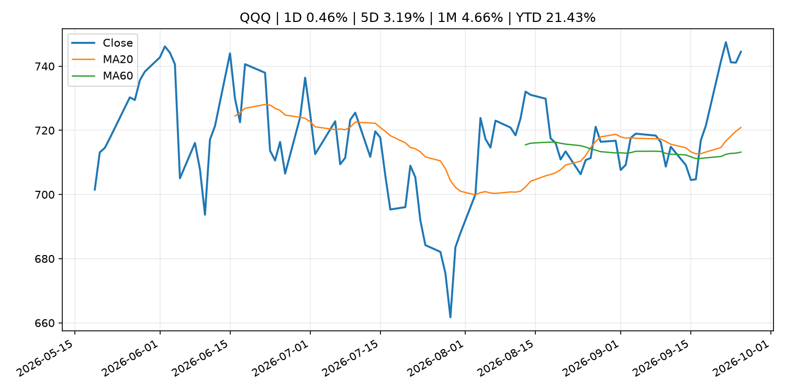
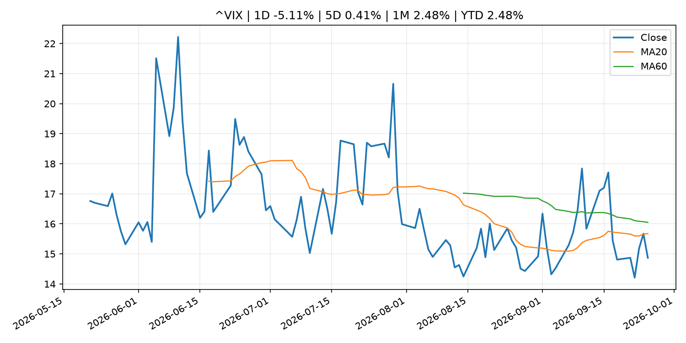
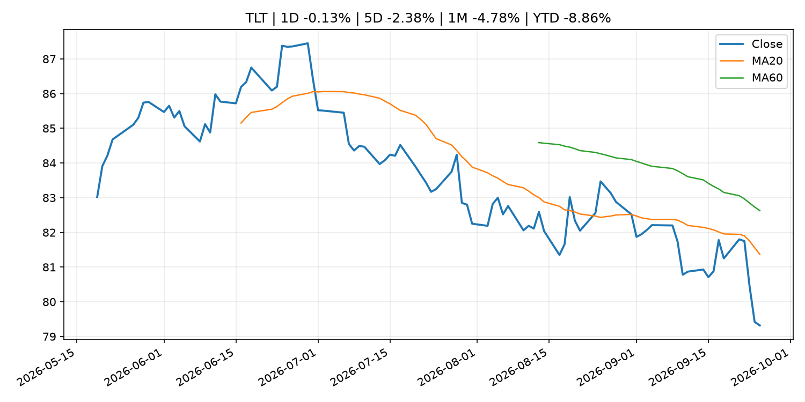
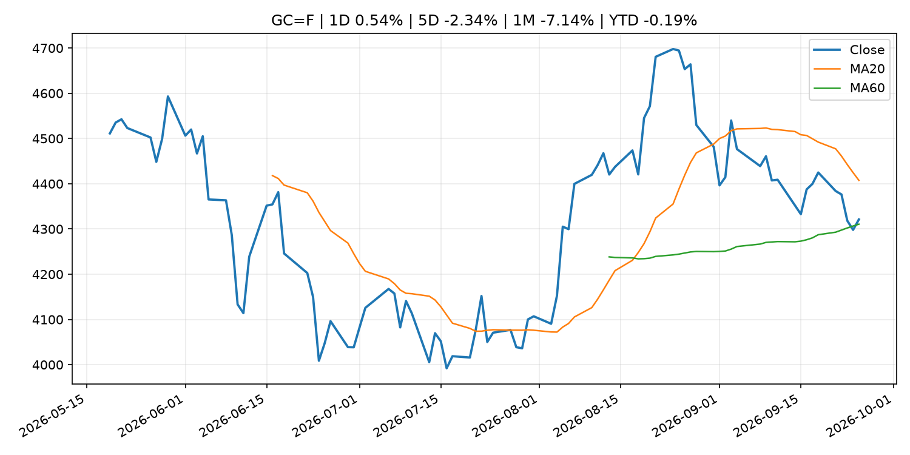
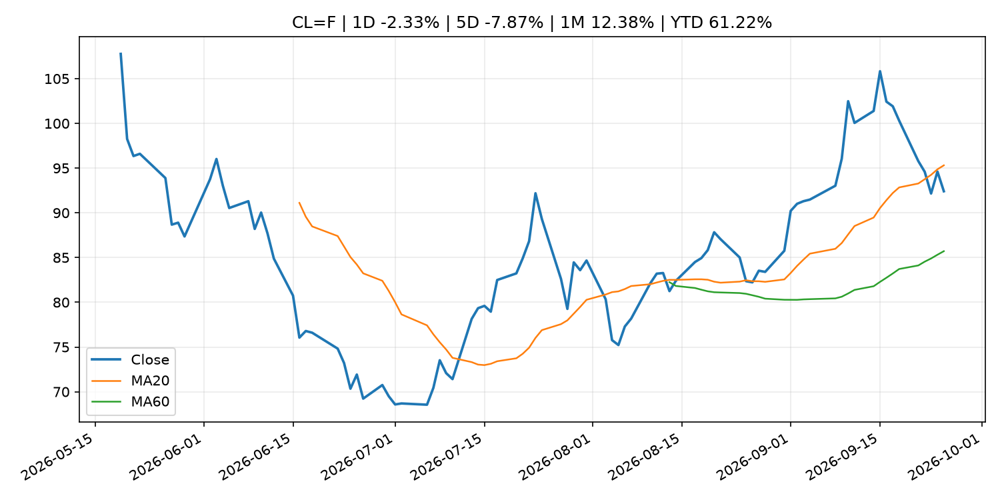
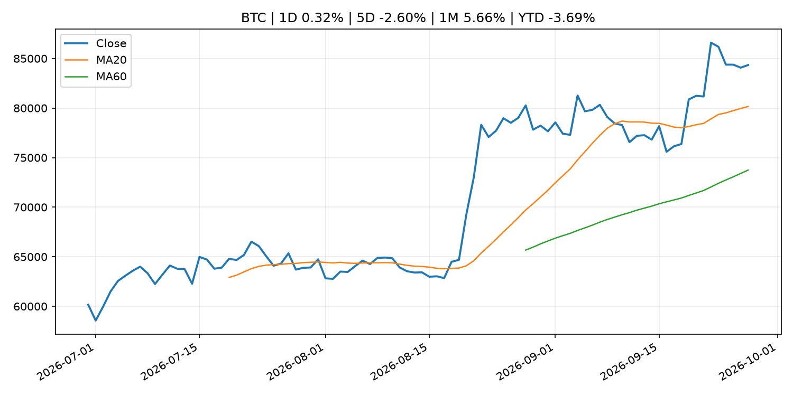
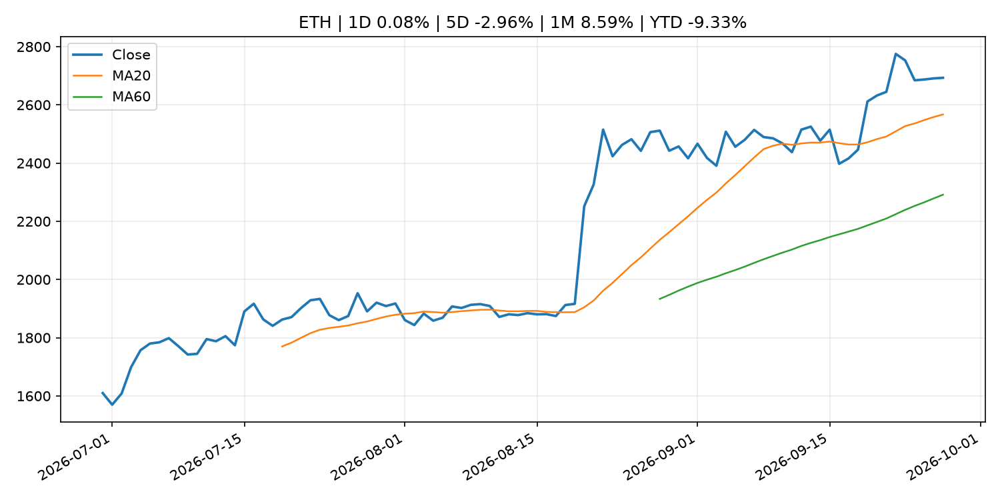
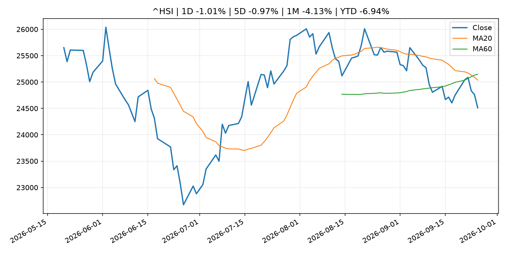

# Global Macro Morning Briefing - 2026-09-27

> Not financial advice / 非投资建议。

## 0. 今日总览
- 市场状态：risk_on。股指上涨、波动率或美元回落，市场更接近风险偏好改善。
- 今日三大主线：
  1. macro_data: Indicators for Core CPI
  2. geopolitical_risk: Live updates: Bitcoin moves to $84,000, oil slides on latest report of Middle East progress
  3. crypto_market_structure: Binance deal gives Circle a boost in stablecoin race with Tether, analysts say
- 一句话结论：今日晨报重点关注：这类宏观数据会直接改变市场对通胀、增长和政策路径的预期。；地缘风险可能推升避险需求、能源价格和市场波动率。。跨资产方面，SPY 1D 0.54%；QQQ 1D 0.46%；^VIX 1D -5.11%；TLT 1D -0.13%；GC=F 1D 0.54%；CL=F 1D -2.33%；BTC 1D 0.32%；ETH 1D 0.08%；股指上涨、波动率或美元回落，市场更接近风险偏好改善。政策、通胀、利率、美元、美债、能源和加密监管仍是主要观察线索。所有结论仅基于公开数据与短摘要整理，不构成投资建议。

## 1. 隔夜跨资产市场
- 美股：SPY 1D 0.54%，QQQ 1D 0.46%，整体趋势需结合 VIX 和利率确认。
- 美债/美元：TLT 1D -0.13%，美元指数 1D -0.32%，是判断折现率压力的核心线索。
- 黄金/原油：黄金 1D 0.54%，原油 1D -2.33%，用于观察避险、通胀和地缘风险。
- 加密：BTC 1D 0.32%，ETH 1D 0.08%，关注是否独立于纳指走出加密自身行情。
- 港股/A股：恒生 1D -1.01%，沪深300/上证 1D n/a，重点看中国政策预期与人民币线索。
- 风险观察：确认风险偏好是否扩散到小盘股、信用利差和周期品。

### US_EQUITY

| symbol | latest close | 1D | 5D | 1M | YTD | trend |
|---|---:|---:|---:|---:|---:|---|
| SPY | 771.35 | 0.54% | 1.27% | 0.69% | 12.91% | uptrend |
| QQQ | 744.50 | 0.46% | 3.19% | 4.66% | 21.43% | strong_uptrend |
| DIA | 517.49 | 0.94% | 0.31% | -3.13% | 7.00% | strong_downtrend |
| IWM | 281.97 | 0.11% | -0.75% | -5.67% | 13.34% | strong_downtrend |
| VTI | 379.77 | 0.45% | 1.16% | 0.41% | 12.92% | uptrend |

### US_MACRO_MARKET

| symbol | latest close | 1D | 5D | 1M | YTD | trend |
|---|---:|---:|---:|---:|---:|---|
| ^VIX | 14.87 | -5.11% | 0.41% | 2.48% | 2.48% | downtrend |
| DX-Y.NYB | 100.97 | -0.32% | 0.75% | 1.82% | 2.59% | range_bound |
| TLT | 79.32 | -0.13% | -2.38% | -4.78% | -8.86% | strong_downtrend |
| IEF | 90.00 | 0.35% | -0.88% | -3.56% | -6.33% | strong_downtrend |

### COMMODITIES

| symbol | latest close | 1D | 5D | 1M | YTD | trend |
|---|---:|---:|---:|---:|---:|---|
| GC=F | 4,321.20 | 0.54% | -2.34% | -7.14% | -0.19% | range_bound |
| SI=F | 64.25 | 1.24% | -3.47% | -5.51% | -8.94% | range_bound |
| CL=F | 92.41 | -2.33% | -7.87% | 12.38% | 61.22% | range_bound |
| BZ=F | 104.32 | -2.14% | 0.43% | 18.76% | 71.72% | strong_uptrend |
| NG=F | 3.20 | -3.06% | 9.75% | 12.46% | -11.66% | strong_uptrend |
| HG=F | 6.70 | -0.34% | 1.22% | 1.53% | 18.71% | uptrend |

### HK_MARKET

| symbol | latest close | 1D | 5D | 1M | YTD | trend |
|---|---:|---:|---:|---:|---:|---|
| ^HSI | 24,510.09 | -1.01% | -0.97% | -4.13% | -6.94% | strong_downtrend |
| 0700.HK | 436.60 | -0.41% | 4.20% | -2.50% | -29.92% | range_bound |
| 9988.HK | 108.40 | -1.45% | -0.82% | -6.15% | -27.25% | downtrend |
| 3690.HK | 71.65 | -0.83% | -2.12% | -7.55% | -31.50% | strong_downtrend |
| 1810.HK | 25.90 | -2.56% | -1.89% | -5.75% | -35.70% | strong_downtrend |
| 1211.HK | 78.10 | -1.76% | -4.17% | -14.41% | -20.91% | strong_downtrend |

### CRYPTO

| symbol | latest close | 1D | 5D | 1M | YTD | trend |
|---|---:|---:|---:|---:|---:|---|
| BTC | 84,341.58 | 0.32% | -2.60% | 5.66% | -3.69% | strong_uptrend |
| ETH | 2,692.97 | 0.08% | -2.96% | 8.59% | -9.33% | strong_uptrend |
| SOLANA | 121.23 | -0.69% | 1.99% | 17.51% | -2.64% | strong_uptrend |
| BINANCECOIN | 772.90 | -0.52% | -3.28% | 0.85% | -10.41% | uptrend |
| RIPPLE | 1.53 | -2.71% | -0.61% | 8.02% | -17.11% | strong_uptrend |

## 2. 今日最重要的 10 条新闻
### 1. Indicators for Core CPI
- 来源：Bank of Japan Announcements
- 时间：2026-09-25T14:00:00+09:00
- 地区：Japan
- 事件类型：macro_data
- 重要性层级：Tier 1
- 一句话摘要：Indicators for Core CPI
- 为什么重要：这类宏观数据会直接改变市场对通胀、增长和政策路径的预期。
- 可能影响：主要影响 DXY，方向为 positive，强度 high；通胀压力可能推高政策利率预期并支撑美元。
  - 资产：DXY
    方向：positive
    强度：high
    原因：通胀压力可能推高政策利率预期并支撑美元。
  - 资产：TLT
    方向：negative
    强度：high
    原因：通胀上行通常推升收益率、压低长债价格。
  - 资产：QQQ
    方向：negative
    强度：high
    原因：更高利率对成长股估值折现率不利。
  - 资产：SPY
    方向：mixed
    强度：medium
    原因：名义增长可能支撑收入，但更高利率压制估值。
  - 资产：GC=F
    方向：mixed
    强度：medium
    原因：通胀对黄金是支撑，但实际利率上行会形成压力。
  - 资产：BTC
    方向：mixed
    强度：medium
    原因：抗通胀叙事和流动性收紧可能相互抵消。
- 原文链接：[http://www.boj.or.jp/en/research/research_data/cpi/index.htm](http://www.boj.or.jp/en/research/research_data/cpi/index.htm)

### 2. Live updates: Bitcoin moves to $84,000, oil slides on latest report of Middle East progress
- 来源：CoinDesk
- 时间：2026-09-25T07:09:11+00:00
- 地区：global
- 事件类型：geopolitical_risk
- 重要性层级：Tier 1
- 一句话摘要：Live updates: Bitcoin moves to $84,000, oil slides on latest report of Middle East progress
- 为什么重要：地缘风险可能推升避险需求、能源价格和市场波动率。
- 可能影响：主要影响 CL=F，方向为 positive，强度 high；供给扰动或 OPEC 减产通常推升 WTI 原油。
  - 资产：CL=F
    方向：positive
    强度：high
    原因：供给扰动或 OPEC 减产通常推升 WTI 原油。
  - 资产：BZ=F
    方向：positive
    强度：high
    原因：全球供给风险通常直接影响 Brent 原油。
  - 资产：SPY
    方向：mixed
    强度：medium
    原因：能源股可能受益，但通胀和成本压力不利于宽基风险资产。
- 原文链接：[https://www.coindesk.com/markets/2026/09/25/live-updates-bitcoin-steadies-near-usd84-000-as-the-bond-selloff-pauses](https://www.coindesk.com/markets/2026/09/25/live-updates-bitcoin-steadies-near-usd84-000-as-the-bond-selloff-pauses)

### 3. Binance deal gives Circle a boost in stablecoin race with Tether, analysts say
- 来源：CoinDesk
- 时间：2026-09-26T13:00:00+00:00
- 地区：global
- 事件类型：crypto_market_structure
- 重要性层级：Tier 2
- 一句话摘要：Binance deal gives Circle a boost in stablecoin race with Tether, analysts say
- 为什么重要：加密市场结构和监管变化会影响 BTC、ETH 及相关股票的风险溢价。
- 可能影响：主要影响 BTC，方向为 mixed，强度 high；加密监管或 ETF 进展会改变 BTC 的资金流和风险溢价。
  - 资产：BTC
    方向：mixed
    强度：high
    原因：加密监管或 ETF 进展会改变 BTC 的资金流和风险溢价。
  - 资产：ETH
    方向：mixed
    强度：high
    原因：监管框架会影响 ETH 产品化和机构参与度。
  - 资产：COIN
    方向：mixed
    强度：medium
    原因：监管清晰度和执法风险会影响交易平台估值。
  - 资产：crypto market
    方向：mixed
    强度：high
    原因：信息影响整个加密市场结构，但方向取决于细节。
- 原文链接：[https://www.coindesk.com/business/2026/09/26/binance-deal-gives-circle-a-boost-in-stablecoin-race-with-tether-analysts-say](https://www.coindesk.com/business/2026/09/26/binance-deal-gives-circle-a-boost-in-stablecoin-race-with-tether-analysts-say)

### 4. U.S. SEC's steadiest crypto advocate, Hester Peirce, to depart next week
- 来源：CoinDesk
- 时间：2026-09-25T22:17:38+00:00
- 地区：global
- 事件类型：regulation
- 重要性层级：Tier 2
- 一句话摘要：U.S. SEC's steadiest crypto advocate, Hester Peirce, to depart next week
- 为什么重要：监管变化会改变行业盈利预期和资产风险溢价。
- 可能影响：主要影响 BTC，方向为 mixed，强度 high；加密监管或 ETF 进展会改变 BTC 的资金流和风险溢价。
  - 资产：BTC
    方向：mixed
    强度：high
    原因：加密监管或 ETF 进展会改变 BTC 的资金流和风险溢价。
  - 资产：ETH
    方向：mixed
    强度：high
    原因：监管框架会影响 ETH 产品化和机构参与度。
  - 资产：COIN
    方向：mixed
    强度：medium
    原因：监管清晰度和执法风险会影响交易平台估值。
  - 资产：crypto market
    方向：mixed
    强度：high
    原因：信息影响整个加密市场结构，但方向取决于细节。
- 原文链接：[https://www.coindesk.com/policy/2026/09/25/u-s-sec-s-steadiest-crypto-advocate-hester-peirce-to-depart-next-week](https://www.coindesk.com/policy/2026/09/25/u-s-sec-s-steadiest-crypto-advocate-hester-peirce-to-depart-next-week)

### 5. From $6 eggs to $50,000 cars, these charts show how inflation has defined the past 5 years
- 来源：MarketWatch Top Stories
- 时间：2026-09-26T17:54:00+00:00
- 地区：US
- 事件类型：other
- 重要性层级：Tier 3
- 一句话摘要：Rising prices have been crushing consumer confidence and biting at Americans’ wallets for more than five years now.
- 为什么重要：这条信息暂未匹配到重大宏观、政策或市场事件，更适合作为背景跟踪。
- 可能影响：主要影响 DXY，方向为 positive，强度 high；通胀压力可能推高政策利率预期并支撑美元。
  - 资产：DXY
    方向：positive
    强度：high
    原因：通胀压力可能推高政策利率预期并支撑美元。
  - 资产：TLT
    方向：negative
    强度：high
    原因：通胀上行通常推升收益率、压低长债价格。
  - 资产：QQQ
    方向：negative
    强度：high
    原因：更高利率对成长股估值折现率不利。
  - 资产：SPY
    方向：mixed
    强度：medium
    原因：名义增长可能支撑收入，但更高利率压制估值。
  - 资产：GC=F
    方向：mixed
    强度：medium
    原因：通胀对黄金是支撑，但实际利率上行会形成压力。
  - 资产：BTC
    方向：mixed
    强度：medium
    原因：抗通胀叙事和流动性收紧可能相互抵消。
- 原文链接：[https://www.marketwatch.com/story/from-6-eggs-to-50-000-cars-these-charts-show-how-inflation-has-defined-the-past-5-years-3c7b9ab9?mod=mw_rss_topstories](https://www.marketwatch.com/story/from-6-eggs-to-50-000-cars-these-charts-show-how-inflation-has-defined-the-past-5-years-3c7b9ab9?mod=mw_rss_topstories)

### 6. The 10-year Treasury yield is at its highest in nearly two decades. How we got here
- 来源：CNBC Economy
- 时间：2026-09-26T13:30:06+00:00
- 地区：US
- 事件类型：other
- 重要性层级：Tier 3
- 一句话摘要：The benchmark yield has climbed to a 19-year high, fueled by sticky inflation, heavy bond issuance and an AI-fueled investment boom.
- 为什么重要：这条信息暂未匹配到重大宏观、政策或市场事件，更适合作为背景跟踪。
- 可能影响：主要影响 DXY，方向为 positive，强度 high；通胀压力可能推高政策利率预期并支撑美元。
  - 资产：DXY
    方向：positive
    强度：high
    原因：通胀压力可能推高政策利率预期并支撑美元。
  - 资产：TLT
    方向：negative
    强度：high
    原因：通胀上行通常推升收益率、压低长债价格。
  - 资产：QQQ
    方向：negative
    强度：high
    原因：更高利率对成长股估值折现率不利。
  - 资产：SPY
    方向：mixed
    强度：medium
    原因：名义增长可能支撑收入，但更高利率压制估值。
  - 资产：GC=F
    方向：mixed
    强度：medium
    原因：通胀对黄金是支撑，但实际利率上行会形成压力。
  - 资产：BTC
    方向：mixed
    强度：medium
    原因：抗通胀叙事和流动性收紧可能相互抵消。
- 原文链接：[https://www.cnbc.com/2026/09/26/10-year-treasury-yield-is-at-its-highest-in-19-years-how-we-got-here.html](https://www.cnbc.com/2026/09/26/10-year-treasury-yield-is-at-its-highest-in-19-years-how-we-got-here.html)

## 3. 政策与央行观察
### 1. Binance deal gives Circle a boost in stablecoin race with Tether, analysts say
- 来源：CoinDesk
- 时间：2026-09-26T13:00:00+00:00
- 地区：global
- 事件类型：crypto_market_structure
- 重要性层级：Tier 2
- 一句话摘要：Binance deal gives Circle a boost in stablecoin race with Tether, analysts say
- 为什么重要：加密市场结构和监管变化会影响 BTC、ETH 及相关股票的风险溢价。
- 可能影响：主要影响 BTC，方向为 mixed，强度 high；加密监管或 ETF 进展会改变 BTC 的资金流和风险溢价。
  - 资产：BTC
    方向：mixed
    强度：high
    原因：加密监管或 ETF 进展会改变 BTC 的资金流和风险溢价。
  - 资产：ETH
    方向：mixed
    强度：high
    原因：监管框架会影响 ETH 产品化和机构参与度。
  - 资产：COIN
    方向：mixed
    强度：medium
    原因：监管清晰度和执法风险会影响交易平台估值。
  - 资产：crypto market
    方向：mixed
    强度：high
    原因：信息影响整个加密市场结构，但方向取决于细节。
- 原文链接：[https://www.coindesk.com/business/2026/09/26/binance-deal-gives-circle-a-boost-in-stablecoin-race-with-tether-analysts-say](https://www.coindesk.com/business/2026/09/26/binance-deal-gives-circle-a-boost-in-stablecoin-race-with-tether-analysts-say)

### 2. U.S. SEC's steadiest crypto advocate, Hester Peirce, to depart next week
- 来源：CoinDesk
- 时间：2026-09-25T22:17:38+00:00
- 地区：global
- 事件类型：regulation
- 重要性层级：Tier 2
- 一句话摘要：U.S. SEC's steadiest crypto advocate, Hester Peirce, to depart next week
- 为什么重要：监管变化会改变行业盈利预期和资产风险溢价。
- 可能影响：主要影响 BTC，方向为 mixed，强度 high；加密监管或 ETF 进展会改变 BTC 的资金流和风险溢价。
  - 资产：BTC
    方向：mixed
    强度：high
    原因：加密监管或 ETF 进展会改变 BTC 的资金流和风险溢价。
  - 资产：ETH
    方向：mixed
    强度：high
    原因：监管框架会影响 ETH 产品化和机构参与度。
  - 资产：COIN
    方向：mixed
    强度：medium
    原因：监管清晰度和执法风险会影响交易平台估值。
  - 资产：crypto market
    方向：mixed
    强度：high
    原因：信息影响整个加密市场结构，但方向取决于细节。
- 原文链接：[https://www.coindesk.com/policy/2026/09/25/u-s-sec-s-steadiest-crypto-advocate-hester-peirce-to-depart-next-week](https://www.coindesk.com/policy/2026/09/25/u-s-sec-s-steadiest-crypto-advocate-hester-peirce-to-depart-next-week)

## 4. 市场异动与图表
- SPY 上涨 0.54%
- QQQ 上涨 0.46%
- VIX 下跌 -5.11%
- DXY 下跌 -0.32%
- Gold 上涨 0.54%
- Oil 下跌 -2.33%

### SPY

### QQQ

### ^VIX

### TLT

### GC=F

### CL=F

### BTC

### ETH

### ^HSI

## 5. 华尔街与机构公开观点
- 暂无可靠公开观点。

## 6. 今日重点关注
- 经济数据：经济数据：暂无可靠公开日历数据；如配置经济日历源后可自动填充。
- 央行讲话：央行讲话：暂无可靠公开日历数据；重点跟踪 Fed、ECB、BoJ、PBOC 官网 RSS。
- 财报：财报：暂无可靠数据。
- 政策事件：政策事件：暂无可靠数据。
- 风险提醒：风险提醒：关注数据源失败项、突发地缘风险、利率和美元的二阶反应。

## 7. 英文金融表达与宏观概念
- **inflation expectations**：通胀预期，指家庭、企业或市场对未来通胀的预估。 例句：Inflation expectations can shape wage bargaining and bond yields.
- **real yield**：实际收益率，名义利率扣除通胀预期后的收益率。 例句：Gold often reacts more to real yields than nominal yields.
- **supply disruption**：供给扰动，通常指能源或商品供应受冲突、减产或天气影响。 例句：Supply disruption can lift oil prices and inflation expectations.
- **market structure**：市场结构，指交易、托管、清算、ETF、监管等制度安排。 例句：Crypto market structure rules can affect institutional participation.
- **terminal rate**：终端利率，市场预期本轮加息周期的最高政策利率。 例句：A higher terminal rate can pressure growth stocks.
- **soft landing**：软着陆，指通胀回落而经济避免明显衰退。 例句：Markets often rally when data support a soft landing.

## 8. 背景材料
- [From $6 eggs to $50,000 cars, these charts show how inflation has defined the past 5 years](https://www.marketwatch.com/story/from-6-eggs-to-50-000-cars-these-charts-show-how-inflation-has-defined-the-past-5-years-3c7b9ab9?mod=mw_rss_topstories)（MarketWatch Top Stories，other）：Rising prices have been crushing consumer confidence and biting at Americans’ wallets for more than five years now.
- [Social Security checks are projected to be cut by $540 a month in just six years](https://www.marketwatch.com/story/social-security-checks-are-projected-to-be-cut-by-540-a-month-in-just-six-years-a8842912?mod=mw_rss_topstories)（MarketWatch Top Stories，other）：Social Security’s future may be even more dire than expected as time is running out to shore up the program’s finances.
- [This may be the ‘missing piece’ for investors looking to boost AI exposure](https://www.cnbc.com/2026/09/26/ai-portfolios-may-need-china-to-grab-the-biggest-gains.html)（CNBC Economy，other）：Matthews Asia portfolio manager Andrew Mattock delivers a strategy that revolves around the world's second largest economy.
- [The 10-year Treasury yield is at its highest in nearly two decades. How we got here](https://www.cnbc.com/2026/09/26/10-year-treasury-yield-is-at-its-highest-in-19-years-how-we-got-here.html)（CNBC Economy，other）：The benchmark yield has climbed to a 19-year high, fueled by sticky inflation, heavy bond issuance and an AI-fueled investment boom.
- [Bitcoin could soon get Zcash-style 'shielded' privacy without changing its rules](https://www.coindesk.com/tech/2026/09/25/bitcoin-could-soon-get-zcash-style-shielded-privacy-without-changing-its-rules)（CoinDesk，other）：Bitcoin could soon get Zcash-style 'shielded' privacy without changing its rules
- [Solana’s 150-millisecond settlement upgrade reaches second public test network](https://www.coindesk.com/tech/2026/09/26/solana-s-150-millisecond-settlement-upgrade-reaches-second-public-test-network)（CoinDesk，other）：Solana’s 150-millisecond settlement upgrade reaches second public test network
- [Appeals court rules that states can regulate Kalshi’s sports prediction markets, dealing another legal blow to platforms](https://www.cnbc.com/2026/09/25/appeals-court-rules-states-can-regulate-sports-prediction-markets.html)（CNBC Economy，other）：The decision is the second in less than a month by an appeals court that states have a role in regulating sports-related event contracts.
- [Federal Reserve Board announces approval of application by Peoples Bancorp Inc.](https://www.federalreserve.gov/newsevents/pressreleases/orders20260925a.htm)（Federal Reserve Press Releases，other）：Federal Reserve Board announces approval of application by Peoples Bancorp Inc.
- [Bond volatility surges while bitcoin and Wall Street stay calm](https://www.coindesk.com/markets/2026/09/25/bond-volatility-surges-while-bitcoin-and-wall-street-stay-calm)（CoinDesk，other）：Bond volatility surges while bitcoin and Wall Street stay calm
- [Bitcoin holders are cashing out, just not the way they did at prior market tops](https://www.coindesk.com/daybook-us/2026/09/25/bitcoin-holders-are-cashing-out-just-not-the-way-they-did-at-prior-market-tops)（CoinDesk，other）：Bitcoin holders are cashing out, just not the way they did at prior market tops
- [Altcoins rally across the board as bitcoin consolidates near $84,000](https://www.coindesk.com/markets/2026/09/25/altcoins-rally-across-the-board-as-bitcoin-consolidates-near-usd84-000)（CoinDesk，other）：Altcoins rally across the board as bitcoin consolidates near $84,000
- [Bitcoin ETF flows turn positive for 2026 after erasing $5.8 billion deficit](https://www.coindesk.com/markets/2026/09/25/bitcoin-etfs-have-erased-a-usd5-8-billion-hole)（CoinDesk，other）：Bitcoin ETF flows turn positive for 2026 after erasing $5.8 billion deficit
- [Conduct of Funds-Supplying Operations against Pooled Collateral](http://www.boj.or.jp/en/mopo/mpmdeci/mpr_2026/mpr260925a.pdf)（Bank of Japan Announcements，other）：Conduct of Funds-Supplying Operations against Pooled Collateral
- [Japanese Government Bonds Held by the Bank of Japan](http://www.boj.or.jp/en/statistics/boj/other/mei/release/2026/mei260918.xlsx)（Bank of Japan Announcements，other）：Japanese Government Bonds Held by the Bank of Japan
- [(BOJ Review)The Expansion and Diversification of Private Credit Funds](http://www.boj.or.jp/en/research/wps_rev/rev_2026/rev26e13.htm)（Bank of Japan Announcements，other）：(BOJ Review)The Expansion and Diversification of Private Credit Funds
- [(BOJ Review) Granular Insights into Depositor Dynamics and Deposit Spreads in Japanese G-SIBs' Foreign Currency Deposits](http://www.boj.or.jp/en/research/wps_rev/rev_2026/rev26e12.htm)（Bank of Japan Announcements，other）：(BOJ Review) Granular Insights into Depositor Dynamics and Deposit Spreads in Japanese G-SIBs' Foreign Currency Deposits
- [Bank of Japan Accounts (September 20)](http://www.boj.or.jp/en/statistics/boj/other/acmai/release/2026/ac260920.htm)（Bank of Japan Announcements，routine_announcement）：Bank of Japan Accounts (September 20)

## 9. 数据源、失败项与免责声明
- 采集时间：2026-09-27T00:13:21
- 数据源：公开 RSS、Yahoo Finance、CoinGecko、AKShare、FRED、SEC data.sec.gov，以及用户自有 inputs/reports 文件。
- 合规说明：不绕过 WSJ、Bloomberg、FT、Reuters 等付费墙；对付费媒体只使用公开 RSS 标题、摘要、链接和发布时间。
- 免责声明：Not financial advice / 非投资建议。本项目仅供个人学习、研究和信息整理，不构成投资建议、交易建议或任何收益承诺。
- 失败或跳过的数据源：
  - crypto data failed coin=dogecoin
  - China market data failed symbol=上证指数: empty dataframe
  - China market data failed symbol=深证成指: empty dataframe
  - China market data failed symbol=创业板指: empty dataframe
  - China market data failed symbol=沪深300: empty dataframe
  - China market data failed symbol=中证500: empty dataframe
  - China market data failed symbol=科创50: empty dataframe
  - FRED_API_KEY not set; skipping FRED macro series
  - SEC failed cik=0000320193
  - SEC failed cik=0000789019
  - SEC failed cik=0001045810
  - SEC failed cik=0001318605
  - SEC failed cik=0001577552
