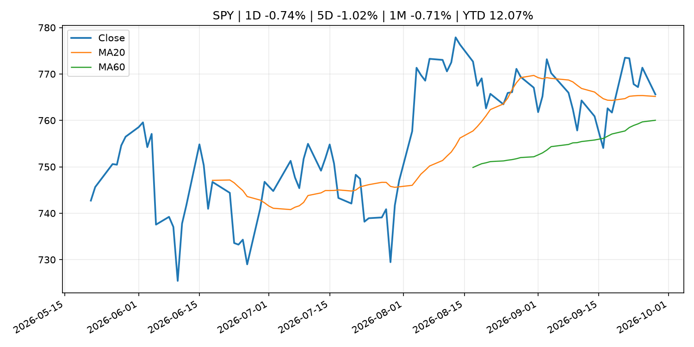
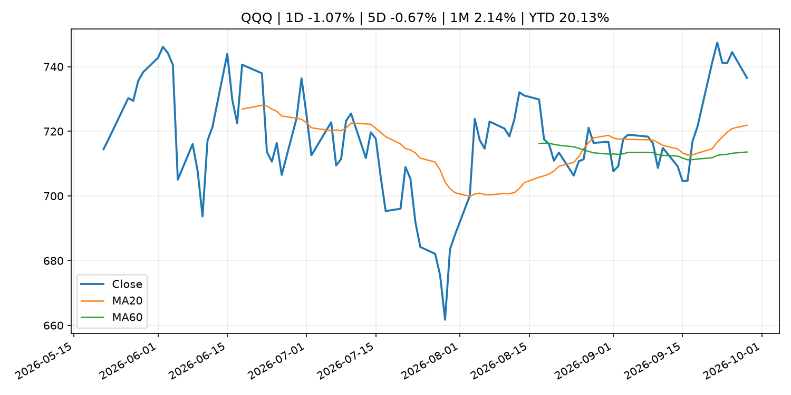
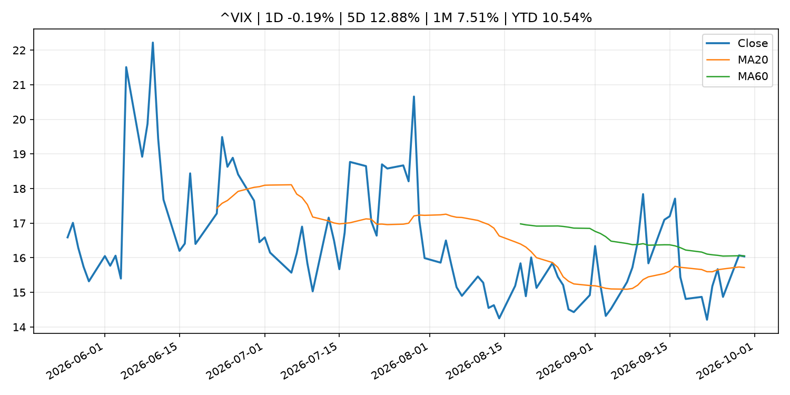
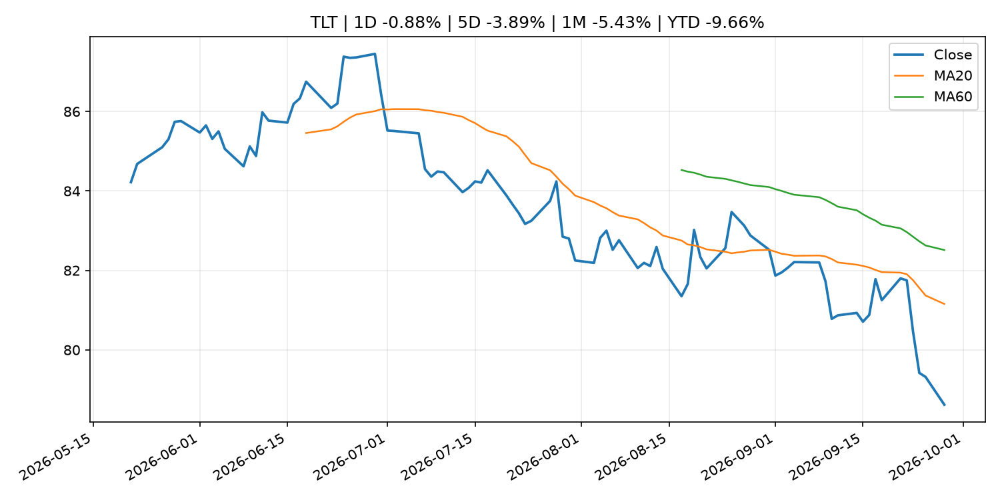
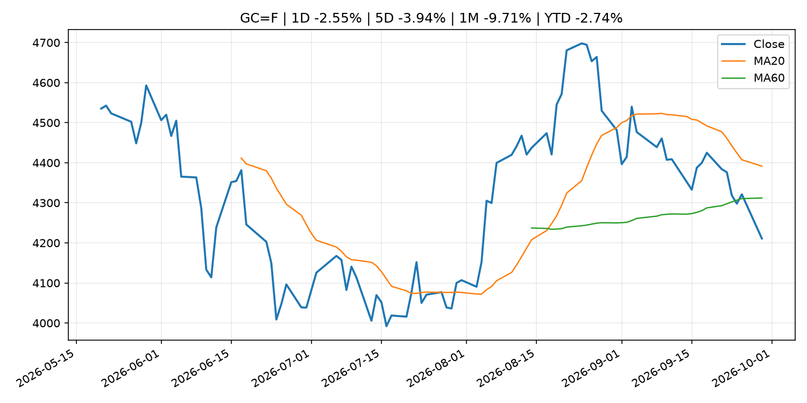
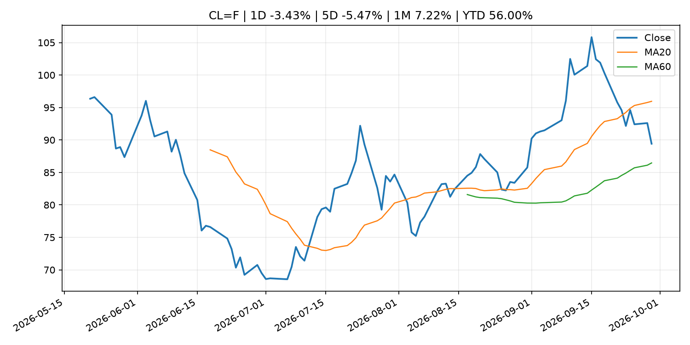
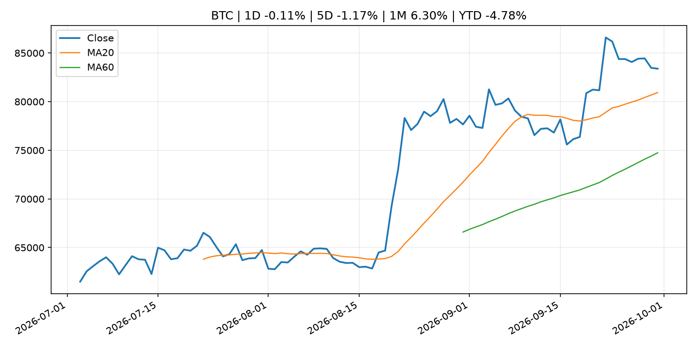
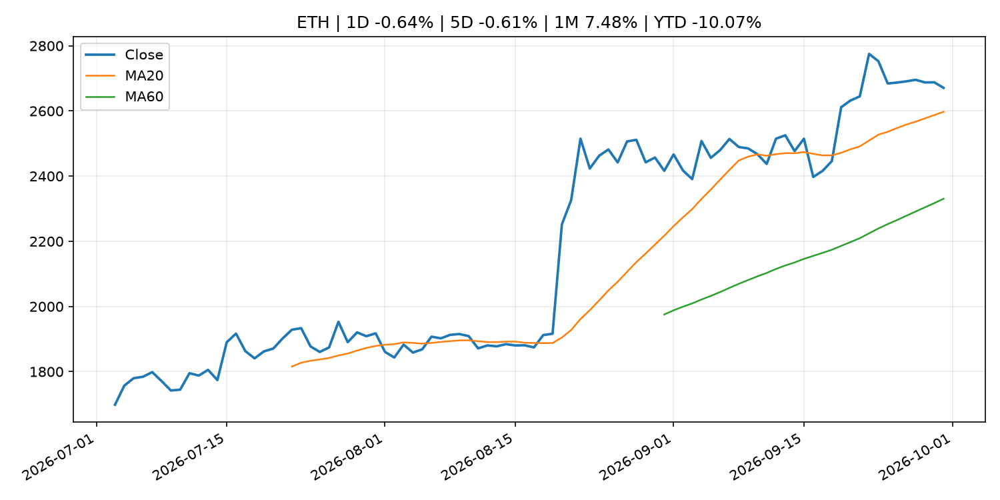
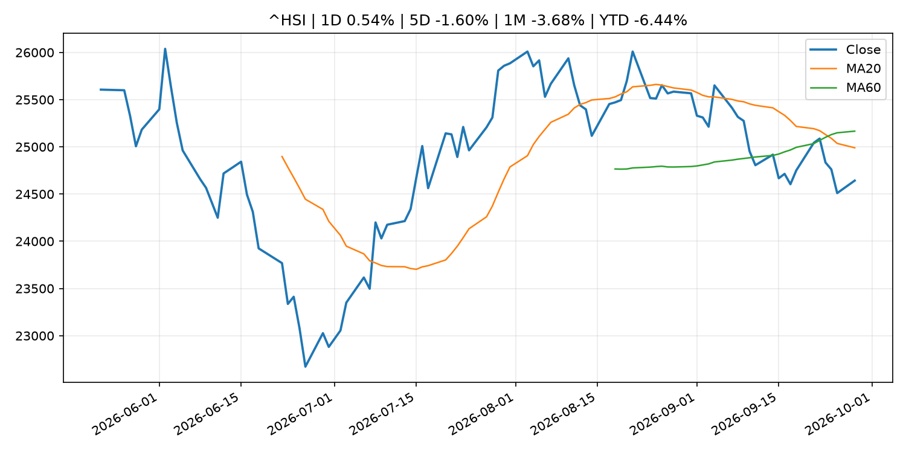

# Global Macro Morning Briefing - 2026-09-30

> Not financial advice / 非投资建议。

## 0. 今日总览
- 市场状态：mixed。市场信号不足，暂不判断明确状态。 但存在信号冲突，需要降低单一叙事置信度。
- 今日三大主线：
  1. geopolitical_risk: SEC Charges Registered Investment Adviser Zoe Financial for Failure to Disclose Conflict of Interest
  2. financial_stability: Polymarket taps Goldman Sachs veteran Lisa Mantil to attract Wall Street liquidity
  3. regulation: SEC Charges Multiple Entities in Fraud Schemes Totaling at Least $15 Million That Used WhatsApp and Other Platforms to Lure Investors
- 一句话结论：今日晨报重点关注：地缘风险可能推升避险需求、能源价格和市场波动率。；金融稳定信号可能放大跨资产波动，并影响央行反应函数。。跨资产方面，SPY 1D -0.74%；QQQ 1D -1.07%；^VIX 1D -0.19%；TLT 1D -0.88%；GC=F 1D -2.55%；CL=F 1D -3.43%；BTC 1D -0.11%；ETH 1D -0.64%；市场信号不足，暂不判断明确状态。 但存在信号冲突，需要降低单一叙事置信度。政策、通胀、利率、美元、美债、能源和加密监管仍是主要观察线索。所有结论仅基于公开数据与短摘要整理，不构成投资建议。

## 1. 隔夜跨资产市场
- 美股：SPY 1D -0.74%，QQQ 1D -1.07%，整体趋势需结合 VIX 和利率确认。
- 美债/美元：TLT 1D -0.88%，美元指数 1D 0.22%，是判断折现率压力的核心线索。
- 黄金/原油：黄金 1D -2.55%，原油 1D -3.43%，用于观察避险、通胀和地缘风险。
- 加密：BTC 1D -0.11%，ETH 1D -0.64%，关注是否独立于纳指走出加密自身行情。
- 港股/A股：恒生 1D 0.54%，沪深300/上证 1D n/a，重点看中国政策预期与人民币线索。
- 风险观察：关注后续数据是否确认当前跨资产信号。

### US_EQUITY

| symbol | latest close | 1D | 5D | 1M | YTD | trend |
|---|---:|---:|---:|---:|---:|---|
| SPY | 765.61 | -0.74% | -1.02% | -0.71% | 12.07% | uptrend |
| QQQ | 736.53 | -1.07% | -0.67% | 2.14% | 20.13% | uptrend |
| DIA | 514.02 | -0.67% | -1.11% | -3.96% | 6.28% | strong_downtrend |
| IWM | 280.02 | -0.69% | -1.95% | -6.60% | 12.56% | strong_downtrend |
| VTI | 375.84 | -1.03% | -1.38% | -1.26% | 11.75% | range_bound |

### US_MACRO_MARKET

| symbol | latest close | 1D | 5D | 1M | YTD | trend |
|---|---:|---:|---:|---:|---:|---|
| ^VIX | 16.04 | -0.19% | 12.88% | 7.51% | 10.54% | range_bound |
| DX-Y.NYB | 101.42 | 0.22% | 0.82% | 1.73% | 3.05% | range_bound |
| TLT | 78.62 | -0.88% | -3.89% | -5.43% | -9.66% | strong_downtrend |
| IEF | 89.53 | -0.52% | -1.78% | -3.97% | -6.82% | strong_downtrend |

### COMMODITIES

| symbol | latest close | 1D | 5D | 1M | YTD | trend |
|---|---:|---:|---:|---:|---:|---|
| GC=F | 4,211.00 | -2.55% | -3.94% | -9.71% | -2.74% | range_bound |
| SI=F | 61.75 | 0.87% | -6.34% | -7.83% | -12.48% | range_bound |
| CL=F | 89.42 | -3.43% | -5.47% | 7.22% | 56.00% | range_bound |
| BZ=F | 96.20 | -8.62% | -3.07% | 7.71% | 58.35% | range_bound |
| NG=F | 3.02 | 0.60% | 1.79% | 4.50% | -16.58% | strong_uptrend |
| HG=F | 6.65 | 1.25% | -1.65% | 1.31% | 17.87% | uptrend |

### HK_MARKET

| symbol | latest close | 1D | 5D | 1M | YTD | trend |
|---|---:|---:|---:|---:|---:|---|
| ^HSI | 24,642.51 | 0.54% | -1.60% | -3.68% | -6.44% | strong_downtrend |
| 0700.HK | 432.00 | -1.77% | -4.34% | -4.64% | -30.66% | downtrend |
| 9988.HK | 106.20 | -1.39% | -7.49% | -7.01% | -28.72% | strong_downtrend |
| 3690.HK | 70.45 | -2.02% | -3.76% | -10.71% | -32.65% | strong_downtrend |
| 1810.HK | 25.20 | -2.55% | -7.35% | -8.76% | -37.44% | strong_downtrend |
| 1211.HK | 75.75 | -2.51% | -6.88% | -13.13% | -23.29% | strong_downtrend |

### CRYPTO

| symbol | latest close | 1D | 5D | 1M | YTD | trend |
|---|---:|---:|---:|---:|---:|---|
| BTC | 83,390.62 | -0.11% | -1.17% | 6.30% | -4.78% | strong_uptrend |
| ETH | 2,670.84 | -0.64% | -0.61% | 7.48% | -10.07% | strong_uptrend |
| SOLANA | 118.83 | 0.01% | 1.56% | 14.97% | -4.57% | strong_uptrend |
| BINANCECOIN | 759.11 | -0.60% | -2.23% | 0.93% | -12.01% | uptrend |
| RIPPLE | 1.49 | -0.31% | -2.79% | 5.22% | -18.98% | strong_uptrend |

## 2. 今日最重要的 10 条新闻
### 1. SEC Charges Registered Investment Adviser Zoe Financial for Failure to Disclose Conflict of Interest
- 来源：SEC Press Releases
- 时间：2026-09-28T13:46:30-04:00
- 地区：US
- 事件类型：geopolitical_risk
- 重要性层级：Tier 1
- 一句话摘要：The Securities and Exchange Commission today announced settled charges against New York-based investment adviser Zoe Financial Inc. for failing to fully and fairly disclose material facts concerning conflicts of interest to its clients and prospective…
- 为什么重要：地缘风险可能推升避险需求、能源价格和市场波动率。
- 可能影响：主要影响 BTC，方向为 mixed，强度 high；加密监管或 ETF 进展会改变 BTC 的资金流和风险溢价。
  - 资产：BTC
    方向：mixed
    强度：high
    原因：加密监管或 ETF 进展会改变 BTC 的资金流和风险溢价。
  - 资产：ETH
    方向：mixed
    强度：high
    原因：监管框架会影响 ETH 产品化和机构参与度。
  - 资产：COIN
    方向：mixed
    强度：medium
    原因：监管清晰度和执法风险会影响交易平台估值。
  - 资产：crypto market
    方向：mixed
    强度：high
    原因：信息影响整个加密市场结构，但方向取决于细节。
- 原文链接：[https://www.sec.gov/newsroom/press-releases/2026-94-sec-charges-registered-investment-adviser-zoe-financial-failure-disclose-conflict-interest](https://www.sec.gov/newsroom/press-releases/2026-94-sec-charges-registered-investment-adviser-zoe-financial-failure-disclose-conflict-interest)

### 2. Polymarket taps Goldman Sachs veteran Lisa Mantil to attract Wall Street liquidity
- 来源：CNBC Economy
- 时间：2026-09-29T12:00:33+00:00
- 地区：US
- 事件类型：financial_stability
- 重要性层级：Tier 1
- 一句话摘要：Lisa Mantil, after a nearly three-decade run at Goldman, will join the prediction market's team to attract institutional traders.
- 为什么重要：金融稳定信号可能放大跨资产波动，并影响央行反应函数。
- 可能影响：可能影响利率、汇率、风险资产或大宗商品预期，但当前公开信息不足以判断明确方向。
  - 资产：暂无明确资产映射
  - 方向：unknown
  - 强度：low
  - 原因：公开信息不足以判断方向。
- 原文链接：[https://www.cnbc.com/2026/09/29/polymarket-lisa-mantil-institutional-growth.html](https://www.cnbc.com/2026/09/29/polymarket-lisa-mantil-institutional-growth.html)

### 3. SEC Charges Multiple Entities in Fraud Schemes Totaling at Least $15 Million That Used WhatsApp and Other Platforms to Lure Investors
- 来源：SEC Press Releases
- 时间：2026-09-29T09:55:53-04:00
- 地区：US
- 事件类型：regulation
- 重要性层级：Tier 2
- 一句话摘要：The Securities and Exchange Commission today charged multiple entities that are likely operated by individuals located overseas for defrauding hundreds of retail investors, including many in the U.S., through so-called investment confidence scams where…
- 为什么重要：监管变化会改变行业盈利预期和资产风险溢价。
- 可能影响：主要影响 BTC，方向为 mixed，强度 high；加密监管或 ETF 进展会改变 BTC 的资金流和风险溢价。
  - 资产：BTC
    方向：mixed
    强度：high
    原因：加密监管或 ETF 进展会改变 BTC 的资金流和风险溢价。
  - 资产：ETH
    方向：mixed
    强度：high
    原因：监管框架会影响 ETH 产品化和机构参与度。
  - 资产：COIN
    方向：mixed
    强度：medium
    原因：监管清晰度和执法风险会影响交易平台估值。
  - 资产：crypto market
    方向：mixed
    强度：high
    原因：信息影响整个加密市场结构，但方向取决于细节。
- 原文链接：[https://www.sec.gov/newsroom/press-releases/2026-95-sec-charges-multiple-entities-fraud-schemes-totaling-least-15-million-used-whatsapp-other-platforms](https://www.sec.gov/newsroom/press-releases/2026-95-sec-charges-multiple-entities-fraud-schemes-totaling-least-15-million-used-whatsapp-other-platforms)

### 4. Goldman Sachs CEO succession planning faces one big problem
- 来源：CNBC Economy
- 时间：2026-09-29T20:50:10+00:00
- 地区：US
- 事件类型：central_bank_speech
- 重要性层级：Tier 2
- 一句话摘要：The Goldman Sachs board has reportedly discussed replacing CEO David Solomon, 64, with president John Waldron, 57, as early as next year.
- 为什么重要：央行官员表态可能影响市场对下一次会议的定价。
- 可能影响：可能影响利率、汇率、风险资产或大宗商品预期，但当前公开信息不足以判断明确方向。
  - 资产：暂无明确资产映射
  - 方向：unknown
  - 强度：low
  - 原因：公开信息不足以判断方向。
- 原文链接：[https://www.cnbc.com/2026/09/29/goldman-sachs-ceo-succession-planning.html](https://www.cnbc.com/2026/09/29/goldman-sachs-ceo-succession-planning.html)

### 5. Bitcoin holds $83,000 as ZEC drops 12% and oil climbs again
- 来源：CoinDesk
- 时间：2026-09-29T04:17:20+00:00
- 地区：global
- 事件类型：other
- 重要性层级：Tier 3
- 一句话摘要：Bitcoin holds $83,000 as ZEC drops 12% and oil climbs again
- 为什么重要：这条信息暂未匹配到重大宏观、政策或市场事件，更适合作为背景跟踪。
- 可能影响：主要影响 CL=F，方向为 positive，强度 high；供给扰动或 OPEC 减产通常推升 WTI 原油。
  - 资产：CL=F
    方向：positive
    强度：high
    原因：供给扰动或 OPEC 减产通常推升 WTI 原油。
  - 资产：BZ=F
    方向：positive
    强度：high
    原因：全球供给风险通常直接影响 Brent 原油。
  - 资产：SPY
    方向：mixed
    强度：medium
    原因：能源股可能受益，但通胀和成本压力不利于宽基风险资产。
- 原文链接：[https://www.coindesk.com/markets/2026/09/29/bitcoin-holds-usd83-000-as-zec-drops-12-and-oil-climbs-again](https://www.coindesk.com/markets/2026/09/29/bitcoin-holds-usd83-000-as-zec-drops-12-and-oil-climbs-again)

### 6. Agencies publish resolution plan feedback letters for 15 banking organizations
- 来源：Federal Reserve Press Releases
- 时间：2026-09-29T20:00:00+00:00
- 地区：US
- 事件类型：other
- 重要性层级：Tier 3
- 一句话摘要：Agencies publish resolution plan feedback letters for 15 banking organizations
- 为什么重要：这条信息暂未匹配到重大宏观、政策或市场事件，更适合作为背景跟踪。
- 可能影响：更偏背景信息，短期市场影响可能有限。
  - 资产：暂无明确资产映射
  - 方向：unknown
  - 强度：low
  - 原因：公开信息不足以判断方向。
- 原文链接：[https://www.federalreserve.gov/newsevents/pressreleases/bcreg20260929a.htm](https://www.federalreserve.gov/newsevents/pressreleases/bcreg20260929a.htm)

## 3. 政策与央行观察
### 1. Polymarket taps Goldman Sachs veteran Lisa Mantil to attract Wall Street liquidity
- 来源：CNBC Economy
- 时间：2026-09-29T12:00:33+00:00
- 地区：US
- 事件类型：financial_stability
- 重要性层级：Tier 1
- 一句话摘要：Lisa Mantil, after a nearly three-decade run at Goldman, will join the prediction market's team to attract institutional traders.
- 为什么重要：金融稳定信号可能放大跨资产波动，并影响央行反应函数。
- 可能影响：可能影响利率、汇率、风险资产或大宗商品预期，但当前公开信息不足以判断明确方向。
  - 资产：暂无明确资产映射
  - 方向：unknown
  - 强度：low
  - 原因：公开信息不足以判断方向。
- 原文链接：[https://www.cnbc.com/2026/09/29/polymarket-lisa-mantil-institutional-growth.html](https://www.cnbc.com/2026/09/29/polymarket-lisa-mantil-institutional-growth.html)

### 2. SEC Charges Multiple Entities in Fraud Schemes Totaling at Least $15 Million That Used WhatsApp and Other Platforms to Lure Investors
- 来源：SEC Press Releases
- 时间：2026-09-29T09:55:53-04:00
- 地区：US
- 事件类型：regulation
- 重要性层级：Tier 2
- 一句话摘要：The Securities and Exchange Commission today charged multiple entities that are likely operated by individuals located overseas for defrauding hundreds of retail investors, including many in the U.S., through so-called investment confidence scams where…
- 为什么重要：监管变化会改变行业盈利预期和资产风险溢价。
- 可能影响：主要影响 BTC，方向为 mixed，强度 high；加密监管或 ETF 进展会改变 BTC 的资金流和风险溢价。
  - 资产：BTC
    方向：mixed
    强度：high
    原因：加密监管或 ETF 进展会改变 BTC 的资金流和风险溢价。
  - 资产：ETH
    方向：mixed
    强度：high
    原因：监管框架会影响 ETH 产品化和机构参与度。
  - 资产：COIN
    方向：mixed
    强度：medium
    原因：监管清晰度和执法风险会影响交易平台估值。
  - 资产：crypto market
    方向：mixed
    强度：high
    原因：信息影响整个加密市场结构，但方向取决于细节。
- 原文链接：[https://www.sec.gov/newsroom/press-releases/2026-95-sec-charges-multiple-entities-fraud-schemes-totaling-least-15-million-used-whatsapp-other-platforms](https://www.sec.gov/newsroom/press-releases/2026-95-sec-charges-multiple-entities-fraud-schemes-totaling-least-15-million-used-whatsapp-other-platforms)

### 3. Goldman Sachs CEO succession planning faces one big problem
- 来源：CNBC Economy
- 时间：2026-09-29T20:50:10+00:00
- 地区：US
- 事件类型：central_bank_speech
- 重要性层级：Tier 2
- 一句话摘要：The Goldman Sachs board has reportedly discussed replacing CEO David Solomon, 64, with president John Waldron, 57, as early as next year.
- 为什么重要：央行官员表态可能影响市场对下一次会议的定价。
- 可能影响：可能影响利率、汇率、风险资产或大宗商品预期，但当前公开信息不足以判断明确方向。
  - 资产：暂无明确资产映射
  - 方向：unknown
  - 强度：low
  - 原因：公开信息不足以判断方向。
- 原文链接：[https://www.cnbc.com/2026/09/29/goldman-sachs-ceo-succession-planning.html](https://www.cnbc.com/2026/09/29/goldman-sachs-ceo-succession-planning.html)

## 4. 市场异动与图表
- SPY 下跌 -0.74%
- QQQ 下跌 -1.07%
- TLT 下跌 -0.88%
- Gold 下跌 -2.55%
- Oil 下跌 -3.43%

### 信号矛盾
- 股债同时承压，可能是利率或流动性冲击而非传统避险。

### SPY

### QQQ

### ^VIX

### TLT

### GC=F

### CL=F

### BTC

### ETH

### ^HSI

## 5. 华尔街与机构公开观点
- 暂无可靠公开观点。

## 6. 今日重点关注
- 经济数据：经济数据：暂无可靠公开日历数据；如配置经济日历源后可自动填充。
- 央行讲话：央行讲话：暂无可靠公开日历数据；重点跟踪 Fed、ECB、BoJ、PBOC 官网 RSS。
- 财报：财报：暂无可靠数据。
- 政策事件：政策事件：暂无可靠数据。
- 风险提醒：风险提醒：关注数据源失败项、突发地缘风险、利率和美元的二阶反应。

## 7. 英文金融表达与宏观概念
- **real yield**：实际收益率，名义利率扣除通胀预期后的收益率。 例句：Gold often reacts more to real yields than nominal yields.
- **supply disruption**：供给扰动，通常指能源或商品供应受冲突、减产或天气影响。 例句：Supply disruption can lift oil prices and inflation expectations.
- **market structure**：市场结构，指交易、托管、清算、ETF、监管等制度安排。 例句：Crypto market structure rules can affect institutional participation.
- **inflation expectations**：通胀预期，指家庭、企业或市场对未来通胀的预估。 例句：Inflation expectations can shape wage bargaining and bond yields.
- **terminal rate**：终端利率，市场预期本轮加息周期的最高政策利率。 例句：A higher terminal rate can pressure growth stocks.
- **soft landing**：软着陆，指通胀回落而经济避免明显衰退。 例句：Markets often rally when data support a soft landing.

## 8. 背景材料
- [‘I’m never selling’: I’m 47 and buy bitcoin with every dollar I earn. Am I crazy?](https://www.marketwatch.com/story/im-never-selling-im-47-and-buy-bitcoin-with-every-dollar-i-earn-am-i-crazy-364d2a64?mod=mw_rss_topstories)（MarketWatch Top Stories，other）：“When my paycheck lands, it takes a detour through bitcoin.”
- [I’m 77, pay rent and live off Social Security, but I help homeless people. Why are so many people going hungry?](https://www.marketwatch.com/story/im-77-pay-rent-and-live-off-social-security-but-i-help-homeless-people-why-are-so-many-people-going-hungry-5818465f?mod=mw_rss_topstories)（MarketWatch Top Stories，other）：“I am a retired senior citizen living check-to-check.”
- [Agencies publish resolution plan feedback letters for 15 banking organizations](https://www.federalreserve.gov/newsevents/pressreleases/bcreg20260929a.htm)（Federal Reserve Press Releases，other）：Agencies publish resolution plan feedback letters for 15 banking organizations
- [Bitcoin surging to $100,000 may be in play, after outperforming gold](https://www.coindesk.com/daybook-us/2026/09/29/bitcoin-outperforms-gold-usd100-000-surge-in-play)（CoinDesk，other）：Bitcoin surging to $100,000 may be in play, after outperforming gold
- [Live updates: Bitcoin turns lower as rates rise, consumer confidence plunges](https://www.coindesk.com/markets/2026/09/29/live-updates-bitcoin-rebounds-above-usd84-000-as-treasury-yields-steady)（CoinDesk，other）：Live updates: Bitcoin turns lower as rates rise, consumer confidence plunges
- [Bitcoin is on track to shatter a major decade-long streak as September gains surge](https://www.coindesk.com/markets/2026/09/29/bitcoin-is-on-track-to-shatter-a-major-decade-long-streak-as-september-gains-surge)（CoinDesk，other）：Bitcoin is on track to shatter a major decade-long streak as September gains surge
- [Analysts see 10-year Treasury yield hitting 6%. Bitcoin bulls shouldn't panic](https://www.coindesk.com/markets/2026/09/29/analysts-see-10-year-treasury-yield-hitting-6-bitcoin-bulls-shouldn-t-panic)（CoinDesk，other）：Analysts see 10-year Treasury yield hitting 6%. Bitcoin bulls shouldn't panic
- [ECB amends monetary policy implementation guidelines as part of regular review](https://www.ecb.europa.eu//press/pr/date/2026/html/ecb.pr260929~050089e922.en.html)（ECB Press Releases，other）：ECB amends monetary policy implementation guidelines as part of regular review
- [China has three new criteria for humanoid robot IPOs. Few, if any, meet them](https://www.cnbc.com/2026/09/29/china-criteria-humanoid-robot-ipos.html)（CNBC Economy，other）：China's securities regulator is raising the bar for public listings of humanoid robot startups with three specific criteria, according to three sources.
- [Bitcoin holds $83,000 as ZEC drops 12% and oil climbs again](https://www.coindesk.com/markets/2026/09/29/bitcoin-holds-usd83-000-as-zec-drops-12-and-oil-climbs-again)（CoinDesk，other）：Bitcoin holds $83,000 as ZEC drops 12% and oil climbs again
- [Goldman Sachs brings $100 billion Treasury fund into crypto’s institutional plumbing](https://www.coindesk.com/markets/2026/09/28/goldman-sachs-brings-usd100-billion-treasury-fund-into-crypto-s-institutional-plumbing)（CoinDesk，other）：Goldman Sachs brings $100 billion Treasury fund into crypto’s institutional plumbing
- [The restaking gold rush is over, and top protocols are barely making a profit](https://www.coindesk.com/business/2026/09/28/the-restaking-gold-rush-is-over-and-top-protocols-are-barely-making-a-profit)（CoinDesk，other）：The restaking gold rush is over, and top protocols are barely making a profit
- [Christine Lagarde: Hearing of the Committee on Economic and Monetary Affairs of the European Parliament](https://www.ecb.europa.eu//press/key/date/2026/html/ecb.sp260928~a875675544.en.html)（ECB Press Releases，other）：Christine Lagarde: Hearing of the Committee on Economic and Monetary Affairs of the European Parliament
- [Chainlink launches new version of its crypto bridge tech 'CCIP' to give apps more control over their security](https://www.coindesk.com/business/2026/09/28/chainlink-updates-its-crypto-bridge-tech-months-after-a-usd292-million-hack-shook-the-industry)（CoinDesk，other）：Chainlink launches new version of its crypto bridge tech 'CCIP' to give apps more control over their security
- [THORChain rejects Bitget request to block hacker as $6 million moves to bitcoin](https://www.coindesk.com/tech/2026/09/28/thorchain-rejects-bitget-request-to-block-hacker-as-usd6-million-moves-to-bitcoin)（CoinDesk，other）：THORChain rejects Bitget request to block hacker as $6 million moves to bitcoin
- [Bitcoin falls to $83,000 while altcoins unwind Friday's rally](https://www.coindesk.com/markets/2026/09/28/bitcoin-falls-to-usd83-000-while-altcoins-unwind-friday-s-rally)（CoinDesk，other）：Bitcoin falls to $83,000 while altcoins unwind Friday's rally
- [Live updates: Bitcoin remains under pressure as Iran denies report of peace progress](https://www.coindesk.com/business/2026/09/28/live-updates-bitcoin-sinks-below-usd83-000-as-iran-talks-stall-and-oil-climbs)（CoinDesk，other）：Live updates: Bitcoin remains under pressure as Iran denies report of peace progress
- [U.S., China to lower tariffs on $60 billion of goods. Here's what qualifies](https://www.cnbc.com/2026/09/28/us-china-lower-tariffs-trump-xi-meeting.html)（CNBC Economy，other）：The lists included U.S. imports of toys, sports equipment and Christmas decorations, while U.S. farm products appeared on the list of Chinese imports.

## 9. 数据源、失败项与免责声明
- 采集时间：2026-09-30T01:03:43
- 数据源：公开 RSS、Yahoo Finance、CoinGecko、AKShare、FRED、SEC data.sec.gov，以及用户自有 inputs/reports 文件。
- 合规说明：不绕过 WSJ、Bloomberg、FT、Reuters 等付费墙；对付费媒体只使用公开 RSS 标题、摘要、链接和发布时间。
- 免责声明：Not financial advice / 非投资建议。本项目仅供个人学习、研究和信息整理，不构成投资建议、交易建议或任何收益承诺。
- 失败或跳过的数据源：
  - crypto data failed coin=dogecoin
  - China market data failed symbol=上证指数: empty dataframe
  - China market data failed symbol=深证成指: empty dataframe
  - China market data failed symbol=创业板指: empty dataframe
  - China market data failed symbol=沪深300: empty dataframe
  - China market data failed symbol=中证500: empty dataframe
  - China market data failed symbol=科创50: empty dataframe
  - FRED_API_KEY not set; skipping FRED macro series
  - SEC failed cik=0000320193
  - SEC failed cik=0000789019
  - SEC failed cik=0001045810
  - SEC failed cik=0001318605
  - SEC failed cik=0001577552
