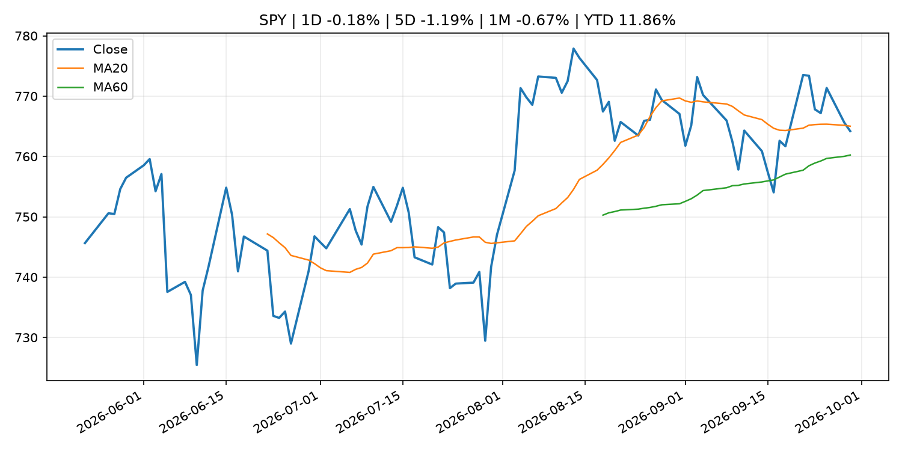
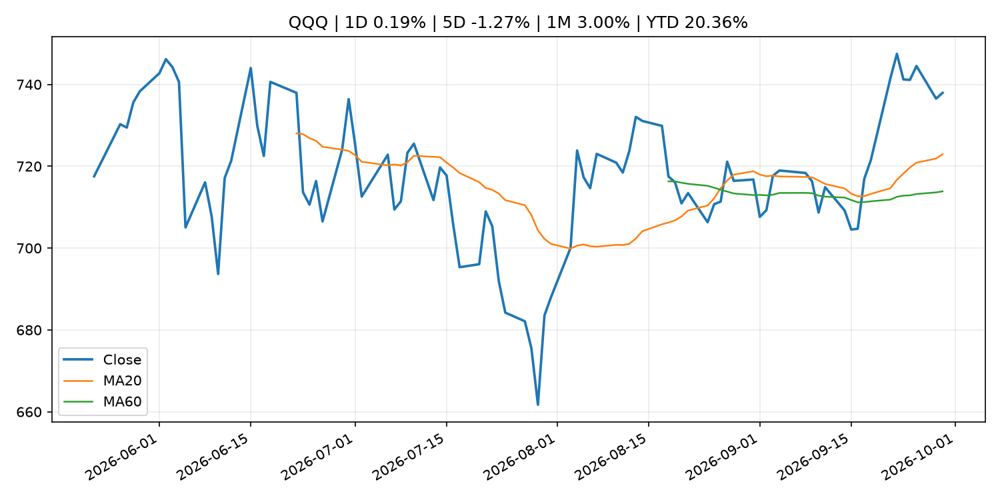
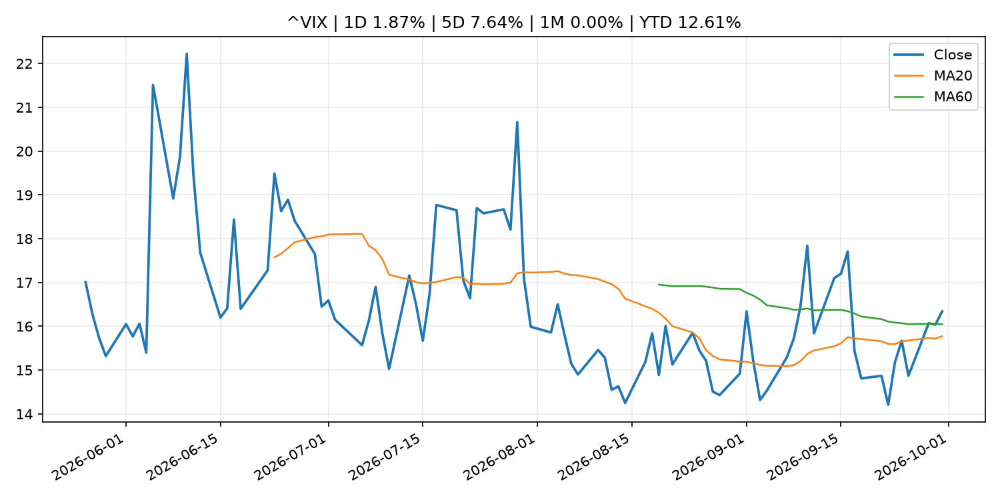
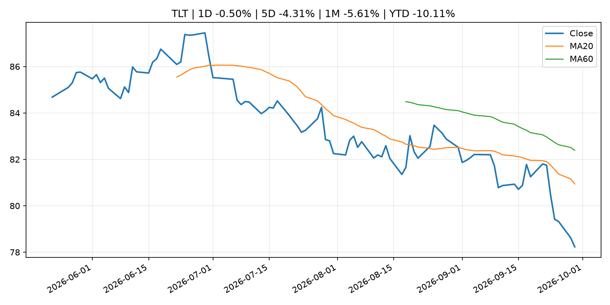
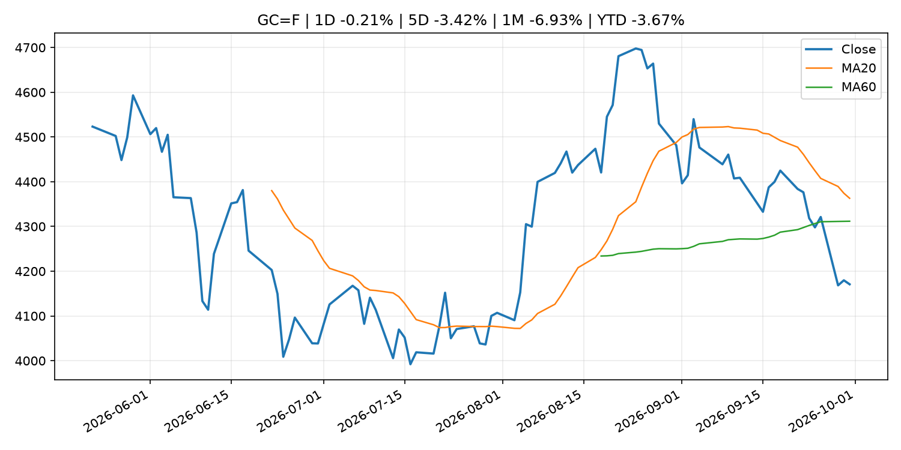
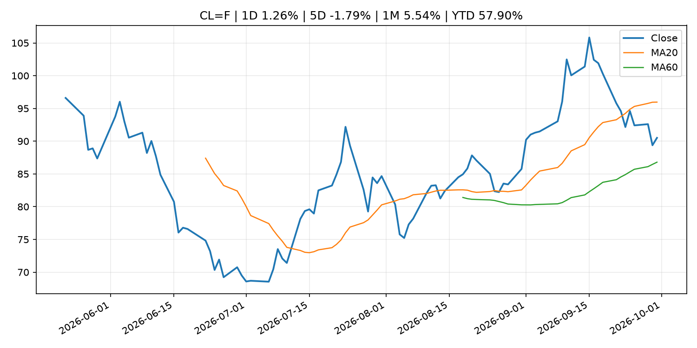
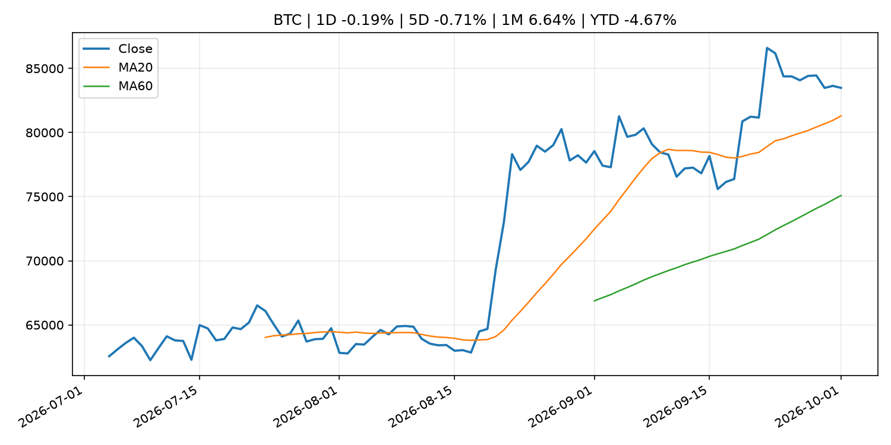
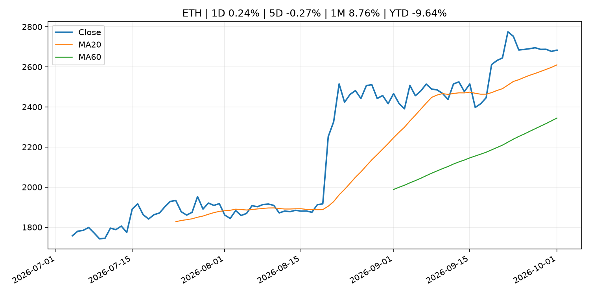
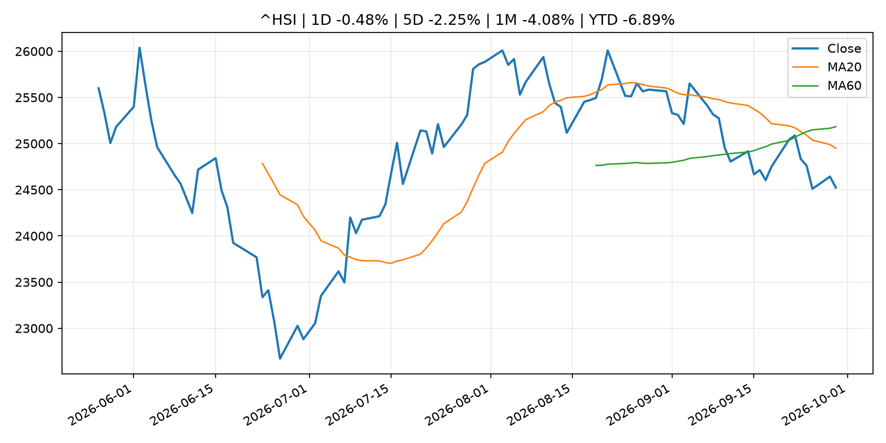

# Global Macro Morning Briefing - 2026-10-01

> Not financial advice / 非投资建议。

## 0. 今日总览
- 市场状态：unknown。市场信号不足，暂不判断明确状态。
- 今日三大主线：
  1. macro_data: Fed's Kashkari says inflation is 'still too high' even after softer-than-expected PCE data, labor market is 'pretty good'
  2. financial_stability: Liquidity Indicators in the JGB Markets (August)
  3. financial_stability: Polymarket taps Goldman Sachs veteran Lisa Mantil to attract Wall Street liquidity
- 一句话结论：今日晨报重点关注：这类宏观数据会直接改变市场对通胀、增长和政策路径的预期。；金融稳定信号可能放大跨资产波动，并影响央行反应函数。。跨资产方面，SPY 1D -0.18%；QQQ 1D 0.19%；^VIX 1D 1.87%；TLT 1D -0.50%；GC=F 1D -0.21%；CL=F 1D 1.26%；BTC 1D -0.19%；ETH 1D 0.24%；市场信号不足，暂不判断明确状态。政策、通胀、利率、美元、美债、能源和加密监管仍是主要观察线索。所有结论仅基于公开数据与短摘要整理，不构成投资建议。

## 1. 隔夜跨资产市场
- 美股：SPY 1D -0.18%，QQQ 1D 0.19%，整体趋势需结合 VIX 和利率确认。
- 美债/美元：TLT 1D -0.50%，美元指数 1D 0.10%，是判断折现率压力的核心线索。
- 黄金/原油：黄金 1D -0.21%，原油 1D 1.26%，用于观察避险、通胀和地缘风险。
- 加密：BTC 1D -0.19%，ETH 1D 0.24%，关注是否独立于纳指走出加密自身行情。
- 港股/A股：恒生 1D -0.48%，沪深300/上证 1D n/a，重点看中国政策预期与人民币线索。
- 风险观察：关注后续数据是否确认当前跨资产信号。

### US_EQUITY

| symbol | latest close | 1D | 5D | 1M | YTD | trend |
|---|---:|---:|---:|---:|---:|---|
| SPY | 764.20 | -0.18% | -1.19% | -0.67% | 11.86% | range_bound |
| QQQ | 737.93 | 0.19% | -1.27% | 3.00% | 20.36% | strong_uptrend |
| DIA | 512.88 | -0.22% | -0.99% | -4.15% | 6.05% | strong_downtrend |
| IWM | 279.01 | -0.36% | -2.86% | -5.66% | 12.15% | strong_downtrend |
| VTI | 375.26 | -0.15% | -1.58% | -1.08% | 11.58% | range_bound |

### US_MACRO_MARKET

| symbol | latest close | 1D | 5D | 1M | YTD | trend |
|---|---:|---:|---:|---:|---:|---|
| ^VIX | 16.34 | 1.87% | 7.64% | 0.00% | 12.61% | range_bound |
| DX-Y.NYB | 101.47 | 0.10% | 0.37% | 2.06% | 3.10% | range_bound |
| TLT | 78.23 | -0.50% | -4.31% | -5.61% | -10.11% | strong_downtrend |
| IEF | 89.45 | -0.09% | -1.88% | -3.66% | -6.90% | strong_downtrend |

### COMMODITIES

| symbol | latest close | 1D | 5D | 1M | YTD | trend |
|---|---:|---:|---:|---:|---:|---|
| GC=F | 4,170.80 | -0.21% | -3.42% | -6.93% | -3.67% | range_bound |
| SI=F | 60.42 | -0.40% | -6.15% | -8.75% | -14.36% | range_bound |
| CL=F | 90.51 | 1.26% | -1.79% | 5.54% | 57.90% | range_bound |
| BZ=F | 98.35 | -4.13% | -4.59% | 8.69% | 61.89% | range_bound |
| NG=F | 3.00 | -0.33% | -0.73% | 2.25% | -17.05% | uptrend |
| HG=F | 6.61 | 0.94% | -1.09% | 0.17% | 17.11% | uptrend |

### HK_MARKET

| symbol | latest close | 1D | 5D | 1M | YTD | trend |
|---|---:|---:|---:|---:|---:|---|
| ^HSI | 24,523.57 | -0.48% | -2.25% | -4.08% | -6.89% | strong_downtrend |
| 0700.HK | 431.00 | -0.23% | -2.27% | -2.36% | -30.82% | downtrend |
| 9988.HK | 106.60 | 0.38% | -2.91% | -3.44% | -28.46% | downtrend |
| 3690.HK | 71.70 | 1.77% | -1.58% | -6.46% | -31.45% | strong_downtrend |
| 1810.HK | 25.24 | 0.16% | -3.59% | -8.42% | -37.34% | downtrend |
| 1211.HK | 75.60 | -0.20% | -5.91% | -14.33% | -23.44% | strong_downtrend |

### CRYPTO

| symbol | latest close | 1D | 5D | 1M | YTD | trend |
|---|---:|---:|---:|---:|---:|---|
| BTC | 83,482.11 | -0.19% | -0.71% | 6.64% | -4.67% | strong_uptrend |
| ETH | 2,683.69 | 0.24% | -0.27% | 8.76% | -9.64% | strong_uptrend |
| SOLANA | 118.03 | -0.89% | -3.32% | 16.21% | -5.21% | strong_uptrend |
| BINANCECOIN | 769.81 | 1.50% | -0.92% | 6.52% | -10.77% | strong_uptrend |
| RIPPLE | 1.49 | 0.10% | -4.88% | 6.95% | -18.96% | strong_uptrend |

## 2. 今日最重要的 10 条新闻
### 1. Fed's Kashkari says inflation is 'still too high' even after softer-than-expected PCE data, labor market is 'pretty good'
- 来源：CNBC Economy
- 时间：2026-09-30T23:44:28+00:00
- 地区：US
- 事件类型：macro_data
- 重要性层级：Tier 1
- 一句话摘要：Kashkari sat down with CNBC's Steve Liesman for an exclusive conversation Wednesday night.
- 为什么重要：这类宏观数据会直接改变市场对通胀、增长和政策路径的预期。
- 可能影响：主要影响 DXY，方向为 positive，强度 high；通胀压力可能推高政策利率预期并支撑美元。
  - 资产：DXY
    方向：positive
    强度：high
    原因：通胀压力可能推高政策利率预期并支撑美元。
  - 资产：TLT
    方向：negative
    强度：high
    原因：通胀上行通常推升收益率、压低长债价格。
  - 资产：QQQ
    方向：negative
    强度：high
    原因：更高利率对成长股估值折现率不利。
  - 资产：SPY
    方向：mixed
    强度：medium
    原因：名义增长可能支撑收入，但更高利率压制估值。
  - 资产：GC=F
    方向：mixed
    强度：medium
    原因：通胀对黄金是支撑，但实际利率上行会形成压力。
  - 资产：BTC
    方向：mixed
    强度：medium
    原因：抗通胀叙事和流动性收紧可能相互抵消。
- 原文链接：[https://www.cnbc.com/2026/09/30/watch-minneapolis-fed-president-neel-kashkari.html](https://www.cnbc.com/2026/09/30/watch-minneapolis-fed-president-neel-kashkari.html)

### 2. Liquidity Indicators in the JGB Markets (August)
- 来源：Bank of Japan Announcements
- 时间：2026-09-30T16:00:00+09:00
- 地区：Japan
- 事件类型：financial_stability
- 重要性层级：Tier 1
- 一句话摘要：Liquidity Indicators in the JGB Markets (August)
- 为什么重要：金融稳定信号可能放大跨资产波动，并影响央行反应函数。
- 可能影响：可能影响利率、汇率、风险资产或大宗商品预期，但当前公开信息不足以判断明确方向。
  - 资产：暂无明确资产映射
  - 方向：unknown
  - 强度：low
  - 原因：公开信息不足以判断方向。
- 原文链接：[http://www.boj.or.jp/en/paym/bond/ryudo.pdf](http://www.boj.or.jp/en/paym/bond/ryudo.pdf)

### 3. Polymarket taps Goldman Sachs veteran Lisa Mantil to attract Wall Street liquidity
- 来源：CNBC Economy
- 时间：2026-09-29T12:00:33+00:00
- 地区：US
- 事件类型：financial_stability
- 重要性层级：Tier 1
- 一句话摘要：Lisa Mantil, after a nearly three-decade run at Goldman, will join the prediction market's team to attract institutional traders.
- 为什么重要：金融稳定信号可能放大跨资产波动，并影响央行反应函数。
- 可能影响：可能影响利率、汇率、风险资产或大宗商品预期，但当前公开信息不足以判断明确方向。
  - 资产：暂无明确资产映射
  - 方向：unknown
  - 强度：low
  - 原因：公开信息不足以判断方向。
- 原文链接：[https://www.cnbc.com/2026/09/29/polymarket-lisa-mantil-institutional-growth.html](https://www.cnbc.com/2026/09/29/polymarket-lisa-mantil-institutional-growth.html)

### 4. SEC Charges Meyer Global Management and Its CEO With Defrauding Retail Investors in Private Funds That Held Interests in SpaceX and Other Pre-IPO Securities
- 来源：SEC Press Releases
- 时间：2026-09-30T14:30:01-04:00
- 地区：US
- 事件类型：regulation
- 重要性层级：Tier 2
- 一句话摘要：The Securities and Exchange Commission today charged private fund adviser Meyer Global Management LLC (MGM) and its CEO, Owen E.H. Meyer, with defrauding investors and MGM-managed funds in connection with investments in SpaceX and other pre-IPO…
- 为什么重要：监管变化会改变行业盈利预期和资产风险溢价。
- 可能影响：主要影响 BTC，方向为 mixed，强度 high；加密监管或 ETF 进展会改变 BTC 的资金流和风险溢价。
  - 资产：BTC
    方向：mixed
    强度：high
    原因：加密监管或 ETF 进展会改变 BTC 的资金流和风险溢价。
  - 资产：ETH
    方向：mixed
    强度：high
    原因：监管框架会影响 ETH 产品化和机构参与度。
  - 资产：COIN
    方向：mixed
    强度：medium
    原因：监管清晰度和执法风险会影响交易平台估值。
  - 资产：crypto market
    方向：mixed
    强度：high
    原因：信息影响整个加密市场结构，但方向取决于细节。
- 原文链接：[https://www.sec.gov/newsroom/press-releases/2026-98-sec-charges-meyer-global-management-its-ceo-defrauding-retail-investors-private-funds-held-interests](https://www.sec.gov/newsroom/press-releases/2026-98-sec-charges-meyer-global-management-its-ceo-defrauding-retail-investors-private-funds-held-interests)

### 5. SEC Charges Two Individuals With Orchestrating Fraud Scheme That Targeted Veterans
- 来源：SEC Press Releases
- 时间：2026-09-30T12:42:15-04:00
- 地区：US
- 事件类型：regulation
- 重要性层级：Tier 2
- 一句话摘要：The Securities and Exchange Commission today announced charges against Christopher Kenji Dinelli and Jacob David “Kobe” Frankel for allegedly orchestrating a fraud scheme that raised more than $8.7 million from 35 investors through their fund, Beyond…
- 为什么重要：监管变化会改变行业盈利预期和资产风险溢价。
- 可能影响：主要影响 BTC，方向为 mixed，强度 high；加密监管或 ETF 进展会改变 BTC 的资金流和风险溢价。
  - 资产：BTC
    方向：mixed
    强度：high
    原因：加密监管或 ETF 进展会改变 BTC 的资金流和风险溢价。
  - 资产：ETH
    方向：mixed
    强度：high
    原因：监管框架会影响 ETH 产品化和机构参与度。
  - 资产：COIN
    方向：mixed
    强度：medium
    原因：监管清晰度和执法风险会影响交易平台估值。
  - 资产：crypto market
    方向：mixed
    强度：high
    原因：信息影响整个加密市场结构，但方向取决于细节。
- 原文链接：[https://www.sec.gov/newsroom/press-releases/2026-97-sec-charges-two-individuals-orchestrating-fraud-scheme-targeted-veterans](https://www.sec.gov/newsroom/press-releases/2026-97-sec-charges-two-individuals-orchestrating-fraud-scheme-targeted-veterans)

### 6. SEC Proposes Amendments to Expand Responsible Retailization of Private Markets
- 来源：SEC Press Releases
- 时间：2026-09-30T11:45:00-04:00
- 地区：US
- 事件类型：regulation
- 重要性层级：Tier 2
- 一句话摘要：The Securities and Exchange Commission today voted to propose rule amendments that would facilitate capital formation in the public and private markets by expanding retail investor choice and promoting innovation in regulated fund structures while…
- 为什么重要：监管变化会改变行业盈利预期和资产风险溢价。
- 可能影响：主要影响 BTC，方向为 mixed，强度 high；加密监管或 ETF 进展会改变 BTC 的资金流和风险溢价。
  - 资产：BTC
    方向：mixed
    强度：high
    原因：加密监管或 ETF 进展会改变 BTC 的资金流和风险溢价。
  - 资产：ETH
    方向：mixed
    强度：high
    原因：监管框架会影响 ETH 产品化和机构参与度。
  - 资产：COIN
    方向：mixed
    强度：medium
    原因：监管清晰度和执法风险会影响交易平台估值。
  - 资产：crypto market
    方向：mixed
    强度：high
    原因：信息影响整个加密市场结构，但方向取决于细节。
- 原文链接：[https://www.sec.gov/newsroom/press-releases/2026-96-sec-proposes-amendments-expand-responsible-retailization-private-markets](https://www.sec.gov/newsroom/press-releases/2026-96-sec-proposes-amendments-expand-responsible-retailization-private-markets)

### 7. Open USD takes on Tether, Circle with a different stablecoin model that's 'building money'
- 来源：CoinDesk
- 时间：2026-09-30T15:34:50+00:00
- 地区：global
- 事件类型：crypto_market_structure
- 重要性层级：Tier 2
- 一句话摘要：Open USD takes on Tether, Circle with a different stablecoin model that's 'building money'
- 为什么重要：加密市场结构和监管变化会影响 BTC、ETH 及相关股票的风险溢价。
- 可能影响：主要影响 BTC，方向为 mixed，强度 high；加密监管或 ETF 进展会改变 BTC 的资金流和风险溢价。
  - 资产：BTC
    方向：mixed
    强度：high
    原因：加密监管或 ETF 进展会改变 BTC 的资金流和风险溢价。
  - 资产：ETH
    方向：mixed
    强度：high
    原因：监管框架会影响 ETH 产品化和机构参与度。
  - 资产：COIN
    方向：mixed
    强度：medium
    原因：监管清晰度和执法风险会影响交易平台估值。
  - 资产：crypto market
    方向：mixed
    强度：high
    原因：信息影响整个加密市场结构，但方向取决于细节。
- 原文链接：[https://www.coindesk.com/business/2026/09/24/open-usd-takes-on-tether-circle-with-a-different-stablecoin-model-that-s-building-money](https://www.coindesk.com/business/2026/09/24/open-usd-takes-on-tether-circle-with-a-different-stablecoin-model-that-s-building-money)

### 8. The SEC Is finally modernizing transfer-agent rules. Wall Street must not repeat the ‘paperwork crisis’
- 来源：CoinDesk
- 时间：2026-09-30T11:00:00+00:00
- 地区：global
- 事件类型：regulation
- 重要性层级：Tier 2
- 一句话摘要：The SEC Is finally modernizing transfer-agent rules. Wall Street must not repeat the ‘paperwork crisis’
- 为什么重要：监管变化会改变行业盈利预期和资产风险溢价。
- 可能影响：主要影响 BTC，方向为 mixed，强度 high；加密监管或 ETF 进展会改变 BTC 的资金流和风险溢价。
  - 资产：BTC
    方向：mixed
    强度：high
    原因：加密监管或 ETF 进展会改变 BTC 的资金流和风险溢价。
  - 资产：ETH
    方向：mixed
    强度：high
    原因：监管框架会影响 ETH 产品化和机构参与度。
  - 资产：COIN
    方向：mixed
    强度：medium
    原因：监管清晰度和执法风险会影响交易平台估值。
  - 资产：crypto market
    方向：mixed
    强度：high
    原因：信息影响整个加密市场结构，但方向取决于细节。
- 原文链接：[https://www.coindesk.com/opinion/2026/09/30/the-sec-is-finally-modernizing-transfer-agent-rules-wall-street-must-not-repeat-the-paperwork-crisis](https://www.coindesk.com/opinion/2026/09/30/the-sec-is-finally-modernizing-transfer-agent-rules-wall-street-must-not-repeat-the-paperwork-crisis)

### 9. SEC Charges Multiple Entities in Fraud Schemes Totaling at Least $15 Million That Used WhatsApp and Other Platforms to Lure Investors
- 来源：SEC Press Releases
- 时间：2026-09-29T09:55:53-04:00
- 地区：US
- 事件类型：regulation
- 重要性层级：Tier 2
- 一句话摘要：The Securities and Exchange Commission today charged multiple entities that are likely operated by individuals located overseas for defrauding hundreds of retail investors, including many in the U.S., through so-called investment confidence scams where…
- 为什么重要：监管变化会改变行业盈利预期和资产风险溢价。
- 可能影响：主要影响 BTC，方向为 mixed，强度 high；加密监管或 ETF 进展会改变 BTC 的资金流和风险溢价。
  - 资产：BTC
    方向：mixed
    强度：high
    原因：加密监管或 ETF 进展会改变 BTC 的资金流和风险溢价。
  - 资产：ETH
    方向：mixed
    强度：high
    原因：监管框架会影响 ETH 产品化和机构参与度。
  - 资产：COIN
    方向：mixed
    强度：medium
    原因：监管清晰度和执法风险会影响交易平台估值。
  - 资产：crypto market
    方向：mixed
    强度：high
    原因：信息影响整个加密市场结构，但方向取决于细节。
- 原文链接：[https://www.sec.gov/newsroom/press-releases/2026-95-sec-charges-multiple-entities-fraud-schemes-totaling-least-15-million-used-whatsapp-other-platforms](https://www.sec.gov/newsroom/press-releases/2026-95-sec-charges-multiple-entities-fraud-schemes-totaling-least-15-million-used-whatsapp-other-platforms)

### 10. Goldman Sachs CEO succession planning faces one big problem
- 来源：CNBC Economy
- 时间：2026-09-29T20:50:10+00:00
- 地区：US
- 事件类型：central_bank_speech
- 重要性层级：Tier 2
- 一句话摘要：The Goldman Sachs board has reportedly discussed replacing CEO David Solomon, 64, with president John Waldron, 57, as early as next year.
- 为什么重要：央行官员表态可能影响市场对下一次会议的定价。
- 可能影响：可能影响利率、汇率、风险资产或大宗商品预期，但当前公开信息不足以判断明确方向。
  - 资产：暂无明确资产映射
  - 方向：unknown
  - 强度：low
  - 原因：公开信息不足以判断方向。
- 原文链接：[https://www.cnbc.com/2026/09/29/goldman-sachs-ceo-succession-planning.html](https://www.cnbc.com/2026/09/29/goldman-sachs-ceo-succession-planning.html)

## 3. 政策与央行观察
### 1. Liquidity Indicators in the JGB Markets (August)
- 来源：Bank of Japan Announcements
- 时间：2026-09-30T16:00:00+09:00
- 地区：Japan
- 事件类型：financial_stability
- 重要性层级：Tier 1
- 一句话摘要：Liquidity Indicators in the JGB Markets (August)
- 为什么重要：金融稳定信号可能放大跨资产波动，并影响央行反应函数。
- 可能影响：可能影响利率、汇率、风险资产或大宗商品预期，但当前公开信息不足以判断明确方向。
  - 资产：暂无明确资产映射
  - 方向：unknown
  - 强度：low
  - 原因：公开信息不足以判断方向。
- 原文链接：[http://www.boj.or.jp/en/paym/bond/ryudo.pdf](http://www.boj.or.jp/en/paym/bond/ryudo.pdf)

### 2. Polymarket taps Goldman Sachs veteran Lisa Mantil to attract Wall Street liquidity
- 来源：CNBC Economy
- 时间：2026-09-29T12:00:33+00:00
- 地区：US
- 事件类型：financial_stability
- 重要性层级：Tier 1
- 一句话摘要：Lisa Mantil, after a nearly three-decade run at Goldman, will join the prediction market's team to attract institutional traders.
- 为什么重要：金融稳定信号可能放大跨资产波动，并影响央行反应函数。
- 可能影响：可能影响利率、汇率、风险资产或大宗商品预期，但当前公开信息不足以判断明确方向。
  - 资产：暂无明确资产映射
  - 方向：unknown
  - 强度：low
  - 原因：公开信息不足以判断方向。
- 原文链接：[https://www.cnbc.com/2026/09/29/polymarket-lisa-mantil-institutional-growth.html](https://www.cnbc.com/2026/09/29/polymarket-lisa-mantil-institutional-growth.html)

### 3. SEC Charges Meyer Global Management and Its CEO With Defrauding Retail Investors in Private Funds That Held Interests in SpaceX and Other Pre-IPO Securities
- 来源：SEC Press Releases
- 时间：2026-09-30T14:30:01-04:00
- 地区：US
- 事件类型：regulation
- 重要性层级：Tier 2
- 一句话摘要：The Securities and Exchange Commission today charged private fund adviser Meyer Global Management LLC (MGM) and its CEO, Owen E.H. Meyer, with defrauding investors and MGM-managed funds in connection with investments in SpaceX and other pre-IPO…
- 为什么重要：监管变化会改变行业盈利预期和资产风险溢价。
- 可能影响：主要影响 BTC，方向为 mixed，强度 high；加密监管或 ETF 进展会改变 BTC 的资金流和风险溢价。
  - 资产：BTC
    方向：mixed
    强度：high
    原因：加密监管或 ETF 进展会改变 BTC 的资金流和风险溢价。
  - 资产：ETH
    方向：mixed
    强度：high
    原因：监管框架会影响 ETH 产品化和机构参与度。
  - 资产：COIN
    方向：mixed
    强度：medium
    原因：监管清晰度和执法风险会影响交易平台估值。
  - 资产：crypto market
    方向：mixed
    强度：high
    原因：信息影响整个加密市场结构，但方向取决于细节。
- 原文链接：[https://www.sec.gov/newsroom/press-releases/2026-98-sec-charges-meyer-global-management-its-ceo-defrauding-retail-investors-private-funds-held-interests](https://www.sec.gov/newsroom/press-releases/2026-98-sec-charges-meyer-global-management-its-ceo-defrauding-retail-investors-private-funds-held-interests)

### 4. SEC Charges Two Individuals With Orchestrating Fraud Scheme That Targeted Veterans
- 来源：SEC Press Releases
- 时间：2026-09-30T12:42:15-04:00
- 地区：US
- 事件类型：regulation
- 重要性层级：Tier 2
- 一句话摘要：The Securities and Exchange Commission today announced charges against Christopher Kenji Dinelli and Jacob David “Kobe” Frankel for allegedly orchestrating a fraud scheme that raised more than $8.7 million from 35 investors through their fund, Beyond…
- 为什么重要：监管变化会改变行业盈利预期和资产风险溢价。
- 可能影响：主要影响 BTC，方向为 mixed，强度 high；加密监管或 ETF 进展会改变 BTC 的资金流和风险溢价。
  - 资产：BTC
    方向：mixed
    强度：high
    原因：加密监管或 ETF 进展会改变 BTC 的资金流和风险溢价。
  - 资产：ETH
    方向：mixed
    强度：high
    原因：监管框架会影响 ETH 产品化和机构参与度。
  - 资产：COIN
    方向：mixed
    强度：medium
    原因：监管清晰度和执法风险会影响交易平台估值。
  - 资产：crypto market
    方向：mixed
    强度：high
    原因：信息影响整个加密市场结构，但方向取决于细节。
- 原文链接：[https://www.sec.gov/newsroom/press-releases/2026-97-sec-charges-two-individuals-orchestrating-fraud-scheme-targeted-veterans](https://www.sec.gov/newsroom/press-releases/2026-97-sec-charges-two-individuals-orchestrating-fraud-scheme-targeted-veterans)

### 5. SEC Proposes Amendments to Expand Responsible Retailization of Private Markets
- 来源：SEC Press Releases
- 时间：2026-09-30T11:45:00-04:00
- 地区：US
- 事件类型：regulation
- 重要性层级：Tier 2
- 一句话摘要：The Securities and Exchange Commission today voted to propose rule amendments that would facilitate capital formation in the public and private markets by expanding retail investor choice and promoting innovation in regulated fund structures while…
- 为什么重要：监管变化会改变行业盈利预期和资产风险溢价。
- 可能影响：主要影响 BTC，方向为 mixed，强度 high；加密监管或 ETF 进展会改变 BTC 的资金流和风险溢价。
  - 资产：BTC
    方向：mixed
    强度：high
    原因：加密监管或 ETF 进展会改变 BTC 的资金流和风险溢价。
  - 资产：ETH
    方向：mixed
    强度：high
    原因：监管框架会影响 ETH 产品化和机构参与度。
  - 资产：COIN
    方向：mixed
    强度：medium
    原因：监管清晰度和执法风险会影响交易平台估值。
  - 资产：crypto market
    方向：mixed
    强度：high
    原因：信息影响整个加密市场结构，但方向取决于细节。
- 原文链接：[https://www.sec.gov/newsroom/press-releases/2026-96-sec-proposes-amendments-expand-responsible-retailization-private-markets](https://www.sec.gov/newsroom/press-releases/2026-96-sec-proposes-amendments-expand-responsible-retailization-private-markets)

### 6. Open USD takes on Tether, Circle with a different stablecoin model that's 'building money'
- 来源：CoinDesk
- 时间：2026-09-30T15:34:50+00:00
- 地区：global
- 事件类型：crypto_market_structure
- 重要性层级：Tier 2
- 一句话摘要：Open USD takes on Tether, Circle with a different stablecoin model that's 'building money'
- 为什么重要：加密市场结构和监管变化会影响 BTC、ETH 及相关股票的风险溢价。
- 可能影响：主要影响 BTC，方向为 mixed，强度 high；加密监管或 ETF 进展会改变 BTC 的资金流和风险溢价。
  - 资产：BTC
    方向：mixed
    强度：high
    原因：加密监管或 ETF 进展会改变 BTC 的资金流和风险溢价。
  - 资产：ETH
    方向：mixed
    强度：high
    原因：监管框架会影响 ETH 产品化和机构参与度。
  - 资产：COIN
    方向：mixed
    强度：medium
    原因：监管清晰度和执法风险会影响交易平台估值。
  - 资产：crypto market
    方向：mixed
    强度：high
    原因：信息影响整个加密市场结构，但方向取决于细节。
- 原文链接：[https://www.coindesk.com/business/2026/09/24/open-usd-takes-on-tether-circle-with-a-different-stablecoin-model-that-s-building-money](https://www.coindesk.com/business/2026/09/24/open-usd-takes-on-tether-circle-with-a-different-stablecoin-model-that-s-building-money)

### 7. The SEC Is finally modernizing transfer-agent rules. Wall Street must not repeat the ‘paperwork crisis’
- 来源：CoinDesk
- 时间：2026-09-30T11:00:00+00:00
- 地区：global
- 事件类型：regulation
- 重要性层级：Tier 2
- 一句话摘要：The SEC Is finally modernizing transfer-agent rules. Wall Street must not repeat the ‘paperwork crisis’
- 为什么重要：监管变化会改变行业盈利预期和资产风险溢价。
- 可能影响：主要影响 BTC，方向为 mixed，强度 high；加密监管或 ETF 进展会改变 BTC 的资金流和风险溢价。
  - 资产：BTC
    方向：mixed
    强度：high
    原因：加密监管或 ETF 进展会改变 BTC 的资金流和风险溢价。
  - 资产：ETH
    方向：mixed
    强度：high
    原因：监管框架会影响 ETH 产品化和机构参与度。
  - 资产：COIN
    方向：mixed
    强度：medium
    原因：监管清晰度和执法风险会影响交易平台估值。
  - 资产：crypto market
    方向：mixed
    强度：high
    原因：信息影响整个加密市场结构，但方向取决于细节。
- 原文链接：[https://www.coindesk.com/opinion/2026/09/30/the-sec-is-finally-modernizing-transfer-agent-rules-wall-street-must-not-repeat-the-paperwork-crisis](https://www.coindesk.com/opinion/2026/09/30/the-sec-is-finally-modernizing-transfer-agent-rules-wall-street-must-not-repeat-the-paperwork-crisis)

### 8. SEC Charges Multiple Entities in Fraud Schemes Totaling at Least $15 Million That Used WhatsApp and Other Platforms to Lure Investors
- 来源：SEC Press Releases
- 时间：2026-09-29T09:55:53-04:00
- 地区：US
- 事件类型：regulation
- 重要性层级：Tier 2
- 一句话摘要：The Securities and Exchange Commission today charged multiple entities that are likely operated by individuals located overseas for defrauding hundreds of retail investors, including many in the U.S., through so-called investment confidence scams where…
- 为什么重要：监管变化会改变行业盈利预期和资产风险溢价。
- 可能影响：主要影响 BTC，方向为 mixed，强度 high；加密监管或 ETF 进展会改变 BTC 的资金流和风险溢价。
  - 资产：BTC
    方向：mixed
    强度：high
    原因：加密监管或 ETF 进展会改变 BTC 的资金流和风险溢价。
  - 资产：ETH
    方向：mixed
    强度：high
    原因：监管框架会影响 ETH 产品化和机构参与度。
  - 资产：COIN
    方向：mixed
    强度：medium
    原因：监管清晰度和执法风险会影响交易平台估值。
  - 资产：crypto market
    方向：mixed
    强度：high
    原因：信息影响整个加密市场结构，但方向取决于细节。
- 原文链接：[https://www.sec.gov/newsroom/press-releases/2026-95-sec-charges-multiple-entities-fraud-schemes-totaling-least-15-million-used-whatsapp-other-platforms](https://www.sec.gov/newsroom/press-releases/2026-95-sec-charges-multiple-entities-fraud-schemes-totaling-least-15-million-used-whatsapp-other-platforms)

### 9. Goldman Sachs CEO succession planning faces one big problem
- 来源：CNBC Economy
- 时间：2026-09-29T20:50:10+00:00
- 地区：US
- 事件类型：central_bank_speech
- 重要性层级：Tier 2
- 一句话摘要：The Goldman Sachs board has reportedly discussed replacing CEO David Solomon, 64, with president John Waldron, 57, as early as next year.
- 为什么重要：央行官员表态可能影响市场对下一次会议的定价。
- 可能影响：可能影响利率、汇率、风险资产或大宗商品预期，但当前公开信息不足以判断明确方向。
  - 资产：暂无明确资产映射
  - 方向：unknown
  - 强度：low
  - 原因：公开信息不足以判断方向。
- 原文链接：[https://www.cnbc.com/2026/09/29/goldman-sachs-ceo-succession-planning.html](https://www.cnbc.com/2026/09/29/goldman-sachs-ceo-succession-planning.html)

## 4. 市场异动与图表
- TLT 下跌 -0.50%
- Oil 上涨 1.26%

### SPY

### QQQ

### ^VIX

### TLT

### GC=F

### CL=F

### BTC

### ETH

### ^HSI

## 5. 华尔街与机构公开观点
- 暂无可靠公开观点。

## 6. 今日重点关注
- 经济数据：经济数据：暂无可靠公开日历数据；如配置经济日历源后可自动填充。
- 央行讲话：央行讲话：暂无可靠公开日历数据；重点跟踪 Fed、ECB、BoJ、PBOC 官网 RSS。
- 财报：财报：暂无可靠数据。
- 政策事件：政策事件：暂无可靠数据。
- 风险提醒：风险提醒：关注数据源失败项、突发地缘风险、利率和美元的二阶反应。

## 7. 英文金融表达与宏观概念
- **inflation expectations**：通胀预期，指家庭、企业或市场对未来通胀的预估。 例句：Inflation expectations can shape wage bargaining and bond yields.
- **real yield**：实际收益率，名义利率扣除通胀预期后的收益率。 例句：Gold often reacts more to real yields than nominal yields.
- **market structure**：市场结构，指交易、托管、清算、ETF、监管等制度安排。 例句：Crypto market structure rules can affect institutional participation.
- **terminal rate**：终端利率，市场预期本轮加息周期的最高政策利率。 例句：A higher terminal rate can pressure growth stocks.
- **soft landing**：软着陆，指通胀回落而经济避免明显衰退。 例句：Markets often rally when data support a soft landing.
- **risk-off**：避险模式，资金偏向美元、国债、黄金等防御资产。 例句：A geopolitical shock can push markets into risk-off mode.

## 8. 背景材料
- [‘I’m never selling’: I’m 47 and buy bitcoin with every dollar I earn. Am I crazy?](https://www.marketwatch.com/story/im-never-selling-im-47-and-buy-bitcoin-with-every-dollar-i-earn-am-i-crazy-364d2a64?mod=mw_rss_topstories)（MarketWatch Top Stories，other）：“When my paycheck lands, it takes a detour through bitcoin.”
- [Summary of Opinions at the Monetary Policy Meeting on September 17 and 18, 2026](http://www.boj.or.jp/en/mopo/mpmsche_minu/opinion_2026/opi260918.pdf)（Bank of Japan Announcements，other）：Summary of Opinions at the Monetary Policy Meeting on September 17 and 18, 2026
- [Tankan (Sept.): Summary and Outline](http://www.boj.or.jp/en/statistics/tk/tankan09a.htm)（Bank of Japan Announcements，other）：Tankan (Sept.): Summary and Outline
- [Christine Lagarde: Interview with La Croix](https://www.ecb.europa.eu//press/inter/date/2026/html/ecb.in260930~10084a5f3d.en.html)（ECB Press Releases，other）：Christine Lagarde: Interview with La Croix
- [Isabel Schnabel: Monetary policy in a world of overlapping shocks](https://www.ecb.europa.eu//press/key/date/2026/html/ecb.sp260930_1~7c6c120482.en.html)（ECB Press Releases，other）：Isabel Schnabel: Monetary policy in a world of overlapping shocks
- [Federal Reserve Board finalizes changes to enhance the transparency and public accountability of its stress test and reduce volatility in its stress test-related capital requirements](https://www.federalreserve.gov/newsevents/pressreleases/bcreg20260930a.htm)（Federal Reserve Press Releases，other）：Federal Reserve Board finalizes changes to enhance the transparency and public accountability of its stress test and reduce volatility in its stress test-related capital requirements
- [A stronger dollar is a weaker threat to bitcoin than traders think](https://www.coindesk.com/daybook-us/2026/09/30/a-stronger-dollar-is-a-weaker-threat-to-bitcoin-than-traders-think)（CoinDesk，other）：A stronger dollar is a weaker threat to bitcoin than traders think
- [Live updates: Bitcoin closing out best quarter since 2024, ether its best since 2021](https://www.coindesk.com/markets/2026/09/30/live-updates-bitcoin-below-usd84-000-ahead-of-pce-inflation-data-micron-earnings)（CoinDesk，other）：Live updates: Bitcoin closing out best quarter since 2024, ether its best since 2021
- [Bitcoin stalls near $83,000 while lighter drops 17% on Robinhood perps plan](https://www.coindesk.com/markets/2026/09/30/bitcoin-stalls-near-usd83-000-while-lighter-drops-17-on-robinhood-perps-plan)（CoinDesk，other）：Bitcoin stalls near $83,000 while lighter drops 17% on Robinhood perps plan
- [Winklevoss-owned Gemini switches Zcash software ahead of faster 25-second blocks](https://www.coindesk.com/tech/2026/09/30/winklevoss-owned-gemini-switches-zcash-software-ahead-of-faster-25-second-blocks)（CoinDesk，other）：Winklevoss-owned Gemini switches Zcash software ahead of faster 25-second blocks
- [How European investors can now buy bitcoin without taking on U.S. dollar risk](https://www.coindesk.com/business/2026/09/30/how-european-investors-can-now-buy-bitcoin-without-taking-on-u-s-dollar-risk)（CoinDesk，other）：How European investors can now buy bitcoin without taking on U.S. dollar risk
- [Quarterly Schedule of Outright Purchases of Japanese Government Bonds (Competitive Auction Method) (October-December 2026)](http://www.boj.or.jp/en/mopo/mpmdeci/mpr_2026/mpr260930a.pdf)（Bank of Japan Announcements，other）：Quarterly Schedule of Outright Purchases of Japanese Government Bonds (Competitive Auction Method) (October-December 2026)
- [Bitcoin bulls have one price level to defend](https://www.coindesk.com/markets/2026/09/30/bitcoin-bulls-have-one-price-level-to-defend)（CoinDesk，other）：Bitcoin bulls have one price level to defend
- [Bitcoin rally shows signs of cooling even as a 'bull score' gauge nears its perfect score](https://www.coindesk.com/markets/2026/09/30/bitcoin-rally-shows-signs-of-cooling-even-as-a-bull-score-gauge-nears-its-perfect-score)（CoinDesk，other）：Bitcoin rally shows signs of cooling even as a 'bull score' gauge nears its perfect score
- [China has three new criteria for humanoid robot IPOs. Few, if any, meet them](https://www.cnbc.com/2026/09/29/china-criteria-humanoid-robot-ipos.html)（CNBC Economy，other）：China's securities regulator is raising the bar for public listings of humanoid robot startups with three specific criteria, according to three sources.
- [Frank Elderson: Supervisory risk appetite, efficiency and effectiveness](https://www.ecb.europa.eu//press/key/date/2026/html/ecb.sp260930~d495288355.en.html)（ECB Press Releases，other）：Frank Elderson: Supervisory risk appetite, efficiency and effectiveness
- [Payment and Settlement Statistics (Aug.)](http://www.boj.or.jp/en/statistics/set/kess/release/2026/kess2608.pdf)（Bank of Japan Announcements，other）：Payment and Settlement Statistics (Aug.)
- [Agencies publish resolution plan feedback letters for 15 banking organizations](https://www.federalreserve.gov/newsevents/pressreleases/bcreg20260929a.htm)（Federal Reserve Press Releases，other）：Agencies publish resolution plan feedback letters for 15 banking organizations
- [Bitcoin surging to $100,000 may be in play, after outperforming gold](https://www.coindesk.com/daybook-us/2026/09/29/bitcoin-outperforms-gold-usd100-000-surge-in-play)（CoinDesk，other）：Bitcoin surging to $100,000 may be in play, after outperforming gold
- [ECB amends monetary policy implementation guidelines as part of regular review](https://www.ecb.europa.eu//press/pr/date/2026/html/ecb.pr260929~050089e922.en.html)（ECB Press Releases，other）：ECB amends monetary policy implementation guidelines as part of regular review

## 9. 数据源、失败项与免责声明
- 采集时间：2026-10-01T01:05:07
- 数据源：公开 RSS、Yahoo Finance、CoinGecko、AKShare、FRED、SEC data.sec.gov，以及用户自有 inputs/reports 文件。
- 合规说明：不绕过 WSJ、Bloomberg、FT、Reuters 等付费墙；对付费媒体只使用公开 RSS 标题、摘要、链接和发布时间。
- 免责声明：Not financial advice / 非投资建议。本项目仅供个人学习、研究和信息整理，不构成投资建议、交易建议或任何收益承诺。
- 失败或跳过的数据源：
  - crypto data failed coin=dogecoin
  - China market data failed symbol=上证指数: empty dataframe
  - China market data failed symbol=深证成指: empty dataframe
  - China market data failed symbol=创业板指: empty dataframe
  - China market data failed symbol=沪深300: empty dataframe
  - China market data failed symbol=中证500: empty dataframe
  - China market data failed symbol=科创50: empty dataframe
  - FRED_API_KEY not set; skipping FRED macro series
  - SEC failed cik=0000320193
  - SEC failed cik=0000789019
  - SEC failed cik=0001045810
  - SEC failed cik=0001318605
  - SEC failed cik=0001577552
