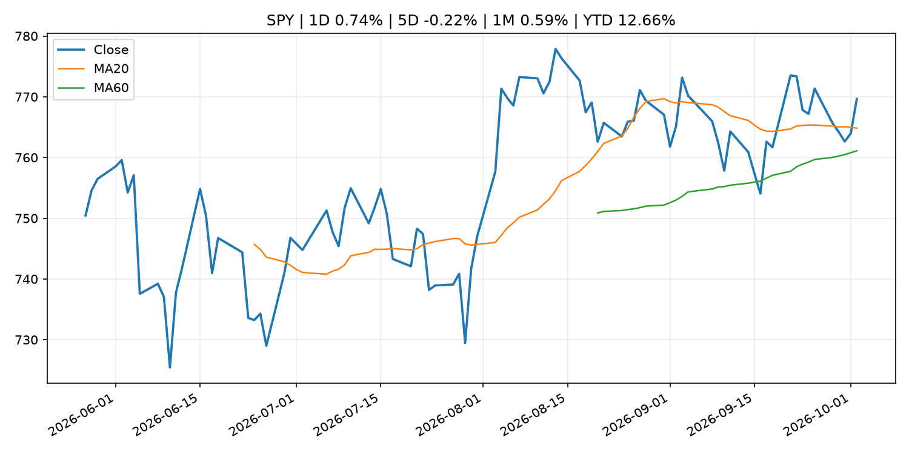
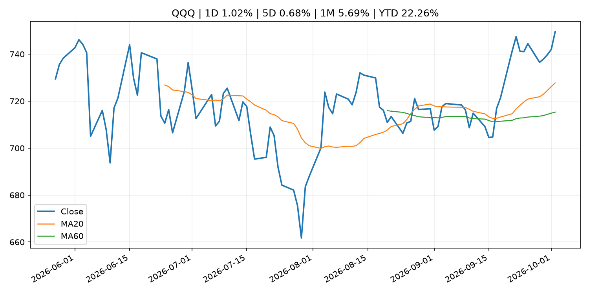
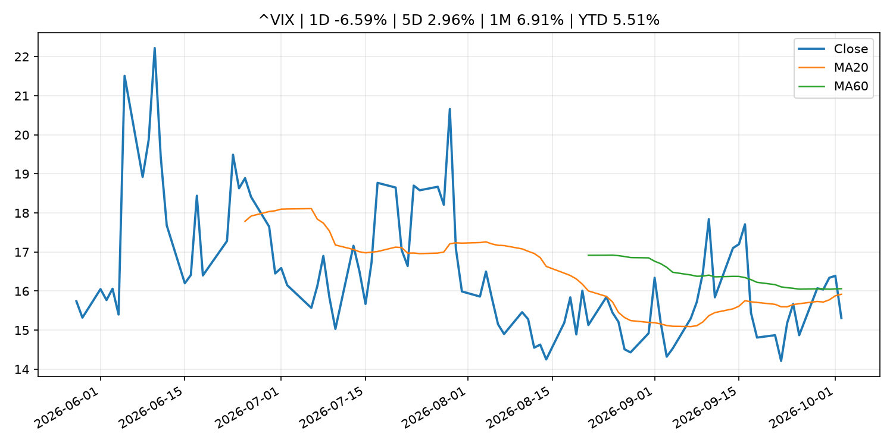
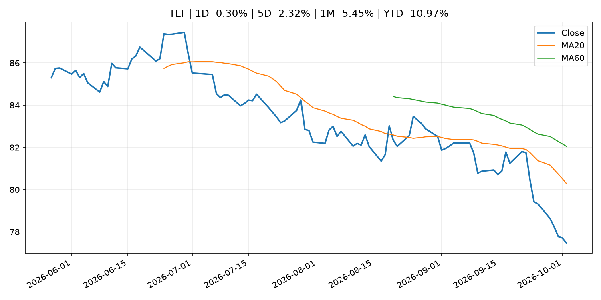
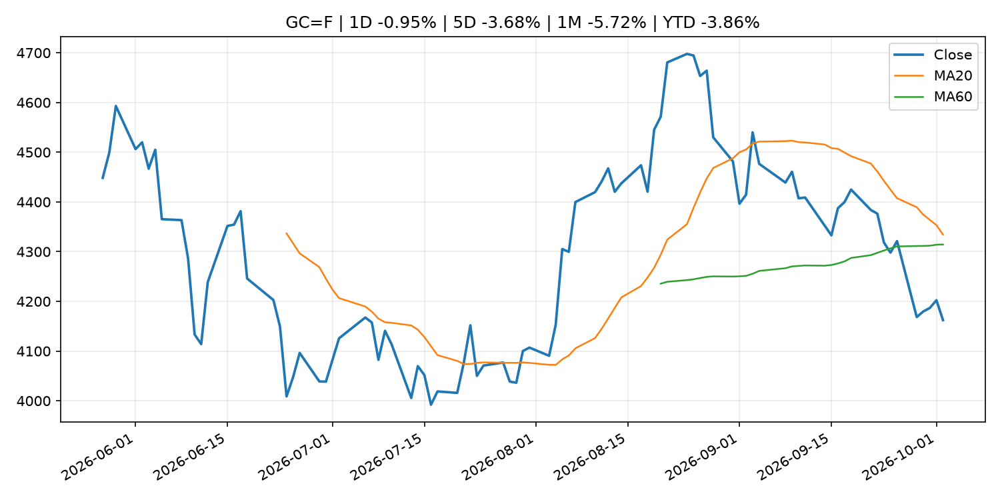
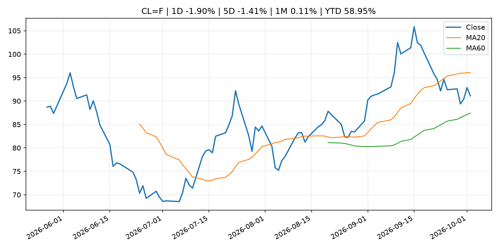
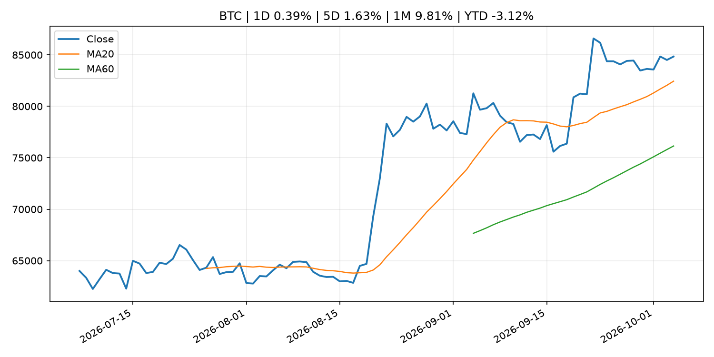
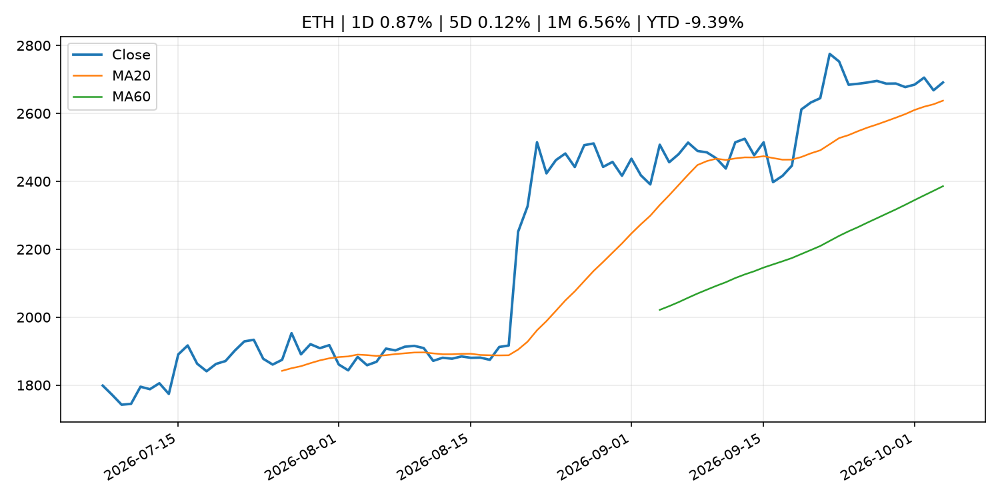
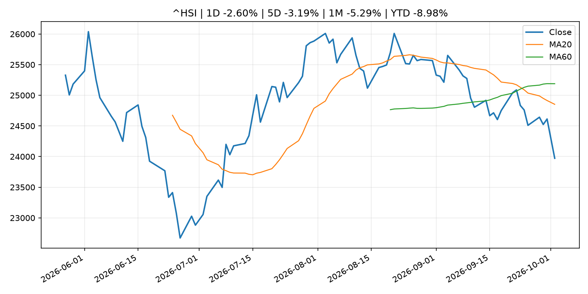

# Global Macro Morning Briefing - 2026-10-04

> Not financial advice / 非投资建议。

## 0. 今日总览
- 市场状态：risk_on。股指上涨、波动率或美元回落，市场更接近风险偏好改善。
- 今日三大主线：
  1. central_bank_decision: Traders now see little chance of a Fed rate hike in October after weak jobs report
  2. macro_data: U.S. added just 29,000 jobs in September, with unemployment rate rising to 4.2%
  3. regulation: Trump’s potential AI czar, Jay Clayton, helped pioneer the SEC’s crypto crackdown
- 一句话结论：今日晨报重点关注：央行决策会重定价利率、汇率、久期资产和风险资产。；这类宏观数据会直接改变市场对通胀、增长和政策路径的预期。。跨资产方面，SPY 1D 0.74%；QQQ 1D 1.02%；^VIX 1D -6.59%；TLT 1D -0.30%；GC=F 1D -0.95%；CL=F 1D -1.90%；BTC 1D 0.39%；ETH 1D 0.87%；股指上涨、波动率或美元回落，市场更接近风险偏好改善。政策、通胀、利率、美元、美债、能源和加密监管仍是主要观察线索。所有结论仅基于公开数据与短摘要整理，不构成投资建议。

## 1. 隔夜跨资产市场
- 美股：SPY 1D 0.74%，QQQ 1D 1.02%，整体趋势需结合 VIX 和利率确认。
- 美债/美元：TLT 1D -0.30%，美元指数 1D -0.17%，是判断折现率压力的核心线索。
- 黄金/原油：黄金 1D -0.95%，原油 1D -1.90%，用于观察避险、通胀和地缘风险。
- 加密：BTC 1D 0.39%，ETH 1D 0.87%，关注是否独立于纳指走出加密自身行情。
- 港股/A股：恒生 1D -2.60%，沪深300/上证 1D n/a，重点看中国政策预期与人民币线索。
- 风险观察：确认风险偏好是否扩散到小盘股、信用利差和周期品。

### US_EQUITY

| symbol | latest close | 1D | 5D | 1M | YTD | trend |
|---|---:|---:|---:|---:|---:|---|
| SPY | 769.64 | 0.74% | -0.22% | 0.59% | 12.66% | uptrend |
| QQQ | 749.58 | 1.02% | 0.68% | 5.69% | 22.26% | strong_uptrend |
| DIA | 511.10 | 0.49% | -1.23% | -3.68% | 5.68% | strong_downtrend |
| IWM | 281.52 | 0.90% | -0.16% | -4.25% | 13.16% | strong_downtrend |
| VTI | 377.99 | 0.75% | -0.47% | 0.29% | 12.39% | uptrend |

### US_MACRO_MARKET

| symbol | latest close | 1D | 5D | 1M | YTD | trend |
|---|---:|---:|---:|---:|---:|---|
| ^VIX | 15.31 | -6.59% | 2.96% | 6.91% | 5.51% | downtrend |
| DX-Y.NYB | 101.93 | -0.17% | 0.95% | 2.38% | 3.57% | uptrend |
| TLT | 77.48 | -0.30% | -2.32% | -5.45% | -10.97% | strong_downtrend |
| IEF | 89.05 | -0.28% | -1.06% | -3.40% | -7.32% | strong_downtrend |

### COMMODITIES

| symbol | latest close | 1D | 5D | 1M | YTD | trend |
|---|---:|---:|---:|---:|---:|---|
| GC=F | 4,162.30 | -0.95% | -3.68% | -5.72% | -3.86% | range_bound |
| SI=F | 59.98 | -1.23% | -6.64% | -7.33% | -14.99% | range_bound |
| CL=F | 91.11 | -1.90% | -1.41% | 0.11% | 58.95% | range_bound |
| BZ=F | 102.25 | -0.06% | -1.98% | 6.92% | 68.31% | range_bound |
| NG=F | 3.04 | 2.29% | -5.04% | 2.67% | -16.11% | uptrend |
| HG=F | 6.49 | 0.15% | -3.04% | -0.14% | 15.11% | range_bound |

### HK_MARKET

| symbol | latest close | 1D | 5D | 1M | YTD | trend |
|---|---:|---:|---:|---:|---:|---|
| ^HSI | 23,972.29 | -2.60% | -3.19% | -5.29% | -8.98% | strong_downtrend |
| 0700.HK | 421.20 | -2.27% | -3.92% | -3.88% | -32.39% | downtrend |
| 9988.HK | 104.40 | -2.06% | -5.09% | -5.00% | -29.93% | strong_downtrend |
| 3690.HK | 70.20 | -2.09% | -2.84% | -10.86% | -32.89% | strong_downtrend |
| 1810.HK | 24.24 | -3.96% | -8.80% | -13.61% | -39.82% | strong_downtrend |
| 1211.HK | 73.90 | -2.25% | -7.04% | -13.31% | -25.16% | strong_downtrend |

### CRYPTO

| symbol | latest close | 1D | 5D | 1M | YTD | trend |
|---|---:|---:|---:|---:|---:|---|
| BTC | 84,839.42 | 0.39% | 1.63% | 9.81% | -3.12% | strong_uptrend |
| ETH | 2,691.03 | 0.87% | 0.12% | 6.56% | -9.39% | strong_uptrend |
| SOLANA | 119.88 | 1.09% | 0.89% | 17.81% | -3.73% | strong_uptrend |
| BINANCECOIN | 786.54 | 2.41% | 2.99% | 8.13% | -8.83% | strong_uptrend |
| RIPPLE | 1.49 | 0.27% | -0.49% | 8.95% | -19.12% | strong_uptrend |

## 2. 今日最重要的 10 条新闻
### 1. Traders now see little chance of a Fed rate hike in October after weak jobs report
- 来源：CNBC Economy
- 时间：2026-10-02T13:29:27+00:00
- 地区：US
- 事件类型：central_bank_decision
- 重要性层级：Tier 1
- 一句话摘要：Odds tumbled after a jobs report showed a soft labor market, leading more traders to lower the the chances of a fed funds rate increase this month.
- 为什么重要：央行决策会重定价利率、汇率、久期资产和风险资产。
- 可能影响：主要影响 QQQ，方向为 negative，强度 high；鹰派政策提高折现率，压制成长股估值。
  - 资产：QQQ
    方向：negative
    强度：high
    原因：鹰派政策提高折现率，压制成长股估值。
  - 资产：SPY
    方向：negative
    强度：medium
    原因：更紧政策通常削弱风险偏好。
  - 资产：TLT
    方向：negative
    强度：high
    原因：利率上行通常压低长债价格。
  - 资产：DXY
    方向：positive
    强度：high
    原因：更高利率预期通常支撑美元。
  - 资产：BTC
    方向：negative
    强度：high
    原因：流动性收紧通常压制高 beta 加密资产。
- 原文链接：[https://www.cnbc.com/2026/10/02/fed-rate-hike-odds-decline-after-september-jobs-report.html](https://www.cnbc.com/2026/10/02/fed-rate-hike-odds-decline-after-september-jobs-report.html)

### 2. U.S. added just 29,000 jobs in September, with unemployment rate rising to 4.2%
- 来源：CoinDesk
- 时间：2026-10-02T12:31:53+00:00
- 地区：global
- 事件类型：macro_data
- 重要性层级：Tier 1
- 一句话摘要：U.S. added just 29,000 jobs in September, with unemployment rate rising to 4.2%
- 为什么重要：这类宏观数据会直接改变市场对通胀、增长和政策路径的预期。
- 可能影响：可能影响利率、汇率、风险资产或大宗商品预期，但当前公开信息不足以判断明确方向。
  - 资产：暂无明确资产映射
  - 方向：unknown
  - 强度：low
  - 原因：公开信息不足以判断方向。
- 原文链接：[https://www.coindesk.com/markets/2026/10/02/u-s-added-just-29-000-jobs-in-september-with-unemployment-rate-rising-to-4-2](https://www.coindesk.com/markets/2026/10/02/u-s-added-just-29-000-jobs-in-september-with-unemployment-rate-rising-to-4-2)

### 3. Trump’s potential AI czar, Jay Clayton, helped pioneer the SEC’s crypto crackdown
- 来源：CoinDesk
- 时间：2026-10-02T17:12:48+00:00
- 地区：global
- 事件类型：regulation
- 重要性层级：Tier 2
- 一句话摘要：Trump’s potential AI czar, Jay Clayton, helped pioneer the SEC’s crypto crackdown
- 为什么重要：监管变化会改变行业盈利预期和资产风险溢价。
- 可能影响：主要影响 BTC，方向为 mixed，强度 high；加密监管或 ETF 进展会改变 BTC 的资金流和风险溢价。
  - 资产：BTC
    方向：mixed
    强度：high
    原因：加密监管或 ETF 进展会改变 BTC 的资金流和风险溢价。
  - 资产：ETH
    方向：mixed
    强度：high
    原因：监管框架会影响 ETH 产品化和机构参与度。
  - 资产：COIN
    方向：mixed
    强度：medium
    原因：监管清晰度和执法风险会影响交易平台估值。
  - 资产：crypto market
    方向：mixed
    强度：high
    原因：信息影响整个加密市场结构，但方向取决于细节。
- 原文链接：[https://www.coindesk.com/news-analysis/2026/10/02/possible-next-crypto-czar-jay-clayton-began-crypto-s-regulation-by-enforcement-at-sec](https://www.coindesk.com/news-analysis/2026/10/02/possible-next-crypto-czar-jay-clayton-began-crypto-s-regulation-by-enforcement-at-sec)

### 4. Federal Reserve Board announces it will extend, until November 4, the comment period on its proposal to modernize Regulation O
- 来源：Federal Reserve Press Releases
- 时间：2026-10-02T20:00:00+00:00
- 地区：US
- 事件类型：regulation
- 重要性层级：Tier 2
- 一句话摘要：Federal Reserve Board announces it will extend, until November 4, the comment period on its proposal to modernize Regulation O
- 为什么重要：监管变化会改变行业盈利预期和资产风险溢价。
- 可能影响：可能影响利率、汇率、风险资产或大宗商品预期，但当前公开信息不足以判断明确方向。
  - 资产：暂无明确资产映射
  - 方向：unknown
  - 强度：low
  - 原因：公开信息不足以判断方向。
- 原文链接：[https://www.federalreserve.gov/newsevents/pressreleases/bcreg20261002a.htm](https://www.federalreserve.gov/newsevents/pressreleases/bcreg20261002a.htm)

### 5. Federal Reserve Board issues enforcement action with Ontario Bancorporation, Inc.
- 来源：Federal Reserve Press Releases
- 时间：2026-10-02T15:00:00+00:00
- 地区：US
- 事件类型：regulation
- 重要性层级：Tier 2
- 一句话摘要：Federal Reserve Board issues enforcement action with Ontario Bancorporation, Inc.
- 为什么重要：监管变化会改变行业盈利预期和资产风险溢价。
- 可能影响：可能影响利率、汇率、风险资产或大宗商品预期，但当前公开信息不足以判断明确方向。
  - 资产：暂无明确资产映射
  - 方向：unknown
  - 强度：low
  - 原因：公开信息不足以判断方向。
- 原文链接：[https://www.federalreserve.gov/newsevents/pressreleases/enforcement20261002a.htm](https://www.federalreserve.gov/newsevents/pressreleases/enforcement20261002a.htm)

### 6. Falling wages, soaring energy prices and inflation: It’s beginning to look a lot like the 1970s
- 来源：MarketWatch Top Stories
- 时间：2026-10-03T23:58:00+00:00
- 地区：US
- 事件类型：other
- 重要性层级：Tier 3
- 一句话摘要：Is it time to dust off the financial playbook from that dismal decade?
- 为什么重要：这条信息暂未匹配到重大宏观、政策或市场事件，更适合作为背景跟踪。
- 可能影响：主要影响 DXY，方向为 positive，强度 high；通胀压力可能推高政策利率预期并支撑美元。
  - 资产：DXY
    方向：positive
    强度：high
    原因：通胀压力可能推高政策利率预期并支撑美元。
  - 资产：TLT
    方向：negative
    强度：high
    原因：通胀上行通常推升收益率、压低长债价格。
  - 资产：QQQ
    方向：negative
    强度：high
    原因：更高利率对成长股估值折现率不利。
  - 资产：SPY
    方向：mixed
    强度：medium
    原因：名义增长可能支撑收入，但更高利率压制估值。
  - 资产：GC=F
    方向：mixed
    强度：medium
    原因：通胀对黄金是支撑，但实际利率上行会形成压力。
  - 资产：BTC
    方向：mixed
    强度：medium
    原因：抗通胀叙事和流动性收紧可能相互抵消。
- 原文链接：[https://www.marketwatch.com/story/falling-wages-soaring-energy-prices-and-inflation-its-beginning-to-look-a-lot-like-the-1970s-d645cbca?mod=mw_rss_topstories](https://www.marketwatch.com/story/falling-wages-soaring-energy-prices-and-inflation-its-beginning-to-look-a-lot-like-the-1970s-d645cbca?mod=mw_rss_topstories)

### 7. Switching jobs to get higher pay works best in these industries
- 来源：MarketWatch Top Stories
- 时间：2026-10-03T16:42:00+00:00
- 地区：US
- 事件类型：other
- 重要性层级：Tier 3
- 一句话摘要：Finding a new job is one way to get a pay increase at a time when inflation has been outpacing wage growth.
- 为什么重要：这条信息暂未匹配到重大宏观、政策或市场事件，更适合作为背景跟踪。
- 可能影响：主要影响 DXY，方向为 positive，强度 high；通胀压力可能推高政策利率预期并支撑美元。
  - 资产：DXY
    方向：positive
    强度：high
    原因：通胀压力可能推高政策利率预期并支撑美元。
  - 资产：TLT
    方向：negative
    强度：high
    原因：通胀上行通常推升收益率、压低长债价格。
  - 资产：QQQ
    方向：negative
    强度：high
    原因：更高利率对成长股估值折现率不利。
  - 资产：SPY
    方向：mixed
    强度：medium
    原因：名义增长可能支撑收入，但更高利率压制估值。
  - 资产：GC=F
    方向：mixed
    强度：medium
    原因：通胀对黄金是支撑，但实际利率上行会形成压力。
  - 资产：BTC
    方向：mixed
    强度：medium
    原因：抗通胀叙事和流动性收紧可能相互抵消。
- 原文链接：[https://www.marketwatch.com/story/the-best-industry-to-change-jobs-to-get-paid-more-money-and-the-worst-ae33a3a7?mod=mw_rss_topstories](https://www.marketwatch.com/story/the-best-industry-to-change-jobs-to-get-paid-more-money-and-the-worst-ae33a3a7?mod=mw_rss_topstories)

## 3. 政策与央行观察
### 1. Traders now see little chance of a Fed rate hike in October after weak jobs report
- 来源：CNBC Economy
- 时间：2026-10-02T13:29:27+00:00
- 地区：US
- 事件类型：central_bank_decision
- 重要性层级：Tier 1
- 一句话摘要：Odds tumbled after a jobs report showed a soft labor market, leading more traders to lower the the chances of a fed funds rate increase this month.
- 为什么重要：央行决策会重定价利率、汇率、久期资产和风险资产。
- 可能影响：主要影响 QQQ，方向为 negative，强度 high；鹰派政策提高折现率，压制成长股估值。
  - 资产：QQQ
    方向：negative
    强度：high
    原因：鹰派政策提高折现率，压制成长股估值。
  - 资产：SPY
    方向：negative
    强度：medium
    原因：更紧政策通常削弱风险偏好。
  - 资产：TLT
    方向：negative
    强度：high
    原因：利率上行通常压低长债价格。
  - 资产：DXY
    方向：positive
    强度：high
    原因：更高利率预期通常支撑美元。
  - 资产：BTC
    方向：negative
    强度：high
    原因：流动性收紧通常压制高 beta 加密资产。
- 原文链接：[https://www.cnbc.com/2026/10/02/fed-rate-hike-odds-decline-after-september-jobs-report.html](https://www.cnbc.com/2026/10/02/fed-rate-hike-odds-decline-after-september-jobs-report.html)

### 2. Trump’s potential AI czar, Jay Clayton, helped pioneer the SEC’s crypto crackdown
- 来源：CoinDesk
- 时间：2026-10-02T17:12:48+00:00
- 地区：global
- 事件类型：regulation
- 重要性层级：Tier 2
- 一句话摘要：Trump’s potential AI czar, Jay Clayton, helped pioneer the SEC’s crypto crackdown
- 为什么重要：监管变化会改变行业盈利预期和资产风险溢价。
- 可能影响：主要影响 BTC，方向为 mixed，强度 high；加密监管或 ETF 进展会改变 BTC 的资金流和风险溢价。
  - 资产：BTC
    方向：mixed
    强度：high
    原因：加密监管或 ETF 进展会改变 BTC 的资金流和风险溢价。
  - 资产：ETH
    方向：mixed
    强度：high
    原因：监管框架会影响 ETH 产品化和机构参与度。
  - 资产：COIN
    方向：mixed
    强度：medium
    原因：监管清晰度和执法风险会影响交易平台估值。
  - 资产：crypto market
    方向：mixed
    强度：high
    原因：信息影响整个加密市场结构，但方向取决于细节。
- 原文链接：[https://www.coindesk.com/news-analysis/2026/10/02/possible-next-crypto-czar-jay-clayton-began-crypto-s-regulation-by-enforcement-at-sec](https://www.coindesk.com/news-analysis/2026/10/02/possible-next-crypto-czar-jay-clayton-began-crypto-s-regulation-by-enforcement-at-sec)

### 3. Federal Reserve Board announces it will extend, until November 4, the comment period on its proposal to modernize Regulation O
- 来源：Federal Reserve Press Releases
- 时间：2026-10-02T20:00:00+00:00
- 地区：US
- 事件类型：regulation
- 重要性层级：Tier 2
- 一句话摘要：Federal Reserve Board announces it will extend, until November 4, the comment period on its proposal to modernize Regulation O
- 为什么重要：监管变化会改变行业盈利预期和资产风险溢价。
- 可能影响：可能影响利率、汇率、风险资产或大宗商品预期，但当前公开信息不足以判断明确方向。
  - 资产：暂无明确资产映射
  - 方向：unknown
  - 强度：low
  - 原因：公开信息不足以判断方向。
- 原文链接：[https://www.federalreserve.gov/newsevents/pressreleases/bcreg20261002a.htm](https://www.federalreserve.gov/newsevents/pressreleases/bcreg20261002a.htm)

### 4. Federal Reserve Board issues enforcement action with Ontario Bancorporation, Inc.
- 来源：Federal Reserve Press Releases
- 时间：2026-10-02T15:00:00+00:00
- 地区：US
- 事件类型：regulation
- 重要性层级：Tier 2
- 一句话摘要：Federal Reserve Board issues enforcement action with Ontario Bancorporation, Inc.
- 为什么重要：监管变化会改变行业盈利预期和资产风险溢价。
- 可能影响：可能影响利率、汇率、风险资产或大宗商品预期，但当前公开信息不足以判断明确方向。
  - 资产：暂无明确资产映射
  - 方向：unknown
  - 强度：low
  - 原因：公开信息不足以判断方向。
- 原文链接：[https://www.federalreserve.gov/newsevents/pressreleases/enforcement20261002a.htm](https://www.federalreserve.gov/newsevents/pressreleases/enforcement20261002a.htm)

## 4. 市场异动与图表
- SPY 上涨 0.74%
- QQQ 上涨 1.02%
- VIX 下跌 -6.59%
- Gold 下跌 -0.95%
- Oil 下跌 -1.90%

### SPY

### QQQ

### ^VIX

### TLT

### GC=F

### CL=F

### BTC

### ETH

### ^HSI

## 5. 华尔街与机构公开观点
- 暂无可靠公开观点。

## 6. 今日重点关注
- 经济数据：经济数据：暂无可靠公开日历数据；如配置经济日历源后可自动填充。
- 央行讲话：央行讲话：暂无可靠公开日历数据；重点跟踪 Fed、ECB、BoJ、PBOC 官网 RSS。
- 财报：财报：暂无可靠数据。
- 政策事件：政策事件：暂无可靠数据。
- 风险提醒：风险提醒：关注数据源失败项、突发地缘风险、利率和美元的二阶反应。

## 7. 英文金融表达与宏观概念
- **inflation expectations**：通胀预期，指家庭、企业或市场对未来通胀的预估。 例句：Inflation expectations can shape wage bargaining and bond yields.
- **real yield**：实际收益率，名义利率扣除通胀预期后的收益率。 例句：Gold often reacts more to real yields than nominal yields.
- **terminal rate**：终端利率，市场预期本轮加息周期的最高政策利率。 例句：A higher terminal rate can pressure growth stocks.
- **soft landing**：软着陆，指通胀回落而经济避免明显衰退。 例句：Markets often rally when data support a soft landing.
- **market structure**：市场结构，指交易、托管、清算、ETF、监管等制度安排。 例句：Crypto market structure rules can affect institutional participation.
- **risk-off**：避险模式，资金偏向美元、国债、黄金等防御资产。 例句：A geopolitical shock can push markets into risk-off mode.

## 8. 背景材料
- [The government can take 15% of Social Security benefits to repay student loans. These proposals seek to stop it.](https://www.marketwatch.com/story/the-government-can-take-15-of-social-security-benefits-to-repay-student-loans-these-proposals-seek-to-stop-it-102622fa?mod=mw_rss_topstories)（MarketWatch Top Stories，other）：Debt among older Americans is rising, both in terms of the number of older households carrying debt and the amount borrowed.
- [Falling wages, soaring energy prices and inflation: It’s beginning to look a lot like the 1970s](https://www.marketwatch.com/story/falling-wages-soaring-energy-prices-and-inflation-its-beginning-to-look-a-lot-like-the-1970s-d645cbca?mod=mw_rss_topstories)（MarketWatch Top Stories，other）：Is it time to dust off the financial playbook from that dismal decade?
- [‘I don’t want to die on the sales floor’: I’m 67 and earn $19.50 an hour at a big-box store. When can I finally retire?](https://www.marketwatch.com/story/i-dont-want-to-die-on-the-sales-floor-im-67-and-earn-19-50-an-hour-at-a-big-box-store-when-can-i-finally-retire-369abcf9?mod=mw_rss_topstories)（MarketWatch Top Stories，other）：“I started taking Social Security at 66 and receive $2,410 a month. I have $214,000 in my 401(k).”
- [These bond strategies can help you get a safe 5% return on your cash](https://www.marketwatch.com/story/these-bond-strategies-can-help-you-get-a-safe-5-return-on-your-cash-5fa45ccd?mod=mw_rss_topstories)（MarketWatch Top Stories，other）：With U.S. Treasury yields on the rise, financial planners say they’re seeing a growing interest in bonds, especially among investors looking to secure fixed income in retirement.
- [Switching jobs to get higher pay works best in these industries](https://www.marketwatch.com/story/the-best-industry-to-change-jobs-to-get-paid-more-money-and-the-worst-ae33a3a7?mod=mw_rss_topstories)（MarketWatch Top Stories，other）：Finding a new job is one way to get a pay increase at a time when inflation has been outpacing wage growth.
- [Federal Reserve Board announces approval of application by Fleur Capital Corporation](https://www.federalreserve.gov/newsevents/pressreleases/orders20261002a.htm)（Federal Reserve Press Releases，other）：Federal Reserve Board announces approval of application by Fleur Capital Corporation
- [Decisions taken by the Governing Council of the ECB (in addition to decisions setting interest rates)](https://www.ecb.europa.eu//press/govcdec/otherdec/2026/html/ecb.gc261002~54c6b5672b.en.html)（ECB Press Releases，other）：Decisions taken by the Governing Council of the ECB (in addition to decisions setting interest rates)
- [Boris Vujčić: Resilience, integration and competitiveness: building the future of European banking](https://www.ecb.europa.eu//press/key/date/2026/html/ecb.sp261002_1~419efe18e0.en.html)（ECB Press Releases，other）：Boris Vujčić: Resilience, integration and competitiveness: building the future of European banking
- [Live updates: Bitcoin reverses big early gains following soft U.S. jobs data](https://www.coindesk.com/tech/2026/10/02/live-updates-bitcoin-gold-and-tech-futures-edge-higher-as-markets-await-u-s-jobs-report)（CoinDesk，other）：Live updates: Bitcoin reverses big early gains following soft U.S. jobs data
- [Crypto traders are in risk-on mode as bitcoin dominance nears return to 60%](https://www.coindesk.com/markets/2026/10/02/crypto-traders-are-in-risk-on-mode-as-bitcoin-dominance-nears-return-to-60)（CoinDesk，other）：Crypto traders are in risk-on mode as bitcoin dominance nears return to 60%
- [Bitcoin open interest jumps $2.3 billion as traders pay more for bullish positions](https://www.coindesk.com/markets/2026/10/02/why-rising-perpetual-funding-rates-signal-growing-bullish-leverage-as-bitcoin-crosses-usd86-500)（CoinDesk，other）：Bitcoin open interest jumps $2.3 billion as traders pay more for bullish positions
- [Tether's USDT is 'coming home' to Bitcoin after more than a decade](https://www.coindesk.com/tech/2026/09/29/tether-s-usdt-is-coming-home-to-bitcoin-this-month-after-more-than-a-decade)（CoinDesk，other）：Tether's USDT is 'coming home' to Bitcoin after more than a decade
- [Bitcoin tops $86,000 ahead of U.S. jobs report](https://www.coindesk.com/markets/2026/10/02/bitcoin-tops-usd86-000-ahead-of-u-s-jobs-report)（CoinDesk，other）：Bitcoin tops $86,000 ahead of U.S. jobs report
- [Japanese Government Bonds Held by the Bank of Japan](http://www.boj.or.jp/en/statistics/boj/other/mei/release/2026/mei260930.xlsx)（Bank of Japan Announcements，other）：Japanese Government Bonds Held by the Bank of Japan
- [Collateral Accepted by the Bank of Japan (End of Sept.)](http://www.boj.or.jp/en/statistics/boj/other/col/col2609.xlsx)（Bank of Japan Announcements，other）：Collateral Accepted by the Bank of Japan (End of Sept.)

## 9. 数据源、失败项与免责声明
- 采集时间：2026-10-04T00:23:22
- 数据源：公开 RSS、Yahoo Finance、CoinGecko、AKShare、FRED、SEC data.sec.gov，以及用户自有 inputs/reports 文件。
- 合规说明：不绕过 WSJ、Bloomberg、FT、Reuters 等付费墙；对付费媒体只使用公开 RSS 标题、摘要、链接和发布时间。
- 免责声明：Not financial advice / 非投资建议。本项目仅供个人学习、研究和信息整理，不构成投资建议、交易建议或任何收益承诺。
- 失败或跳过的数据源：
  - crypto data failed coin=dogecoin
  - China market data failed symbol=上证指数: empty dataframe
  - China market data failed symbol=深证成指: empty dataframe
  - China market data failed symbol=创业板指: empty dataframe
  - China market data failed symbol=沪深300: empty dataframe
  - China market data failed symbol=中证500: empty dataframe
  - China market data failed symbol=科创50: empty dataframe
  - FRED_API_KEY not set; skipping FRED macro series
  - SEC failed cik=0000320193
  - SEC failed cik=0000789019
  - SEC failed cik=0001045810
  - SEC failed cik=0001318605
  - SEC failed cik=0001577552
