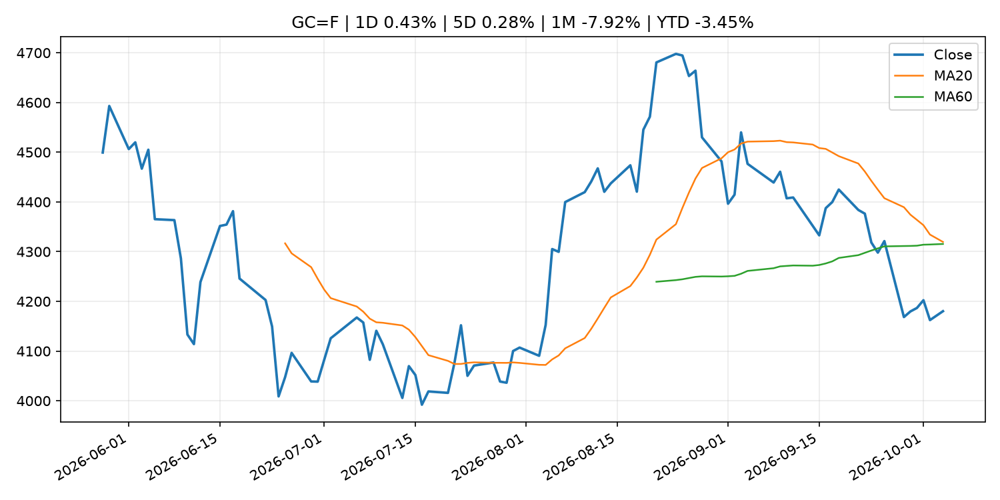
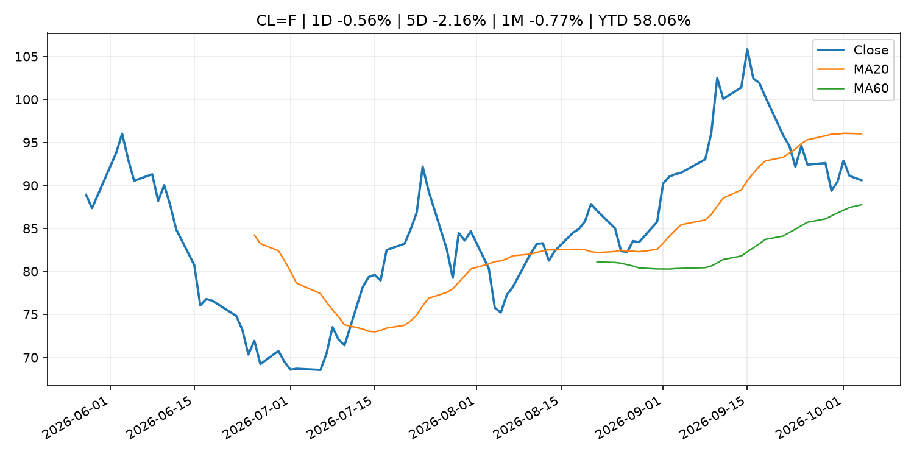
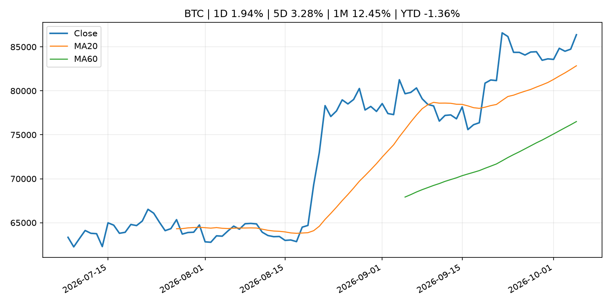
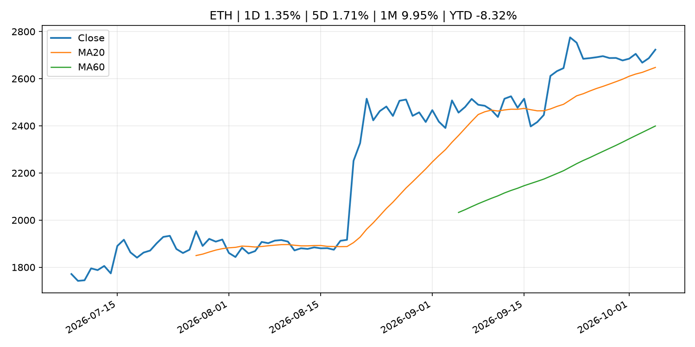

# Global Macro Morning Briefing - 2026-10-05

> Not financial advice / 非投资建议。

## 0. 今日总览
- 市场状态：risk_on。股指上涨、波动率或美元回落，市场更接近风险偏好改善。
- 今日三大主线：
  1. central_bank_speech: Opening Remarks by Deputy Governor UCHIDA at the ECONDAT 2026 Fall Meeting (AI, Big Data, and Monetary Policy)
  2. earnings: Corporate America has never been this upbeat about future profits
- 一句话结论：今日晨报重点关注：央行官员表态可能影响市场对下一次会议的定价。；大型科技股盈利和资本开支会影响纳指、半导体和 AI 交易主线。。跨资产方面，SPY 1D 0.74%；QQQ 1D 1.02%；^VIX 1D -6.59%；TLT 1D -0.30%；GC=F 1D 0.43%；CL=F 1D -0.56%；BTC 1D 1.94%；ETH 1D 1.35%；股指上涨、波动率或美元回落，市场更接近风险偏好改善。政策、通胀、利率、美元、美债、能源和加密监管仍是主要观察线索。所有结论仅基于公开数据与短摘要整理，不构成投资建议。

## 1. 隔夜跨资产市场
- 美股：SPY 1D 0.74%，QQQ 1D 1.02%，整体趋势需结合 VIX 和利率确认。
- 美债/美元：TLT 1D -0.30%，美元指数 1D 0.00%，是判断折现率压力的核心线索。
- 黄金/原油：黄金 1D 0.43%，原油 1D -0.56%，用于观察避险、通胀和地缘风险。
- 加密：BTC 1D 1.94%，ETH 1D 1.35%，关注是否独立于纳指走出加密自身行情。
- 港股/A股：恒生 1D -2.60%，沪深300/上证 1D n/a，重点看中国政策预期与人民币线索。
- 风险观察：确认风险偏好是否扩散到小盘股、信用利差和周期品。

### US_EQUITY

| symbol | latest close | 1D | 5D | 1M | YTD | trend |
|---|---:|---:|---:|---:|---:|---|
| SPY | 769.64 | 0.74% | -0.22% | 0.59% | 12.66% | uptrend |
| QQQ | 749.58 | 1.02% | 0.68% | 5.69% | 22.26% | strong_uptrend |
| DIA | 511.10 | 0.49% | -1.23% | -3.68% | 5.68% | strong_downtrend |
| IWM | 281.52 | 0.90% | -0.16% | -4.25% | 13.16% | strong_downtrend |
| VTI | 377.99 | 0.75% | -0.47% | 0.29% | 12.39% | uptrend |

### US_MACRO_MARKET

| symbol | latest close | 1D | 5D | 1M | YTD | trend |
|---|---:|---:|---:|---:|---:|---|
| ^VIX | 15.31 | -6.59% | 2.96% | 6.91% | 5.51% | downtrend |
| DX-Y.NYB | 101.93 | 0.00% | 0.73% | 2.96% | 3.57% | uptrend |
| TLT | 77.48 | -0.30% | -2.32% | -5.45% | -10.97% | strong_downtrend |
| IEF | 89.05 | -0.28% | -1.06% | -3.40% | -7.32% | strong_downtrend |

### COMMODITIES

| symbol | latest close | 1D | 5D | 1M | YTD | trend |
|---|---:|---:|---:|---:|---:|---|
| GC=F | 4,180.20 | 0.43% | 0.28% | -7.92% | -3.45% | range_bound |
| SI=F | 61.27 | 2.16% | 0.08% | -8.52% | -13.16% | range_bound |
| CL=F | 90.60 | -0.56% | -2.16% | -0.77% | 58.06% | range_bound |
| BZ=F | 102.01 | -0.23% | -3.11% | 6.79% | 67.92% | range_bound |
| NG=F | 3.03 | -0.33% | 0.83% | 3.84% | -16.39% | strong_uptrend |
| HG=F | 6.59 | 1.52% | 0.37% | 0.21% | 16.85% | uptrend |

### HK_MARKET

| symbol | latest close | 1D | 5D | 1M | YTD | trend |
|---|---:|---:|---:|---:|---:|---|
| ^HSI | 23,972.29 | -2.60% | -3.19% | -5.29% | -8.98% | strong_downtrend |
| 0700.HK | 421.20 | -2.27% | -3.92% | -3.88% | -32.39% | downtrend |
| 9988.HK | 104.40 | -2.06% | -5.09% | -5.00% | -29.93% | strong_downtrend |
| 3690.HK | 70.20 | -2.09% | -2.84% | -10.86% | -32.89% | strong_downtrend |
| 1810.HK | 24.24 | -3.96% | -8.80% | -13.61% | -39.82% | strong_downtrend |
| 1211.HK | 73.90 | -2.25% | -7.04% | -13.31% | -25.16% | strong_downtrend |

### CRYPTO

| symbol | latest close | 1D | 5D | 1M | YTD | trend |
|---|---:|---:|---:|---:|---:|---|
| BTC | 86,385.78 | 1.94% | 3.28% | 12.45% | -1.36% | strong_uptrend |
| ETH | 2,723.07 | 1.35% | 1.71% | 9.95% | -8.32% | strong_uptrend |
| SOLANA | 121.19 | 1.33% | 1.76% | 22.01% | -2.68% | strong_uptrend |
| BINANCECOIN | 794.43 | 0.97% | 4.74% | 10.91% | -7.91% | strong_uptrend |
| RIPPLE | 1.52 | 2.03% | 1.76% | 13.02% | -17.61% | strong_uptrend |

## 2. 今日最重要的 10 条新闻
### 1. Opening Remarks by Deputy Governor UCHIDA at the ECONDAT 2026 Fall Meeting (AI, Big Data, and Monetary Policy)
- 来源：Bank of Japan Announcements
- 时间：2026-10-05T09:20:00+09:00
- 地区：Japan
- 事件类型：central_bank_speech
- 重要性层级：Tier 2
- 一句话摘要：Opening Remarks by Deputy Governor UCHIDA at the ECONDAT 2026 Fall Meeting (AI, Big Data, and Monetary Policy)
- 为什么重要：央行官员表态可能影响市场对下一次会议的定价。
- 可能影响：可能影响利率、汇率、风险资产或大宗商品预期，但当前公开信息不足以判断明确方向。
  - 资产：暂无明确资产映射
  - 方向：unknown
  - 强度：low
  - 原因：公开信息不足以判断方向。
- 原文链接：[http://www.boj.or.jp/en/about/press/koen_2026/ko261005a.htm](http://www.boj.or.jp/en/about/press/koen_2026/ko261005a.htm)

### 2. Corporate America has never been this upbeat about future profits
- 来源：MarketWatch Top Stories
- 时间：2026-10-04T14:00:00+00:00
- 地区：US
- 事件类型：earnings
- 重要性层级：Tier 2
- 一句话摘要：As third-quarter earnings kick off this week, more companies than ever have expressed optimism about their bottom lines.
- 为什么重要：大型科技股盈利和资本开支会影响纳指、半导体和 AI 交易主线。
- 可能影响：可能影响利率、汇率、风险资产或大宗商品预期，但当前公开信息不足以判断明确方向。
  - 资产：暂无明确资产映射
  - 方向：unknown
  - 强度：low
  - 原因：公开信息不足以判断方向。
- 原文链接：[https://www.marketwatch.com/story/corporate-america-has-never-been-this-upbeat-about-future-profits-fbaf8cd9?mod=mw_rss_topstories](https://www.marketwatch.com/story/corporate-america-has-never-been-this-upbeat-about-future-profits-fbaf8cd9?mod=mw_rss_topstories)

### 3. Falling wages, soaring energy prices and inflation: It’s beginning to look a lot like the 1970s
- 来源：MarketWatch Top Stories
- 时间：2026-10-03T23:58:00+00:00
- 地区：US
- 事件类型：other
- 重要性层级：Tier 3
- 一句话摘要：Is it time to dust off the financial playbook from that dismal decade?
- 为什么重要：这条信息暂未匹配到重大宏观、政策或市场事件，更适合作为背景跟踪。
- 可能影响：主要影响 DXY，方向为 positive，强度 high；通胀压力可能推高政策利率预期并支撑美元。
  - 资产：DXY
    方向：positive
    强度：high
    原因：通胀压力可能推高政策利率预期并支撑美元。
  - 资产：TLT
    方向：negative
    强度：high
    原因：通胀上行通常推升收益率、压低长债价格。
  - 资产：QQQ
    方向：negative
    强度：high
    原因：更高利率对成长股估值折现率不利。
  - 资产：SPY
    方向：mixed
    强度：medium
    原因：名义增长可能支撑收入，但更高利率压制估值。
  - 资产：GC=F
    方向：mixed
    强度：medium
    原因：通胀对黄金是支撑，但实际利率上行会形成压力。
  - 资产：BTC
    方向：mixed
    强度：medium
    原因：抗通胀叙事和流动性收紧可能相互抵消。
- 原文链接：[https://www.marketwatch.com/story/falling-wages-soaring-energy-prices-and-inflation-its-beginning-to-look-a-lot-like-the-1970s-d645cbca?mod=mw_rss_topstories](https://www.marketwatch.com/story/falling-wages-soaring-energy-prices-and-inflation-its-beginning-to-look-a-lot-like-the-1970s-d645cbca?mod=mw_rss_topstories)

### 4. 8th Conference on Nontraditional Data, Machine Learning, and Natural Language Processing in Macroeconomics (ECONDAT 2026 Fall Meeting)
- 来源：Bank of Japan Announcements
- 时间：2026-10-05T09:20:00+09:00
- 地区：Japan
- 事件类型：other
- 重要性层级：Tier 3
- 一句话摘要：8th Conference on Nontraditional Data, Machine Learning, and Natural Language Processing in Macroeconomics (ECONDAT 2026 Fall Meeting)
- 为什么重要：这条信息暂未匹配到重大宏观、政策或市场事件，更适合作为背景跟踪。
- 可能影响：更偏背景信息，短期市场影响可能有限。
  - 资产：暂无明确资产映射
  - 方向：unknown
  - 强度：low
  - 原因：公开信息不足以判断方向。
- 原文链接：[http://www.boj.or.jp/en/research/conf/conf2610a.htm](http://www.boj.or.jp/en/research/conf/conf2610a.htm)

## 3. 政策与央行观察
### 1. Opening Remarks by Deputy Governor UCHIDA at the ECONDAT 2026 Fall Meeting (AI, Big Data, and Monetary Policy)
- 来源：Bank of Japan Announcements
- 时间：2026-10-05T09:20:00+09:00
- 地区：Japan
- 事件类型：central_bank_speech
- 重要性层级：Tier 2
- 一句话摘要：Opening Remarks by Deputy Governor UCHIDA at the ECONDAT 2026 Fall Meeting (AI, Big Data, and Monetary Policy)
- 为什么重要：央行官员表态可能影响市场对下一次会议的定价。
- 可能影响：可能影响利率、汇率、风险资产或大宗商品预期，但当前公开信息不足以判断明确方向。
  - 资产：暂无明确资产映射
  - 方向：unknown
  - 强度：low
  - 原因：公开信息不足以判断方向。
- 原文链接：[http://www.boj.or.jp/en/about/press/koen_2026/ko261005a.htm](http://www.boj.or.jp/en/about/press/koen_2026/ko261005a.htm)

## 4. 市场异动与图表
- SPY 上涨 0.74%
- QQQ 上涨 1.02%
- VIX 下跌 -6.59%

### SPY

### QQQ

### ^VIX

### TLT

### GC=F

### CL=F

### BTC

### ETH

### ^HSI

## 5. 华尔街与机构公开观点
- 暂无可靠公开观点。

## 6. 今日重点关注
- 经济数据：经济数据：暂无可靠公开日历数据；如配置经济日历源后可自动填充。
- 央行讲话：央行讲话：暂无可靠公开日历数据；重点跟踪 Fed、ECB、BoJ、PBOC 官网 RSS。
- 财报：财报：暂无可靠数据。
- 政策事件：政策事件：暂无可靠数据。
- 风险提醒：风险提醒：关注数据源失败项、突发地缘风险、利率和美元的二阶反应。

## 7. 英文金融表达与宏观概念
- **inflation expectations**：通胀预期，指家庭、企业或市场对未来通胀的预估。 例句：Inflation expectations can shape wage bargaining and bond yields.
- **real yield**：实际收益率，名义利率扣除通胀预期后的收益率。 例句：Gold often reacts more to real yields than nominal yields.
- **terminal rate**：终端利率，市场预期本轮加息周期的最高政策利率。 例句：A higher terminal rate can pressure growth stocks.
- **soft landing**：软着陆，指通胀回落而经济避免明显衰退。 例句：Markets often rally when data support a soft landing.
- **risk-off**：避险模式，资金偏向美元、国债、黄金等防御资产。 例句：A geopolitical shock can push markets into risk-off mode.
- **supply disruption**：供给扰动，通常指能源或商品供应受冲突、减产或天气影响。 例句：Supply disruption can lift oil prices and inflation expectations.

## 8. 背景材料
- [8th Conference on Nontraditional Data, Machine Learning, and Natural Language Processing in Macroeconomics (ECONDAT 2026 Fall Meeting)](http://www.boj.or.jp/en/research/conf/conf2610a.htm)（Bank of Japan Announcements，other）：8th Conference on Nontraditional Data, Machine Learning, and Natural Language Processing in Macroeconomics (ECONDAT 2026 Fall Meeting)
- [Sources of Changes in Current Account Balances (Projections for Oct.)](http://www.boj.or.jp/en/statistics/boj/fm/juqp/juqp2610.xlsx)（Bank of Japan Announcements，other）：Sources of Changes in Current Account Balances (Projections for Oct.)
- [‘I don’t want to die on the sales floor’: I’m 67 and earn $19.50 an hour at a big-box store. When can I finally retire?](https://www.marketwatch.com/story/i-dont-want-to-die-on-the-sales-floor-im-67-and-earn-19-50-an-hour-at-a-big-box-store-when-can-i-finally-retire-369abcf9?mod=mw_rss_topstories)（MarketWatch Top Stories，other）：“I started taking Social Security at 66 and receive $2,410 a month. I have $214,000 in my 401(k).”
- [Fed minutes coming this week could give markets important clues about future rate hikes](https://www.marketwatch.com/story/fed-minutes-coming-this-week-could-give-markets-important-clues-about-future-rate-hikes-31bfba5b?mod=mw_rss_topstories)（MarketWatch Top Stories，other）：Minutes from the September meeting may provide extra context, as the real fed-funds rate is now surprisingly low.
- [The government can take 15% of Social Security benefits to repay student loans. These proposals seek to stop it.](https://www.marketwatch.com/story/the-government-can-take-15-of-social-security-benefits-to-repay-student-loans-these-proposals-seek-to-stop-it-102622fa?mod=mw_rss_topstories)（MarketWatch Top Stories，other）：Debt among older Americans is rising, both in terms of the number of older households carrying debt and the amount borrowed.
- [Falling wages, soaring energy prices and inflation: It’s beginning to look a lot like the 1970s](https://www.marketwatch.com/story/falling-wages-soaring-energy-prices-and-inflation-its-beginning-to-look-a-lot-like-the-1970s-d645cbca?mod=mw_rss_topstories)（MarketWatch Top Stories，other）：Is it time to dust off the financial playbook from that dismal decade?
- [These bond strategies can help you get a safe 5% return on your cash](https://www.marketwatch.com/story/these-bond-strategies-can-help-you-get-a-safe-5-return-on-your-cash-5fa45ccd?mod=mw_rss_topstories)（MarketWatch Top Stories，other）：With U.S. Treasury yields on the rise, financial planners say they’re seeing a growing interest in bonds, especially among investors looking to secure fixed income in retirement.

## 9. 数据源、失败项与免责声明
- 采集时间：2026-10-05T00:27:20
- 数据源：公开 RSS、Yahoo Finance、CoinGecko、AKShare、FRED、SEC data.sec.gov，以及用户自有 inputs/reports 文件。
- 合规说明：不绕过 WSJ、Bloomberg、FT、Reuters 等付费墙；对付费媒体只使用公开 RSS 标题、摘要、链接和发布时间。
- 免责声明：Not financial advice / 非投资建议。本项目仅供个人学习、研究和信息整理，不构成投资建议、交易建议或任何收益承诺。
- 失败或跳过的数据源：
  - crypto data failed coin=dogecoin
  - China market data failed symbol=上证指数: empty dataframe
  - China market data failed symbol=深证成指: empty dataframe
  - China market data failed symbol=创业板指: empty dataframe
  - China market data failed symbol=沪深300: empty dataframe
  - China market data failed symbol=中证500: empty dataframe
  - China market data failed symbol=科创50: empty dataframe
  - FRED_API_KEY not set; skipping FRED macro series
  - SEC failed cik=0000320193
  - SEC failed cik=0000789019
  - SEC failed cik=0001045810
  - SEC failed cik=0001318605
  - SEC failed cik=0001577552
