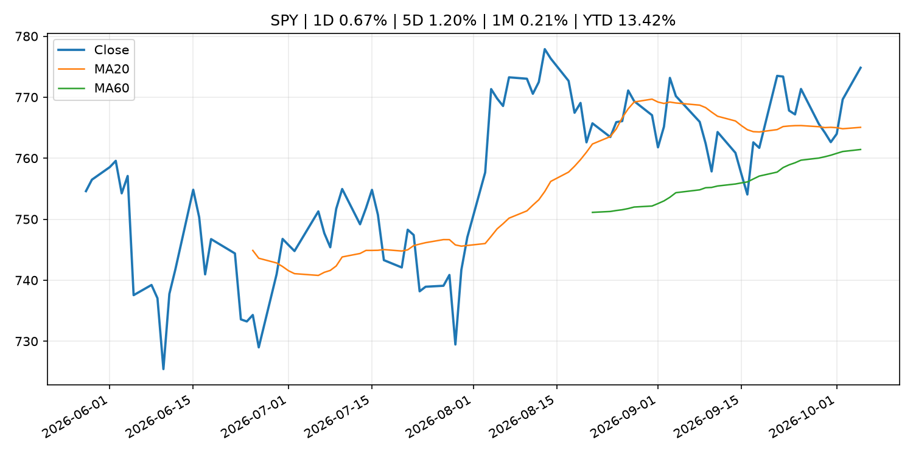
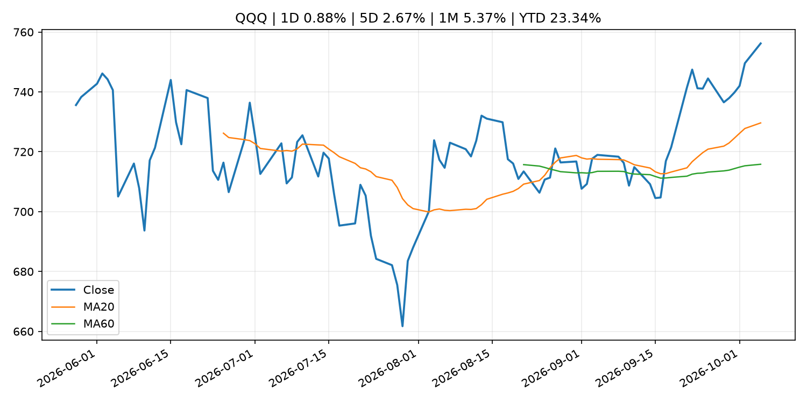
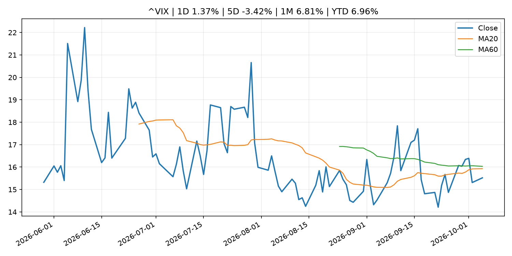
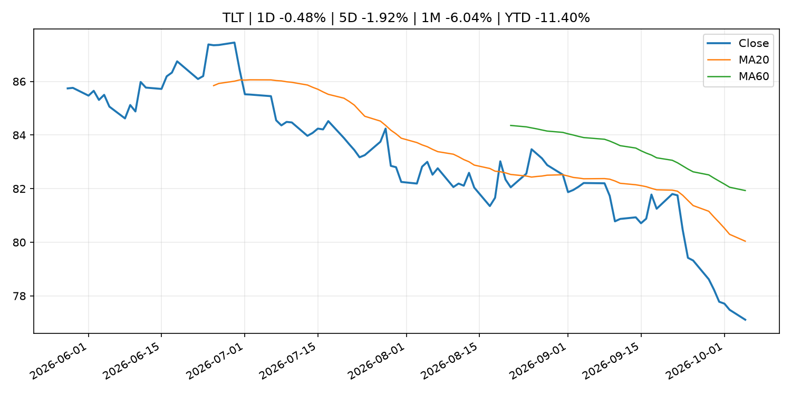
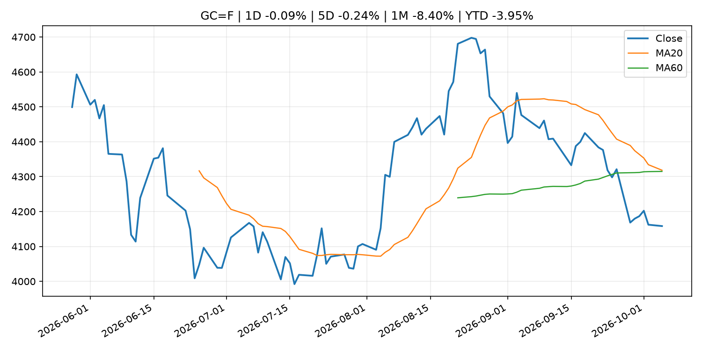
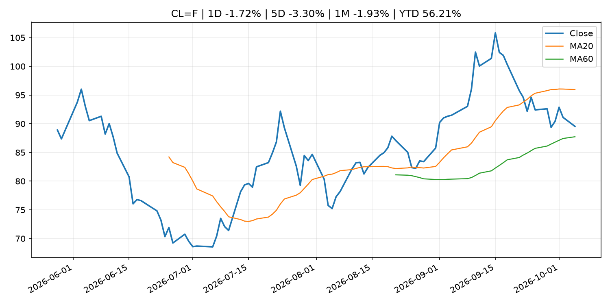
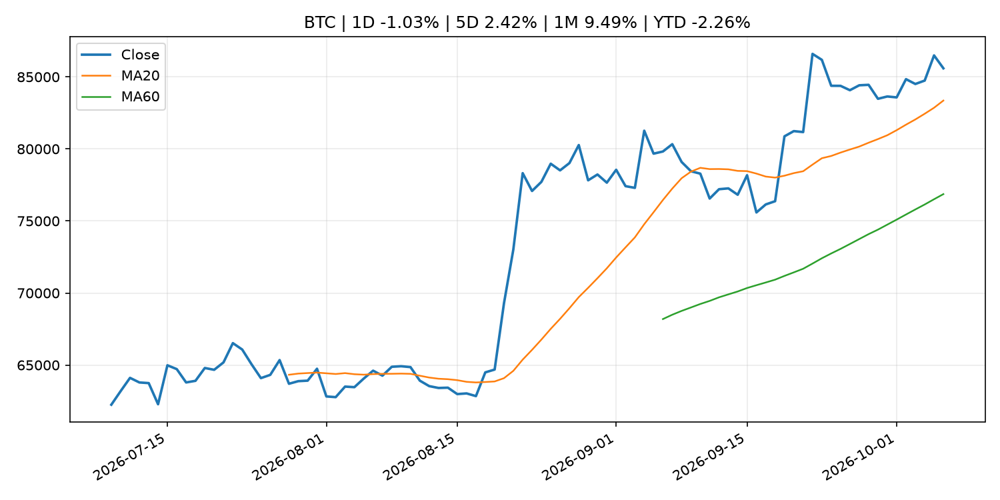
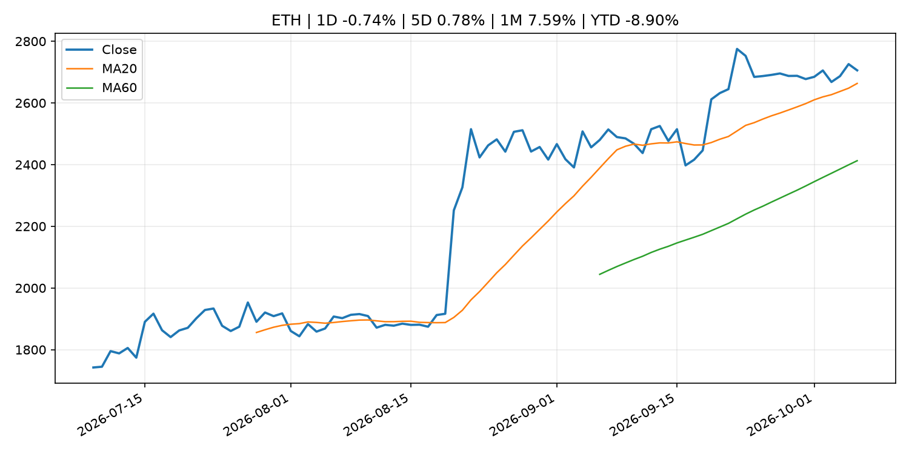
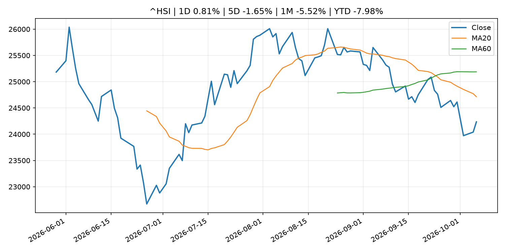

# Global Macro Morning Briefing - 2026-10-06

> Not financial advice / 非投资建议。

## 0. 今日总览
- 市场状态：unknown。市场信号不足，暂不判断明确状态。
- 今日三大主线：
  1. financial_stability: Ether's bitcoin-beating Q3 rally came with a catch. Liquidity thinned.
  2. regulation: SEC Coordinates with Global Financial Regulators to Raise Fraud Awareness During World Investor Week
  3. regulation: U.S. CFTC joins SEC in proposing crypto regulations, though spot-market gap lingers
- 一句话结论：今日晨报重点关注：金融稳定信号可能放大跨资产波动，并影响央行反应函数。；监管变化会改变行业盈利预期和资产风险溢价。。跨资产方面，SPY 1D 0.67%；QQQ 1D 0.88%；^VIX 1D 1.37%；TLT 1D -0.48%；GC=F 1D -0.09%；CL=F 1D -1.72%；BTC 1D -1.03%；ETH 1D -0.74%；市场信号不足，暂不判断明确状态。政策、通胀、利率、美元、美债、能源和加密监管仍是主要观察线索。所有结论仅基于公开数据与短摘要整理，不构成投资建议。

## 1. 隔夜跨资产市场
- 美股：SPY 1D 0.67%，QQQ 1D 0.88%，整体趋势需结合 VIX 和利率确认。
- 美债/美元：TLT 1D -0.48%，美元指数 1D 0.19%，是判断折现率压力的核心线索。
- 黄金/原油：黄金 1D -0.09%，原油 1D -1.72%，用于观察避险、通胀和地缘风险。
- 加密：BTC 1D -1.03%，ETH 1D -0.74%，关注是否独立于纳指走出加密自身行情。
- 港股/A股：恒生 1D 0.81%，沪深300/上证 1D n/a，重点看中国政策预期与人民币线索。
- 风险观察：关注后续数据是否确认当前跨资产信号。

### US_EQUITY

| symbol | latest close | 1D | 5D | 1M | YTD | trend |
|---|---:|---:|---:|---:|---:|---|
| SPY | 774.83 | 0.67% | 1.20% | 0.21% | 13.42% | uptrend |
| QQQ | 756.20 | 0.88% | 2.67% | 5.37% | 23.34% | strong_uptrend |
| DIA | 512.11 | 0.20% | -0.37% | -4.62% | 5.89% | strong_downtrend |
| IWM | 283.38 | 0.66% | 1.20% | -4.00% | 13.91% | downtrend |
| VTI | 380.60 | 0.69% | 1.27% | -0.09% | 13.17% | uptrend |

### US_MACRO_MARKET

| symbol | latest close | 1D | 5D | 1M | YTD | trend |
|---|---:|---:|---:|---:|---:|---|
| ^VIX | 15.52 | 1.37% | -3.42% | 6.81% | 6.96% | downtrend |
| DX-Y.NYB | 102.12 | 0.19% | 0.91% | 3.15% | 3.76% | strong_uptrend |
| TLT | 77.11 | -0.48% | -1.92% | -6.04% | -11.40% | strong_downtrend |
| IEF | 88.92 | -0.15% | -0.68% | -3.64% | -7.45% | strong_downtrend |

### COMMODITIES

| symbol | latest close | 1D | 5D | 1M | YTD | trend |
|---|---:|---:|---:|---:|---:|---|
| GC=F | 4,158.40 | -0.09% | -0.24% | -8.40% | -3.95% | range_bound |
| SI=F | 61.05 | 1.79% | -0.28% | -8.84% | -13.47% | range_bound |
| CL=F | 89.54 | -1.72% | -3.30% | -1.93% | 56.21% | range_bound |
| BZ=F | 100.50 | -1.71% | -4.54% | 5.21% | 65.43% | range_bound |
| NG=F | 3.08 | 1.42% | 2.60% | 5.66% | -14.93% | strong_uptrend |
| HG=F | 6.67 | 2.68% | 1.52% | 1.35% | 18.19% | uptrend |

### HK_MARKET

| symbol | latest close | 1D | 5D | 1M | YTD | trend |
|---|---:|---:|---:|---:|---:|---|
| ^HSI | 24,236.04 | 0.81% | -1.65% | -5.52% | -7.98% | strong_downtrend |
| 0700.HK | 427.60 | 1.09% | -2.77% | -3.43% | -31.36% | strong_downtrend |
| 9988.HK | 108.40 | 2.85% | 0.65% | -1.54% | -27.25% | range_bound |
| 3690.HK | 70.45 | -0.28% | -2.02% | -13.82% | -32.65% | strong_downtrend |
| 1810.HK | 23.90 | 0.08% | -7.58% | -15.96% | -40.67% | strong_downtrend |
| 1211.HK | 74.65 | 0.74% | -3.93% | -13.35% | -24.41% | strong_downtrend |

### CRYPTO

| symbol | latest close | 1D | 5D | 1M | YTD | trend |
|---|---:|---:|---:|---:|---:|---|
| BTC | 85,594.57 | -1.03% | 2.42% | 9.49% | -2.26% | uptrend |
| ETH | 2,705.68 | -0.74% | 0.78% | 7.59% | -8.90% | uptrend |
| SOLANA | 120.53 | -0.81% | 2.11% | 17.57% | -3.21% | uptrend |
| BINANCECOIN | 781.78 | -1.69% | 1.69% | 8.53% | -9.38% | uptrend |
| RIPPLE | 1.50 | -1.35% | 0.64% | 5.34% | -18.55% | uptrend |

## 2. 今日最重要的 10 条新闻
### 1. Ether's bitcoin-beating Q3 rally came with a catch. Liquidity thinned.
- 来源：CoinDesk
- 时间：2026-10-05T03:50:29+00:00
- 地区：global
- 事件类型：financial_stability
- 重要性层级：Tier 1
- 一句话摘要：Ether's bitcoin-beating Q3 rally came with a catch. Liquidity thinned.
- 为什么重要：金融稳定信号可能放大跨资产波动，并影响央行反应函数。
- 可能影响：可能影响利率、汇率、风险资产或大宗商品预期，但当前公开信息不足以判断明确方向。
  - 资产：暂无明确资产映射
  - 方向：unknown
  - 强度：low
  - 原因：公开信息不足以判断方向。
- 原文链接：[https://www.coindesk.com/markets/2026/10/05/ether-s-bitcoin-beating-q3-rally-came-with-a-catch-liquidity-thinned](https://www.coindesk.com/markets/2026/10/05/ether-s-bitcoin-beating-q3-rally-came-with-a-catch-liquidity-thinned)

### 2. SEC Coordinates with Global Financial Regulators to Raise Fraud Awareness During World Investor Week
- 来源：SEC Press Releases
- 时间：2026-10-05T08:47:36-04:00
- 地区：US
- 事件类型：regulation
- 重要性层级：Tier 2
- 一句话摘要：The Securities and Exchange Commission, in coordination with other U.S. and global financial regulators, today issued a joint investor bulletin as part of World Investor Week (WIW). The bulletin encourages investors to be resilient in changing…
- 为什么重要：监管变化会改变行业盈利预期和资产风险溢价。
- 可能影响：主要影响 BTC，方向为 mixed，强度 high；加密监管或 ETF 进展会改变 BTC 的资金流和风险溢价。
  - 资产：BTC
    方向：mixed
    强度：high
    原因：加密监管或 ETF 进展会改变 BTC 的资金流和风险溢价。
  - 资产：ETH
    方向：mixed
    强度：high
    原因：监管框架会影响 ETH 产品化和机构参与度。
  - 资产：COIN
    方向：mixed
    强度：medium
    原因：监管清晰度和执法风险会影响交易平台估值。
  - 资产：crypto market
    方向：mixed
    强度：high
    原因：信息影响整个加密市场结构，但方向取决于细节。
- 原文链接：[https://www.sec.gov/newsroom/press-releases/2026-101-sec-coordinates-global-financial-regulators-raise-fraud-awareness-during-world-investor-week](https://www.sec.gov/newsroom/press-releases/2026-101-sec-coordinates-global-financial-regulators-raise-fraud-awareness-during-world-investor-week)

### 3. U.S. CFTC joins SEC in proposing crypto regulations, though spot-market gap lingers
- 来源：CoinDesk
- 时间：2026-10-05T15:54:23+00:00
- 地区：global
- 事件类型：regulation
- 重要性层级：Tier 2
- 一句话摘要：U.S. CFTC joins SEC in proposing crypto regulations, though spot-market gap lingers
- 为什么重要：监管变化会改变行业盈利预期和资产风险溢价。
- 可能影响：主要影响 BTC，方向为 mixed，强度 high；加密监管或 ETF 进展会改变 BTC 的资金流和风险溢价。
  - 资产：BTC
    方向：mixed
    强度：high
    原因：加密监管或 ETF 进展会改变 BTC 的资金流和风险溢价。
  - 资产：ETH
    方向：mixed
    强度：high
    原因：监管框架会影响 ETH 产品化和机构参与度。
  - 资产：COIN
    方向：mixed
    强度：medium
    原因：监管清晰度和执法风险会影响交易平台估值。
  - 资产：crypto market
    方向：mixed
    强度：high
    原因：信息影响整个加密市场结构，但方向取决于细节。
- 原文链接：[https://www.coindesk.com/policy/2026/10/05/u-s-cftc-joins-sec-in-proposing-crypto-regulations-though-spot-market-gap-lingers](https://www.coindesk.com/policy/2026/10/05/u-s-cftc-joins-sec-in-proposing-crypto-regulations-though-spot-market-gap-lingers)

### 4. Stripe to expand stablecoin cards to over 100 countries by the end of the year
- 来源：CoinDesk
- 时间：2026-10-05T13:46:31+00:00
- 地区：global
- 事件类型：crypto_market_structure
- 重要性层级：Tier 2
- 一句话摘要：Stripe to expand stablecoin cards to over 100 countries by the end of the year
- 为什么重要：加密市场结构和监管变化会影响 BTC、ETH 及相关股票的风险溢价。
- 可能影响：主要影响 BTC，方向为 mixed，强度 high；加密监管或 ETF 进展会改变 BTC 的资金流和风险溢价。
  - 资产：BTC
    方向：mixed
    强度：high
    原因：加密监管或 ETF 进展会改变 BTC 的资金流和风险溢价。
  - 资产：ETH
    方向：mixed
    强度：high
    原因：监管框架会影响 ETH 产品化和机构参与度。
  - 资产：COIN
    方向：mixed
    强度：medium
    原因：监管清晰度和执法风险会影响交易平台估值。
  - 资产：crypto market
    方向：mixed
    强度：high
    原因：信息影响整个加密市场结构，但方向取决于细节。
- 原文链接：[https://www.coindesk.com/business/2026/10/01/stripe-to-expand-stablecoin-cards-to-over-100-countries-by-the-end-of-the-year](https://www.coindesk.com/business/2026/10/01/stripe-to-expand-stablecoin-cards-to-over-100-countries-by-the-end-of-the-year)

### 5. SEC approves a 3x fix for bitcoin and ether traders who miss the wild swings
- 来源：CoinDesk
- 时间：2026-10-05T11:14:35+00:00
- 地区：global
- 事件类型：regulation
- 重要性层级：Tier 2
- 一句话摘要：SEC approves a 3x fix for bitcoin and ether traders who miss the wild swings
- 为什么重要：监管变化会改变行业盈利预期和资产风险溢价。
- 可能影响：主要影响 BTC，方向为 mixed，强度 high；加密监管或 ETF 进展会改变 BTC 的资金流和风险溢价。
  - 资产：BTC
    方向：mixed
    强度：high
    原因：加密监管或 ETF 进展会改变 BTC 的资金流和风险溢价。
  - 资产：ETH
    方向：mixed
    强度：high
    原因：监管框架会影响 ETH 产品化和机构参与度。
  - 资产：COIN
    方向：mixed
    强度：medium
    原因：监管清晰度和执法风险会影响交易平台估值。
  - 资产：crypto market
    方向：mixed
    强度：high
    原因：信息影响整个加密市场结构，但方向取决于细节。
- 原文链接：[https://www.coindesk.com/daybook-us/2026/10/05/sec-approves-a-3x-fix-for-bitcoin-and-ether-traders-who-miss-the-wild-swings](https://www.coindesk.com/daybook-us/2026/10/05/sec-approves-a-3x-fix-for-bitcoin-and-ether-traders-who-miss-the-wild-swings)

### 6. Opening Remarks by Deputy Governor UCHIDA at the ECONDAT 2026 Fall Meeting (AI, Big Data, and Monetary Policy)
- 来源：Bank of Japan Announcements
- 时间：2026-10-05T09:20:00+09:00
- 地区：Japan
- 事件类型：central_bank_speech
- 重要性层级：Tier 2
- 一句话摘要：Opening Remarks by Deputy Governor UCHIDA at the ECONDAT 2026 Fall Meeting (AI, Big Data, and Monetary Policy)
- 为什么重要：央行官员表态可能影响市场对下一次会议的定价。
- 可能影响：可能影响利率、汇率、风险资产或大宗商品预期，但当前公开信息不足以判断明确方向。
  - 资产：暂无明确资产映射
  - 方向：unknown
  - 强度：low
  - 原因：公开信息不足以判断方向。
- 原文链接：[http://www.boj.or.jp/en/about/press/koen_2026/ko261005a.htm](http://www.boj.or.jp/en/about/press/koen_2026/ko261005a.htm)

### 7. Federal Reserve Board announces approval of application by Isabella Bank Corporation
- 来源：Federal Reserve Press Releases
- 时间：2026-10-05T20:30:00+00:00
- 地区：US
- 事件类型：other
- 重要性层级：Tier 3
- 一句话摘要：Federal Reserve Board announces approval of application by Isabella Bank Corporation
- 为什么重要：这条信息暂未匹配到重大宏观、政策或市场事件，更适合作为背景跟踪。
- 可能影响：更偏背景信息，短期市场影响可能有限。
  - 资产：暂无明确资产映射
  - 方向：unknown
  - 强度：low
  - 原因：公开信息不足以判断方向。
- 原文链接：[https://www.federalreserve.gov/newsevents/pressreleases/orders20261005a.htm](https://www.federalreserve.gov/newsevents/pressreleases/orders20261005a.htm)

### 8. ‘People in the U.S. need to wake up’: As a mortgage loan officer, I rejected wealthy couples due to overspending. We’re all heading for trouble.
- 来源：MarketWatch Top Stories
- 时间：2026-10-05T23:30:00+00:00
- 地区：US
- 事件类型：other
- 重要性层级：Tier 3
- 一句话摘要：A reader writes: “We’d better get real quick or we’re going to have a financial crisis that makes the Great Recession of 2008 look like a picnic.”
- 为什么重要：这条信息暂未匹配到重大宏观、政策或市场事件，更适合作为背景跟踪。
- 可能影响：更偏背景信息，短期市场影响可能有限。
  - 资产：暂无明确资产映射
  - 方向：unknown
  - 强度：low
  - 原因：公开信息不足以判断方向。
- 原文链接：[https://www.marketwatch.com/story/people-in-the-u-s-need-to-wake-up-as-a-mortgage-loan-officer-i-rejected-wealthy-couples-due-to-overspending-were-all-heading-for-trouble-6a52e04e?mod=mw_rss_topstories](https://www.marketwatch.com/story/people-in-the-u-s-need-to-wake-up-as-a-mortgage-loan-officer-i-rejected-wealthy-couples-due-to-overspending-were-all-heading-for-trouble-6a52e04e?mod=mw_rss_topstories)

## 3. 政策与央行观察
### 1. Ether's bitcoin-beating Q3 rally came with a catch. Liquidity thinned.
- 来源：CoinDesk
- 时间：2026-10-05T03:50:29+00:00
- 地区：global
- 事件类型：financial_stability
- 重要性层级：Tier 1
- 一句话摘要：Ether's bitcoin-beating Q3 rally came with a catch. Liquidity thinned.
- 为什么重要：金融稳定信号可能放大跨资产波动，并影响央行反应函数。
- 可能影响：可能影响利率、汇率、风险资产或大宗商品预期，但当前公开信息不足以判断明确方向。
  - 资产：暂无明确资产映射
  - 方向：unknown
  - 强度：low
  - 原因：公开信息不足以判断方向。
- 原文链接：[https://www.coindesk.com/markets/2026/10/05/ether-s-bitcoin-beating-q3-rally-came-with-a-catch-liquidity-thinned](https://www.coindesk.com/markets/2026/10/05/ether-s-bitcoin-beating-q3-rally-came-with-a-catch-liquidity-thinned)

### 2. SEC Coordinates with Global Financial Regulators to Raise Fraud Awareness During World Investor Week
- 来源：SEC Press Releases
- 时间：2026-10-05T08:47:36-04:00
- 地区：US
- 事件类型：regulation
- 重要性层级：Tier 2
- 一句话摘要：The Securities and Exchange Commission, in coordination with other U.S. and global financial regulators, today issued a joint investor bulletin as part of World Investor Week (WIW). The bulletin encourages investors to be resilient in changing…
- 为什么重要：监管变化会改变行业盈利预期和资产风险溢价。
- 可能影响：主要影响 BTC，方向为 mixed，强度 high；加密监管或 ETF 进展会改变 BTC 的资金流和风险溢价。
  - 资产：BTC
    方向：mixed
    强度：high
    原因：加密监管或 ETF 进展会改变 BTC 的资金流和风险溢价。
  - 资产：ETH
    方向：mixed
    强度：high
    原因：监管框架会影响 ETH 产品化和机构参与度。
  - 资产：COIN
    方向：mixed
    强度：medium
    原因：监管清晰度和执法风险会影响交易平台估值。
  - 资产：crypto market
    方向：mixed
    强度：high
    原因：信息影响整个加密市场结构，但方向取决于细节。
- 原文链接：[https://www.sec.gov/newsroom/press-releases/2026-101-sec-coordinates-global-financial-regulators-raise-fraud-awareness-during-world-investor-week](https://www.sec.gov/newsroom/press-releases/2026-101-sec-coordinates-global-financial-regulators-raise-fraud-awareness-during-world-investor-week)

### 3. U.S. CFTC joins SEC in proposing crypto regulations, though spot-market gap lingers
- 来源：CoinDesk
- 时间：2026-10-05T15:54:23+00:00
- 地区：global
- 事件类型：regulation
- 重要性层级：Tier 2
- 一句话摘要：U.S. CFTC joins SEC in proposing crypto regulations, though spot-market gap lingers
- 为什么重要：监管变化会改变行业盈利预期和资产风险溢价。
- 可能影响：主要影响 BTC，方向为 mixed，强度 high；加密监管或 ETF 进展会改变 BTC 的资金流和风险溢价。
  - 资产：BTC
    方向：mixed
    强度：high
    原因：加密监管或 ETF 进展会改变 BTC 的资金流和风险溢价。
  - 资产：ETH
    方向：mixed
    强度：high
    原因：监管框架会影响 ETH 产品化和机构参与度。
  - 资产：COIN
    方向：mixed
    强度：medium
    原因：监管清晰度和执法风险会影响交易平台估值。
  - 资产：crypto market
    方向：mixed
    强度：high
    原因：信息影响整个加密市场结构，但方向取决于细节。
- 原文链接：[https://www.coindesk.com/policy/2026/10/05/u-s-cftc-joins-sec-in-proposing-crypto-regulations-though-spot-market-gap-lingers](https://www.coindesk.com/policy/2026/10/05/u-s-cftc-joins-sec-in-proposing-crypto-regulations-though-spot-market-gap-lingers)

### 4. Stripe to expand stablecoin cards to over 100 countries by the end of the year
- 来源：CoinDesk
- 时间：2026-10-05T13:46:31+00:00
- 地区：global
- 事件类型：crypto_market_structure
- 重要性层级：Tier 2
- 一句话摘要：Stripe to expand stablecoin cards to over 100 countries by the end of the year
- 为什么重要：加密市场结构和监管变化会影响 BTC、ETH 及相关股票的风险溢价。
- 可能影响：主要影响 BTC，方向为 mixed，强度 high；加密监管或 ETF 进展会改变 BTC 的资金流和风险溢价。
  - 资产：BTC
    方向：mixed
    强度：high
    原因：加密监管或 ETF 进展会改变 BTC 的资金流和风险溢价。
  - 资产：ETH
    方向：mixed
    强度：high
    原因：监管框架会影响 ETH 产品化和机构参与度。
  - 资产：COIN
    方向：mixed
    强度：medium
    原因：监管清晰度和执法风险会影响交易平台估值。
  - 资产：crypto market
    方向：mixed
    强度：high
    原因：信息影响整个加密市场结构，但方向取决于细节。
- 原文链接：[https://www.coindesk.com/business/2026/10/01/stripe-to-expand-stablecoin-cards-to-over-100-countries-by-the-end-of-the-year](https://www.coindesk.com/business/2026/10/01/stripe-to-expand-stablecoin-cards-to-over-100-countries-by-the-end-of-the-year)

### 5. SEC approves a 3x fix for bitcoin and ether traders who miss the wild swings
- 来源：CoinDesk
- 时间：2026-10-05T11:14:35+00:00
- 地区：global
- 事件类型：regulation
- 重要性层级：Tier 2
- 一句话摘要：SEC approves a 3x fix for bitcoin and ether traders who miss the wild swings
- 为什么重要：监管变化会改变行业盈利预期和资产风险溢价。
- 可能影响：主要影响 BTC，方向为 mixed，强度 high；加密监管或 ETF 进展会改变 BTC 的资金流和风险溢价。
  - 资产：BTC
    方向：mixed
    强度：high
    原因：加密监管或 ETF 进展会改变 BTC 的资金流和风险溢价。
  - 资产：ETH
    方向：mixed
    强度：high
    原因：监管框架会影响 ETH 产品化和机构参与度。
  - 资产：COIN
    方向：mixed
    强度：medium
    原因：监管清晰度和执法风险会影响交易平台估值。
  - 资产：crypto market
    方向：mixed
    强度：high
    原因：信息影响整个加密市场结构，但方向取决于细节。
- 原文链接：[https://www.coindesk.com/daybook-us/2026/10/05/sec-approves-a-3x-fix-for-bitcoin-and-ether-traders-who-miss-the-wild-swings](https://www.coindesk.com/daybook-us/2026/10/05/sec-approves-a-3x-fix-for-bitcoin-and-ether-traders-who-miss-the-wild-swings)

### 6. Opening Remarks by Deputy Governor UCHIDA at the ECONDAT 2026 Fall Meeting (AI, Big Data, and Monetary Policy)
- 来源：Bank of Japan Announcements
- 时间：2026-10-05T09:20:00+09:00
- 地区：Japan
- 事件类型：central_bank_speech
- 重要性层级：Tier 2
- 一句话摘要：Opening Remarks by Deputy Governor UCHIDA at the ECONDAT 2026 Fall Meeting (AI, Big Data, and Monetary Policy)
- 为什么重要：央行官员表态可能影响市场对下一次会议的定价。
- 可能影响：可能影响利率、汇率、风险资产或大宗商品预期，但当前公开信息不足以判断明确方向。
  - 资产：暂无明确资产映射
  - 方向：unknown
  - 强度：low
  - 原因：公开信息不足以判断方向。
- 原文链接：[http://www.boj.or.jp/en/about/press/koen_2026/ko261005a.htm](http://www.boj.or.jp/en/about/press/koen_2026/ko261005a.htm)

## 4. 市场异动与图表
- SPY 上涨 0.67%
- QQQ 上涨 0.88%
- TLT 下跌 -0.48%
- Oil 下跌 -1.72%

### SPY

### QQQ

### ^VIX

### TLT

### GC=F

### CL=F

### BTC

### ETH

### ^HSI

## 5. 华尔街与机构公开观点
- 暂无可靠公开观点。

## 6. 今日重点关注
- 经济数据：经济数据：暂无可靠公开日历数据；如配置经济日历源后可自动填充。
- 央行讲话：央行讲话：暂无可靠公开日历数据；重点跟踪 Fed、ECB、BoJ、PBOC 官网 RSS。
- 财报：财报：暂无可靠数据。
- 政策事件：政策事件：暂无可靠数据。
- 风险提醒：风险提醒：关注数据源失败项、突发地缘风险、利率和美元的二阶反应。

## 7. 英文金融表达与宏观概念
- **risk-off**：避险模式，资金偏向美元、国债、黄金等防御资产。 例句：A geopolitical shock can push markets into risk-off mode.
- **market structure**：市场结构，指交易、托管、清算、ETF、监管等制度安排。 例句：Crypto market structure rules can affect institutional participation.
- **inflation expectations**：通胀预期，指家庭、企业或市场对未来通胀的预估。 例句：Inflation expectations can shape wage bargaining and bond yields.
- **real yield**：实际收益率，名义利率扣除通胀预期后的收益率。 例句：Gold often reacts more to real yields than nominal yields.
- **terminal rate**：终端利率，市场预期本轮加息周期的最高政策利率。 例句：A higher terminal rate can pressure growth stocks.
- **soft landing**：软着陆，指通胀回落而经济避免明显衰退。 例句：Markets often rally when data support a soft landing.

## 8. 背景材料
- [‘People in the U.S. need to wake up’: As a mortgage loan officer, I rejected wealthy couples due to overspending. We’re all heading for trouble.](https://www.marketwatch.com/story/people-in-the-u-s-need-to-wake-up-as-a-mortgage-loan-officer-i-rejected-wealthy-couples-due-to-overspending-were-all-heading-for-trouble-6a52e04e?mod=mw_rss_topstories)（MarketWatch Top Stories，other）：A reader writes: “We’d better get real quick or we’re going to have a financial crisis that makes the Great Recession of 2008 look like a picnic.”
- [Federal Reserve Board announces approval of application by Isabella Bank Corporation](https://www.federalreserve.gov/newsevents/pressreleases/orders20261005a.htm)（Federal Reserve Press Releases，other）：Federal Reserve Board announces approval of application by Isabella Bank Corporation
- [An XRP treasury SPAC surges nearly 300% ahead of Evernorth merger](https://www.coindesk.com/markets/2026/10/05/xrp-treasury-spac-surges-nearly-300-ahead-of-evernorth-merger)（CoinDesk，other）：An XRP treasury SPAC surges nearly 300% ahead of Evernorth merger
- [Treasury crackdown exposes crypto's role in $2 million Hamas fundraising network](https://www.coindesk.com/policy/2026/10/05/treasury-crackdown-exposes-crypto-s-role-in-usd2-million-hamas-fundraising-network)（CoinDesk，other）：Treasury crackdown exposes crypto's role in $2 million Hamas fundraising network
- [Metaplanet added 1,000 bitcoin net in the third quarter bringing holdings to 44,000 BTC](https://www.coindesk.com/business/2026/10/05/metaplanet-adds-1-000-bitcoin-after-sale-and-repurchase-launches-income-strategy)（CoinDesk，other）：Metaplanet added 1,000 bitcoin net in the third quarter bringing holdings to 44,000 BTC
- [Bitcoin resilience tested as U.S. dollar climbs to 18-month high](https://www.coindesk.com/markets/2026/10/05/u-s-dollar-climbs-to-18-month-high-as-bitcoin-holds-firm-around-usd86-000)（CoinDesk，other）：Bitcoin resilience tested as U.S. dollar climbs to 18-month high
- [Live updates: Bitcoin under pressure as rates continue to rise](https://www.coindesk.com/business/2026/10/05/live-updates-bitcoin-above-usd86-000-as-traders-price-out-an-october-fed-hike)（CoinDesk，other）：Live updates: Bitcoin under pressure as rates continue to rise
- [Technicals signal bitcoin shift, Ethereum gears up for Glamsterdam: Crypto Week Ahead](https://www.coindesk.com/markets/2026/10/05/technicals-signal-bitcoin-shift-ethereum-gears-up-for-glamsterdam-crypto-week-ahead)（CoinDesk，other）：Technicals signal bitcoin shift, Ethereum gears up for Glamsterdam: Crypto Week Ahead
- [Philip R. Lane: Diagnostic Challenges for ECB Monetary Policy](https://www.ecb.europa.eu//press/key/date/2026/html/ecb.sp261005~1d8d998ef4.en.html)（ECB Press Releases，other）：Philip R. Lane: Diagnostic Challenges for ECB Monetary Policy
- [Bitcoin is about to get a major bullish signal it hasn't had in over a year](https://www.coindesk.com/markets/2026/10/05/bitcoin-is-about-to-get-a-major-bullish-signal-it-hasn-t-had-in-over-a-year)（CoinDesk，other）：Bitcoin is about to get a major bullish signal it hasn't had in over a year
- [Output Gap, Potential Growth Rate, and Labor Market Indicators](http://www.boj.or.jp/en/research/research_data/gap/index.htm)（Bank of Japan Announcements，other）：Output Gap, Potential Growth Rate, and Labor Market Indicators
- [Zcash’s 25-second blocks go live on public testnet ahead of schedule](https://www.coindesk.com/tech/2026/10/05/zcash-s-25-second-blocks-go-live-on-public-testnet-ahead-of-schedule)（CoinDesk，other）：Zcash’s 25-second blocks go live on public testnet ahead of schedule
- [Bitcoin zooms toward $87,000, nearly setting an eight-month high, then reverses](https://www.coindesk.com/markets/2026/10/05/bitcoin-zooms-toward-usd87-000-nearly-setting-an-eight-month-high-then-reverses)（CoinDesk，other）：Bitcoin zooms toward $87,000, nearly setting an eight-month high, then reverses
- [8th Conference on Nontraditional Data, Machine Learning, and Natural Language Processing in Macroeconomics (ECONDAT 2026 Fall Meeting)](http://www.boj.or.jp/en/research/conf/conf2610a.htm)（Bank of Japan Announcements，other）：8th Conference on Nontraditional Data, Machine Learning, and Natural Language Processing in Macroeconomics (ECONDAT 2026 Fall Meeting)
- [Sources of Changes in Current Account Balances (Projections for Oct.)](http://www.boj.or.jp/en/statistics/boj/fm/juqp/juqp2610.xlsx)（Bank of Japan Announcements，other）：Sources of Changes in Current Account Balances (Projections for Oct.)

## 9. 数据源、失败项与免责声明
- 采集时间：2026-10-06T02:04:52
- 数据源：公开 RSS、Yahoo Finance、CoinGecko、AKShare、FRED、SEC data.sec.gov，以及用户自有 inputs/reports 文件。
- 合规说明：不绕过 WSJ、Bloomberg、FT、Reuters 等付费墙；对付费媒体只使用公开 RSS 标题、摘要、链接和发布时间。
- 免责声明：Not financial advice / 非投资建议。本项目仅供个人学习、研究和信息整理，不构成投资建议、交易建议或任何收益承诺。
- 失败或跳过的数据源：
  - crypto data failed coin=dogecoin
  - China market data failed symbol=上证指数: empty dataframe
  - China market data failed symbol=深证成指: empty dataframe
  - China market data failed symbol=创业板指: empty dataframe
  - China market data failed symbol=沪深300: empty dataframe
  - China market data failed symbol=中证500: empty dataframe
  - China market data failed symbol=科创50: empty dataframe
  - FRED_API_KEY not set; skipping FRED macro series
  - SEC failed cik=0000320193
  - SEC failed cik=0000789019
  - SEC failed cik=0001045810
  - SEC failed cik=0001318605
  - SEC failed cik=0001577552
