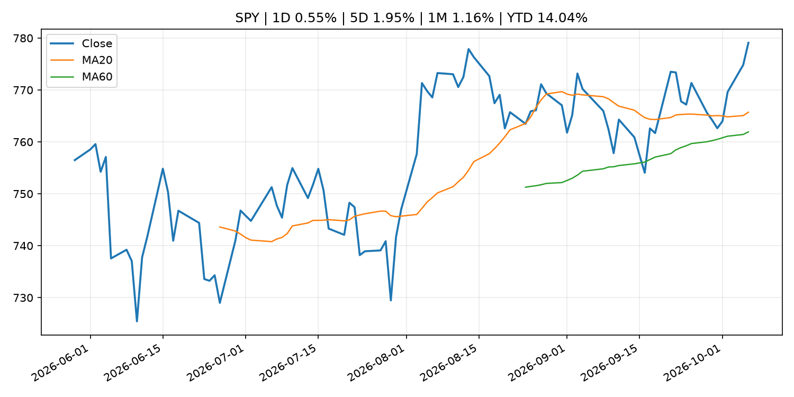
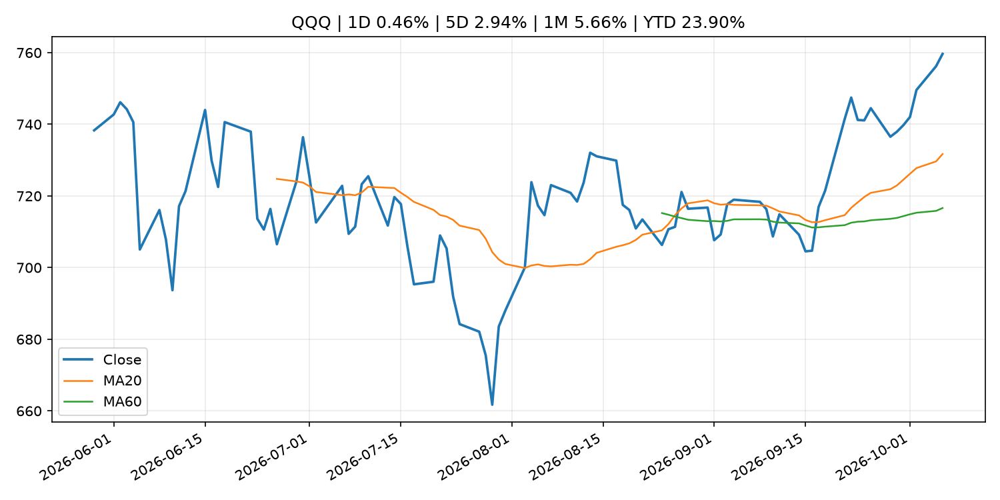
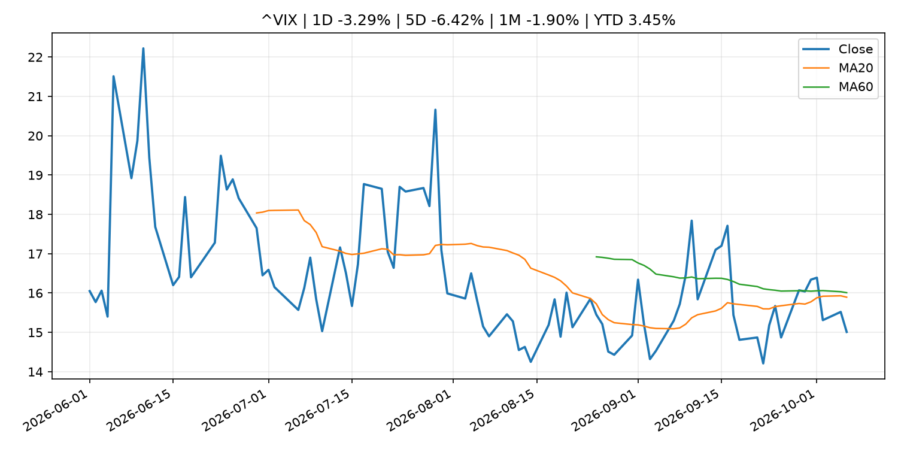
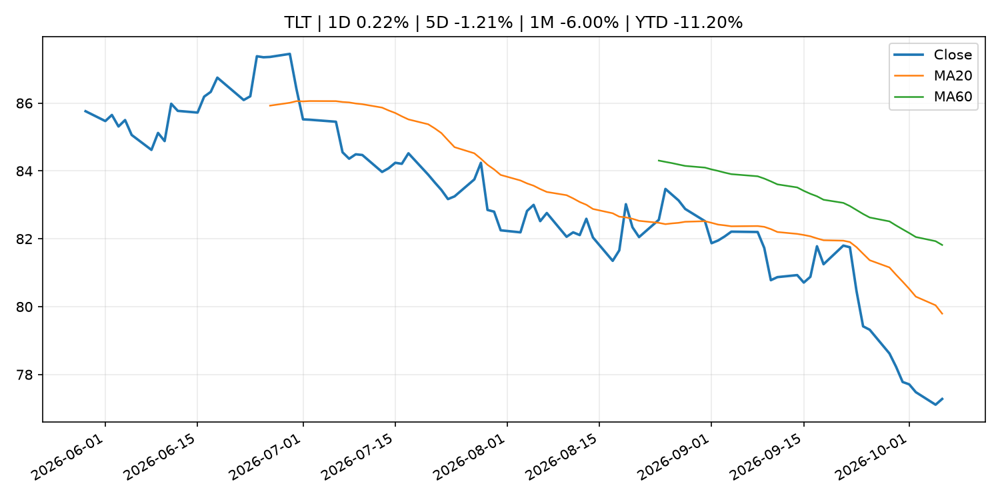
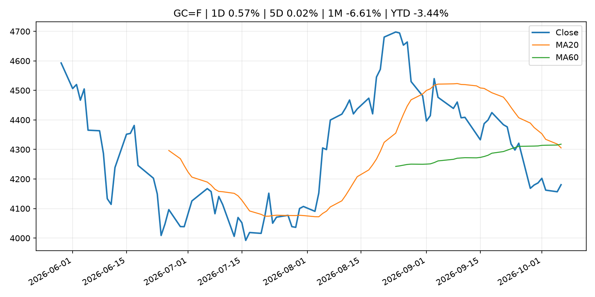
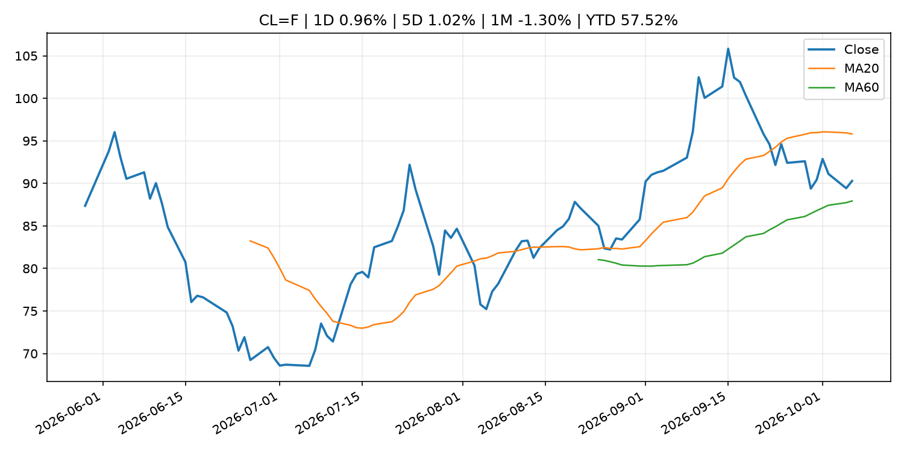
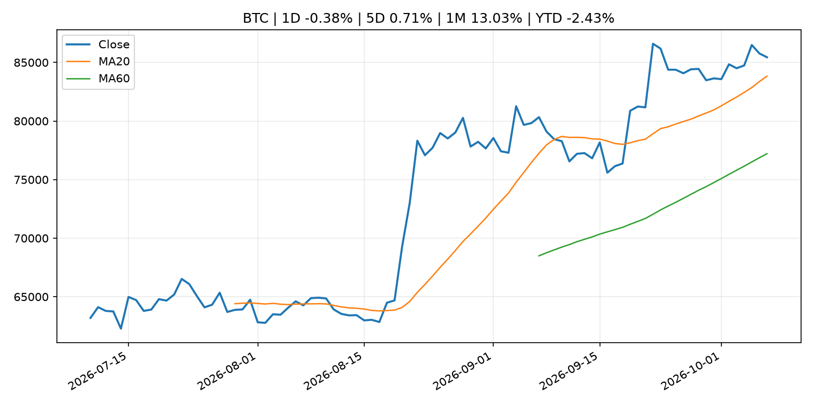
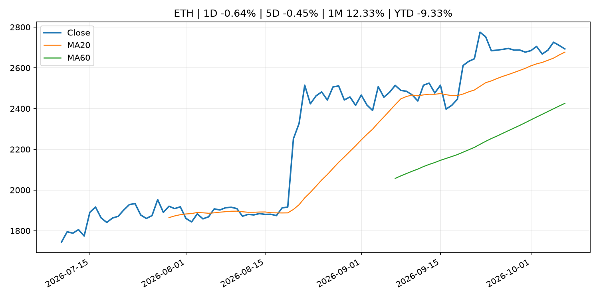

# Global Macro Morning Briefing - 2026-10-07

> Not financial advice / 非投资建议。

## 0. 今日总览
- 市场状态：risk_on。股指上涨、波动率或美元回落，市场更接近风险偏好改善。
- 今日三大主线：
  1. regulation: SEC Seeks Final Judgment Against Former Western Asset Co-CIO Ken Leech in Cherry Picking Case
  2. regulation: SEC to Host Virtual National Compliance Outreach Seminar for Investment Companies and Investment Advisers
  3. crypto_market_structure: Arbitrum joins Paxos-led stablecoin group Global Dollar to capture digital dollar growth
- 一句话结论：今日晨报重点关注：监管变化会改变行业盈利预期和资产风险溢价。；监管变化会改变行业盈利预期和资产风险溢价。。跨资产方面，SPY 1D 0.55%；QQQ 1D 0.46%；^VIX 1D -3.29%；TLT 1D 0.22%；GC=F 1D 0.57%；CL=F 1D 0.96%；BTC 1D -0.38%；ETH 1D -0.64%；股指上涨、波动率或美元回落，市场更接近风险偏好改善。政策、通胀、利率、美元、美债、能源和加密监管仍是主要观察线索。所有结论仅基于公开数据与短摘要整理，不构成投资建议。

## 1. 隔夜跨资产市场
- 美股：SPY 1D 0.55%，QQQ 1D 0.46%，整体趋势需结合 VIX 和利率确认。
- 美债/美元：TLT 1D 0.22%，美元指数 1D -0.20%，是判断折现率压力的核心线索。
- 黄金/原油：黄金 1D 0.57%，原油 1D 0.96%，用于观察避险、通胀和地缘风险。
- 加密：BTC 1D -0.38%，ETH 1D -0.64%，关注是否独立于纳指走出加密自身行情。
- 港股/A股：恒生 1D 1.00%，沪深300/上证 1D n/a，重点看中国政策预期与人民币线索。
- 风险观察：确认风险偏好是否扩散到小盘股、信用利差和周期品。

### US_EQUITY

| symbol | latest close | 1D | 5D | 1M | YTD | trend |
|---|---:|---:|---:|---:|---:|---|
| SPY | 779.09 | 0.55% | 1.95% | 1.16% | 14.04% | uptrend |
| QQQ | 759.66 | 0.46% | 2.94% | 5.66% | 23.90% | strong_uptrend |
| DIA | 514.56 | 0.48% | 0.33% | -3.65% | 6.40% | downtrend |
| IWM | 281.34 | -0.72% | 0.84% | -4.96% | 13.09% | strong_downtrend |
| VTI | 382.54 | 0.51% | 1.94% | 0.74% | 13.75% | uptrend |

### US_MACRO_MARKET

| symbol | latest close | 1D | 5D | 1M | YTD | trend |
|---|---:|---:|---:|---:|---:|---|
| ^VIX | 15.01 | -3.29% | -6.42% | -1.90% | 3.45% | downtrend |
| DX-Y.NYB | 101.97 | -0.20% | 0.59% | 2.83% | 3.61% | uptrend |
| TLT | 77.28 | 0.22% | -1.21% | -6.00% | -11.20% | strong_downtrend |
| IEF | 89.13 | 0.24% | -0.36% | -3.38% | -7.23% | strong_downtrend |

### COMMODITIES

| symbol | latest close | 1D | 5D | 1M | YTD | trend |
|---|---:|---:|---:|---:|---:|---|
| GC=F | 4,180.70 | 0.57% | 0.02% | -6.61% | -3.44% | strong_downtrend |
| SI=F | 61.58 | 1.17% | 1.50% | -6.76% | -12.72% | range_bound |
| CL=F | 90.29 | 0.96% | 1.02% | -1.30% | 57.52% | range_bound |
| BZ=F | 101.55 | 1.23% | -1.01% | 5.47% | 67.16% | range_bound |
| NG=F | 3.14 | 2.32% | 4.18% | 5.45% | -13.29% | strong_uptrend |
| HG=F | 6.66 | 1.14% | 1.79% | 0.96% | 18.09% | uptrend |

### HK_MARKET

| symbol | latest close | 1D | 5D | 1M | YTD | trend |
|---|---:|---:|---:|---:|---:|---|
| ^HSI | 24,280.56 | 1.00% | -1.47% | -5.34% | -7.81% | strong_downtrend |
| 0700.HK | 428.20 | 1.23% | -2.64% | -3.30% | -31.27% | strong_downtrend |
| 9988.HK | 108.20 | 2.66% | 0.46% | -1.73% | -27.38% | range_bound |
| 3690.HK | 70.80 | 0.21% | -1.53% | -13.39% | -32.31% | strong_downtrend |
| 1810.HK | 24.26 | 1.59% | -6.19% | -14.70% | -39.77% | strong_downtrend |
| 1211.HK | 75.00 | 1.21% | -3.47% | -12.94% | -24.05% | strong_downtrend |

### CRYPTO

| symbol | latest close | 1D | 5D | 1M | YTD | trend |
|---|---:|---:|---:|---:|---:|---|
| BTC | 85,442.84 | -0.38% | 0.71% | 13.03% | -2.43% | uptrend |
| ETH | 2,693.03 | -0.64% | -0.45% | 12.33% | -9.33% | uptrend |
| SOLANA | 120.35 | -0.34% | 1.66% | 24.23% | -3.35% | uptrend |
| BINANCECOIN | 778.73 | -0.97% | 0.95% | 9.41% | -9.73% | uptrend |
| RIPPLE | 1.50 | -0.83% | 0.08% | 16.51% | -18.76% | uptrend |

## 2. 今日最重要的 10 条新闻
### 1. SEC Seeks Final Judgment Against Former Western Asset Co-CIO Ken Leech in Cherry Picking Case
- 来源：SEC Press Releases
- 时间：2026-10-06T16:30:24-04:00
- 地区：US
- 事件类型：regulation
- 重要性层级：Tier 2
- 一句话摘要：The Securities and Exchange Commission today moved for entry of a final judgment by consent against Stephen Kenneth Leech II, the former co-chief investment officer of registered investment adviser Western Asset Management Company LLC, whom the SEC…
- 为什么重要：监管变化会改变行业盈利预期和资产风险溢价。
- 可能影响：主要影响 BTC，方向为 mixed，强度 high；加密监管或 ETF 进展会改变 BTC 的资金流和风险溢价。
  - 资产：BTC
    方向：mixed
    强度：high
    原因：加密监管或 ETF 进展会改变 BTC 的资金流和风险溢价。
  - 资产：ETH
    方向：mixed
    强度：high
    原因：监管框架会影响 ETH 产品化和机构参与度。
  - 资产：COIN
    方向：mixed
    强度：medium
    原因：监管清晰度和执法风险会影响交易平台估值。
  - 资产：crypto market
    方向：mixed
    强度：high
    原因：信息影响整个加密市场结构，但方向取决于细节。
- 原文链接：[https://www.sec.gov/newsroom/press-releases/2026-103-sec-seeks-final-judgment-against-former-western-asset-co-cio-ken-leech-cherry-picking-case](https://www.sec.gov/newsroom/press-releases/2026-103-sec-seeks-final-judgment-against-former-western-asset-co-cio-ken-leech-cherry-picking-case)

### 2. SEC to Host Virtual National Compliance Outreach Seminar for Investment Companies and Investment Advisers
- 来源：SEC Press Releases
- 时间：2026-10-06T10:37:55-04:00
- 地区：US
- 事件类型：regulation
- 重要性层级：Tier 2
- 一句话摘要：The Securities and Exchange Commission’s Compliance Outreach Program announced today that it will host a virtual national seminar for investment companies and investment advisers on November 19, 2026. The purpose of the event is to help chief compliance…
- 为什么重要：监管变化会改变行业盈利预期和资产风险溢价。
- 可能影响：主要影响 BTC，方向为 mixed，强度 high；加密监管或 ETF 进展会改变 BTC 的资金流和风险溢价。
  - 资产：BTC
    方向：mixed
    强度：high
    原因：加密监管或 ETF 进展会改变 BTC 的资金流和风险溢价。
  - 资产：ETH
    方向：mixed
    强度：high
    原因：监管框架会影响 ETH 产品化和机构参与度。
  - 资产：COIN
    方向：mixed
    强度：medium
    原因：监管清晰度和执法风险会影响交易平台估值。
  - 资产：crypto market
    方向：mixed
    强度：high
    原因：信息影响整个加密市场结构，但方向取决于细节。
- 原文链接：[https://www.sec.gov/newsroom/press-releases/2026-102-sec-host-virtual-national-compliance-outreach-seminar-investment-companies-investment-advisers](https://www.sec.gov/newsroom/press-releases/2026-102-sec-host-virtual-national-compliance-outreach-seminar-investment-companies-investment-advisers)

### 3. Arbitrum joins Paxos-led stablecoin group Global Dollar to capture digital dollar growth
- 来源：CoinDesk
- 时间：2026-10-06T13:02:33+00:00
- 地区：global
- 事件类型：crypto_market_structure
- 重要性层级：Tier 2
- 一句话摘要：Arbitrum joins Paxos-led stablecoin group Global Dollar to capture digital dollar growth
- 为什么重要：加密市场结构和监管变化会影响 BTC、ETH 及相关股票的风险溢价。
- 可能影响：主要影响 BTC，方向为 mixed，强度 high；加密监管或 ETF 进展会改变 BTC 的资金流和风险溢价。
  - 资产：BTC
    方向：mixed
    强度：high
    原因：加密监管或 ETF 进展会改变 BTC 的资金流和风险溢价。
  - 资产：ETH
    方向：mixed
    强度：high
    原因：监管框架会影响 ETH 产品化和机构参与度。
  - 资产：COIN
    方向：mixed
    强度：medium
    原因：监管清晰度和执法风险会影响交易平台估值。
  - 资产：crypto market
    方向：mixed
    强度：high
    原因：信息影响整个加密市场结构，但方向取决于细节。
- 原文链接：[https://www.coindesk.com/business/2026/10/05/arbitrum-joins-paxos-led-stablecoin-group-global-dollar-to-capture-digital-dollar-growth](https://www.coindesk.com/business/2026/10/05/arbitrum-joins-paxos-led-stablecoin-group-global-dollar-to-capture-digital-dollar-growth)

### 4. OKX looks to abstract blockchain mechanics to bring stablecoin balances to everyday consumers
- 来源：CoinDesk
- 时间：2026-10-06T09:02:01+00:00
- 地区：global
- 事件类型：crypto_market_structure
- 重要性层级：Tier 2
- 一句话摘要：OKX looks to abstract blockchain mechanics to bring stablecoin balances to everyday consumers
- 为什么重要：加密市场结构和监管变化会影响 BTC、ETH 及相关股票的风险溢价。
- 可能影响：主要影响 BTC，方向为 mixed，强度 high；加密监管或 ETF 进展会改变 BTC 的资金流和风险溢价。
  - 资产：BTC
    方向：mixed
    强度：high
    原因：加密监管或 ETF 进展会改变 BTC 的资金流和风险溢价。
  - 资产：ETH
    方向：mixed
    强度：high
    原因：监管框架会影响 ETH 产品化和机构参与度。
  - 资产：COIN
    方向：mixed
    强度：medium
    原因：监管清晰度和执法风险会影响交易平台估值。
  - 资产：crypto market
    方向：mixed
    强度：high
    原因：信息影响整个加密市场结构，但方向取决于细节。
- 原文链接：[https://www.coindesk.com/business/2026/10/06/okx-money-lets-users-save-earn-10-yield-and-spend-dollar-stablecoins-in-one-app](https://www.coindesk.com/business/2026/10/06/okx-money-lets-users-save-earn-10-yield-and-spend-dollar-stablecoins-in-one-app)

### 5. SEC Coordinates with Global Financial Regulators to Raise Fraud Awareness During World Investor Week
- 来源：SEC Press Releases
- 时间：2026-10-05T08:47:36-04:00
- 地区：US
- 事件类型：regulation
- 重要性层级：Tier 2
- 一句话摘要：The Securities and Exchange Commission, in coordination with other U.S. and global financial regulators, today issued a joint investor bulletin as part of World Investor Week (WIW). The bulletin encourages investors to be resilient in changing…
- 为什么重要：监管变化会改变行业盈利预期和资产风险溢价。
- 可能影响：主要影响 BTC，方向为 mixed，强度 high；加密监管或 ETF 进展会改变 BTC 的资金流和风险溢价。
  - 资产：BTC
    方向：mixed
    强度：high
    原因：加密监管或 ETF 进展会改变 BTC 的资金流和风险溢价。
  - 资产：ETH
    方向：mixed
    强度：high
    原因：监管框架会影响 ETH 产品化和机构参与度。
  - 资产：COIN
    方向：mixed
    强度：medium
    原因：监管清晰度和执法风险会影响交易平台估值。
  - 资产：crypto market
    方向：mixed
    强度：high
    原因：信息影响整个加密市场结构，但方向取决于细节。
- 原文链接：[https://www.sec.gov/newsroom/press-releases/2026-101-sec-coordinates-global-financial-regulators-raise-fraud-awareness-during-world-investor-week](https://www.sec.gov/newsroom/press-releases/2026-101-sec-coordinates-global-financial-regulators-raise-fraud-awareness-during-world-investor-week)

### 6. U.S. CFTC joins SEC in proposing crypto regulations, though spot-market gap lingers
- 来源：CoinDesk
- 时间：2026-10-05T15:54:23+00:00
- 地区：global
- 事件类型：regulation
- 重要性层级：Tier 2
- 一句话摘要：U.S. CFTC joins SEC in proposing crypto regulations, though spot-market gap lingers
- 为什么重要：监管变化会改变行业盈利预期和资产风险溢价。
- 可能影响：主要影响 BTC，方向为 mixed，强度 high；加密监管或 ETF 进展会改变 BTC 的资金流和风险溢价。
  - 资产：BTC
    方向：mixed
    强度：high
    原因：加密监管或 ETF 进展会改变 BTC 的资金流和风险溢价。
  - 资产：ETH
    方向：mixed
    强度：high
    原因：监管框架会影响 ETH 产品化和机构参与度。
  - 资产：COIN
    方向：mixed
    强度：medium
    原因：监管清晰度和执法风险会影响交易平台估值。
  - 资产：crypto market
    方向：mixed
    强度：high
    原因：信息影响整个加密市场结构，但方向取决于细节。
- 原文链接：[https://www.coindesk.com/policy/2026/10/05/u-s-cftc-joins-sec-in-proposing-crypto-regulations-though-spot-market-gap-lingers](https://www.coindesk.com/policy/2026/10/05/u-s-cftc-joins-sec-in-proposing-crypto-regulations-though-spot-market-gap-lingers)

### 7. Stripe to expand stablecoin cards to over 100 countries by the end of the year
- 来源：CoinDesk
- 时间：2026-10-05T13:46:31+00:00
- 地区：global
- 事件类型：crypto_market_structure
- 重要性层级：Tier 2
- 一句话摘要：Stripe to expand stablecoin cards to over 100 countries by the end of the year
- 为什么重要：加密市场结构和监管变化会影响 BTC、ETH 及相关股票的风险溢价。
- 可能影响：主要影响 BTC，方向为 mixed，强度 high；加密监管或 ETF 进展会改变 BTC 的资金流和风险溢价。
  - 资产：BTC
    方向：mixed
    强度：high
    原因：加密监管或 ETF 进展会改变 BTC 的资金流和风险溢价。
  - 资产：ETH
    方向：mixed
    强度：high
    原因：监管框架会影响 ETH 产品化和机构参与度。
  - 资产：COIN
    方向：mixed
    强度：medium
    原因：监管清晰度和执法风险会影响交易平台估值。
  - 资产：crypto market
    方向：mixed
    强度：high
    原因：信息影响整个加密市场结构，但方向取决于细节。
- 原文链接：[https://www.coindesk.com/business/2026/10/01/stripe-to-expand-stablecoin-cards-to-over-100-countries-by-the-end-of-the-year](https://www.coindesk.com/business/2026/10/01/stripe-to-expand-stablecoin-cards-to-over-100-countries-by-the-end-of-the-year)

### 8. SEC approves a 3x fix for bitcoin and ether traders who miss the wild swings
- 来源：CoinDesk
- 时间：2026-10-05T11:14:35+00:00
- 地区：global
- 事件类型：regulation
- 重要性层级：Tier 2
- 一句话摘要：SEC approves a 3x fix for bitcoin and ether traders who miss the wild swings
- 为什么重要：监管变化会改变行业盈利预期和资产风险溢价。
- 可能影响：主要影响 BTC，方向为 mixed，强度 high；加密监管或 ETF 进展会改变 BTC 的资金流和风险溢价。
  - 资产：BTC
    方向：mixed
    强度：high
    原因：加密监管或 ETF 进展会改变 BTC 的资金流和风险溢价。
  - 资产：ETH
    方向：mixed
    强度：high
    原因：监管框架会影响 ETH 产品化和机构参与度。
  - 资产：COIN
    方向：mixed
    强度：medium
    原因：监管清晰度和执法风险会影响交易平台估值。
  - 资产：crypto market
    方向：mixed
    强度：high
    原因：信息影响整个加密市场结构，但方向取决于细节。
- 原文链接：[https://www.coindesk.com/daybook-us/2026/10/05/sec-approves-a-3x-fix-for-bitcoin-and-ether-traders-who-miss-the-wild-swings](https://www.coindesk.com/daybook-us/2026/10/05/sec-approves-a-3x-fix-for-bitcoin-and-ether-traders-who-miss-the-wild-swings)

### 9. Goldman: Diesel prices set to stay high through 2027 as refineries struggle to meet demand
- 来源：CNBC Economy
- 时间：2026-10-06T08:47:30+00:00
- 地区：US
- 事件类型：commodity_supply
- 重要性层级：Tier 2
- 一句话摘要：Goldman Sachs says tight refinery capacity could keep diesel prices elevated through 2027, with high margins needed to curb demand and rebuild inventories.
- 为什么重要：大宗商品供给变化会影响能源价格、通胀预期和资源股。
- 可能影响：可能影响利率、汇率、风险资产或大宗商品预期，但当前公开信息不足以判断明确方向。
  - 资产：暂无明确资产映射
  - 方向：unknown
  - 强度：low
  - 原因：公开信息不足以判断方向。
- 原文链接：[https://www.cnbc.com/2026/10/06/diesel-oil-refinery-price-capacity-demand.html](https://www.cnbc.com/2026/10/06/diesel-oil-refinery-price-capacity-demand.html)

### 10. Chart: A look at the S&P 500's remarkable and defiant trip to a new record
- 来源：CNBC Economy
- 时间：2026-10-06T22:23:01+00:00
- 地区：US
- 事件类型：other
- 重要性层级：Tier 3
- 一句话摘要：The S&P 500 returned to an intraday record Tuesday as tech gains, easing oil prices and Treasury yields helped stocks overcome months of market shocks.
- 为什么重要：这条信息暂未匹配到重大宏观、政策或市场事件，更适合作为背景跟踪。
- 可能影响：主要影响 QQQ，方向为 positive，强度 high；宽松预期降低折现率，有利于成长股。
  - 资产：QQQ
    方向：positive
    强度：high
    原因：宽松预期降低折现率，有利于成长股。
  - 资产：SPY
    方向：positive
    强度：high
    原因：宽松政策通常改善风险偏好。
  - 资产：TLT
    方向：positive
    强度：high
    原因：降息预期通常推升长债价格。
  - 资产：DXY
    方向：negative
    强度：medium
    原因：利差预期回落通常压制美元。
  - 资产：GC=F
    方向：positive
    强度：medium
    原因：实际利率下降通常利好黄金。
  - 资产：BTC
    方向：positive
    强度：high
    原因：流动性改善通常支持加密资产。
- 原文链接：[https://www.cnbc.com/2026/10/06/chart-a-look-at-the-sp-500s-remarkable-and-defiant-trip-a-new-record.html](https://www.cnbc.com/2026/10/06/chart-a-look-at-the-sp-500s-remarkable-and-defiant-trip-a-new-record.html)

## 3. 政策与央行观察
### 1. SEC Seeks Final Judgment Against Former Western Asset Co-CIO Ken Leech in Cherry Picking Case
- 来源：SEC Press Releases
- 时间：2026-10-06T16:30:24-04:00
- 地区：US
- 事件类型：regulation
- 重要性层级：Tier 2
- 一句话摘要：The Securities and Exchange Commission today moved for entry of a final judgment by consent against Stephen Kenneth Leech II, the former co-chief investment officer of registered investment adviser Western Asset Management Company LLC, whom the SEC…
- 为什么重要：监管变化会改变行业盈利预期和资产风险溢价。
- 可能影响：主要影响 BTC，方向为 mixed，强度 high；加密监管或 ETF 进展会改变 BTC 的资金流和风险溢价。
  - 资产：BTC
    方向：mixed
    强度：high
    原因：加密监管或 ETF 进展会改变 BTC 的资金流和风险溢价。
  - 资产：ETH
    方向：mixed
    强度：high
    原因：监管框架会影响 ETH 产品化和机构参与度。
  - 资产：COIN
    方向：mixed
    强度：medium
    原因：监管清晰度和执法风险会影响交易平台估值。
  - 资产：crypto market
    方向：mixed
    强度：high
    原因：信息影响整个加密市场结构，但方向取决于细节。
- 原文链接：[https://www.sec.gov/newsroom/press-releases/2026-103-sec-seeks-final-judgment-against-former-western-asset-co-cio-ken-leech-cherry-picking-case](https://www.sec.gov/newsroom/press-releases/2026-103-sec-seeks-final-judgment-against-former-western-asset-co-cio-ken-leech-cherry-picking-case)

### 2. SEC to Host Virtual National Compliance Outreach Seminar for Investment Companies and Investment Advisers
- 来源：SEC Press Releases
- 时间：2026-10-06T10:37:55-04:00
- 地区：US
- 事件类型：regulation
- 重要性层级：Tier 2
- 一句话摘要：The Securities and Exchange Commission’s Compliance Outreach Program announced today that it will host a virtual national seminar for investment companies and investment advisers on November 19, 2026. The purpose of the event is to help chief compliance…
- 为什么重要：监管变化会改变行业盈利预期和资产风险溢价。
- 可能影响：主要影响 BTC，方向为 mixed，强度 high；加密监管或 ETF 进展会改变 BTC 的资金流和风险溢价。
  - 资产：BTC
    方向：mixed
    强度：high
    原因：加密监管或 ETF 进展会改变 BTC 的资金流和风险溢价。
  - 资产：ETH
    方向：mixed
    强度：high
    原因：监管框架会影响 ETH 产品化和机构参与度。
  - 资产：COIN
    方向：mixed
    强度：medium
    原因：监管清晰度和执法风险会影响交易平台估值。
  - 资产：crypto market
    方向：mixed
    强度：high
    原因：信息影响整个加密市场结构，但方向取决于细节。
- 原文链接：[https://www.sec.gov/newsroom/press-releases/2026-102-sec-host-virtual-national-compliance-outreach-seminar-investment-companies-investment-advisers](https://www.sec.gov/newsroom/press-releases/2026-102-sec-host-virtual-national-compliance-outreach-seminar-investment-companies-investment-advisers)

### 3. Arbitrum joins Paxos-led stablecoin group Global Dollar to capture digital dollar growth
- 来源：CoinDesk
- 时间：2026-10-06T13:02:33+00:00
- 地区：global
- 事件类型：crypto_market_structure
- 重要性层级：Tier 2
- 一句话摘要：Arbitrum joins Paxos-led stablecoin group Global Dollar to capture digital dollar growth
- 为什么重要：加密市场结构和监管变化会影响 BTC、ETH 及相关股票的风险溢价。
- 可能影响：主要影响 BTC，方向为 mixed，强度 high；加密监管或 ETF 进展会改变 BTC 的资金流和风险溢价。
  - 资产：BTC
    方向：mixed
    强度：high
    原因：加密监管或 ETF 进展会改变 BTC 的资金流和风险溢价。
  - 资产：ETH
    方向：mixed
    强度：high
    原因：监管框架会影响 ETH 产品化和机构参与度。
  - 资产：COIN
    方向：mixed
    强度：medium
    原因：监管清晰度和执法风险会影响交易平台估值。
  - 资产：crypto market
    方向：mixed
    强度：high
    原因：信息影响整个加密市场结构，但方向取决于细节。
- 原文链接：[https://www.coindesk.com/business/2026/10/05/arbitrum-joins-paxos-led-stablecoin-group-global-dollar-to-capture-digital-dollar-growth](https://www.coindesk.com/business/2026/10/05/arbitrum-joins-paxos-led-stablecoin-group-global-dollar-to-capture-digital-dollar-growth)

### 4. OKX looks to abstract blockchain mechanics to bring stablecoin balances to everyday consumers
- 来源：CoinDesk
- 时间：2026-10-06T09:02:01+00:00
- 地区：global
- 事件类型：crypto_market_structure
- 重要性层级：Tier 2
- 一句话摘要：OKX looks to abstract blockchain mechanics to bring stablecoin balances to everyday consumers
- 为什么重要：加密市场结构和监管变化会影响 BTC、ETH 及相关股票的风险溢价。
- 可能影响：主要影响 BTC，方向为 mixed，强度 high；加密监管或 ETF 进展会改变 BTC 的资金流和风险溢价。
  - 资产：BTC
    方向：mixed
    强度：high
    原因：加密监管或 ETF 进展会改变 BTC 的资金流和风险溢价。
  - 资产：ETH
    方向：mixed
    强度：high
    原因：监管框架会影响 ETH 产品化和机构参与度。
  - 资产：COIN
    方向：mixed
    强度：medium
    原因：监管清晰度和执法风险会影响交易平台估值。
  - 资产：crypto market
    方向：mixed
    强度：high
    原因：信息影响整个加密市场结构，但方向取决于细节。
- 原文链接：[https://www.coindesk.com/business/2026/10/06/okx-money-lets-users-save-earn-10-yield-and-spend-dollar-stablecoins-in-one-app](https://www.coindesk.com/business/2026/10/06/okx-money-lets-users-save-earn-10-yield-and-spend-dollar-stablecoins-in-one-app)

### 5. SEC Coordinates with Global Financial Regulators to Raise Fraud Awareness During World Investor Week
- 来源：SEC Press Releases
- 时间：2026-10-05T08:47:36-04:00
- 地区：US
- 事件类型：regulation
- 重要性层级：Tier 2
- 一句话摘要：The Securities and Exchange Commission, in coordination with other U.S. and global financial regulators, today issued a joint investor bulletin as part of World Investor Week (WIW). The bulletin encourages investors to be resilient in changing…
- 为什么重要：监管变化会改变行业盈利预期和资产风险溢价。
- 可能影响：主要影响 BTC，方向为 mixed，强度 high；加密监管或 ETF 进展会改变 BTC 的资金流和风险溢价。
  - 资产：BTC
    方向：mixed
    强度：high
    原因：加密监管或 ETF 进展会改变 BTC 的资金流和风险溢价。
  - 资产：ETH
    方向：mixed
    强度：high
    原因：监管框架会影响 ETH 产品化和机构参与度。
  - 资产：COIN
    方向：mixed
    强度：medium
    原因：监管清晰度和执法风险会影响交易平台估值。
  - 资产：crypto market
    方向：mixed
    强度：high
    原因：信息影响整个加密市场结构，但方向取决于细节。
- 原文链接：[https://www.sec.gov/newsroom/press-releases/2026-101-sec-coordinates-global-financial-regulators-raise-fraud-awareness-during-world-investor-week](https://www.sec.gov/newsroom/press-releases/2026-101-sec-coordinates-global-financial-regulators-raise-fraud-awareness-during-world-investor-week)

### 6. U.S. CFTC joins SEC in proposing crypto regulations, though spot-market gap lingers
- 来源：CoinDesk
- 时间：2026-10-05T15:54:23+00:00
- 地区：global
- 事件类型：regulation
- 重要性层级：Tier 2
- 一句话摘要：U.S. CFTC joins SEC in proposing crypto regulations, though spot-market gap lingers
- 为什么重要：监管变化会改变行业盈利预期和资产风险溢价。
- 可能影响：主要影响 BTC，方向为 mixed，强度 high；加密监管或 ETF 进展会改变 BTC 的资金流和风险溢价。
  - 资产：BTC
    方向：mixed
    强度：high
    原因：加密监管或 ETF 进展会改变 BTC 的资金流和风险溢价。
  - 资产：ETH
    方向：mixed
    强度：high
    原因：监管框架会影响 ETH 产品化和机构参与度。
  - 资产：COIN
    方向：mixed
    强度：medium
    原因：监管清晰度和执法风险会影响交易平台估值。
  - 资产：crypto market
    方向：mixed
    强度：high
    原因：信息影响整个加密市场结构，但方向取决于细节。
- 原文链接：[https://www.coindesk.com/policy/2026/10/05/u-s-cftc-joins-sec-in-proposing-crypto-regulations-though-spot-market-gap-lingers](https://www.coindesk.com/policy/2026/10/05/u-s-cftc-joins-sec-in-proposing-crypto-regulations-though-spot-market-gap-lingers)

### 7. Stripe to expand stablecoin cards to over 100 countries by the end of the year
- 来源：CoinDesk
- 时间：2026-10-05T13:46:31+00:00
- 地区：global
- 事件类型：crypto_market_structure
- 重要性层级：Tier 2
- 一句话摘要：Stripe to expand stablecoin cards to over 100 countries by the end of the year
- 为什么重要：加密市场结构和监管变化会影响 BTC、ETH 及相关股票的风险溢价。
- 可能影响：主要影响 BTC，方向为 mixed，强度 high；加密监管或 ETF 进展会改变 BTC 的资金流和风险溢价。
  - 资产：BTC
    方向：mixed
    强度：high
    原因：加密监管或 ETF 进展会改变 BTC 的资金流和风险溢价。
  - 资产：ETH
    方向：mixed
    强度：high
    原因：监管框架会影响 ETH 产品化和机构参与度。
  - 资产：COIN
    方向：mixed
    强度：medium
    原因：监管清晰度和执法风险会影响交易平台估值。
  - 资产：crypto market
    方向：mixed
    强度：high
    原因：信息影响整个加密市场结构，但方向取决于细节。
- 原文链接：[https://www.coindesk.com/business/2026/10/01/stripe-to-expand-stablecoin-cards-to-over-100-countries-by-the-end-of-the-year](https://www.coindesk.com/business/2026/10/01/stripe-to-expand-stablecoin-cards-to-over-100-countries-by-the-end-of-the-year)

### 8. SEC approves a 3x fix for bitcoin and ether traders who miss the wild swings
- 来源：CoinDesk
- 时间：2026-10-05T11:14:35+00:00
- 地区：global
- 事件类型：regulation
- 重要性层级：Tier 2
- 一句话摘要：SEC approves a 3x fix for bitcoin and ether traders who miss the wild swings
- 为什么重要：监管变化会改变行业盈利预期和资产风险溢价。
- 可能影响：主要影响 BTC，方向为 mixed，强度 high；加密监管或 ETF 进展会改变 BTC 的资金流和风险溢价。
  - 资产：BTC
    方向：mixed
    强度：high
    原因：加密监管或 ETF 进展会改变 BTC 的资金流和风险溢价。
  - 资产：ETH
    方向：mixed
    强度：high
    原因：监管框架会影响 ETH 产品化和机构参与度。
  - 资产：COIN
    方向：mixed
    强度：medium
    原因：监管清晰度和执法风险会影响交易平台估值。
  - 资产：crypto market
    方向：mixed
    强度：high
    原因：信息影响整个加密市场结构，但方向取决于细节。
- 原文链接：[https://www.coindesk.com/daybook-us/2026/10/05/sec-approves-a-3x-fix-for-bitcoin-and-ether-traders-who-miss-the-wild-swings](https://www.coindesk.com/daybook-us/2026/10/05/sec-approves-a-3x-fix-for-bitcoin-and-ether-traders-who-miss-the-wild-swings)

## 4. 市场异动与图表
- SPY 上涨 0.55%
- QQQ 上涨 0.46%
- VIX 下跌 -3.29%
- Gold 上涨 0.57%

### SPY

### QQQ

### ^VIX

### TLT

### GC=F

### CL=F

### BTC

### ETH

### ^HSI

## 5. 华尔街与机构公开观点
- 暂无可靠公开观点。

## 6. 今日重点关注
- 经济数据：经济数据：暂无可靠公开日历数据；如配置经济日历源后可自动填充。
- 央行讲话：央行讲话：暂无可靠公开日历数据；重点跟踪 Fed、ECB、BoJ、PBOC 官网 RSS。
- 财报：财报：暂无可靠数据。
- 政策事件：政策事件：暂无可靠数据。
- 风险提醒：风险提醒：关注数据源失败项、突发地缘风险、利率和美元的二阶反应。

## 7. 英文金融表达与宏观概念
- **real yield**：实际收益率，名义利率扣除通胀预期后的收益率。 例句：Gold often reacts more to real yields than nominal yields.
- **risk-off**：避险模式，资金偏向美元、国债、黄金等防御资产。 例句：A geopolitical shock can push markets into risk-off mode.
- **supply disruption**：供给扰动，通常指能源或商品供应受冲突、减产或天气影响。 例句：Supply disruption can lift oil prices and inflation expectations.
- **market structure**：市场结构，指交易、托管、清算、ETF、监管等制度安排。 例句：Crypto market structure rules can affect institutional participation.
- **inflation expectations**：通胀预期，指家庭、企业或市场对未来通胀的预估。 例句：Inflation expectations can shape wage bargaining and bond yields.
- **terminal rate**：终端利率，市场预期本轮加息周期的最高政策利率。 例句：A higher terminal rate can pressure growth stocks.

## 8. 背景材料
- [Bank of Japan Accounts (September 30)](http://www.boj.or.jp/en/statistics/boj/other/acmai/release/2026/ac260930.htm)（Bank of Japan Announcements，routine_announcement）：Bank of Japan Accounts (September 30)
- [Monetary Base and the Bank of Japan's Transactions (Sept.)](http://www.boj.or.jp/en/statistics/boj/other/mbt/mbt2609.pdf)（Bank of Japan Announcements，other）：Monetary Base and the Bank of Japan's Transactions (Sept.)
- [Bank of Japan's Transactions with the Government (Sept.)](http://www.boj.or.jp/en/statistics/boj/other/tseifu/release/2026/seifu2609.pdf)（Bank of Japan Announcements，other）：Bank of Japan's Transactions with the Government (Sept.)
- [Market Operations by the Bank of Japan (Sept.)](http://www.boj.or.jp/en/statistics/boj/fm/ope/m_release/2026/ope2609.xlsx)（Bank of Japan Announcements，other）：Market Operations by the Bank of Japan (Sept.)
- [Chart: A look at the S&P 500's remarkable and defiant trip to a new record](https://www.cnbc.com/2026/10/06/chart-a-look-at-the-sp-500s-remarkable-and-defiant-trip-a-new-record.html)（CNBC Economy，other）：The S&P 500 returned to an intraday record Tuesday as tech gains, easing oil prices and Treasury yields helped stocks overcome months of market shocks.
- [Frank Elderson: Effective supervision through timely remediation](https://www.ecb.europa.eu//press/key/date/2026/html/ecb.sp261006_1~0df91e4e44.en.html)（ECB Press Releases，other）：Frank Elderson: Effective supervision through timely remediation
- [Piero Cipollone: Money in the digital age: digital euro, tokenisation and the role of central banks](https://www.ecb.europa.eu//press/key/date/2026/html/ecb.sp261006~0da978f159.en.html)（ECB Press Releases，other）：Piero Cipollone: Money in the digital age: digital euro, tokenisation and the role of central banks
- [The VIX of bonds is rising but bitcoin and stocks aren't hearing it yet](https://www.coindesk.com/daybook-us/2026/10/06/the-vix-of-bonds-is-rising-but-bitcoin-and-stocks-aren-t-hearing-it-yet)（CoinDesk，other）：The VIX of bonds is rising but bitcoin and stocks aren't hearing it yet
- [Live updates: Bitcoin remains locked in range as stocks notch another new record high](https://www.coindesk.com/markets/2026/10/06/live-updates-a-drop-below-usd84-000-could-put-usd80-000-in-play-for-bitcoin)（CoinDesk，other）：Live updates: Bitcoin remains locked in range as stocks notch another new record high
- [Smaller altcoins shine as bitcoin stills trades around $85,000](https://www.coindesk.com/markets/2026/10/06/smaller-altcoins-shine-as-bitcoin-stills-trades-around-usd85-000)（CoinDesk，other）：Smaller altcoins shine as bitcoin stills trades around $85,000
- [U.S.- China AI race heats up as Chinese rivals secure billions ahead of IPOs](https://www.coindesk.com/markets/2026/10/06/u-s-china-ai-race-heats-up-as-chinese-rivals-secure-billions-ahead-of-ipos)（CoinDesk，other）：U.S.- China AI race heats up as Chinese rivals secure billions ahead of IPOs
- [Why bitcoin is down 'just' 32% a year after its record high of $126,000](https://www.coindesk.com/markets/2026/10/06/from-retail-leverage-to-etf-flows-a-year-after-its-record-high-bitcoin-is-down-just-32)（CoinDesk，other）：Why bitcoin is down 'just' 32% a year after its record high of $126,000
- [Philip R. Lane: Interview with Ansa](https://www.ecb.europa.eu//press/inter/date/2026/html/ecb.in261006~bc94400297.en.html)（ECB Press Releases，other）：Philip R. Lane: Interview with Ansa
- [Bitcoin keeps getting rejected at $87,000 as stocks hover near records](https://www.coindesk.com/markets/2026/10/06/bitcoin-keeps-getting-rejected-at-usd87-000-as-stocks-hover-near-records)（CoinDesk，other）：Bitcoin keeps getting rejected at $87,000 as stocks hover near records
- [Solana Foundation unveils a program to settle institutional trades in seconds. JPMorgan gave input](https://www.coindesk.com/markets/2026/10/06/solana-foundation-unveils-a-program-to-settle-institutional-trades-in-seconds-with-jpmorgan-s-inputs)（CoinDesk，other）：Solana Foundation unveils a program to settle institutional trades in seconds. JPMorgan gave input
- [Federal Reserve Board announces approval of application by Isabella Bank Corporation](https://www.federalreserve.gov/newsevents/pressreleases/orders20261005a.htm)（Federal Reserve Press Releases，other）：Federal Reserve Board announces approval of application by Isabella Bank Corporation
- [An XRP treasury SPAC surges nearly 300% ahead of Evernorth merger](https://www.coindesk.com/markets/2026/10/05/xrp-treasury-spac-surges-nearly-300-ahead-of-evernorth-merger)（CoinDesk，other）：An XRP treasury SPAC surges nearly 300% ahead of Evernorth merger
- [Treasury crackdown exposes crypto's role in $2 million Hamas fundraising network](https://www.coindesk.com/policy/2026/10/05/treasury-crackdown-exposes-crypto-s-role-in-usd2-million-hamas-fundraising-network)（CoinDesk，other）：Treasury crackdown exposes crypto's role in $2 million Hamas fundraising network
- [Metaplanet added 1,000 bitcoin net in the third quarter bringing holdings to 44,000 BTC](https://www.coindesk.com/business/2026/10/05/metaplanet-adds-1-000-bitcoin-after-sale-and-repurchase-launches-income-strategy)（CoinDesk，other）：Metaplanet added 1,000 bitcoin net in the third quarter bringing holdings to 44,000 BTC
- [Bitcoin resilience tested as U.S. dollar climbs to 18-month high](https://www.coindesk.com/markets/2026/10/05/u-s-dollar-climbs-to-18-month-high-as-bitcoin-holds-firm-around-usd86-000)（CoinDesk，other）：Bitcoin resilience tested as U.S. dollar climbs to 18-month high

## 9. 数据源、失败项与免责声明
- 采集时间：2026-10-07T01:14:24
- 数据源：公开 RSS、Yahoo Finance、CoinGecko、AKShare、FRED、SEC data.sec.gov，以及用户自有 inputs/reports 文件。
- 合规说明：不绕过 WSJ、Bloomberg、FT、Reuters 等付费墙；对付费媒体只使用公开 RSS 标题、摘要、链接和发布时间。
- 免责声明：Not financial advice / 非投资建议。本项目仅供个人学习、研究和信息整理，不构成投资建议、交易建议或任何收益承诺。
- 失败或跳过的数据源：
  - crypto data failed coin=dogecoin
  - China market data failed symbol=上证指数: empty dataframe
  - China market data failed symbol=深证成指: empty dataframe
  - China market data failed symbol=创业板指: empty dataframe
  - China market data failed symbol=沪深300: empty dataframe
  - China market data failed symbol=中证500: empty dataframe
  - China market data failed symbol=科创50: empty dataframe
  - FRED_API_KEY not set; skipping FRED macro series
  - SEC failed cik=0000320193
  - SEC failed cik=0000789019
  - SEC failed cik=0001045810
  - SEC failed cik=0001318605
  - SEC failed cik=0001577552
