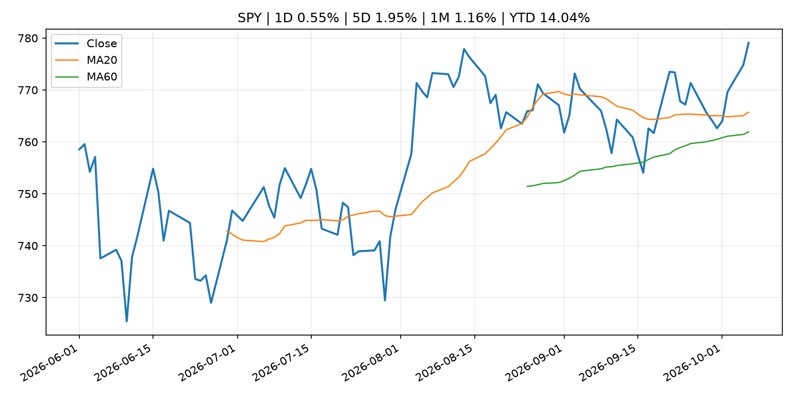
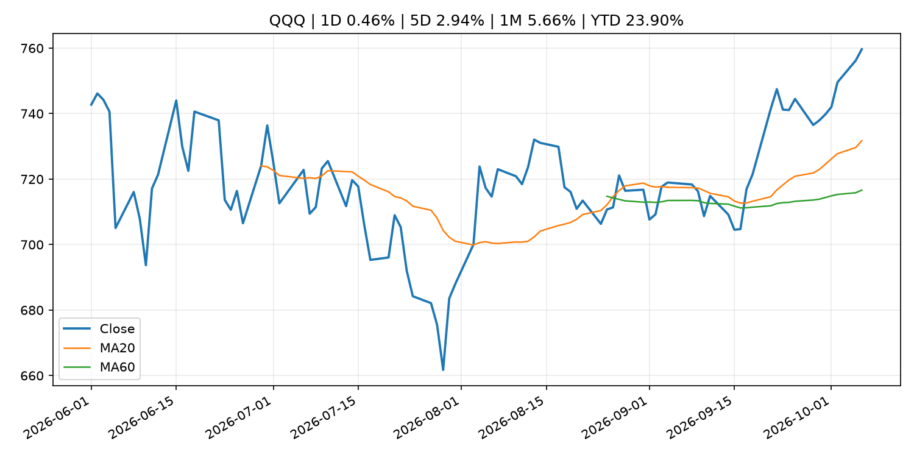
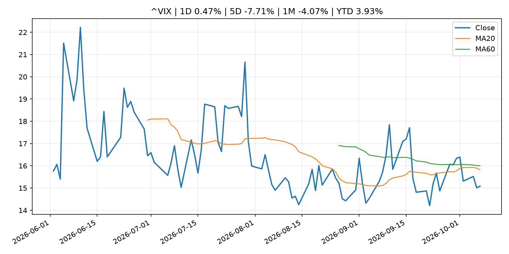
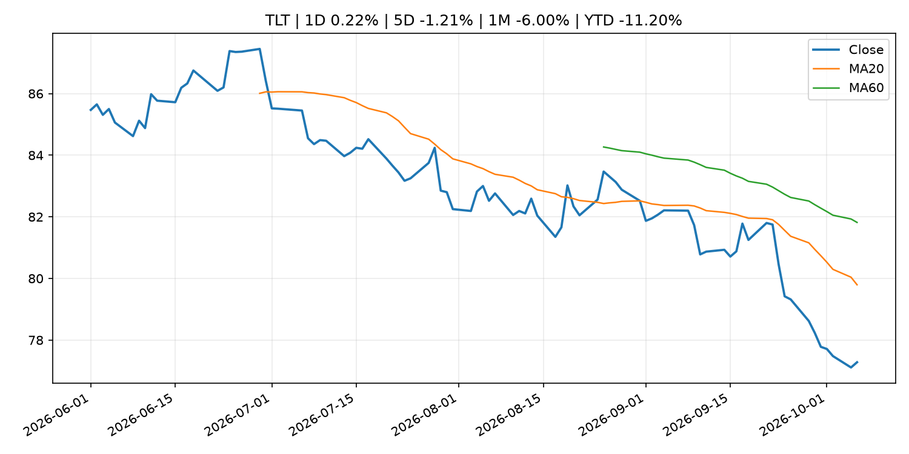
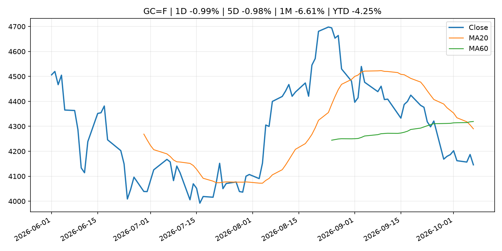
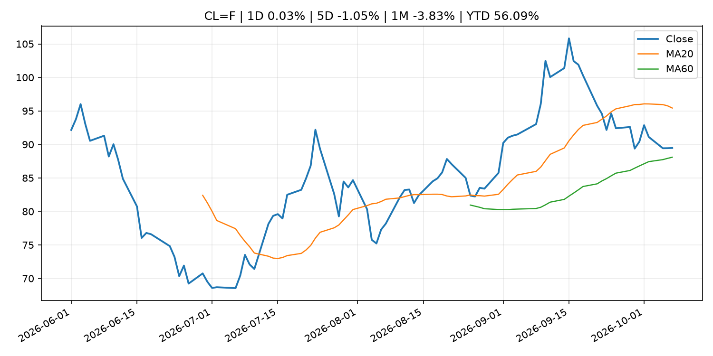
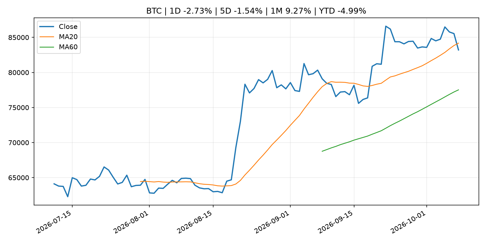
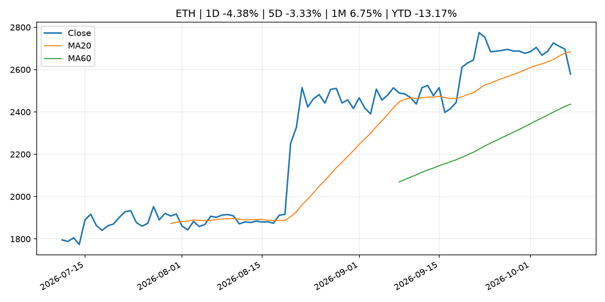
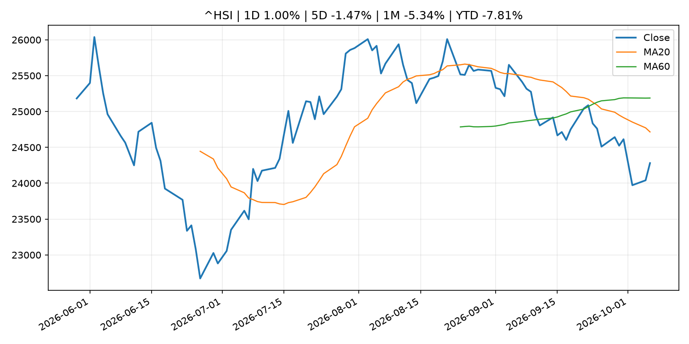

# Global Macro Morning Briefing - 2026-10-08

> Not financial advice / 非投资建议。

## 0. 今日总览
- 市场状态：unknown。市场信号不足，暂不判断明确状态。
- 今日三大主线：
  1. central_bank_decision: Fed’s minutes show no appetite for a series of interest-rate hikes
  2. financial_stability: Wells Fargo in talks with Kraken parent Payward for crypto trading liquidity
  3. central_bank_decision: Robinhood adds $25 million of bitcoin to its balance sheet
- 一句话结论：今日晨报重点关注：央行决策会重定价利率、汇率、久期资产和风险资产。；金融稳定信号可能放大跨资产波动，并影响央行反应函数。。跨资产方面，SPY 1D 0.55%；QQQ 1D 0.46%；^VIX 1D 0.47%；TLT 1D 0.22%；GC=F 1D -0.99%；CL=F 1D 0.03%；BTC 1D -2.73%；ETH 1D -4.38%；市场信号不足，暂不判断明确状态。政策、通胀、利率、美元、美债、能源和加密监管仍是主要观察线索。所有结论仅基于公开数据与短摘要整理，不构成投资建议。

## 1. 隔夜跨资产市场
- 美股：SPY 1D 0.55%，QQQ 1D 0.46%，整体趋势需结合 VIX 和利率确认。
- 美债/美元：TLT 1D 0.22%，美元指数 1D 0.39%，是判断折现率压力的核心线索。
- 黄金/原油：黄金 1D -0.99%，原油 1D 0.03%，用于观察避险、通胀和地缘风险。
- 加密：BTC 1D -2.73%，ETH 1D -4.38%，关注是否独立于纳指走出加密自身行情。
- 港股/A股：恒生 1D 1.00%，沪深300/上证 1D n/a，重点看中国政策预期与人民币线索。
- 风险观察：关注后续数据是否确认当前跨资产信号。

### US_EQUITY

| symbol | latest close | 1D | 5D | 1M | YTD | trend |
|---|---:|---:|---:|---:|---:|---|
| SPY | 779.09 | 0.55% | 1.95% | 1.16% | 14.04% | uptrend |
| QQQ | 759.66 | 0.46% | 2.94% | 5.66% | 23.90% | strong_uptrend |
| DIA | 514.56 | 0.48% | 0.33% | -3.65% | 6.40% | downtrend |
| IWM | 281.34 | -0.72% | 0.84% | -4.96% | 13.09% | strong_downtrend |
| VTI | 382.54 | 0.51% | 1.94% | 0.74% | 13.75% | uptrend |

### US_MACRO_MARKET

| symbol | latest close | 1D | 5D | 1M | YTD | trend |
|---|---:|---:|---:|---:|---:|---|
| ^VIX | 15.08 | 0.47% | -7.71% | -4.07% | 3.93% | downtrend |
| DX-Y.NYB | 102.23 | 0.39% | 0.77% | 3.43% | 3.87% | strong_uptrend |
| TLT | 77.28 | 0.22% | -1.21% | -6.00% | -11.20% | strong_downtrend |
| IEF | 89.13 | 0.24% | -0.36% | -3.38% | -7.23% | strong_downtrend |

### COMMODITIES

| symbol | latest close | 1D | 5D | 1M | YTD | trend |
|---|---:|---:|---:|---:|---:|---|
| GC=F | 4,145.70 | -0.99% | -0.98% | -6.61% | -4.25% | strong_downtrend |
| SI=F | 60.49 | -1.11% | 0.65% | -8.76% | -14.27% | range_bound |
| CL=F | 89.47 | 0.03% | -1.05% | -3.83% | 56.09% | range_bound |
| BZ=F | 101.68 | 1.09% | -1.79% | 3.84% | 67.37% | range_bound |
| NG=F | 3.26 | 4.82% | 7.87% | 11.93% | -9.78% | strong_uptrend |
| HG=F | 6.73 | 2.00% | 2.55% | -0.19% | 19.26% | uptrend |

### HK_MARKET

| symbol | latest close | 1D | 5D | 1M | YTD | trend |
|---|---:|---:|---:|---:|---:|---|
| ^HSI | 24,280.56 | 1.00% | -1.47% | -5.34% | -7.81% | strong_downtrend |
| 0700.HK | 420.60 | -1.77% | -2.64% | -4.06% | -32.49% | strong_downtrend |
| 9988.HK | 105.40 | -2.59% | -0.75% | -3.83% | -29.26% | downtrend |
| 3690.HK | 70.15 | -0.92% | -0.43% | -12.37% | -32.93% | strong_downtrend |
| 1810.HK | 23.94 | -1.32% | -5.00% | -12.95% | -40.57% | strong_downtrend |
| 1211.HK | 74.55 | -0.60% | -1.58% | -11.78% | -24.51% | strong_downtrend |

### CRYPTO

| symbol | latest close | 1D | 5D | 1M | YTD | trend |
|---|---:|---:|---:|---:|---:|---|
| BTC | 83,207.18 | -2.73% | -1.54% | 9.27% | -4.99% | range_bound |
| ETH | 2,579.01 | -4.38% | -3.33% | 6.75% | -13.17% | range_bound |
| SOLANA | 116.37 | -3.57% | -1.87% | 18.09% | -6.55% | range_bound |
| BINANCECOIN | 773.21 | -0.77% | 0.67% | 6.60% | -10.37% | range_bound |
| RIPPLE | 1.42 | -4.84% | -4.05% | 9.71% | -22.61% | range_bound |

## 2. 今日最重要的 10 条新闻
### 1. Fed’s minutes show no appetite for a series of interest-rate hikes
- 来源：MarketWatch Top Stories
- 时间：2026-10-07T19:35:00+00:00
- 地区：US
- 事件类型：central_bank_decision
- 重要性层级：Tier 1
- 一句话摘要：September’s rate hike was viewed by many officials as needed just in case inflation remains sticky.
- 为什么重要：央行决策会重定价利率、汇率、久期资产和风险资产。
- 可能影响：主要影响 DXY，方向为 positive，强度 high；通胀压力可能推高政策利率预期并支撑美元。
  - 资产：DXY
    方向：positive
    强度：high
    原因：通胀压力可能推高政策利率预期并支撑美元。
  - 资产：TLT
    方向：negative
    强度：high
    原因：通胀上行通常推升收益率、压低长债价格。
  - 资产：QQQ
    方向：negative
    强度：high
    原因：更高利率对成长股估值折现率不利。
  - 资产：SPY
    方向：mixed
    强度：medium
    原因：名义增长可能支撑收入，但更高利率压制估值。
  - 资产：GC=F
    方向：mixed
    强度：medium
    原因：通胀对黄金是支撑，但实际利率上行会形成压力。
  - 资产：BTC
    方向：negative
    强度：high
    原因：流动性收紧通常压制高 beta 加密资产。
- 原文链接：[https://www.marketwatch.com/story/fed-minutes-show-no-appetite-for-a-series-of-interest-rate-hikes-8b1c6436?mod=mw_rss_topstories](https://www.marketwatch.com/story/fed-minutes-show-no-appetite-for-a-series-of-interest-rate-hikes-8b1c6436?mod=mw_rss_topstories)

### 2. Wells Fargo in talks with Kraken parent Payward for crypto trading liquidity
- 来源：CoinDesk
- 时间：2026-10-07T18:59:32+00:00
- 地区：global
- 事件类型：financial_stability
- 重要性层级：Tier 1
- 一句话摘要：Wells Fargo in talks with Kraken parent Payward for crypto trading liquidity
- 为什么重要：金融稳定信号可能放大跨资产波动，并影响央行反应函数。
- 可能影响：可能影响利率、汇率、风险资产或大宗商品预期，但当前公开信息不足以判断明确方向。
  - 资产：暂无明确资产映射
  - 方向：unknown
  - 强度：low
  - 原因：公开信息不足以判断方向。
- 原文链接：[https://www.coindesk.com/business/2026/10/05/wells-fargo-in-talks-with-kraken-parent-payward-for-crypto-trading-liquidity](https://www.coindesk.com/business/2026/10/05/wells-fargo-in-talks-with-kraken-parent-payward-for-crypto-trading-liquidity)

### 3. Robinhood adds $25 million of bitcoin to its balance sheet
- 来源：CoinDesk
- 时间：2026-10-07T08:53:27+00:00
- 地区：global
- 事件类型：central_bank_decision
- 重要性层级：Tier 1
- 一句话摘要：Robinhood adds $25 million of bitcoin to its balance sheet
- 为什么重要：央行决策会重定价利率、汇率、久期资产和风险资产。
- 可能影响：可能影响利率、汇率、风险资产或大宗商品预期，但当前公开信息不足以判断明确方向。
  - 资产：暂无明确资产映射
  - 方向：unknown
  - 强度：low
  - 原因：公开信息不足以判断方向。
- 原文链接：[https://www.coindesk.com/markets/2026/10/07/robinhood-adds-bitcoin-worth-usd25-million-to-its-balance-sheet-report](https://www.coindesk.com/markets/2026/10/07/robinhood-adds-bitcoin-worth-usd25-million-to-its-balance-sheet-report)

### 4. Polygon taps TRON’s $94 billion stablecoin supply for seamless cross-border transfers
- 来源：CoinDesk
- 时间：2026-10-07T16:30:00+00:00
- 地区：global
- 事件类型：crypto_market_structure
- 重要性层级：Tier 2
- 一句话摘要：Polygon taps TRON’s $94 billion stablecoin supply for seamless cross-border transfers
- 为什么重要：加密市场结构和监管变化会影响 BTC、ETH 及相关股票的风险溢价。
- 可能影响：主要影响 BTC，方向为 mixed，强度 high；加密监管或 ETF 进展会改变 BTC 的资金流和风险溢价。
  - 资产：BTC
    方向：mixed
    强度：high
    原因：加密监管或 ETF 进展会改变 BTC 的资金流和风险溢价。
  - 资产：ETH
    方向：mixed
    强度：high
    原因：监管框架会影响 ETH 产品化和机构参与度。
  - 资产：COIN
    方向：mixed
    强度：medium
    原因：监管清晰度和执法风险会影响交易平台估值。
  - 资产：crypto market
    方向：mixed
    强度：high
    原因：信息影响整个加密市场结构，但方向取决于细节。
- 原文链接：[https://www.coindesk.com/business/2026/10/07/polygon-and-tron-partner-to-bridge-usd94-billion-usdt-ecosystem-with-u-s-banking-rails](https://www.coindesk.com/business/2026/10/07/polygon-and-tron-partner-to-bridge-usd94-billion-usdt-ecosystem-with-u-s-banking-rails)

### 5. Tether tapped by Kazakhstan’s central bank to explore stablecoin and tokenization
- 来源：CoinDesk
- 时间：2026-10-07T14:27:37+00:00
- 地区：global
- 事件类型：crypto_market_structure
- 重要性层级：Tier 2
- 一句话摘要：Tether tapped by Kazakhstan’s central bank to explore stablecoin and tokenization
- 为什么重要：加密市场结构和监管变化会影响 BTC、ETH 及相关股票的风险溢价。
- 可能影响：主要影响 BTC，方向为 mixed，强度 high；加密监管或 ETF 进展会改变 BTC 的资金流和风险溢价。
  - 资产：BTC
    方向：mixed
    强度：high
    原因：加密监管或 ETF 进展会改变 BTC 的资金流和风险溢价。
  - 资产：ETH
    方向：mixed
    强度：high
    原因：监管框架会影响 ETH 产品化和机构参与度。
  - 资产：COIN
    方向：mixed
    强度：medium
    原因：监管清晰度和执法风险会影响交易平台估值。
  - 资产：crypto market
    方向：mixed
    强度：high
    原因：信息影响整个加密市场结构，但方向取决于细节。
- 原文链接：[https://www.coindesk.com/business/2026/10/07/tether-tapped-by-kazakhstan-s-central-bank-to-explore-stablecoin-and-tokenization](https://www.coindesk.com/business/2026/10/07/tether-tapped-by-kazakhstan-s-central-bank-to-explore-stablecoin-and-tokenization)

### 6. SEC Seeks Final Judgment Against Former Western Asset Co-CIO Ken Leech in Cherry Picking Case
- 来源：SEC Press Releases
- 时间：2026-10-06T16:30:24-04:00
- 地区：US
- 事件类型：regulation
- 重要性层级：Tier 2
- 一句话摘要：The Securities and Exchange Commission today moved for entry of a final judgment by consent against Stephen Kenneth Leech II, the former co-chief investment officer of registered investment adviser Western Asset Management Company LLC, whom the SEC…
- 为什么重要：监管变化会改变行业盈利预期和资产风险溢价。
- 可能影响：主要影响 BTC，方向为 mixed，强度 high；加密监管或 ETF 进展会改变 BTC 的资金流和风险溢价。
  - 资产：BTC
    方向：mixed
    强度：high
    原因：加密监管或 ETF 进展会改变 BTC 的资金流和风险溢价。
  - 资产：ETH
    方向：mixed
    强度：high
    原因：监管框架会影响 ETH 产品化和机构参与度。
  - 资产：COIN
    方向：mixed
    强度：medium
    原因：监管清晰度和执法风险会影响交易平台估值。
  - 资产：crypto market
    方向：mixed
    强度：high
    原因：信息影响整个加密市场结构，但方向取决于细节。
- 原文链接：[https://www.sec.gov/newsroom/press-releases/2026-103-sec-seeks-final-judgment-against-former-western-asset-co-cio-ken-leech-cherry-picking-case](https://www.sec.gov/newsroom/press-releases/2026-103-sec-seeks-final-judgment-against-former-western-asset-co-cio-ken-leech-cherry-picking-case)

### 7. SEC to Host Virtual National Compliance Outreach Seminar for Investment Companies and Investment Advisers
- 来源：SEC Press Releases
- 时间：2026-10-06T10:37:55-04:00
- 地区：US
- 事件类型：regulation
- 重要性层级：Tier 2
- 一句话摘要：The Securities and Exchange Commission’s Compliance Outreach Program announced today that it will host a virtual national seminar for investment companies and investment advisers on November 19, 2026. The purpose of the event is to help chief compliance…
- 为什么重要：监管变化会改变行业盈利预期和资产风险溢价。
- 可能影响：主要影响 BTC，方向为 mixed，强度 high；加密监管或 ETF 进展会改变 BTC 的资金流和风险溢价。
  - 资产：BTC
    方向：mixed
    强度：high
    原因：加密监管或 ETF 进展会改变 BTC 的资金流和风险溢价。
  - 资产：ETH
    方向：mixed
    强度：high
    原因：监管框架会影响 ETH 产品化和机构参与度。
  - 资产：COIN
    方向：mixed
    强度：medium
    原因：监管清晰度和执法风险会影响交易平台估值。
  - 资产：crypto market
    方向：mixed
    强度：high
    原因：信息影响整个加密市场结构，但方向取决于细节。
- 原文链接：[https://www.sec.gov/newsroom/press-releases/2026-102-sec-host-virtual-national-compliance-outreach-seminar-investment-companies-investment-advisers](https://www.sec.gov/newsroom/press-releases/2026-102-sec-host-virtual-national-compliance-outreach-seminar-investment-companies-investment-advisers)

### 8. Arbitrum joins Paxos-led stablecoin group Global Dollar to capture digital dollar growth
- 来源：CoinDesk
- 时间：2026-10-06T13:02:33+00:00
- 地区：global
- 事件类型：crypto_market_structure
- 重要性层级：Tier 2
- 一句话摘要：Arbitrum joins Paxos-led stablecoin group Global Dollar to capture digital dollar growth
- 为什么重要：加密市场结构和监管变化会影响 BTC、ETH 及相关股票的风险溢价。
- 可能影响：主要影响 BTC，方向为 mixed，强度 high；加密监管或 ETF 进展会改变 BTC 的资金流和风险溢价。
  - 资产：BTC
    方向：mixed
    强度：high
    原因：加密监管或 ETF 进展会改变 BTC 的资金流和风险溢价。
  - 资产：ETH
    方向：mixed
    强度：high
    原因：监管框架会影响 ETH 产品化和机构参与度。
  - 资产：COIN
    方向：mixed
    强度：medium
    原因：监管清晰度和执法风险会影响交易平台估值。
  - 资产：crypto market
    方向：mixed
    强度：high
    原因：信息影响整个加密市场结构，但方向取决于细节。
- 原文链接：[https://www.coindesk.com/business/2026/10/05/arbitrum-joins-paxos-led-stablecoin-group-global-dollar-to-capture-digital-dollar-growth](https://www.coindesk.com/business/2026/10/05/arbitrum-joins-paxos-led-stablecoin-group-global-dollar-to-capture-digital-dollar-growth)

### 9. Goldman: Diesel prices set to stay high through 2027 as refineries struggle to meet demand
- 来源：CNBC Economy
- 时间：2026-10-06T08:47:30+00:00
- 地区：US
- 事件类型：commodity_supply
- 重要性层级：Tier 2
- 一句话摘要：Goldman Sachs says tight refinery capacity could keep diesel prices elevated through 2027, with high margins needed to curb demand and rebuild inventories.
- 为什么重要：大宗商品供给变化会影响能源价格、通胀预期和资源股。
- 可能影响：可能影响利率、汇率、风险资产或大宗商品预期，但当前公开信息不足以判断明确方向。
  - 资产：暂无明确资产映射
  - 方向：unknown
  - 强度：low
  - 原因：公开信息不足以判断方向。
- 原文链接：[https://www.cnbc.com/2026/10/06/diesel-oil-refinery-price-capacity-demand.html](https://www.cnbc.com/2026/10/06/diesel-oil-refinery-price-capacity-demand.html)

### 10. Why AI is both the hope and the hazard for world leaders, according to IMF chief Georgieva
- 来源：CNBC Economy
- 时间：2026-10-07T06:16:39+00:00
- 地区：US
- 事件类型：other
- 重要性层级：Tier 3
- 一句话摘要：Kristalina Georgieva warns that the technology lifting growth hopes is also pushing up inflation and yields, just as public debt levels rose.
- 为什么重要：这条信息暂未匹配到重大宏观、政策或市场事件，更适合作为背景跟踪。
- 可能影响：主要影响 DXY，方向为 positive，强度 high；通胀压力可能推高政策利率预期并支撑美元。
  - 资产：DXY
    方向：positive
    强度：high
    原因：通胀压力可能推高政策利率预期并支撑美元。
  - 资产：TLT
    方向：negative
    强度：high
    原因：通胀上行通常推升收益率、压低长债价格。
  - 资产：QQQ
    方向：negative
    强度：high
    原因：更高利率对成长股估值折现率不利。
  - 资产：SPY
    方向：mixed
    强度：medium
    原因：名义增长可能支撑收入，但更高利率压制估值。
  - 资产：GC=F
    方向：mixed
    强度：medium
    原因：通胀对黄金是支撑，但实际利率上行会形成压力。
  - 资产：BTC
    方向：mixed
    强度：medium
    原因：抗通胀叙事和流动性收紧可能相互抵消。
- 原文链接：[https://www.cnbc.com/2026/10/07/economy-inflation-ai-trade-imf-iran-hormuz-trump-.html](https://www.cnbc.com/2026/10/07/economy-inflation-ai-trade-imf-iran-hormuz-trump-.html)

## 3. 政策与央行观察
### 1. Fed’s minutes show no appetite for a series of interest-rate hikes
- 来源：MarketWatch Top Stories
- 时间：2026-10-07T19:35:00+00:00
- 地区：US
- 事件类型：central_bank_decision
- 重要性层级：Tier 1
- 一句话摘要：September’s rate hike was viewed by many officials as needed just in case inflation remains sticky.
- 为什么重要：央行决策会重定价利率、汇率、久期资产和风险资产。
- 可能影响：主要影响 DXY，方向为 positive，强度 high；通胀压力可能推高政策利率预期并支撑美元。
  - 资产：DXY
    方向：positive
    强度：high
    原因：通胀压力可能推高政策利率预期并支撑美元。
  - 资产：TLT
    方向：negative
    强度：high
    原因：通胀上行通常推升收益率、压低长债价格。
  - 资产：QQQ
    方向：negative
    强度：high
    原因：更高利率对成长股估值折现率不利。
  - 资产：SPY
    方向：mixed
    强度：medium
    原因：名义增长可能支撑收入，但更高利率压制估值。
  - 资产：GC=F
    方向：mixed
    强度：medium
    原因：通胀对黄金是支撑，但实际利率上行会形成压力。
  - 资产：BTC
    方向：negative
    强度：high
    原因：流动性收紧通常压制高 beta 加密资产。
- 原文链接：[https://www.marketwatch.com/story/fed-minutes-show-no-appetite-for-a-series-of-interest-rate-hikes-8b1c6436?mod=mw_rss_topstories](https://www.marketwatch.com/story/fed-minutes-show-no-appetite-for-a-series-of-interest-rate-hikes-8b1c6436?mod=mw_rss_topstories)

### 2. Wells Fargo in talks with Kraken parent Payward for crypto trading liquidity
- 来源：CoinDesk
- 时间：2026-10-07T18:59:32+00:00
- 地区：global
- 事件类型：financial_stability
- 重要性层级：Tier 1
- 一句话摘要：Wells Fargo in talks with Kraken parent Payward for crypto trading liquidity
- 为什么重要：金融稳定信号可能放大跨资产波动，并影响央行反应函数。
- 可能影响：可能影响利率、汇率、风险资产或大宗商品预期，但当前公开信息不足以判断明确方向。
  - 资产：暂无明确资产映射
  - 方向：unknown
  - 强度：low
  - 原因：公开信息不足以判断方向。
- 原文链接：[https://www.coindesk.com/business/2026/10/05/wells-fargo-in-talks-with-kraken-parent-payward-for-crypto-trading-liquidity](https://www.coindesk.com/business/2026/10/05/wells-fargo-in-talks-with-kraken-parent-payward-for-crypto-trading-liquidity)

### 3. Robinhood adds $25 million of bitcoin to its balance sheet
- 来源：CoinDesk
- 时间：2026-10-07T08:53:27+00:00
- 地区：global
- 事件类型：central_bank_decision
- 重要性层级：Tier 1
- 一句话摘要：Robinhood adds $25 million of bitcoin to its balance sheet
- 为什么重要：央行决策会重定价利率、汇率、久期资产和风险资产。
- 可能影响：可能影响利率、汇率、风险资产或大宗商品预期，但当前公开信息不足以判断明确方向。
  - 资产：暂无明确资产映射
  - 方向：unknown
  - 强度：low
  - 原因：公开信息不足以判断方向。
- 原文链接：[https://www.coindesk.com/markets/2026/10/07/robinhood-adds-bitcoin-worth-usd25-million-to-its-balance-sheet-report](https://www.coindesk.com/markets/2026/10/07/robinhood-adds-bitcoin-worth-usd25-million-to-its-balance-sheet-report)

### 4. Polygon taps TRON’s $94 billion stablecoin supply for seamless cross-border transfers
- 来源：CoinDesk
- 时间：2026-10-07T16:30:00+00:00
- 地区：global
- 事件类型：crypto_market_structure
- 重要性层级：Tier 2
- 一句话摘要：Polygon taps TRON’s $94 billion stablecoin supply for seamless cross-border transfers
- 为什么重要：加密市场结构和监管变化会影响 BTC、ETH 及相关股票的风险溢价。
- 可能影响：主要影响 BTC，方向为 mixed，强度 high；加密监管或 ETF 进展会改变 BTC 的资金流和风险溢价。
  - 资产：BTC
    方向：mixed
    强度：high
    原因：加密监管或 ETF 进展会改变 BTC 的资金流和风险溢价。
  - 资产：ETH
    方向：mixed
    强度：high
    原因：监管框架会影响 ETH 产品化和机构参与度。
  - 资产：COIN
    方向：mixed
    强度：medium
    原因：监管清晰度和执法风险会影响交易平台估值。
  - 资产：crypto market
    方向：mixed
    强度：high
    原因：信息影响整个加密市场结构，但方向取决于细节。
- 原文链接：[https://www.coindesk.com/business/2026/10/07/polygon-and-tron-partner-to-bridge-usd94-billion-usdt-ecosystem-with-u-s-banking-rails](https://www.coindesk.com/business/2026/10/07/polygon-and-tron-partner-to-bridge-usd94-billion-usdt-ecosystem-with-u-s-banking-rails)

### 5. Tether tapped by Kazakhstan’s central bank to explore stablecoin and tokenization
- 来源：CoinDesk
- 时间：2026-10-07T14:27:37+00:00
- 地区：global
- 事件类型：crypto_market_structure
- 重要性层级：Tier 2
- 一句话摘要：Tether tapped by Kazakhstan’s central bank to explore stablecoin and tokenization
- 为什么重要：加密市场结构和监管变化会影响 BTC、ETH 及相关股票的风险溢价。
- 可能影响：主要影响 BTC，方向为 mixed，强度 high；加密监管或 ETF 进展会改变 BTC 的资金流和风险溢价。
  - 资产：BTC
    方向：mixed
    强度：high
    原因：加密监管或 ETF 进展会改变 BTC 的资金流和风险溢价。
  - 资产：ETH
    方向：mixed
    强度：high
    原因：监管框架会影响 ETH 产品化和机构参与度。
  - 资产：COIN
    方向：mixed
    强度：medium
    原因：监管清晰度和执法风险会影响交易平台估值。
  - 资产：crypto market
    方向：mixed
    强度：high
    原因：信息影响整个加密市场结构，但方向取决于细节。
- 原文链接：[https://www.coindesk.com/business/2026/10/07/tether-tapped-by-kazakhstan-s-central-bank-to-explore-stablecoin-and-tokenization](https://www.coindesk.com/business/2026/10/07/tether-tapped-by-kazakhstan-s-central-bank-to-explore-stablecoin-and-tokenization)

### 6. SEC Seeks Final Judgment Against Former Western Asset Co-CIO Ken Leech in Cherry Picking Case
- 来源：SEC Press Releases
- 时间：2026-10-06T16:30:24-04:00
- 地区：US
- 事件类型：regulation
- 重要性层级：Tier 2
- 一句话摘要：The Securities and Exchange Commission today moved for entry of a final judgment by consent against Stephen Kenneth Leech II, the former co-chief investment officer of registered investment adviser Western Asset Management Company LLC, whom the SEC…
- 为什么重要：监管变化会改变行业盈利预期和资产风险溢价。
- 可能影响：主要影响 BTC，方向为 mixed，强度 high；加密监管或 ETF 进展会改变 BTC 的资金流和风险溢价。
  - 资产：BTC
    方向：mixed
    强度：high
    原因：加密监管或 ETF 进展会改变 BTC 的资金流和风险溢价。
  - 资产：ETH
    方向：mixed
    强度：high
    原因：监管框架会影响 ETH 产品化和机构参与度。
  - 资产：COIN
    方向：mixed
    强度：medium
    原因：监管清晰度和执法风险会影响交易平台估值。
  - 资产：crypto market
    方向：mixed
    强度：high
    原因：信息影响整个加密市场结构，但方向取决于细节。
- 原文链接：[https://www.sec.gov/newsroom/press-releases/2026-103-sec-seeks-final-judgment-against-former-western-asset-co-cio-ken-leech-cherry-picking-case](https://www.sec.gov/newsroom/press-releases/2026-103-sec-seeks-final-judgment-against-former-western-asset-co-cio-ken-leech-cherry-picking-case)

### 7. SEC to Host Virtual National Compliance Outreach Seminar for Investment Companies and Investment Advisers
- 来源：SEC Press Releases
- 时间：2026-10-06T10:37:55-04:00
- 地区：US
- 事件类型：regulation
- 重要性层级：Tier 2
- 一句话摘要：The Securities and Exchange Commission’s Compliance Outreach Program announced today that it will host a virtual national seminar for investment companies and investment advisers on November 19, 2026. The purpose of the event is to help chief compliance…
- 为什么重要：监管变化会改变行业盈利预期和资产风险溢价。
- 可能影响：主要影响 BTC，方向为 mixed，强度 high；加密监管或 ETF 进展会改变 BTC 的资金流和风险溢价。
  - 资产：BTC
    方向：mixed
    强度：high
    原因：加密监管或 ETF 进展会改变 BTC 的资金流和风险溢价。
  - 资产：ETH
    方向：mixed
    强度：high
    原因：监管框架会影响 ETH 产品化和机构参与度。
  - 资产：COIN
    方向：mixed
    强度：medium
    原因：监管清晰度和执法风险会影响交易平台估值。
  - 资产：crypto market
    方向：mixed
    强度：high
    原因：信息影响整个加密市场结构，但方向取决于细节。
- 原文链接：[https://www.sec.gov/newsroom/press-releases/2026-102-sec-host-virtual-national-compliance-outreach-seminar-investment-companies-investment-advisers](https://www.sec.gov/newsroom/press-releases/2026-102-sec-host-virtual-national-compliance-outreach-seminar-investment-companies-investment-advisers)

### 8. Arbitrum joins Paxos-led stablecoin group Global Dollar to capture digital dollar growth
- 来源：CoinDesk
- 时间：2026-10-06T13:02:33+00:00
- 地区：global
- 事件类型：crypto_market_structure
- 重要性层级：Tier 2
- 一句话摘要：Arbitrum joins Paxos-led stablecoin group Global Dollar to capture digital dollar growth
- 为什么重要：加密市场结构和监管变化会影响 BTC、ETH 及相关股票的风险溢价。
- 可能影响：主要影响 BTC，方向为 mixed，强度 high；加密监管或 ETF 进展会改变 BTC 的资金流和风险溢价。
  - 资产：BTC
    方向：mixed
    强度：high
    原因：加密监管或 ETF 进展会改变 BTC 的资金流和风险溢价。
  - 资产：ETH
    方向：mixed
    强度：high
    原因：监管框架会影响 ETH 产品化和机构参与度。
  - 资产：COIN
    方向：mixed
    强度：medium
    原因：监管清晰度和执法风险会影响交易平台估值。
  - 资产：crypto market
    方向：mixed
    强度：high
    原因：信息影响整个加密市场结构，但方向取决于细节。
- 原文链接：[https://www.coindesk.com/business/2026/10/05/arbitrum-joins-paxos-led-stablecoin-group-global-dollar-to-capture-digital-dollar-growth](https://www.coindesk.com/business/2026/10/05/arbitrum-joins-paxos-led-stablecoin-group-global-dollar-to-capture-digital-dollar-growth)

## 4. 市场异动与图表
- SPY 上涨 0.55%
- QQQ 上涨 0.46%
- DXY 上涨 0.39%
- Gold 下跌 -0.99%
- BTC 下跌 -2.73%
- ETH 下跌 -4.38%

### SPY

### QQQ

### ^VIX

### TLT

### GC=F

### CL=F

### BTC

### ETH

### ^HSI

## 5. 华尔街与机构公开观点
- 暂无可靠公开观点。

## 6. 今日重点关注
- 经济数据：经济数据：暂无可靠公开日历数据；如配置经济日历源后可自动填充。
- 央行讲话：央行讲话：暂无可靠公开日历数据；重点跟踪 Fed、ECB、BoJ、PBOC 官网 RSS。
- 财报：财报：暂无可靠数据。
- 政策事件：政策事件：暂无可靠数据。
- 风险提醒：风险提醒：关注数据源失败项、突发地缘风险、利率和美元的二阶反应。

## 7. 英文金融表达与宏观概念
- **inflation expectations**：通胀预期，指家庭、企业或市场对未来通胀的预估。 例句：Inflation expectations can shape wage bargaining and bond yields.
- **real yield**：实际收益率，名义利率扣除通胀预期后的收益率。 例句：Gold often reacts more to real yields than nominal yields.
- **terminal rate**：终端利率，市场预期本轮加息周期的最高政策利率。 例句：A higher terminal rate can pressure growth stocks.
- **risk-off**：避险模式，资金偏向美元、国债、黄金等防御资产。 例句：A geopolitical shock can push markets into risk-off mode.
- **market structure**：市场结构，指交易、托管、清算、ETF、监管等制度安排。 例句：Crypto market structure rules can affect institutional participation.
- **soft landing**：软着陆，指通胀回落而经济避免明显衰退。 例句：Markets often rally when data support a soft landing.

## 8. 背景材料
- [Direct Investment by Region and Industry (2nd quarter 2026)](http://www.boj.or.jp/en/statistics/br/bop_06/bpdata/diiqcy.htm)（Bank of Japan Announcements，other）：Direct Investment by Region and Industry (2nd quarter 2026)
- [Rising yields are quietly crashing the stock market’s earlier winners of 2026](https://www.marketwatch.com/story/rising-yields-are-quietly-crashing-the-stock-markets-earlier-winners-of-2026-a29f2863?mod=mw_rss_topstories)（MarketWatch Top Stories，other）：Surging Treasury yields have begun to hammer parts of the stock market that might easily be overlooked, especially with the spotlight once again shining brightly on a small group of glamorous tech companies.
- [Higher yields are taking their toll on all areas of the stock market, except the one that matters](https://www.marketwatch.com/story/higher-yields-are-taking-their-toll-on-all-areas-of-the-stock-market-except-the-one-that-matters-69a90322?mod=mw_rss_topstories)（MarketWatch Top Stories，other）：Technology is the only one of the S&P 500’s 11 sectors that gained since Sept. 1, as Treasury yields have climbed to multi-decade highs.
- [Fed officials see another hike coming, but no sign as to when, minutes show](https://www.cnbc.com/2026/10/07/fed-officials-see-another-hike-coming-but-no-sign-as-to-when-minutes-show.html)（CNBC Economy，other）：The Federal Reserve on Wednesday released minutes from its Sept. 15-16 policy meeting.
- [Minutes of the Federal Open Market Committee, September 15-16, 2026](https://www.federalreserve.gov/newsevents/pressreleases/monetary20261007a.htm)（Federal Reserve Press Releases，other）：Minutes of the Federal Open Market Committee, September 15-16, 2026
- [Here’s what bitcoin needs to break above $87,000](https://www.coindesk.com/daybook-us/2026/10/07/here-s-what-bitcoin-needs-to-break-above-usd87-000)（CoinDesk，other）：Here’s what bitcoin needs to break above $87,000
- [Live updates: Bitcoin edges up from worst levels as yields pull back](https://www.coindesk.com/business/2026/10/07/live-updates-bitcoin-slides-under-usd84-000-as-usd550-million-in-bets-get-liquidated)（CoinDesk，other）：Live updates: Bitcoin edges up from worst levels as yields pull back
- [Bitcoin’s recovery stalls just short of rescuing its last underwater cohort](https://www.coindesk.com/markets/2026/10/07/bitcoin-s-recovery-stalls-just-short-of-rescuing-its-last-underwater-cohort)（CoinDesk，other）：Bitcoin’s recovery stalls just short of rescuing its last underwater cohort
- [Results of the September 2026 survey on credit terms and conditions in euro-denominated securities financing and OTC derivatives markets (SESFOD)](https://www.ecb.europa.eu//press/pr/date/2026/html/ecb.pr261007~6447350434.en.html)（ECB Press Releases，other）：Results of the September 2026 survey on credit terms and conditions in euro-denominated securities financing and OTC derivatives markets (SESFOD)
- [Down but not out. Bitcoin's stair-step bullish trajectory is still intact](https://www.coindesk.com/markets/2026/10/07/down-but-not-out-bitcoin-s-stair-step-bullish-trajectory-is-still-intact)（CoinDesk，other）：Down but not out. Bitcoin's stair-step bullish trajectory is still intact
- [Why AI is both the hope and the hazard for world leaders, according to IMF chief Georgieva](https://www.cnbc.com/2026/10/07/economy-inflation-ai-trade-imf-iran-hormuz-trump-.html)（CNBC Economy，other）：Kristalina Georgieva warns that the technology lifting growth hopes is also pushing up inflation and yields, just as public debt levels rose.
- [Amounts Outstanding in the Call Money Market (Sept.)](http://www.boj.or.jp/en/statistics/market/short/call/call.xlsx)（Bank of Japan Announcements，other）：Amounts Outstanding in the Call Money Market (Sept.)
- [Consumption Activity Index](http://www.boj.or.jp/en/research/research_data/cai/index.htm)（Bank of Japan Announcements，other）：Consumption Activity Index
- [Pudgy Penguins’ Abstract becomes second Ethereum layer 2 to shut in a week](https://www.coindesk.com/tech/2026/10/07/pudgy-penguins-abstract-becomes-second-ethereum-layer-2-to-shut-in-a-week)（CoinDesk，other）：Pudgy Penguins’ Abstract becomes second Ethereum layer 2 to shut in a week
- [Bitcoin dips below $84,000 as oil jumps on Iranian tanker attacks](https://www.coindesk.com/markets/2026/10/07/bitcoin-dips-below-usd84-000-as-oil-jumps-on-iranian-tanker-attacks)（CoinDesk，other）：Bitcoin dips below $84,000 as oil jumps on Iranian tanker attacks
- [Bank of Japan Accounts (September 30)](http://www.boj.or.jp/en/statistics/boj/other/acmai/release/2026/ac260930.htm)（Bank of Japan Announcements，routine_announcement）：Bank of Japan Accounts (September 30)
- [Monetary Base and the Bank of Japan's Transactions (Sept.)](http://www.boj.or.jp/en/statistics/boj/other/mbt/mbt2609.pdf)（Bank of Japan Announcements，other）：Monetary Base and the Bank of Japan's Transactions (Sept.)
- [Bank of Japan's Transactions with the Government (Sept.)](http://www.boj.or.jp/en/statistics/boj/other/tseifu/release/2026/seifu2609.pdf)（Bank of Japan Announcements，other）：Bank of Japan's Transactions with the Government (Sept.)
- [Market Operations by the Bank of Japan (Sept.)](http://www.boj.or.jp/en/statistics/boj/fm/ope/m_release/2026/ope2609.xlsx)（Bank of Japan Announcements，other）：Market Operations by the Bank of Japan (Sept.)
- [Chart: A look at the S&P 500's remarkable and defiant trip to a new record](https://www.cnbc.com/2026/10/06/chart-a-look-at-the-sp-500s-remarkable-and-defiant-trip-a-new-record.html)（CNBC Economy，other）：The S&P 500 returned to an intraday record Tuesday as tech gains, easing oil prices and Treasury yields helped stocks overcome months of market shocks.

## 9. 数据源、失败项与免责声明
- 采集时间：2026-10-08T01:35:20
- 数据源：公开 RSS、Yahoo Finance、CoinGecko、AKShare、FRED、SEC data.sec.gov，以及用户自有 inputs/reports 文件。
- 合规说明：不绕过 WSJ、Bloomberg、FT、Reuters 等付费墙；对付费媒体只使用公开 RSS 标题、摘要、链接和发布时间。
- 免责声明：Not financial advice / 非投资建议。本项目仅供个人学习、研究和信息整理，不构成投资建议、交易建议或任何收益承诺。
- 失败或跳过的数据源：
  - crypto data failed coin=dogecoin
  - China market data failed symbol=上证指数: empty dataframe
  - China market data failed symbol=深证成指: empty dataframe
  - China market data failed symbol=创业板指: empty dataframe
  - China market data failed symbol=沪深300: empty dataframe
  - China market data failed symbol=中证500: empty dataframe
  - China market data failed symbol=科创50: empty dataframe
  - FRED_API_KEY not set; skipping FRED macro series
  - SEC failed cik=0000320193
  - SEC failed cik=0000789019
  - SEC failed cik=0001045810
  - SEC failed cik=0001318605
  - SEC failed cik=0001577552
