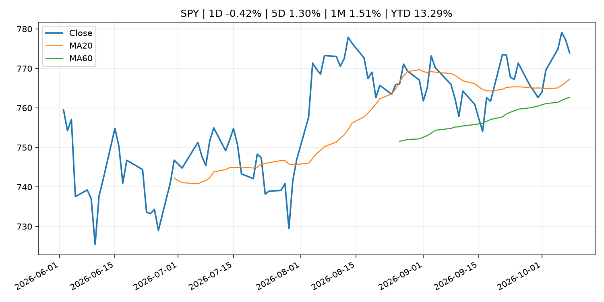
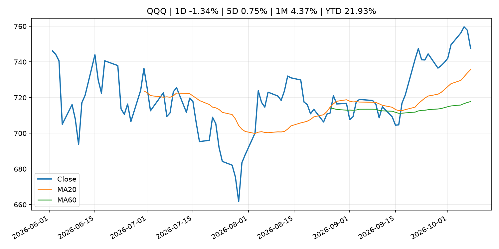
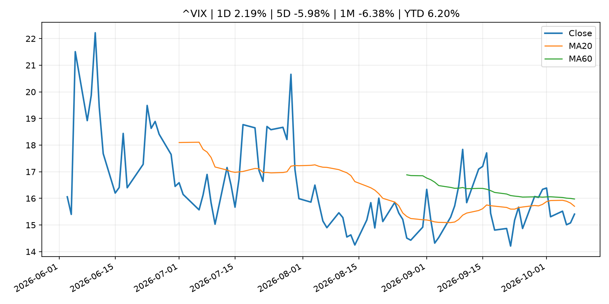
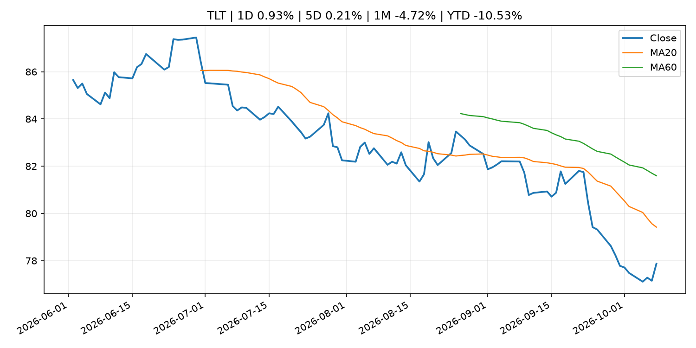
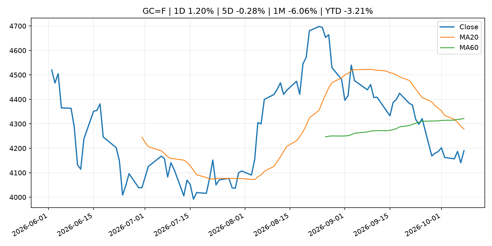
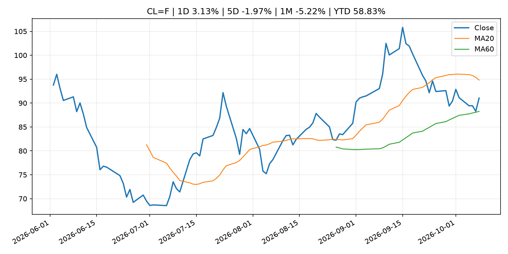
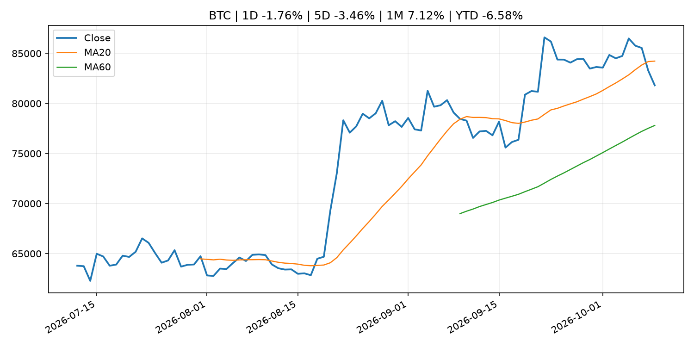
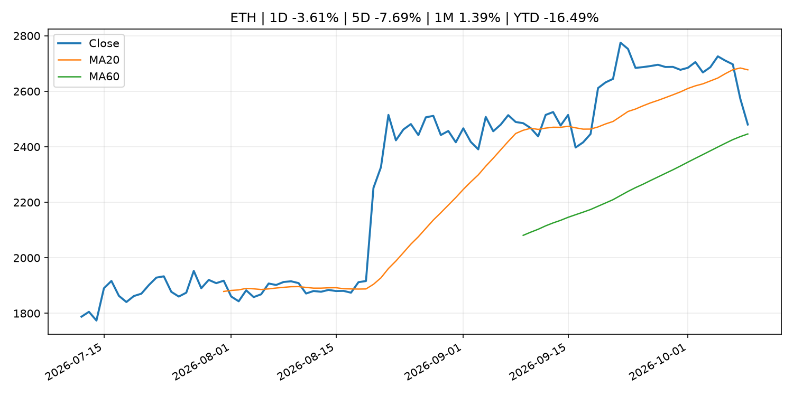
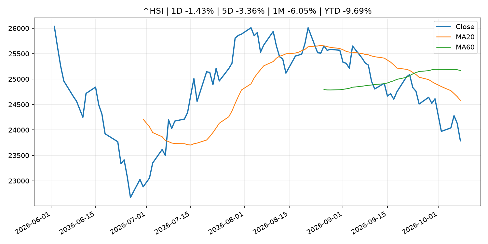

# Global Macro Morning Briefing - 2026-10-09

> Not financial advice / 非投资建议。

## 0. 今日总览
- 市场状态：risk_off。股指回落、VIX 抬升且避险资产走强，市场偏风险规避。
- 今日三大主线：
  1. fiscal_policy: Huawei doubles down on smartphones as EV sales slow
  2. earnings: Securitize brings Apple, Nvidia and Tesla to Solana, with NYSE trading in the works
  3. regulation: Federal Reserve Board announces enforcement action against American Express Company to address, among other things, the firm’s failure to sufficiently detect and report certain suspicious activity related to money laundering
- 一句话结论：今日晨报重点关注：财政和贸易政策会影响增长、通胀、企业利润和跨境资本流。；大型科技股盈利和资本开支会影响纳指、半导体和 AI 交易主线。。跨资产方面，SPY 1D -0.42%；QQQ 1D -1.34%；^VIX 1D 2.19%；TLT 1D 0.93%；GC=F 1D 1.20%；CL=F 1D 3.13%；BTC 1D -1.76%；ETH 1D -3.61%；股指回落、VIX 抬升且避险资产走强，市场偏风险规避。政策、通胀、利率、美元、美债、能源和加密监管仍是主要观察线索。所有结论仅基于公开数据与短摘要整理，不构成投资建议。

## 1. 隔夜跨资产市场
- 美股：SPY 1D -0.42%，QQQ 1D -1.34%，整体趋势需结合 VIX 和利率确认。
- 美债/美元：TLT 1D 0.93%，美元指数 1D -0.23%，是判断折现率压力的核心线索。
- 黄金/原油：黄金 1D 1.20%，原油 1D 3.13%，用于观察避险、通胀和地缘风险。
- 加密：BTC 1D -1.76%，ETH 1D -3.61%，关注是否独立于纳指走出加密自身行情。
- 港股/A股：恒生 1D -1.43%，沪深300/上证 1D n/a，重点看中国政策预期与人民币线索。
- 风险观察：关注避险是否演变为信用或流动性压力。

### US_EQUITY

| symbol | latest close | 1D | 5D | 1M | YTD | trend |
|---|---:|---:|---:|---:|---:|---|
| SPY | 773.93 | -0.42% | 1.30% | 1.51% | 13.29% | uptrend |
| QQQ | 747.58 | -1.34% | 0.75% | 4.37% | 21.93% | strong_uptrend |
| DIA | 511.65 | 0.12% | 0.60% | -2.37% | 5.79% | downtrend |
| IWM | 277.57 | -0.05% | -0.52% | -4.50% | 11.57% | strong_downtrend |
| VTI | 379.56 | -0.39% | 1.17% | 1.07% | 12.86% | uptrend |

### US_MACRO_MARKET

| symbol | latest close | 1D | 5D | 1M | YTD | trend |
|---|---:|---:|---:|---:|---:|---|
| ^VIX | 15.41 | 2.19% | -5.98% | -6.38% | 6.20% | downtrend |
| DX-Y.NYB | 102.00 | -0.23% | -0.10% | 3.27% | 3.64% | strong_uptrend |
| TLT | 77.87 | 0.93% | 0.21% | -4.72% | -10.53% | strong_downtrend |
| IEF | 89.45 | 0.38% | 0.17% | -2.67% | -6.90% | downtrend |

### COMMODITIES

| symbol | latest close | 1D | 5D | 1M | YTD | trend |
|---|---:|---:|---:|---:|---:|---|
| GC=F | 4,190.50 | 1.20% | -0.28% | -6.06% | -3.21% | strong_downtrend |
| SI=F | 60.20 | 0.50% | -0.86% | -11.40% | -14.68% | strong_downtrend |
| CL=F | 91.04 | 3.13% | -1.97% | -5.22% | 58.83% | range_bound |
| BZ=F | 103.74 | 3.53% | 1.40% | 2.50% | 70.77% | uptrend |
| NG=F | 3.13 | -2.12% | 5.66% | 11.09% | -13.35% | strong_uptrend |
| HG=F | 6.61 | 0.27% | 2.04% | -2.79% | 17.27% | uptrend |

### HK_MARKET

| symbol | latest close | 1D | 5D | 1M | YTD | trend |
|---|---:|---:|---:|---:|---:|---|
| ^HSI | 23,785.79 | -1.43% | -3.36% | -6.05% | -9.69% | strong_downtrend |
| 0700.HK | 411.40 | -2.19% | -4.55% | -5.51% | -33.96% | strong_downtrend |
| 9988.HK | 104.30 | -1.04% | -2.16% | -4.75% | -30.00% | downtrend |
| 3690.HK | 69.40 | -1.07% | -3.21% | -13.90% | -33.65% | strong_downtrend |
| 1810.HK | 23.66 | -1.17% | -6.26% | -12.11% | -41.26% | strong_downtrend |
| 1211.HK | 72.90 | -2.21% | -3.57% | -13.06% | -26.18% | strong_downtrend |

### CRYPTO

| symbol | latest close | 1D | 5D | 1M | YTD | trend |
|---|---:|---:|---:|---:|---:|---|
| BTC | 81,812.53 | -1.76% | -3.46% | 7.12% | -6.58% | range_bound |
| ETH | 2,480.24 | -3.61% | -7.69% | 1.39% | -16.49% | range_bound |
| SOLANA | 109.34 | -5.92% | -8.58% | 7.65% | -12.19% | range_bound |
| BINANCECOIN | 734.65 | -4.84% | -6.63% | -0.43% | -14.84% | range_bound |
| RIPPLE | 1.39 | -2.07% | -6.38% | 7.40% | -24.40% | range_bound |

## 2. 今日最重要的 10 条新闻
### 1. Huawei doubles down on smartphones as EV sales slow
- 来源：CNBC Economy
- 时间：2026-10-08T08:04:11+00:00
- 地区：US
- 事件类型：fiscal_policy
- 重要性层级：Tier 1
- 一句话摘要：Chinese tech company Huawei wants to rebuild its consumer business after U.S. sanctions halved segment revenue.
- 为什么重要：财政和贸易政策会影响增长、通胀、企业利润和跨境资本流。
- 可能影响：可能影响利率、汇率、风险资产或大宗商品预期，但当前公开信息不足以判断明确方向。
  - 资产：暂无明确资产映射
  - 方向：unknown
  - 强度：low
  - 原因：公开信息不足以判断方向。
- 原文链接：[https://www.cnbc.com/2026/10/08/huawei-china-smartphone-ev-slow.html](https://www.cnbc.com/2026/10/08/huawei-china-smartphone-ev-slow.html)

### 2. Securitize brings Apple, Nvidia and Tesla to Solana, with NYSE trading in the works
- 来源：CoinDesk
- 时间：2026-10-08T13:06:24+00:00
- 地区：global
- 事件类型：earnings
- 重要性层级：Tier 2
- 一句话摘要：Securitize brings Apple, Nvidia and Tesla to Solana, with NYSE trading in the works
- 为什么重要：大型科技股盈利和资本开支会影响纳指、半导体和 AI 交易主线。
- 可能影响：主要影响 QQQ，方向为 mixed，强度 high；AI 资本开支会影响大型科技股盈利和估值预期。
  - 资产：QQQ
    方向：mixed
    强度：high
    原因：AI 资本开支会影响大型科技股盈利和估值预期。
  - 资产：SMH
    方向：mixed
    强度：high
    原因：AI 投资周期直接影响半导体需求。
  - 资产：NVDA
    方向：mixed
    强度：high
    原因：AI 训练和推理需求是英伟达收入预期核心变量。
  - 资产：MSFT
    方向：mixed
    强度：medium
    原因：云和 AI 资本开支影响利润率与增长叙事。
  - 资产：GOOGL
    方向：mixed
    强度：medium
    原因：AI 投资和搜索商业化影响估值。
  - 资产：META
    方向：mixed
    强度：medium
    原因：AI 基建支出与广告效率共同影响市场预期。
- 原文链接：[https://www.coindesk.com/business/2026/10/08/securitize-brings-apple-nvidia-and-tesla-to-solana-with-nyse-trading-in-the-works](https://www.coindesk.com/business/2026/10/08/securitize-brings-apple-nvidia-and-tesla-to-solana-with-nyse-trading-in-the-works)

### 3. Federal Reserve Board announces enforcement action against American Express Company to address, among other things, the firm’s failure to sufficiently detect and report certain suspicious activity related to money laundering
- 来源：Federal Reserve Press Releases
- 时间：2026-10-08T20:30:00+00:00
- 地区：US
- 事件类型：regulation
- 重要性层级：Tier 2
- 一句话摘要：Federal Reserve Board announces enforcement action against American Express Company to address, among other things, the firm’s failure to sufficiently detect and report certain suspicious activity related to money laundering
- 为什么重要：监管变化会改变行业盈利预期和资产风险溢价。
- 可能影响：可能影响利率、汇率、风险资产或大宗商品预期，但当前公开信息不足以判断明确方向。
  - 资产：暂无明确资产映射
  - 方向：unknown
  - 强度：low
  - 原因：公开信息不足以判断方向。
- 原文链接：[https://www.federalreserve.gov/newsevents/pressreleases/enforcement20261008a.htm](https://www.federalreserve.gov/newsevents/pressreleases/enforcement20261008a.htm)

### 4. Why AI is both the hope and the hazard for world leaders, according to IMF chief Georgieva
- 来源：CNBC Economy
- 时间：2026-10-07T06:16:39+00:00
- 地区：US
- 事件类型：other
- 重要性层级：Tier 3
- 一句话摘要：Kristalina Georgieva warns that the technology lifting growth hopes is also pushing up inflation and yields, just as public debt levels rose.
- 为什么重要：这条信息暂未匹配到重大宏观、政策或市场事件，更适合作为背景跟踪。
- 可能影响：主要影响 DXY，方向为 positive，强度 high；通胀压力可能推高政策利率预期并支撑美元。
  - 资产：DXY
    方向：positive
    强度：high
    原因：通胀压力可能推高政策利率预期并支撑美元。
  - 资产：TLT
    方向：negative
    强度：high
    原因：通胀上行通常推升收益率、压低长债价格。
  - 资产：QQQ
    方向：negative
    强度：high
    原因：更高利率对成长股估值折现率不利。
  - 资产：SPY
    方向：mixed
    强度：medium
    原因：名义增长可能支撑收入，但更高利率压制估值。
  - 资产：GC=F
    方向：mixed
    强度：medium
    原因：通胀对黄金是支撑，但实际利率上行会形成压力。
  - 资产：BTC
    方向：mixed
    强度：medium
    原因：抗通胀叙事和流动性收紧可能相互抵消。
- 原文链接：[https://www.cnbc.com/2026/10/07/economy-inflation-ai-trade-imf-iran-hormuz-trump-.html](https://www.cnbc.com/2026/10/07/economy-inflation-ai-trade-imf-iran-hormuz-trump-.html)

### 5. Bitcoin ETF investors head for the exit, and it's the biggest rush in months
- 来源：CoinDesk
- 时间：2026-10-08T11:15:00+00:00
- 地区：global
- 事件类型：other
- 重要性层级：Tier 3
- 一句话摘要：Bitcoin ETF investors head for the exit, and it's the biggest rush in months
- 为什么重要：这条信息暂未匹配到重大宏观、政策或市场事件，更适合作为背景跟踪。
- 可能影响：主要影响 BTC，方向为 mixed，强度 high；加密监管或 ETF 进展会改变 BTC 的资金流和风险溢价。
  - 资产：BTC
    方向：mixed
    强度：high
    原因：加密监管或 ETF 进展会改变 BTC 的资金流和风险溢价。
  - 资产：ETH
    方向：mixed
    强度：high
    原因：监管框架会影响 ETH 产品化和机构参与度。
  - 资产：COIN
    方向：mixed
    强度：medium
    原因：监管清晰度和执法风险会影响交易平台估值。
  - 资产：crypto market
    方向：mixed
    强度：high
    原因：信息影响整个加密市场结构，但方向取决于细节。
- 原文链接：[https://www.coindesk.com/daybook-us/2026/10/08/bitcoin-etf-investors-head-for-the-exit-and-it-s-the-biggest-rush-in-months](https://www.coindesk.com/daybook-us/2026/10/08/bitcoin-etf-investors-head-for-the-exit-and-it-s-the-biggest-rush-in-months)

## 3. 政策与央行观察
### 1. Huawei doubles down on smartphones as EV sales slow
- 来源：CNBC Economy
- 时间：2026-10-08T08:04:11+00:00
- 地区：US
- 事件类型：fiscal_policy
- 重要性层级：Tier 1
- 一句话摘要：Chinese tech company Huawei wants to rebuild its consumer business after U.S. sanctions halved segment revenue.
- 为什么重要：财政和贸易政策会影响增长、通胀、企业利润和跨境资本流。
- 可能影响：可能影响利率、汇率、风险资产或大宗商品预期，但当前公开信息不足以判断明确方向。
  - 资产：暂无明确资产映射
  - 方向：unknown
  - 强度：low
  - 原因：公开信息不足以判断方向。
- 原文链接：[https://www.cnbc.com/2026/10/08/huawei-china-smartphone-ev-slow.html](https://www.cnbc.com/2026/10/08/huawei-china-smartphone-ev-slow.html)

### 2. Federal Reserve Board announces enforcement action against American Express Company to address, among other things, the firm’s failure to sufficiently detect and report certain suspicious activity related to money laundering
- 来源：Federal Reserve Press Releases
- 时间：2026-10-08T20:30:00+00:00
- 地区：US
- 事件类型：regulation
- 重要性层级：Tier 2
- 一句话摘要：Federal Reserve Board announces enforcement action against American Express Company to address, among other things, the firm’s failure to sufficiently detect and report certain suspicious activity related to money laundering
- 为什么重要：监管变化会改变行业盈利预期和资产风险溢价。
- 可能影响：可能影响利率、汇率、风险资产或大宗商品预期，但当前公开信息不足以判断明确方向。
  - 资产：暂无明确资产映射
  - 方向：unknown
  - 强度：low
  - 原因：公开信息不足以判断方向。
- 原文链接：[https://www.federalreserve.gov/newsevents/pressreleases/enforcement20261008a.htm](https://www.federalreserve.gov/newsevents/pressreleases/enforcement20261008a.htm)

## 4. 市场异动与图表
- SPY 下跌 -0.42%
- QQQ 下跌 -1.34%
- TLT 上涨 0.93%
- Gold 上涨 1.20%
- Oil 上涨 3.13%
- ETH 下跌 -3.61%

### SPY

### QQQ

### ^VIX

### TLT

### GC=F

### CL=F

### BTC

### ETH

### ^HSI

## 5. 华尔街与机构公开观点
- 暂无可靠公开观点。

## 6. 今日重点关注
- 经济数据：经济数据：暂无可靠公开日历数据；如配置经济日历源后可自动填充。
- 央行讲话：央行讲话：暂无可靠公开日历数据；重点跟踪 Fed、ECB、BoJ、PBOC 官网 RSS。
- 财报：财报：暂无可靠数据。
- 政策事件：政策事件：暂无可靠数据。
- 风险提醒：风险提醒：关注数据源失败项、突发地缘风险、利率和美元的二阶反应。

## 7. 英文金融表达与宏观概念
- **inflation expectations**：通胀预期，指家庭、企业或市场对未来通胀的预估。 例句：Inflation expectations can shape wage bargaining and bond yields.
- **real yield**：实际收益率，名义利率扣除通胀预期后的收益率。 例句：Gold often reacts more to real yields than nominal yields.
- **risk-off**：避险模式，资金偏向美元、国债、黄金等防御资产。 例句：A geopolitical shock can push markets into risk-off mode.
- **market structure**：市场结构，指交易、托管、清算、ETF、监管等制度安排。 例句：Crypto market structure rules can affect institutional participation.
- **AI capex**：AI 资本开支，指云厂商和科技公司投入 AI 基建的支出。 例句：AI capex guidance can move semiconductor stocks.
- **terminal rate**：终端利率，市场预期本轮加息周期的最高政策利率。 例句：A higher terminal rate can pressure growth stocks.

## 8. 背景材料
- [Wall Street's tokenization boom could have bigger winners than bitcoin and ether, Citrini says](https://www.coindesk.com/markets/2026/10/08/wall-street-s-tokenization-boom-could-have-bigger-winners-than-bitcoin-and-ether-citrini-says)（CoinDesk，other）：Wall Street's tokenization boom could have bigger winners than bitcoin and ether, Citrini says
- [U.S. government moves $1 billion in bitcoin tied to Bitfinex hack, with no sign of sale](https://www.coindesk.com/business/2026/10/08/u-s-government-moves-usd1-billion-in-bitcoin-from-bitfinex-hack-wallet-no-sale-indicated)（CoinDesk，other）：U.S. government moves $1 billion in bitcoin tied to Bitfinex hack, with no sign of sale
- [EU securities regulator gives crypto platforms 3 months to remove unauthorized stablecoins](https://www.coindesk.com/policy/2026/10/08/eu-securities-regulator-gives-crypto-platforms-3-months-to-remove-unauthorized-stablecoins)（CoinDesk，other）：EU securities regulator gives crypto platforms 3 months to remove unauthorized stablecoins
- [Crypto for Advisors: Digital assets outran stocks and gold in Q3](https://www.coindesk.com/coindesk-indices/2026/10/08/crypto-for-advisors-digital-assets-outran-stocks-and-gold-in-q3)（CoinDesk，other）：Crypto for Advisors: Digital assets outran stocks and gold in Q3
- [Over 6 million bitcoin sit behind exposed public keys as AI warnings mount](https://www.coindesk.com/markets/2026/10/08/over-6-million-bitcoin-sit-behind-exposed-public-keys-as-ai-warnings-mount)（CoinDesk，other）：Over 6 million bitcoin sit behind exposed public keys as AI warnings mount
- [Bitcoin and ether holders urged to enter ‘bunker mode’ against possible AI attacks](https://www.coindesk.com/tech/2026/10/08/bitcoin-and-ether-holders-urged-to-prepare-bunker-mode-against-possible-ai-attacks)（CoinDesk，other）：Bitcoin and ether holders urged to enter ‘bunker mode’ against possible AI attacks
- [Bitcoin mined for pennies in 2010 moves after 16 years, now worth $8.5 million](https://www.coindesk.com/tech/2026/10/08/bitcoin-mined-for-pennies-in-2010-moves-after-16-years-now-worth-usd8-5-million)（CoinDesk，other）：Bitcoin mined for pennies in 2010 moves after 16 years, now worth $8.5 million
- [Meeting of 9-10 September 2026](https://www.ecb.europa.eu//press/accounts/2026/html/ecb.mg261008~a10153d090.en.html)（ECB Press Releases，other）：Meeting of 9-10 September 2026
- [Bitcoin ETF investors head for the exit, and it's the biggest rush in months](https://www.coindesk.com/daybook-us/2026/10/08/bitcoin-etf-investors-head-for-the-exit-and-it-s-the-biggest-rush-in-months)（CoinDesk，other）：Bitcoin ETF investors head for the exit, and it's the biggest rush in months
- [Live updates: Bitcoin pulls off worst levels late in Thursday session](https://www.coindesk.com/markets/2026/10/08/live-news-risk-assets-under-pressure-as-bond-selloff-and-oil-rally-intensify)（CoinDesk，other）：Live updates: Bitcoin pulls off worst levels late in Thursday session
- [Bitcoin slips below $83,000 as Ethereum researcher's 'bunker mode' call divides crypto](https://www.coindesk.com/markets/2026/10/08/bitcoin-slips-below-usd83-000-as-ethereum-researcher-s-bunker-mode-call-divides-crypto)（CoinDesk，other）：Bitcoin slips below $83,000 as Ethereum researcher's 'bunker mode' call divides crypto
- [After a yearslong slump, China's real estate market may be set for a turnaround](https://www.cnbc.com/2026/10/08/chinas-real-estate-market-may-be-set-for-a-turnaround-sp-says.html)（CNBC Economy，other）：A recovery in China's largest cities real estate markets could come as soon as next year, the S&P ratings agency said.
- [Piero Cipollone: Interview with Corriere della Sera](https://www.ecb.europa.eu//press/inter/date/2026/html/ecb.in261008~3184e7d0d0.en.html)（ECB Press Releases，other）：Piero Cipollone: Interview with Corriere della Sera
- [Bitcoin loans are paying for tuition and working capital, not just trades, lenders say](https://www.coindesk.com/markets/2026/10/08/bitcoin-loans-are-paying-for-tuition-and-working-capital-not-just-trades-lenders-say)（CoinDesk，other）：Bitcoin loans are paying for tuition and working capital, not just trades, lenders say
- [Regional Economic Report (Summary) (Oct. 2026)](http://www.boj.or.jp/en/research/brp/rer/rer261008.htm)（Bank of Japan Announcements，other）：Regional Economic Report (Summary) (Oct. 2026)
- [Bitcoin breaks below $83,000 as oil jumps on Iran strike-plan report](https://www.coindesk.com/markets/2026/10/08/bitcoin-breaks-below-usd83-000-as-oil-jumps-on-iran-strike-plan-report)（CoinDesk，other）：Bitcoin breaks below $83,000 as oil jumps on Iran strike-plan report
- [Direct Investment by Region and Industry (2nd quarter 2026)](http://www.boj.or.jp/en/statistics/br/bop_06/bpdata/diiqcy.htm)（Bank of Japan Announcements，other）：Direct Investment by Region and Industry (2nd quarter 2026)
- [Fed officials see another hike coming, but no sign as to when, minutes show](https://www.cnbc.com/2026/10/07/fed-officials-see-another-hike-coming-but-no-sign-as-to-when-minutes-show.html)（CNBC Economy，other）：The Federal Reserve on Wednesday released minutes from its Sept. 15-16 policy meeting.
- [Minutes of the Federal Open Market Committee, September 15-16, 2026](https://www.federalreserve.gov/newsevents/pressreleases/monetary20261007a.htm)（Federal Reserve Press Releases，other）：Minutes of the Federal Open Market Committee, September 15-16, 2026
- [Results of the September 2026 survey on credit terms and conditions in euro-denominated securities financing and OTC derivatives markets (SESFOD)](https://www.ecb.europa.eu//press/pr/date/2026/html/ecb.pr261007~6447350434.en.html)（ECB Press Releases，other）：Results of the September 2026 survey on credit terms and conditions in euro-denominated securities financing and OTC derivatives markets (SESFOD)

## 9. 数据源、失败项与免责声明
- 采集时间：2026-10-09T01:45:26
- 数据源：公开 RSS、Yahoo Finance、CoinGecko、AKShare、FRED、SEC data.sec.gov，以及用户自有 inputs/reports 文件。
- 合规说明：不绕过 WSJ、Bloomberg、FT、Reuters 等付费墙；对付费媒体只使用公开 RSS 标题、摘要、链接和发布时间。
- 免责声明：Not financial advice / 非投资建议。本项目仅供个人学习、研究和信息整理，不构成投资建议、交易建议或任何收益承诺。
- 失败或跳过的数据源：
  - crypto data failed coin=dogecoin
  - China market data failed symbol=上证指数: empty dataframe
  - China market data failed symbol=深证成指: empty dataframe
  - China market data failed symbol=创业板指: empty dataframe
  - China market data failed symbol=沪深300: empty dataframe
  - China market data failed symbol=中证500: empty dataframe
  - China market data failed symbol=科创50: empty dataframe
  - FRED_API_KEY not set; skipping FRED macro series
  - SEC failed cik=0000320193
  - SEC failed cik=0000789019
  - SEC failed cik=0001045810
  - SEC failed cik=0001318605
  - SEC failed cik=0001577552
