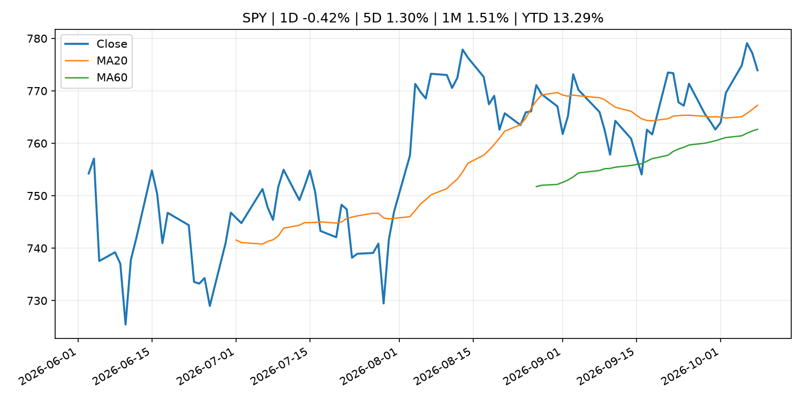
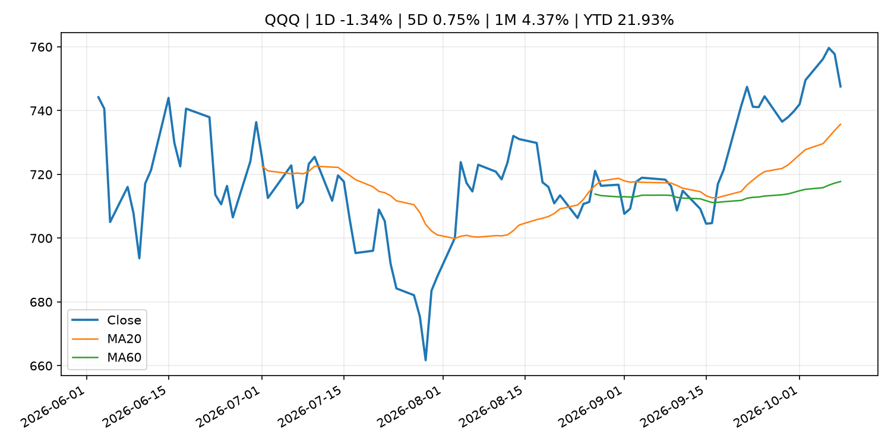
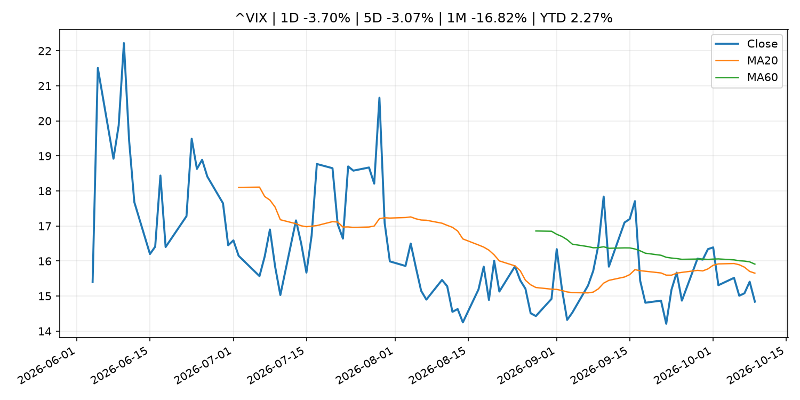
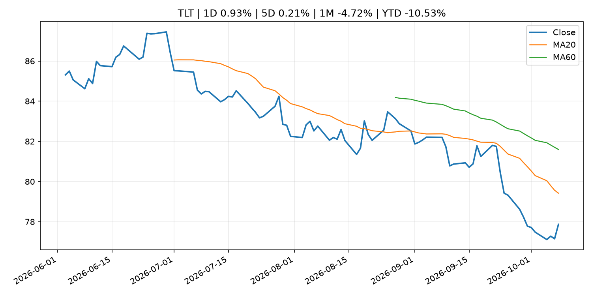
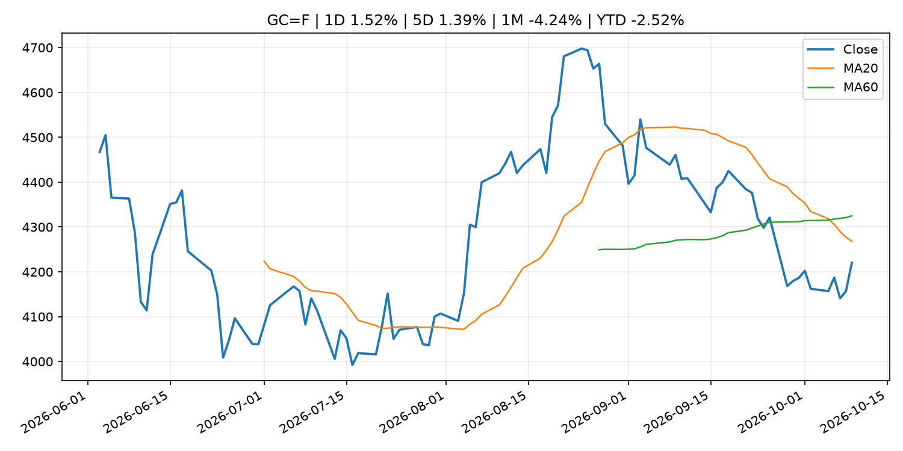
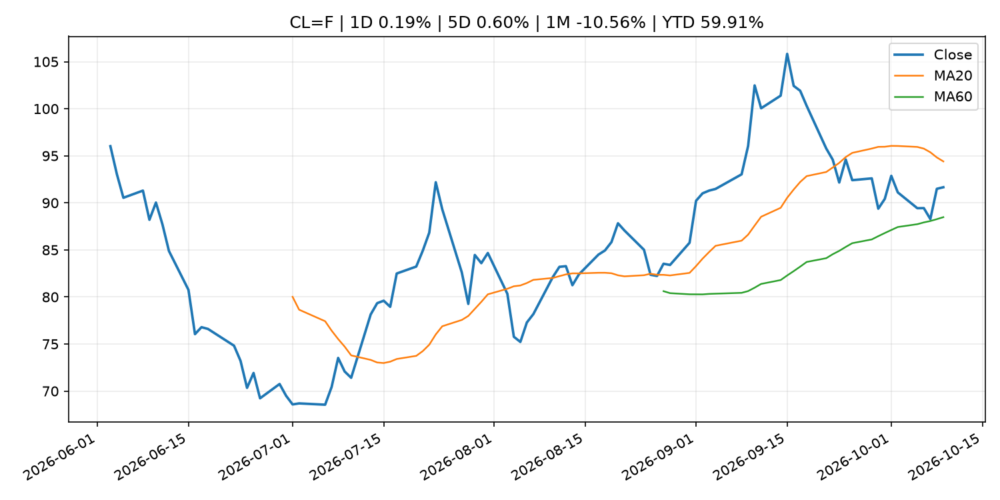
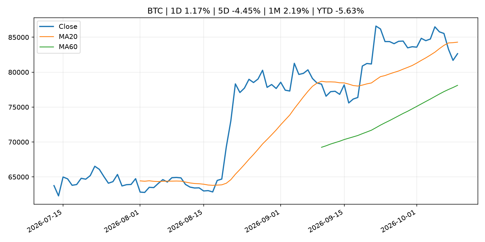
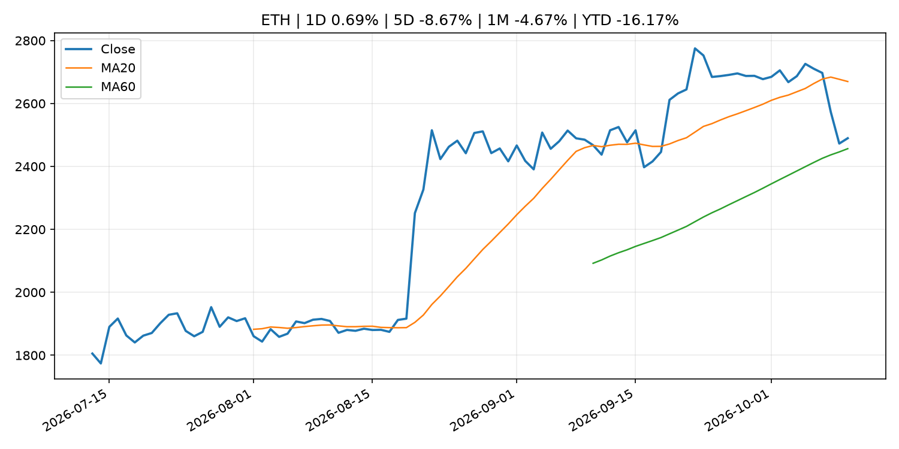
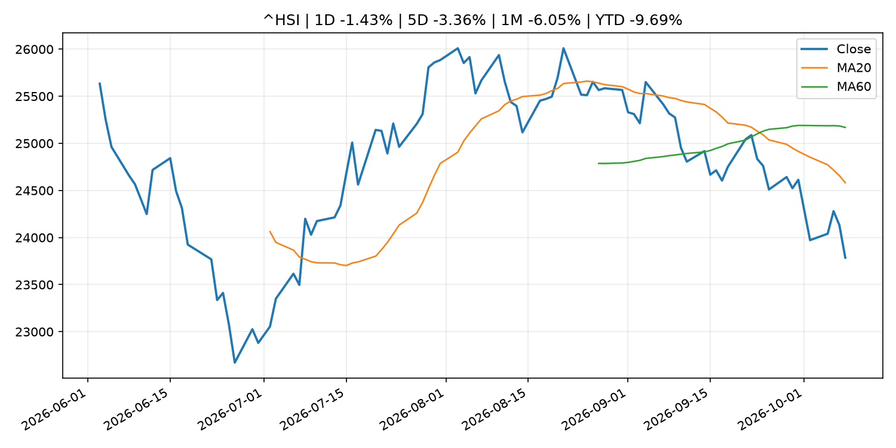

# Global Macro Morning Briefing - 2026-10-10

> Not financial advice / 非投资建议。

## 0. 今日总览
- 市场状态：unknown。市场信号不足，暂不判断明确状态。
- 今日三大主线：
  1. financial_stability: Twenty-fifth Meeting of the "Council for Cooperation on Financial Stability"
  2. fiscal_policy: UK slaps sanctions on three crypto exchanges over alleged Russia links
  3. fiscal_policy: Huawei doubles down on smartphones as EV sales slow
- 一句话结论：今日晨报重点关注：金融稳定信号可能放大跨资产波动，并影响央行反应函数。；财政和贸易政策会影响增长、通胀、企业利润和跨境资本流。。跨资产方面，SPY 1D -0.42%；QQQ 1D -1.34%；^VIX 1D -3.70%；TLT 1D 0.93%；GC=F 1D 1.52%；CL=F 1D 0.19%；BTC 1D 1.17%；ETH 1D 0.69%；市场信号不足，暂不判断明确状态。政策、通胀、利率、美元、美债、能源和加密监管仍是主要观察线索。所有结论仅基于公开数据与短摘要整理，不构成投资建议。

## 1. 隔夜跨资产市场
- 美股：SPY 1D -0.42%，QQQ 1D -1.34%，整体趋势需结合 VIX 和利率确认。
- 美债/美元：TLT 1D 0.93%，美元指数 1D 0.09%，是判断折现率压力的核心线索。
- 黄金/原油：黄金 1D 1.52%，原油 1D 0.19%，用于观察避险、通胀和地缘风险。
- 加密：BTC 1D 1.17%，ETH 1D 0.69%，关注是否独立于纳指走出加密自身行情。
- 港股/A股：恒生 1D -1.43%，沪深300/上证 1D n/a，重点看中国政策预期与人民币线索。
- 风险观察：关注后续数据是否确认当前跨资产信号。

### US_EQUITY

| symbol | latest close | 1D | 5D | 1M | YTD | trend |
|---|---:|---:|---:|---:|---:|---|
| SPY | 773.93 | -0.42% | 1.30% | 1.51% | 13.29% | uptrend |
| QQQ | 747.58 | -1.34% | 0.75% | 4.37% | 21.93% | strong_uptrend |
| DIA | 511.65 | 0.12% | 0.60% | -2.37% | 5.79% | downtrend |
| IWM | 277.57 | -0.05% | -0.52% | -4.50% | 11.57% | strong_downtrend |
| VTI | 379.56 | -0.39% | 1.17% | 1.07% | 12.86% | uptrend |

### US_MACRO_MARKET

| symbol | latest close | 1D | 5D | 1M | YTD | trend |
|---|---:|---:|---:|---:|---:|---|
| ^VIX | 14.84 | -3.70% | -3.07% | -16.82% | 2.27% | downtrend |
| DX-Y.NYB | 102.23 | 0.09% | 0.30% | 3.17% | 3.87% | strong_uptrend |
| TLT | 77.87 | 0.93% | 0.21% | -4.72% | -10.53% | strong_downtrend |
| IEF | 89.45 | 0.38% | 0.17% | -2.67% | -6.90% | downtrend |

### COMMODITIES

| symbol | latest close | 1D | 5D | 1M | YTD | trend |
|---|---:|---:|---:|---:|---:|---|
| GC=F | 4,220.30 | 1.52% | 1.39% | -4.24% | -2.52% | strong_downtrend |
| SI=F | 61.11 | 3.46% | 1.89% | -4.94% | -13.39% | strong_downtrend |
| CL=F | 91.66 | 0.19% | 0.60% | -10.56% | 59.91% | range_bound |
| BZ=F | 104.43 | 0.14% | 2.13% | -2.97% | 71.90% | uptrend |
| NG=F | 3.20 | 1.14% | 5.57% | 13.06% | -11.44% | strong_uptrend |
| HG=F | 6.71 | 2.95% | 3.37% | 3.77% | 18.99% | uptrend |

### HK_MARKET

| symbol | latest close | 1D | 5D | 1M | YTD | trend |
|---|---:|---:|---:|---:|---:|---|
| ^HSI | 23,785.79 | -1.43% | -3.36% | -6.05% | -9.69% | strong_downtrend |
| 0700.HK | 424.80 | 3.26% | 0.85% | -2.12% | -31.81% | downtrend |
| 9988.HK | 107.00 | 2.59% | 2.49% | -2.55% | -28.19% | downtrend |
| 3690.HK | 71.50 | 3.03% | 1.85% | -8.10% | -31.64% | strong_downtrend |
| 1810.HK | 25.96 | 9.72% | 7.10% | -1.59% | -35.55% | range_bound |
| 1211.HK | 75.60 | 3.70% | 2.30% | -7.58% | -23.44% | strong_downtrend |

### CRYPTO

| symbol | latest close | 1D | 5D | 1M | YTD | trend |
|---|---:|---:|---:|---:|---:|---|
| BTC | 82,643.45 | 1.17% | -4.45% | 2.19% | -5.63% | range_bound |
| ETH | 2,489.69 | 0.69% | -8.67% | -4.67% | -16.17% | range_bound |
| SOLANA | 109.56 | 0.05% | -9.84% | -2.79% | -12.01% | range_bound |
| BINANCECOIN | 744.11 | 1.19% | -6.42% | -2.24% | -13.75% | range_bound |
| RIPPLE | 1.40 | 1.67% | -7.72% | 0.45% | -23.81% | range_bound |

## 2. 今日最重要的 10 条新闻
### 1. Twenty-fifth Meeting of the "Council for Cooperation on Financial Stability"
- 来源：Bank of Japan Announcements
- 时间：2026-10-09T18:00:00+09:00
- 地区：Japan
- 事件类型：financial_stability
- 重要性层级：Tier 1
- 一句话摘要：Twenty-fifth Meeting of the "Council for Cooperation on Financial Stability"
- 为什么重要：金融稳定信号可能放大跨资产波动，并影响央行反应函数。
- 可能影响：可能影响利率、汇率、风险资产或大宗商品预期，但当前公开信息不足以判断明确方向。
  - 资产：暂无明确资产映射
  - 方向：unknown
  - 强度：low
  - 原因：公开信息不足以判断方向。
- 原文链接：[http://www.boj.or.jp/en/finsys/macpru/mac261009a.pdf](http://www.boj.or.jp/en/finsys/macpru/mac261009a.pdf)

### 2. UK slaps sanctions on three crypto exchanges over alleged Russia links
- 来源：CoinDesk
- 时间：2026-10-09T10:14:59+00:00
- 地区：global
- 事件类型：fiscal_policy
- 重要性层级：Tier 1
- 一句话摘要：UK slaps sanctions on three crypto exchanges over alleged Russia links
- 为什么重要：财政和贸易政策会影响增长、通胀、企业利润和跨境资本流。
- 可能影响：可能影响利率、汇率、风险资产或大宗商品预期，但当前公开信息不足以判断明确方向。
  - 资产：暂无明确资产映射
  - 方向：unknown
  - 强度：low
  - 原因：公开信息不足以判断方向。
- 原文链接：[https://www.coindesk.com/policy/2026/10/09/uk-slaps-sanctions-on-three-crypto-exchanges-over-alleged-russia-links](https://www.coindesk.com/policy/2026/10/09/uk-slaps-sanctions-on-three-crypto-exchanges-over-alleged-russia-links)

### 3. Huawei doubles down on smartphones as EV sales slow
- 来源：CNBC Economy
- 时间：2026-10-08T08:04:11+00:00
- 地区：US
- 事件类型：fiscal_policy
- 重要性层级：Tier 1
- 一句话摘要：Chinese tech company Huawei wants to rebuild its consumer business after U.S. sanctions halved segment revenue.
- 为什么重要：财政和贸易政策会影响增长、通胀、企业利润和跨境资本流。
- 可能影响：可能影响利率、汇率、风险资产或大宗商品预期，但当前公开信息不足以判断明确方向。
  - 资产：暂无明确资产映射
  - 方向：unknown
  - 强度：low
  - 原因：公开信息不足以判断方向。
- 原文链接：[https://www.cnbc.com/2026/10/08/huawei-china-smartphone-ev-slow.html](https://www.cnbc.com/2026/10/08/huawei-china-smartphone-ev-slow.html)

### 4. SEC Proposes Expanding Securities Eligible for Cross Trading by Registered Funds
- 来源：SEC Press Releases
- 时间：2026-10-09T10:59:00-04:00
- 地区：US
- 事件类型：regulation
- 重要性层级：Tier 2
- 一句话摘要：The Securities and Exchange Commission today proposed amendments to the Investment Company Act “cross-trading rule,” which permits transactions in securities between a registered fund and its affiliates under certain conditions. The proposed amendments…
- 为什么重要：监管变化会改变行业盈利预期和资产风险溢价。
- 可能影响：主要影响 BTC，方向为 mixed，强度 high；加密监管或 ETF 进展会改变 BTC 的资金流和风险溢价。
  - 资产：BTC
    方向：mixed
    强度：high
    原因：加密监管或 ETF 进展会改变 BTC 的资金流和风险溢价。
  - 资产：ETH
    方向：mixed
    强度：high
    原因：监管框架会影响 ETH 产品化和机构参与度。
  - 资产：COIN
    方向：mixed
    强度：medium
    原因：监管清晰度和执法风险会影响交易平台估值。
  - 资产：crypto market
    方向：mixed
    强度：high
    原因：信息影响整个加密市场结构，但方向取决于细节。
- 原文链接：[https://www.sec.gov/newsroom/press-releases/2026-104-sec-proposes-expanding-securities-eligible-cross-trading-registered-funds](https://www.sec.gov/newsroom/press-releases/2026-104-sec-proposes-expanding-securities-eligible-cross-trading-registered-funds)

### 5. Federal Reserve Board announces enforcement action against American Express Company to address, among other things, the firm’s failure to sufficiently detect and report certain suspicious activity related to money laundering
- 来源：Federal Reserve Press Releases
- 时间：2026-10-08T20:30:00+00:00
- 地区：US
- 事件类型：regulation
- 重要性层级：Tier 2
- 一句话摘要：Federal Reserve Board announces enforcement action against American Express Company to address, among other things, the firm’s failure to sufficiently detect and report certain suspicious activity related to money laundering
- 为什么重要：监管变化会改变行业盈利预期和资产风险溢价。
- 可能影响：可能影响利率、汇率、风险资产或大宗商品预期，但当前公开信息不足以判断明确方向。
  - 资产：暂无明确资产映射
  - 方向：unknown
  - 强度：low
  - 原因：公开信息不足以判断方向。
- 原文链接：[https://www.federalreserve.gov/newsevents/pressreleases/enforcement20261008a.htm](https://www.federalreserve.gov/newsevents/pressreleases/enforcement20261008a.htm)

### 6. Bitcoin rebounds to $82,000 as Trump rules out Iran strikes, oil drops
- 来源：CoinDesk
- 时间：2026-10-09T03:27:38+00:00
- 地区：global
- 事件类型：other
- 重要性层级：Tier 3
- 一句话摘要：Bitcoin rebounds to $82,000 as Trump rules out Iran strikes, oil drops
- 为什么重要：这条信息暂未匹配到重大宏观、政策或市场事件，更适合作为背景跟踪。
- 可能影响：主要影响 CL=F，方向为 positive，强度 high；供给扰动或 OPEC 减产通常推升 WTI 原油。
  - 资产：CL=F
    方向：positive
    强度：high
    原因：供给扰动或 OPEC 减产通常推升 WTI 原油。
  - 资产：BZ=F
    方向：positive
    强度：high
    原因：全球供给风险通常直接影响 Brent 原油。
  - 资产：SPY
    方向：mixed
    强度：medium
    原因：能源股可能受益，但通胀和成本压力不利于宽基风险资产。
- 原文链接：[https://www.coindesk.com/markets/2026/10/09/bitcoin-rebounds-to-usd82-000-as-trump-rules-out-iran-strikes](https://www.coindesk.com/markets/2026/10/09/bitcoin-rebounds-to-usd82-000-as-trump-rules-out-iran-strikes)

### 7. ‘I feel like a loser’: I check my ETFs every day. They’re up one minute, down the next. Should I be worried?
- 来源：MarketWatch Top Stories
- 时间：2026-10-10T00:00:00+00:00
- 地区：US
- 事件类型：other
- 重要性层级：Tier 3
- 一句话摘要：“I presume these are sophisticated investors taking a profit.”
- 为什么重要：这条信息暂未匹配到重大宏观、政策或市场事件，更适合作为背景跟踪。
- 可能影响：更偏背景信息，短期市场影响可能有限。
  - 资产：暂无明确资产映射
  - 方向：unknown
  - 强度：low
  - 原因：公开信息不足以判断方向。
- 原文链接：[https://www.marketwatch.com/story/i-feel-like-a-loser-my-etfs-go-up-one-day-and-crash-the-next-is-this-a-bad-sign-0c9848b2?mod=mw_rss_topstories](https://www.marketwatch.com/story/i-feel-like-a-loser-my-etfs-go-up-one-day-and-crash-the-next-is-this-a-bad-sign-0c9848b2?mod=mw_rss_topstories)

## 3. 政策与央行观察
### 1. Twenty-fifth Meeting of the "Council for Cooperation on Financial Stability"
- 来源：Bank of Japan Announcements
- 时间：2026-10-09T18:00:00+09:00
- 地区：Japan
- 事件类型：financial_stability
- 重要性层级：Tier 1
- 一句话摘要：Twenty-fifth Meeting of the "Council for Cooperation on Financial Stability"
- 为什么重要：金融稳定信号可能放大跨资产波动，并影响央行反应函数。
- 可能影响：可能影响利率、汇率、风险资产或大宗商品预期，但当前公开信息不足以判断明确方向。
  - 资产：暂无明确资产映射
  - 方向：unknown
  - 强度：low
  - 原因：公开信息不足以判断方向。
- 原文链接：[http://www.boj.or.jp/en/finsys/macpru/mac261009a.pdf](http://www.boj.or.jp/en/finsys/macpru/mac261009a.pdf)

### 2. UK slaps sanctions on three crypto exchanges over alleged Russia links
- 来源：CoinDesk
- 时间：2026-10-09T10:14:59+00:00
- 地区：global
- 事件类型：fiscal_policy
- 重要性层级：Tier 1
- 一句话摘要：UK slaps sanctions on three crypto exchanges over alleged Russia links
- 为什么重要：财政和贸易政策会影响增长、通胀、企业利润和跨境资本流。
- 可能影响：可能影响利率、汇率、风险资产或大宗商品预期，但当前公开信息不足以判断明确方向。
  - 资产：暂无明确资产映射
  - 方向：unknown
  - 强度：low
  - 原因：公开信息不足以判断方向。
- 原文链接：[https://www.coindesk.com/policy/2026/10/09/uk-slaps-sanctions-on-three-crypto-exchanges-over-alleged-russia-links](https://www.coindesk.com/policy/2026/10/09/uk-slaps-sanctions-on-three-crypto-exchanges-over-alleged-russia-links)

### 3. Huawei doubles down on smartphones as EV sales slow
- 来源：CNBC Economy
- 时间：2026-10-08T08:04:11+00:00
- 地区：US
- 事件类型：fiscal_policy
- 重要性层级：Tier 1
- 一句话摘要：Chinese tech company Huawei wants to rebuild its consumer business after U.S. sanctions halved segment revenue.
- 为什么重要：财政和贸易政策会影响增长、通胀、企业利润和跨境资本流。
- 可能影响：可能影响利率、汇率、风险资产或大宗商品预期，但当前公开信息不足以判断明确方向。
  - 资产：暂无明确资产映射
  - 方向：unknown
  - 强度：low
  - 原因：公开信息不足以判断方向。
- 原文链接：[https://www.cnbc.com/2026/10/08/huawei-china-smartphone-ev-slow.html](https://www.cnbc.com/2026/10/08/huawei-china-smartphone-ev-slow.html)

### 4. SEC Proposes Expanding Securities Eligible for Cross Trading by Registered Funds
- 来源：SEC Press Releases
- 时间：2026-10-09T10:59:00-04:00
- 地区：US
- 事件类型：regulation
- 重要性层级：Tier 2
- 一句话摘要：The Securities and Exchange Commission today proposed amendments to the Investment Company Act “cross-trading rule,” which permits transactions in securities between a registered fund and its affiliates under certain conditions. The proposed amendments…
- 为什么重要：监管变化会改变行业盈利预期和资产风险溢价。
- 可能影响：主要影响 BTC，方向为 mixed，强度 high；加密监管或 ETF 进展会改变 BTC 的资金流和风险溢价。
  - 资产：BTC
    方向：mixed
    强度：high
    原因：加密监管或 ETF 进展会改变 BTC 的资金流和风险溢价。
  - 资产：ETH
    方向：mixed
    强度：high
    原因：监管框架会影响 ETH 产品化和机构参与度。
  - 资产：COIN
    方向：mixed
    强度：medium
    原因：监管清晰度和执法风险会影响交易平台估值。
  - 资产：crypto market
    方向：mixed
    强度：high
    原因：信息影响整个加密市场结构，但方向取决于细节。
- 原文链接：[https://www.sec.gov/newsroom/press-releases/2026-104-sec-proposes-expanding-securities-eligible-cross-trading-registered-funds](https://www.sec.gov/newsroom/press-releases/2026-104-sec-proposes-expanding-securities-eligible-cross-trading-registered-funds)

### 5. Federal Reserve Board announces enforcement action against American Express Company to address, among other things, the firm’s failure to sufficiently detect and report certain suspicious activity related to money laundering
- 来源：Federal Reserve Press Releases
- 时间：2026-10-08T20:30:00+00:00
- 地区：US
- 事件类型：regulation
- 重要性层级：Tier 2
- 一句话摘要：Federal Reserve Board announces enforcement action against American Express Company to address, among other things, the firm’s failure to sufficiently detect and report certain suspicious activity related to money laundering
- 为什么重要：监管变化会改变行业盈利预期和资产风险溢价。
- 可能影响：可能影响利率、汇率、风险资产或大宗商品预期，但当前公开信息不足以判断明确方向。
  - 资产：暂无明确资产映射
  - 方向：unknown
  - 强度：low
  - 原因：公开信息不足以判断方向。
- 原文链接：[https://www.federalreserve.gov/newsevents/pressreleases/enforcement20261008a.htm](https://www.federalreserve.gov/newsevents/pressreleases/enforcement20261008a.htm)

## 4. 市场异动与图表
- SPY 下跌 -0.42%
- QQQ 下跌 -1.34%
- VIX 下跌 -3.70%
- TLT 上涨 0.93%
- Gold 上涨 1.52%

### SPY

### QQQ

### ^VIX

### TLT

### GC=F

### CL=F

### BTC

### ETH

### ^HSI

## 5. 华尔街与机构公开观点
- 暂无可靠公开观点。

## 6. 今日重点关注
- 经济数据：经济数据：暂无可靠公开日历数据；如配置经济日历源后可自动填充。
- 央行讲话：央行讲话：暂无可靠公开日历数据；重点跟踪 Fed、ECB、BoJ、PBOC 官网 RSS。
- 财报：财报：暂无可靠数据。
- 政策事件：政策事件：暂无可靠数据。
- 风险提醒：风险提醒：关注数据源失败项、突发地缘风险、利率和美元的二阶反应。

## 7. 英文金融表达与宏观概念
- **risk-off**：避险模式，资金偏向美元、国债、黄金等防御资产。 例句：A geopolitical shock can push markets into risk-off mode.
- **supply disruption**：供给扰动，通常指能源或商品供应受冲突、减产或天气影响。 例句：Supply disruption can lift oil prices and inflation expectations.
- **market structure**：市场结构，指交易、托管、清算、ETF、监管等制度安排。 例句：Crypto market structure rules can affect institutional participation.
- **inflation expectations**：通胀预期，指家庭、企业或市场对未来通胀的预估。 例句：Inflation expectations can shape wage bargaining and bond yields.
- **real yield**：实际收益率，名义利率扣除通胀预期后的收益率。 例句：Gold often reacts more to real yields than nominal yields.
- **terminal rate**：终端利率，市场预期本轮加息周期的最高政策利率。 例句：A higher terminal rate can pressure growth stocks.

## 8. 背景材料
- [‘I feel like a loser’: I check my ETFs every day. They’re up one minute, down the next. Should I be worried?](https://www.marketwatch.com/story/i-feel-like-a-loser-my-etfs-go-up-one-day-and-crash-the-next-is-this-a-bad-sign-0c9848b2?mod=mw_rss_topstories)（MarketWatch Top Stories，other）：“I presume these are sophisticated investors taking a profit.”
- [New York AG secures up to $35 million and lifetime crypto ban from Celsius’ Alex Mashinsky](https://www.coindesk.com/policy/2026/10/09/new-york-ag-secures-up-to-usd35-million-and-lifetime-crypto-ban-from-celsius-alex-mashinsky)（CoinDesk，other）：New York AG secures up to $35 million and lifetime crypto ban from Celsius’ Alex Mashinsky
- [Federal Reserve Board releases results of the 2025 Survey of Consumer Finances, which provides the public and policymakers with detailed insights into the economic condition of American families](https://www.federalreserve.gov/newsevents/pressreleases/other20261009a.htm)（Federal Reserve Press Releases，other）：Federal Reserve Board releases results of the 2025 Survey of Consumer Finances, which provides the public and policymakers with detailed insights into the economic condition of American families
- [Trump's Iran pledge underpins crypto gains as bitcoin bears face liquidation pressure](https://www.coindesk.com/daybook-us/2026/10/09/trump-s-iran-pledge-underpins-crypto-gains-as-bitcoin-bears-face-liquidation-pressure)（CoinDesk，other）：Trump's Iran pledge underpins crypto gains as bitcoin bears face liquidation pressure
- [Bitcoin steadies near $82,500 after Trump rules out Iran strike before midterms](https://www.coindesk.com/markets/2026/10/09/bitcoin-steadies-near-usd82-500-after-trump-rules-out-iran-strike-before-midterms)（CoinDesk，other）：Bitcoin steadies near $82,500 after Trump rules out Iran strike before midterms
- [Thailand opens door to locally listed bitcoin and ether ETFs](https://www.coindesk.com/policy/2026/10/09/thailand-opens-door-to-locally-listed-bitcoin-and-ether-etfs)（CoinDesk，other）：Thailand opens door to locally listed bitcoin and ether ETFs
- [Dark web drug market operator sentenced to 40 years, forfeits $101 million in bitcoin](https://www.coindesk.com/policy/2026/10/09/dark-web-drug-market-operator-forfeits-1-230-bitcoin-and-faces-40-years-in-prison)（CoinDesk，other）：Dark web drug market operator sentenced to 40 years, forfeits $101 million in bitcoin
- [MARA transfers $81.1 million in bitcoin to Galaxy Digital as strategy pivots to AI](https://www.coindesk.com/markets/2026/10/09/mara-transfers-usd81-1-million-in-bitcoin-to-galaxy-digital-as-strategy-pivots-to-ai)（CoinDesk，other）：MARA transfers $81.1 million in bitcoin to Galaxy Digital as strategy pivots to AI
- [Sam Altman-backed bitcoin insurer Meanwhile secures $37.5 million in Bain Capital Crypto-led round](https://www.coindesk.com/business/2026/10/09/sam-altman-backed-bitcoin-insurer-meanwhile-secures-usd37-5-million-in-bain-capital-crypto-led-round)（CoinDesk，other）：Sam Altman-backed bitcoin insurer Meanwhile secures $37.5 million in Bain Capital Crypto-led round
- [Amendment to "Prices of Eligible Collateral"](http://www.boj.or.jp/en/mopo/mpmdeci/mpr_2026/mpr261009a.pdf)（Bank of Japan Announcements，other）：Amendment to "Prices of Eligible Collateral"
- [Live updates: Bitcoin slips from day's highs, set to close week with a loss](https://www.coindesk.com/business/2026/10/09/live-updates-xrp-etfs-the-only-ones-in-green-as-btc-eth-zec-funds-post-outflows)（CoinDesk，other）：Live updates: Bitcoin slips from day's highs, set to close week with a loss
- [New tech to power bitcoin lending is set to debut with $500 million in commitments](https://www.coindesk.com/markets/2026/10/09/new-tech-to-power-bitcoin-lending-is-set-to-debut-with-usd500-million-in-commitments)（CoinDesk，other）：New tech to power bitcoin lending is set to debut with $500 million in commitments
- [Solana is about to halve its block times as final 200-millisecond upgrade nears](https://www.coindesk.com/tech/2026/10/09/solana-is-about-to-halve-its-block-times-as-final-200-millisecond-upgrade-nears)（CoinDesk，other）：Solana is about to halve its block times as final 200-millisecond upgrade nears
- [XRP Ledger adds new controls for banks, stablecoins and tokenized funds](https://www.coindesk.com/tech/2026/10/09/xrp-ledger-adds-new-controls-for-banks-stablecoins-and-tokenized-funds)（CoinDesk，other）：XRP Ledger adds new controls for banks, stablecoins and tokenized funds
- [Ether bets were wiped out at six times bitcoin’s rate in crypto’s $1 billion flush](https://www.coindesk.com/markets/2026/10/09/ether-bets-were-wiped-out-at-six-times-bitcoin-s-rate-in-crypto-s-usd1-billion-flush)（CoinDesk，other）：Ether bets were wiped out at six times bitcoin’s rate in crypto’s $1 billion flush
- [Bitcoin rebounds to $82,000 as Trump rules out Iran strikes, oil drops](https://www.coindesk.com/markets/2026/10/09/bitcoin-rebounds-to-usd82-000-as-trump-rules-out-iran-strikes)（CoinDesk，other）：Bitcoin rebounds to $82,000 as Trump rules out Iran strikes, oil drops
- [IMES Discussion Paper Series (2026)](http://www.boj.or.jp/en/research/imes/dps/dps26.htm)（Bank of Japan Announcements，research_publication）：IMES Discussion Paper Series (2026)
- [Wall Street's tokenization boom could have bigger winners than bitcoin and ether, Citrini says](https://www.coindesk.com/markets/2026/10/08/wall-street-s-tokenization-boom-could-have-bigger-winners-than-bitcoin-and-ether-citrini-says)（CoinDesk，other）：Wall Street's tokenization boom could have bigger winners than bitcoin and ether, Citrini says
- [U.S. government moves $1 billion in bitcoin tied to Bitfinex hack, with no sign of sale](https://www.coindesk.com/business/2026/10/08/u-s-government-moves-usd1-billion-in-bitcoin-from-bitfinex-hack-wallet-no-sale-indicated)（CoinDesk，other）：U.S. government moves $1 billion in bitcoin tied to Bitfinex hack, with no sign of sale
- [EU securities regulator gives crypto platforms 3 months to remove unauthorized stablecoins](https://www.coindesk.com/policy/2026/10/08/eu-securities-regulator-gives-crypto-platforms-3-months-to-remove-unauthorized-stablecoins)（CoinDesk，other）：EU securities regulator gives crypto platforms 3 months to remove unauthorized stablecoins

## 9. 数据源、失败项与免责声明
- 采集时间：2026-10-10T01:31:38
- 数据源：公开 RSS、Yahoo Finance、CoinGecko、AKShare、FRED、SEC data.sec.gov，以及用户自有 inputs/reports 文件。
- 合规说明：不绕过 WSJ、Bloomberg、FT、Reuters 等付费墙；对付费媒体只使用公开 RSS 标题、摘要、链接和发布时间。
- 免责声明：Not financial advice / 非投资建议。本项目仅供个人学习、研究和信息整理，不构成投资建议、交易建议或任何收益承诺。
- 失败或跳过的数据源：
  - crypto data failed coin=dogecoin
  - China market data failed symbol=上证指数: empty dataframe
  - China market data failed symbol=深证成指: empty dataframe
  - China market data failed symbol=创业板指: empty dataframe
  - China market data failed symbol=沪深300: empty dataframe
  - China market data failed symbol=中证500: empty dataframe
  - China market data failed symbol=科创50: empty dataframe
  - FRED_API_KEY not set; skipping FRED macro series
  - SEC failed cik=0000320193
  - SEC failed cik=0000789019
  - SEC failed cik=0001045810
  - SEC failed cik=0001318605
  - SEC failed cik=0001577552
